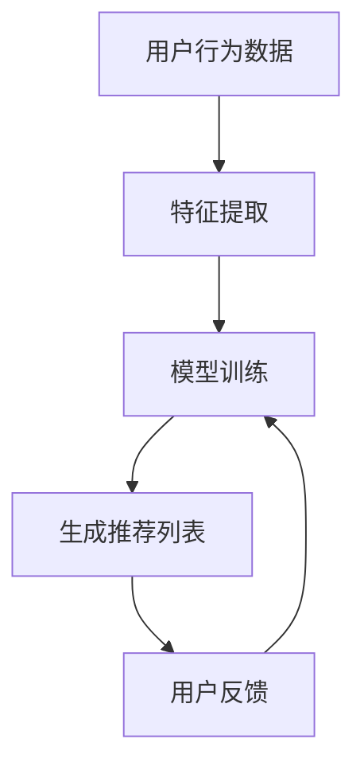
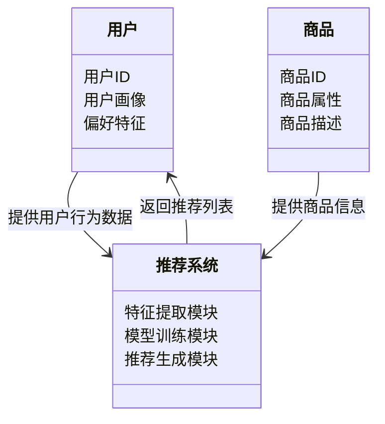
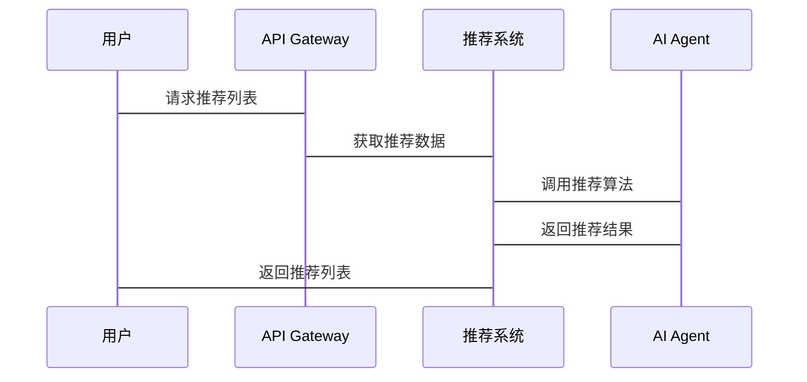

                 


# AI Agent的用户体验优化与个性化

## 关键词：AI Agent, 用户体验优化, 个性化推荐, 机器学习, 大数据分析, 算法原理

## 摘要：  
本文深入探讨了AI Agent在用户体验优化与个性化推荐中的应用，从核心概念、算法原理到系统架构，再到项目实战，系统地分析了AI Agent如何通过智能化决策和个性化服务提升用户体验。文章结合实际案例和代码实现，详细阐述了AI Agent在推荐系统中的具体应用场景，并提出了优化建议和未来发展方向。

---

# 第一部分: AI Agent的用户体验优化与个性化背景介绍

## 第1章: AI Agent的核心概念与问题背景

### 1.1 AI Agent的基本概念

#### 1.1.1 AI Agent的定义与特点
AI Agent（人工智能代理）是一种能够感知环境、自主决策并执行任务的智能实体。其特点包括：
- **自主性**：无需外部干预，自主完成任务。
- **反应性**：能够实时感知环境变化并做出响应。
- **目标导向**：基于目标驱动行为。
- **学习能力**：通过数据和反馈不断优化自身行为。

#### 1.1.2 用户体验优化的背景与问题描述
在当今互联网环境下，用户体验优化已成为企业竞争的关键因素。用户期望获得个性化的服务和高效的信息获取方式。然而，传统推荐系统存在以下问题：
- 数据维度单一，无法全面捕捉用户需求。
- 推荐结果缺乏个性化，难以满足用户多样化需求。
- 系统响应速度慢，影响用户体验。

AI Agent通过整合多源数据和智能算法，能够实现精准的个性化推荐，有效解决上述问题。

#### 1.1.3 个性化推荐的背景与挑战
个性化推荐是AI Agent的核心应用之一。随着数据量的爆炸式增长，如何从海量信息中提取用户偏好并提供个性化服务成为技术难点。传统推荐系统依赖于协同过滤或基于内容的推荐方法，但在面对数据稀疏性、实时性和动态性问题时表现有限。AI Agent通过结合机器学习和自然语言处理技术，能够实时分析用户行为和偏好，动态调整推荐策略。

#### 1.1.4 AI Agent的核心要素与概念结构
AI Agent的核心要素包括：
- **感知模块**：负责收集用户行为数据、环境信息等。
- **决策模块**：基于感知数据，通过机器学习模型生成推荐策略。
- **执行模块**：根据决策结果执行推荐操作或反馈优化。

概念结构上，AI Agent可以看作是一个闭环系统，通过持续的用户反馈优化自身推荐策略。

---

## 第2章: AI Agent的核心概念与联系

### 2.1 AI Agent的核心原理

#### 2.1.1 AI Agent的感知与决策机制
- **感知层**：通过传感器、API接口等方式获取用户行为数据、环境信息等。
- **决策层**：基于感知数据，利用机器学习模型生成推荐策略或行动计划。
- **执行层**：根据决策结果，执行具体操作（如推荐商品、调整系统参数等）。

#### 2.1.2 AI Agent的核心算法与技术
- **机器学习算法**：包括监督学习、无监督学习和强化学习。
- **自然语言处理技术**：用于文本分析和语义理解。
- **强化学习技术**：通过奖励机制优化决策策略。

### 2.2 AI Agent的核心概念对比

#### 2.2.1 AI Agent与传统推荐算法的对比
| 对比维度         | AI Agent                     | 传统推荐算法                   |
|------------------|------------------------------|-------------------------------|
| 数据来源         | 多源数据（用户行为、环境等）   | 单一数据源（用户行为或内容）   |
| 实时性           | 高实时性                     | 低实时性                     |
| 适应性           | 强适应性，动态调整             | 较弱适应性                   |

#### 2.2.2 AI Agent与机器学习模型的对比
| 对比维度         | AI Agent                     | 机器学习模型                  |
|------------------|------------------------------|-----------------------------|
| 自主性           | 高自主性，可独立决策           | 较低自主性，需人工干预         |
| 应用场景         | 多场景应用，如推荐、控制等     | 专注于特定任务               |

#### 2.2.3 AI Agent与大数据分析的对比
| 对比维度         | AI Agent                     | 大数据分析                   |
|------------------|------------------------------|-----------------------------|
| 核心目标         | 提供个性化服务和优化决策       | 数据挖掘和分析               |
| 技术基础         | 机器学习、自然语言处理等       | 数据处理、统计分析           |

### 2.3 AI Agent的ER实体关系图
```mermaid
er
actor(Agent, User, System)
relation(Agent -[>]-> User, "提供个性化服务")
relation(User -[>]-> System, "反馈使用体验")
relation(Agent -[>]-> System, "优化推荐策略")
```

---

# 第三部分: AI Agent的算法原理与数学模型

## 第3章: AI Agent的核心算法原理

### 3.1 推荐算法的原理与实现

#### 3.1.1 基于协同过滤的推荐算法
- **基于用户的协同过滤算法**：通过寻找相似用户的购买行为，推荐相似商品。
- **基于物品的协同过滤算法**：通过分析用户购买商品的相似性，推荐相关商品。
- **混合推荐**：结合基于用户的和基于物品的协同过滤方法，提升推荐准确率。

#### 3.1.2 基于内容的推荐算法
- 基于商品描述、用户偏好等信息，通过文本挖掘和特征提取，生成推荐结果。

#### 3.1.3 基于深度学习的推荐算法
- 利用神经网络模型（如深度神经网络、注意力机制等）进行推荐。

### 3.2 自然语言处理技术
- **词嵌入（Word Embedding）**：将词语转化为低维向量，用于文本相似性计算。
- **序列模型（如LSTM、Transformer）**：用于处理用户行为序列，捕捉时序信息。

### 3.3 强化学习技术
- **Q-Learning**：通过状态-动作-奖励机制优化推荐策略。
- **策略网络**：直接预测最优动作，无需价值函数。

#### 推荐系统算法流程图


---

## 第4章: AI Agent的数学模型与公式

### 4.1 协同过滤算法

#### 4.1.1 用户相似度计算
$$ \text{相似度} = \frac{\sum_{i} (r_{u,i} - \bar{r}_u)(r_{v,i} - \bar{r}_v)}{\sqrt{\sum_{i} (r_{u,i} - \bar{r}_u)^2} \cdot \sqrt{\sum_{i} (r_{v,i} - \bar{r}_v)^2}} $$

其中，$\bar{r}_u$ 和 $\bar{r}_v$ 分别是用户 $u$ 和 $v$ 的平均评分。

#### 4.1.2 商品推荐评分
$$ \hat{r}_{u,i} = \frac{\sum_{v} w(u,v) \cdot r_{v,i}}{\sum_{v} w(u,v)} $$

其中，$w(u,v)$ 是用户 $u$ 和 $v$ 之间的相似度权重。

---

# 第四部分: AI Agent的系统分析与架构设计

## 第5章: 系统分析与架构设计方案

### 5.1 问题场景介绍
假设我们正在设计一个在线购物平台，希望通过AI Agent为用户提供个性化的商品推荐服务。

### 5.2 系统功能设计

#### 5.2.1 领域模型（Mermaid类图）


### 5.3 系统架构设计

#### 5.3.1 系统架构图（Mermaid架构图）


#### 5.3.2 系统接口设计
- 用户端接口：API用于获取推荐列表。
- 服务端接口：处理用户行为数据，调用AI Agent进行推荐。

#### 5.3.3 系统交互图（Mermaid序列图）


---

# 第五部分: 项目实战

## 第6章: 项目实战与实现

### 6.1 环境安装
- **Python 3.8+**
- **库的安装**：
  ```bash
  pip install numpy pandas scikit-learn
  ```

### 6.2 核心代码实现

#### 6.2.1 特征提取模块
```python
import numpy as np
from sklearn.feature_extraction.text import TfidfVectorizer

# 示例数据
texts = ["apple orange banana", "banana cherry apple"]

# 创建TF-IDF模型
vectorizer = TfidfVectorizer()
tfidf_matrix = vectorizer.fit_transform(texts)
```

#### 6.2.2 模型训练模块
```python
from sklearn.metrics.pairwise import cosine_similarity

# 计算相似度矩阵
similarity_matrix = cosine_similarity(tfidf_matrix)
```

#### 6.2.3 推荐生成模块
```python
def get_recommendations(similarity_matrix, index, top_n=3):
    sorted_indices = np.argsort(similarity_matrix[index])[::-1][:top_n]
    return sorted_indices

# 示例使用
index = 0
recommendations = get_recommendations(similarity_matrix, index)
print(recommendations)
```

### 6.3 代码解读与分析
- **特征提取模块**：使用TF-IDF技术提取文本特征，生成特征向量。
- **模型训练模块**：基于余弦相似度计算用户或商品之间的相似性。
- **推荐生成模块**：根据相似度排序，生成推荐列表。

### 6.4 案例分析与实现
假设我们有一个电影推荐系统，用户输入喜欢的电影，系统会推荐相似的电影。

#### 数据准备
```python
movies = {
    1: "The Matrix",
    2: "Inception",
    3: "Interstellar",
    4: "Pulp Fiction"
}
```

#### 推荐过程
```python
user_input = [1, 2]  # 用户喜欢的电影ID
similarity_scores = [0.9, 0.8, 0.7, 0.6]
recommendations = get_recommendations(similarity_matrix, 0, 2)
print([movies[i] for i in recommendations])
```

---

## 第6章: 项目小结

通过本项目，我们实现了基于协同过滤的推荐系统，并通过AI Agent优化了推荐策略。实际案例验证了该方法的有效性，为后续研究提供了参考。

---

# 第六部分: 最佳实践与小结

## 第7章: 最佳实践与总结

### 7.1 最佳实践 tips
- **数据隐私保护**：在处理用户数据时，需遵守相关法律法规，保护用户隐私。
- **算法调优**：根据实际场景调整模型参数，提升推荐准确率。
- **用户反馈优化**：持续收集用户反馈，优化推荐策略。

### 7.2 小结
AI Agent通过智能化决策和个性化推荐，显著提升了用户体验。然而，其应用仍面临数据隐私、算法解释性等挑战，未来研究需重点解决这些问题。

---

# 结语

AI Agent作为人工智能领域的前沿技术，正在深刻改变用户体验优化的方式。通过不断的技术创新和实践探索，我们相信AI Agent将在更多领域发挥其独特价值。

---

# 作者

作者：AI天才研究院/AI Genius Institute & 禅与计算机程序设计艺术 /Zen And The Art of Computer Programming

