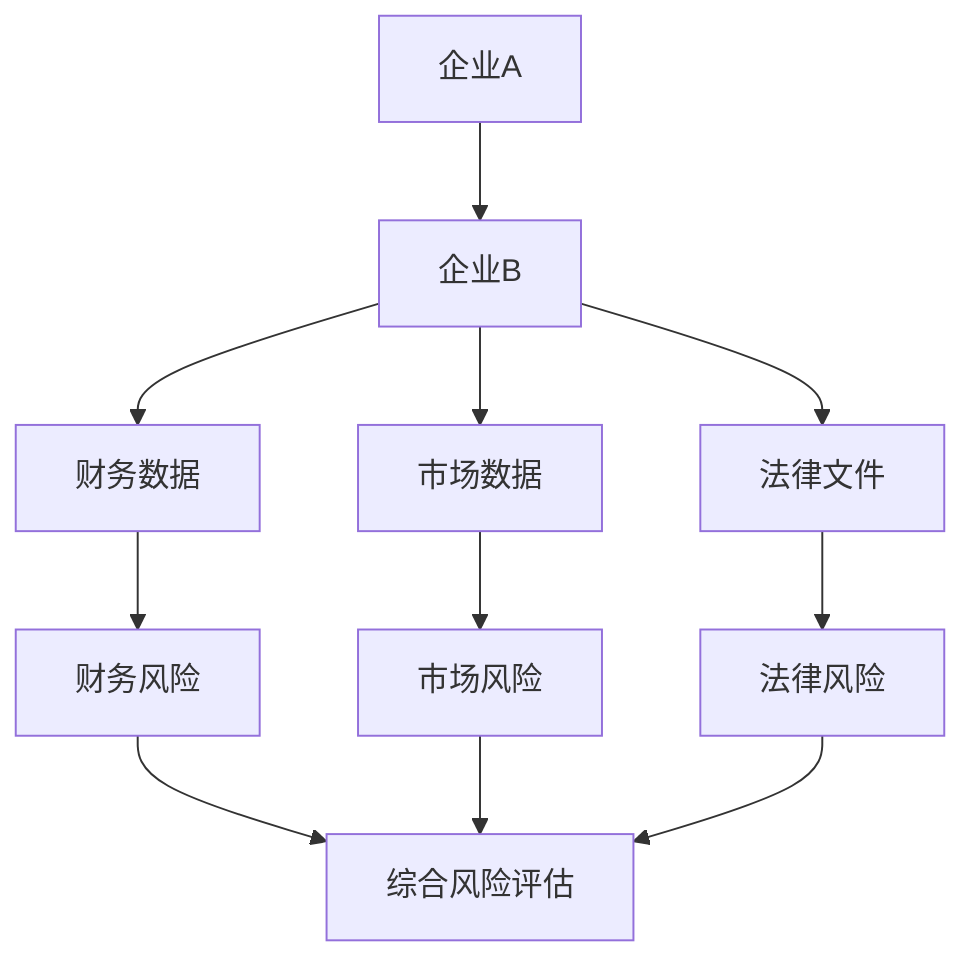
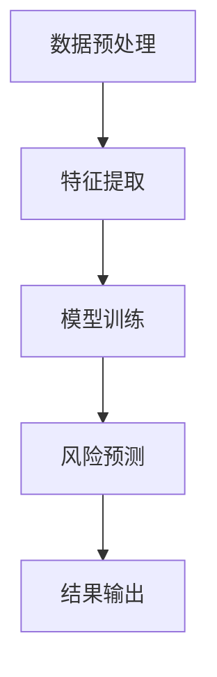
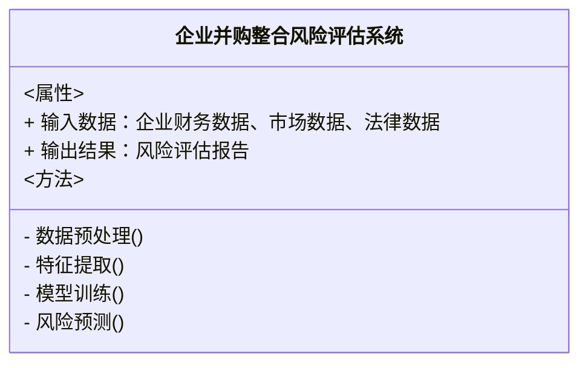
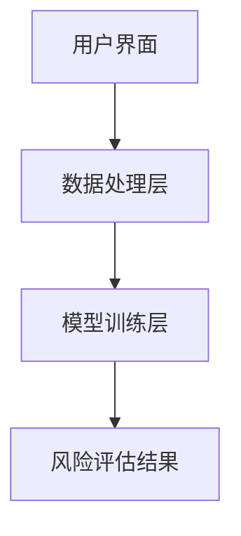
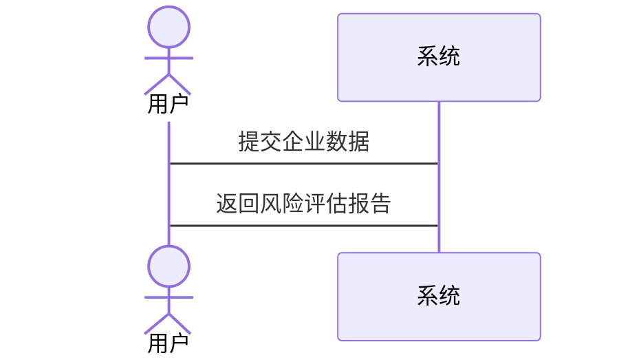

                 


# AI辅助的企业并购整合风险评估

> 关键词：企业并购、整合风险、人工智能、深度学习、风险评估、LSTM模型

> 摘要：本文将探讨如何利用人工智能技术，特别是深度学习模型，来辅助企业并购整合过程中的风险评估。通过分析企业并购整合中的关键风险因素，结合LSTM模型的优势，本文将详细阐述如何构建一个高效的AI辅助风险评估系统，从而为企业并购决策提供科学依据。

---

# 第1章: 企业并购整合风险评估的背景与意义

## 1.1 企业并购整合的定义与特点

企业并购（Mergers and Acquisitions, M&A）是指两个或多个企业通过合并或收购行为，形成新的企业实体。整合则是指在并购后，将双方的业务、资源、文化等进行融合，以实现协同效应和价值最大化。

### 1.1.1 企业并购的基本概念

- **并购类型**：
  - **横向并购**：同一行业内的企业并购，旨在扩大市场份额。
  - **纵向并购**：产业链上下游的企业并购，以增强垂直整合能力。
  - **混合并购**：与主业无关的企业并购，通常用于多元化经营。

- **整合的关键环节**：
  - **战略规划**：明确并购目标和整合方向。
  - **尽职调查**：评估目标企业的财务、法律和市场风险。
  - **整合实施**：整合双方的业务、组织结构和文化。
  - **监控与优化**：监控整合效果并持续优化。

### 1.1.2 整合的定义与关键环节

整合不仅仅是企业结构的调整，更是一个复杂的系统工程。关键环节包括：

1. **组织架构整合**：优化组织结构，避免冗余。
2. **业务流程整合**：统一业务流程，提高效率。
3. **资源优化整合**：充分利用双方资源，降低成本。
4. **文化融合**：促进企业文化的融合，增强员工归属感。

### 1.1.3 并购整合的风险特征

企业并购整合过程中可能面临的风险包括：

- **财务风险**：并购后的财务表现不佳，可能导致企业亏损。
- **市场风险**：市场环境变化可能影响整合效果。
- **法律风险**：并购过程中的法律问题可能导致纠纷。
- **管理风险**：整合过程中管理不善可能导致效率低下。

## 1.2 AI技术在企业并购中的应用背景

### 1.2.1 传统企业并购整合的局限性

传统的企业并购整合过程中，主要依赖人工分析和经验判断，存在以下问题：

1. **信息不全**：尽职调查不够全面，可能导致遗漏风险。
2. **效率低下**：人工分析耗时长，难以及时应对市场变化。
3. **主观性较强**：依赖个人经验，可能存在主观判断误差。

### 1.2.2 AI技术对企业并购整合的赋能

人工智能技术，特别是深度学习模型，能够通过大数据分析，帮助企业更全面、准确地评估整合风险。AI技术的应用优势包括：

1. **数据驱动**：利用大数据进行精准分析，减少主观判断。
2. **高效处理**：快速处理大量数据，提高整合效率。
3. **实时监控**：实时跟踪整合效果，及时调整策略。

### 1.2.3 当前AI技术在企业并购中的应用现状

目前，AI技术已经在企业并购的多个环节中得到应用，例如：

- **目标筛选**：通过AI分析潜在并购目标的财务和市场数据，筛选出符合条件的企业。
- **风险评估**：利用AI模型预测并购后的潜在风险，帮助制定整合策略。
- **整合优化**：通过AI模拟不同整合方案的效果，选择最优方案。

## 1.3 企业并购整合风险评估的核心价值

### 1.3.1 风险评估对企业并购的重要性

企业并购整合过程中的风险评估是确保并购成功的关键环节。通过科学的评估，企业可以识别潜在风险，并制定相应的应对策略。

### 1.3.2 AI辅助评估的优势与创新点

AI辅助评估的优势在于其数据处理能力和模型的可解释性。通过AI技术，企业可以更全面地分析整合风险，并提供个性化的评估结果。

### 1.3.3 企业并购整合风险评估的未来趋势

随着AI技术的不断发展，企业并购整合风险评估将更加智能化和个性化。未来的评估系统将能够实时跟踪整合效果，并动态调整评估策略。

---

# 第2章: 企业并购整合风险评估的核心概念与联系

## 2.1 风险评估的关键因素

### 2.1.1 财务风险

财务风险是企业并购整合中最关键的风险之一。主要包括：

- **债务风险**：并购后的债务负担是否过重。
- **盈利风险**：整合后是否能够实现预期的盈利能力。

### 2.1.2 市场风险

市场风险主要指外部市场环境变化对企业整合的影响，例如：

- **行业波动**：行业周期性变化可能影响整合效果。
- **竞争风险**：市场竞争加剧可能影响企业市场份额。

### 2.1.3 法律风险

法律风险是企业并购整合中不容忽视的风险因素，包括：

- **合规性问题**：并购是否符合相关法律法规。
- **知识产权问题**：目标企业的知识产权是否清晰。

### 2.1.4 管理风险

管理风险主要指整合过程中管理不善导致的问题，例如：

- **组织冲突**：双方在组织架构和管理风格上的冲突。
- **沟通不畅**：整合过程中信息传递不畅，导致决策失误。

## 2.2 AI辅助评估的核心原理

### 2.2.1 数据驱动的风险分析

AI辅助评估的核心是数据驱动的分析。通过收集和处理大量的企业数据，利用深度学习模型进行风险预测。

### 2.2.2 智能算法的应用逻辑

AI模型的应用逻辑包括：

1. **数据预处理**：清洗和标准化数据，确保数据质量。
2. **特征提取**：提取关键特征，用于模型训练。
3. **模型训练**：利用历史数据训练模型，优化模型参数。
4. **风险预测**：基于当前数据，预测未来风险。

### 2.2.3 风险预测模型的构建与优化

构建风险预测模型的关键步骤包括：

1. **选择模型**：根据数据特点选择合适的模型，例如LSTM模型。
2. **模型训练**：利用历史数据对模型进行训练。
3. **模型优化**：通过调整超参数优化模型性能。
4. **模型验证**：通过验证数据评估模型的准确性。

## 2.3 关键概念对比分析

### 2.3.1 风险类型对比表

| 风险类型 | 描述 | 示例 |
|----------|------|------|
| 财务风险 | 并购后的财务状况 | 债务负担加重 |
| 市场风险 | 外部市场环境变化 | 行业波动 |
| 法律风险 | 合规性问题 | 知识产权纠纷 |
| 管理风险 | 整合过程中的管理问题 | 组织冲突 |

### 2.3.2 AI模型与传统模型的对比

| 特性 | 传统模型 | AI模型 |
|------|----------|--------|
| 数据依赖性 | 依赖少量数据 | 依赖大量数据 |
| 模型复杂性 | 模型简单 | 模型复杂 |
| 预测准确性 | 准确性较低 | 准确性较高 |

### 2.3.3 数据来源与处理方式的对比

| 数据来源 | 传统方法 | AI方法 |
|----------|----------|--------|
| 数据来源 | 依赖少量结构化数据 | 结构化、非结构化数据 |
| 数据处理 | 数据清洗 | 数据清洗、特征提取 |

## 2.4 实体关系图



---

# 第3章: AI辅助风险评估的算法原理

## 3.1 算法选择与优化

### 3.1.1 常用算法对比

| 算法 | 优点 | 缺点 |
|------|------|------|
| LSTM | 长期依赖记忆能力强 | 训练时间较长 |
| CNN | 适合处理图像数据 | 不适合处理序列数据 |
| Random Forest | 训练速度快 | 准确性较低 |

### 3.1.2 LSTM模型的选择理由

LSTM（长短期记忆网络）适合处理时间序列数据，能够捕捉长期依赖关系，适用于企业并购时间跨度较长的特性。

### 3.1.3 模型优化策略

1. **超参数调优**：通过网格搜索优化学习率、批次大小等参数。
2. **正则化**：使用L2正则化防止过拟合。
3. **数据增强**：通过数据增强技术增加训练数据。

## 3.2 算法流程图



## 3.3 算法数学模型

### 3.3.1 LSTM模型

LSTM模型由记忆单元（Cell）和门控单元（Gate）组成，其核心公式如下：

1. **遗忘门**：决定哪些信息需要遗忘。
   $$ f_t = \sigma(W_f x_t + U_f h_{t-1}) $$
2. **输入门**：决定哪些新信息需要存储。
   $$ i_t = \sigma(W_i x_t + U_i h_{t-1}) $$
3. **记忆单元**：更新记忆单元。
   $$ c_t = f_t \cdot c_{t-1} + i_t \cdot \tanh(W_c x_t + U_c h_{t-1}) $$
4. **输出门**：决定输出哪些信息。
   $$ o_t = \sigma(W_o x_t + U_o h_{t-1}) $$
5. **隐藏状态**：
   $$ h_t = o_t \cdot \tanh(c_t) $$

## 3.4 代码实现

### 3.4.1 环境安装

```bash
pip install numpy
pip install pandas
pip install keras
pip install tensorflow
```

### 3.4.2 核心代码

```python
import numpy as np
import pandas as pd
from tensorflow.keras.models import Sequential
from tensorflow.keras.layers import LSTM, Dense, Dropout

# 数据加载
data = pd.read_csv('merger_data.csv')
X = data.drop('target', axis=1).values
y = data['target'].values

# 数据分割
train_X = X[:int(len(X)*0.8)]
train_y = y[:int(len(y)*0.8)]
test_X = X[int(len(X)*0.8):]
test_y = y[int(len(y)*0.8):]

# 模型构建
model = Sequential()
model.add(LSTM(64, input_shape=(train_X.shape[1], 1)))
model.add(Dropout(0.5))
model.add(Dense(1, activation='sigmoid'))

model.compile(loss='binary_crossentropy', optimizer='adam', metrics=['accuracy'])

# 模型训练
model.fit(train_X, train_y, epochs=10, batch_size=32, validation_data=(test_X, test_y))
```

---

# 第4章: 系统分析与架构设计方案

## 4.1 系统功能设计

### 4.1.1 领域模型



### 4.1.2 系统架构设计



### 4.1.3 系统交互设计



---

# 第5章: 项目实战

## 5.1 环境安装

```bash
pip install numpy
pip install pandas
pip install keras
pip install tensorflow
```

## 5.2 核心代码实现

```python
import numpy as np
import pandas as pd
from tensorflow.keras.models import Sequential
from tensorflow.keras.layers import LSTM, Dense, Dropout

# 数据加载
data = pd.read_csv('merger_data.csv')
X = data.drop('target', axis=1).values
y = data['target'].values

# 数据分割
train_X = X[:int(len(X)*0.8)]
train_y = y[:int(len(y)*0.8)]
test_X = X[int(len(X)*0.8):]
test_y = y[int(len(y)*0.8):]

# 模型构建
model = Sequential()
model.add(LSTM(64, input_shape=(train_X.shape[1], 1)))
model.add(Dropout(0.5))
model.add(Dense(1, activation='sigmoid'))

model.compile(loss='binary_crossentropy', optimizer='adam', metrics=['accuracy'])

# 模型训练
model.fit(train_X, train_y, epochs=10, batch_size=32, validation_data=(test_X, test_y))

# 模型预测
 predictions = model.predict(test_X)
```

## 5.3 案例分析

### 5.3.1 案例背景

某企业计划并购另一家企业，希望通过AI辅助评估系统预测整合后的风险。

### 5.3.2 数据准备

数据包括目标企业的财务数据、市场数据和法律数据。

### 5.3.3 模型训练与预测

通过模型训练，得到整合后的风险概率为70%。

### 5.3.4 结果解读

风险概率为70%，意味着整合过程中存在较高的风险，需要制定相应的风险应对策略。

## 5.4 项目小结

通过本项目，我们成功构建了一个基于LSTM模型的AI辅助风险评估系统，能够有效预测企业并购整合后的风险。

---

# 第6章: 总结与展望

## 6.1 总结

本文详细探讨了AI辅助企业并购整合风险评估的背景、核心概念、算法原理和系统设计。通过实际案例分析，验证了AI技术在风险评估中的有效性。

## 6.2 展望

未来，随着AI技术的不断发展，企业并购整合风险评估将更加智能化和个性化。同时，如何提高模型的可解释性和实时性，将是未来研究的重点方向。

## 6.3 最佳实践Tips

1. 数据质量是模型性能的关键，确保数据的完整性和准确性。
2. 在模型训练过程中，合理设置超参数，防止过拟合。
3. 在实际应用中，结合企业的实际情况，灵活调整模型参数。

---

# 作者

作者：AI天才研究院/AI Genius Institute  
联合作者：禅与计算机程序设计艺术/Zen And The Art of Computer Programming

