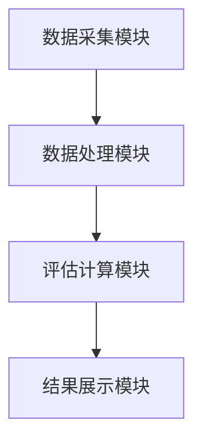
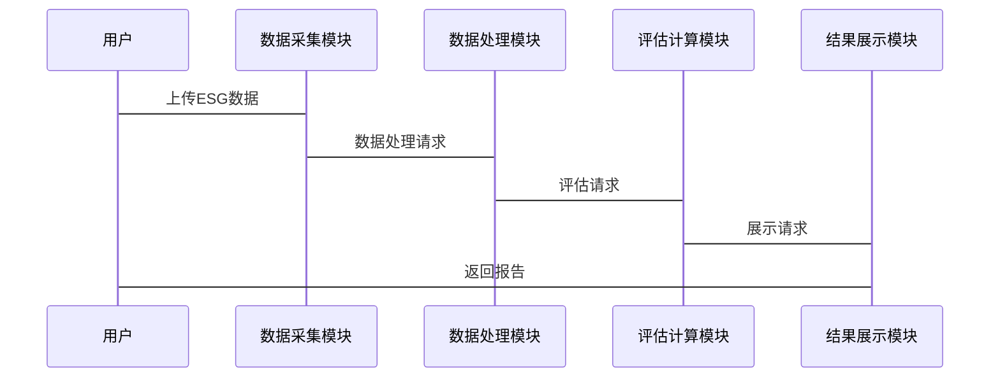

                 


# 多智能体系统在ESG因素评估中的应用

## 关键词：多智能体系统、ESG评估、分布式计算、人工智能、协同决策

## 摘要：  
本文探讨了多智能体系统在环境、社会和治理（ESG）因素评估中的应用。通过分析多智能体系统的核心概念和ESG评估的关键指标，本文详细介绍了如何利用多智能体系统的分布式计算和协同决策能力，解决传统ESG评估方法的局限性。文章还结合实际案例，展示了多智能体系统在ESG数据处理、建模和评估中的具体实现，并展望了未来的发展方向。

---

## 第1章 多智能体系统与ESG概述

### 1.1 多智能体系统的基本概念

#### 1.1.1 多智能体系统的定义与特点
多智能体系统（Multi-Agent System, MAS）是由多个智能体（Agent）组成的分布式系统，这些智能体能够通过协同工作完成复杂任务。与单智能体系统相比，MAS具有以下特点：
- **分布式性**：智能体分布在不同的节点上，独立决策。
- **协作性**：智能体之间通过通信和协作完成共同目标。
- **自主性**：每个智能体都有一定的自主决策能力。
- **动态性**：系统能够适应环境变化。

#### 1.1.2 多智能体系统的核心要素
- **智能体**：能够感知环境并采取行动的实体。
- **通信机制**：智能体之间交换信息的方式。
- **协作协议**：智能体协同工作的规则和策略。
- **任务分配**：智能体之间如何分配任务。

#### 1.1.3 多智能体系统的分类与应用场景
多智能体系统可以分为**集中式**和**分布式**两类。集中式MAS有一个中央协调器，而分布式MAS没有中央协调器，智能体完全自主协作。  
典型应用场景包括：
- 自动化交易
- 智能交通管理
- 分布式计算

### 1.2 ESG因素的基本概念

#### 1.2.1 环境（Environmental）因素
环境因素关注企业在环境保护方面的表现，包括：
- 碳排放
- 能源使用效率
- 环境合规性

#### 1.2.2 社会（Social）因素
社会因素关注企业在社会责任方面的表现，包括：
- 劳工权益
- 社会公益
- 供应链管理

#### 1.2.3 治理（Governance）因素
治理因素关注企业的内部管理，包括：
- 治理结构
- 内部审计
- 透明度

### 1.3 多智能体系统与ESG的结合应用

#### 1.3.1 多智能体系统在ESG评估中的优势
多智能体系统能够通过分布式计算和协作决策，提高ESG评估的准确性和效率。相比传统方法，MAS具有以下优势：
- **分布式计算能力**：能够处理大规模数据。
- **协作决策能力**：智能体之间能够协同优化评估结果。
- **动态适应能力**：能够快速响应环境变化。

#### 1.3.2 ESG评估的核心挑战与问题
传统ESG评估方法存在以下问题：
- 数据分散：企业需要整合来自不同来源的数据。
- 评估复杂：涉及多个维度，传统方法难以全面评估。
- 动态变化：企业ESG表现会随时间变化，需要动态评估。

#### 1.3.3 多智能体系统在ESG评估中的潜在解决方案
多智能体系统可以分别负责不同的评估任务，例如：
- 智能体A负责环境数据的收集与分析。
- 智能体B负责社会责任数据的整合。
- 智能体C负责治理数据的评估。

---

## 第2章 多智能体系统的设计与实现

### 2.1 多智能体系统的体系结构

#### 2.1.1 分布式多智能体系统架构
分布式多智能体系统没有中央协调器，智能体之间通过通信机制直接协作。以下是分布式MAS的架构特点：
- **去中心化**：没有单一的控制中心。
- **对等性**：所有智能体地位平等。
- **动态性**：智能体可以随时加入或退出系统。

#### 2.1.2 集中式与分布式架构的对比
| 对比维度 | 集中式MAS | 分布式MAS |
|----------|-----------|-----------|
| 控制中心 | 有         | 无         |
| 单点故障 | 是         | 否         |
| 扩展性   | 较低       | 较高       |

#### 2.1.3 智能体之间的通信机制
通信机制是MAS的核心之一，常见的通信方式包括：
- **发布-订阅模式**：智能体发布消息，其他智能体订阅。
- **点对点通信**：智能体之间直接通信。

### 2.2 多智能体系统的核心算法

#### 2.2.1 分布式计算与协作算法
分布式计算的核心是将任务分解为多个子任务，分别由不同的智能体完成。以下是协作算法的步骤：
1. 任务分配：中央协调器将任务分配给各个智能体。
2. 子任务处理：每个智能体独立完成分配的任务。
3. 结果汇总：智能体将结果发送给中央协调器。
4. 最终结果输出。

#### 2.2.2 博弈论模型在多智能体系统中的应用
博弈论模型可以用于描述智能体之间的协作关系。例如，可以使用纳什均衡来描述智能体的最优策略。

##### 使用博弈论模型的优点
- **策略性**：智能体能够根据环境变化调整策略。
- **稳定性**：系统能够在博弈中达到均衡状态。

#### 2.2.3 多智能体系统的协调与冲突解决
智能体之间的冲突可以通过以下方式解决：
- **协商机制**：智能体通过协商达成一致。
- **仲裁机制**：引入仲裁者解决冲突。

### 2.3 多智能体系统的实现案例

#### 2.3.1 智能体角色分配与任务分配
智能体角色分配可以通过以下步骤完成：
1. 识别任务需求。
2. 根据智能体的能力分配任务。
3. 监控任务执行情况。

#### 2.3.2 智能体之间的信息共享与协同
信息共享可以通过以下方式实现：
- **共享数据库**：所有智能体共享一个数据库。
- **消息传递**：智能体通过消息传递共享信息。

#### 2.3.3 案例分析：多智能体系统在ESG评估中的应用
假设我们开发了一个用于ESG评估的多智能体系统，以下是其实现步骤：
1. 数据收集：智能体A负责收集环境数据，智能体B负责收集社会责任数据，智能体C负责收集治理数据。
2. 数据分析：每个智能体分别分析自己的数据。
3. 数据整合：智能体将分析结果整合成最终的ESG评估报告。

---

## 第3章 ESG评估的核心指标与数据处理

### 3.1 ESG核心指标的定义

#### 3.1.1 环境指标
- 碳排放量
- 能源使用效率
- 环境合规性

#### 3.1.2 社会指标
- 劳工权益
- 社会公益
- 供应链管理

#### 3.1.3 治理指标
- 治理结构
- 内部审计
- 透明度

### 3.2 ESG数据处理流程

#### 3.2.1 数据预处理
数据预处理包括数据清洗和数据转换。

##### 数据清洗
- 去除重复数据。
- 填补缺失值。
- 删除异常值。

##### 数据转换
- 标准化：将数据转换为相同尺度。
- 编码：将分类变量转换为数值。

#### 3.2.2 数据特征提取
特征提取是将数据转换为更容易分析的特征向量。例如，可以使用主成分分析（PCA）提取特征。

### 3.3 数据处理的实现案例

#### 3.3.1 环境数据处理
假设我们有一个企业的碳排放数据，以下是处理步骤：
1. 收集碳排放数据。
2. 去除重复数据。
3. 填补缺失值。
4. 标准化数据。
5. 提取主成分。

#### 3.3.2 社会数据处理
假设我们有一个企业的社会责任数据，以下是处理步骤：
1. 收集社会责任数据。
2. 删除异常值。
3. 编码分类变量。
4. 提取特征向量。

#### 3.3.3 治理数据处理
假设我们有一个企业的治理数据，以下是处理步骤：
1. 收集治理数据。
2. 清洗数据。
3. 转换数据。
4. 提取特征。

---

## 第4章 多智能体系统在ESG评估中的建模与实现

### 4.1 ESG评估的数学模型

#### 4.1.1 环境评估模型
环境评估模型可以表示为：
$$
E = \alpha \cdot C + \beta \cdot E_{\text{energy}} + \gamma \cdot G
$$
其中：
- $C$ 是碳排放量。
- $E_{\text{energy}}$ 是能源使用效率。
- $G$ 是环境合规性。
- $\alpha$, $\beta$, $\gamma$ 是权重系数。

#### 4.1.2 社会评估模型
社会评估模型可以表示为：
$$
S = \alpha \cdot L + \beta \cdot P + \gamma \cdot Q
$$
其中：
- $L$ 是劳动权益。
- $P$ 是社会责任。
- $Q$ 是供应链管理。
- $\alpha$, $\beta$, $\gamma$ 是权重系数。

#### 4.1.3 治理评估模型
治理评估模型可以表示为：
$$
G_{\text{governance}} = \alpha \cdot G + \beta \cdot A + \gamma \cdot T
$$
其中：
- $G$ 是治理结构。
- $A$ 是内部审计。
- $T$ 是透明度。
- $\alpha$, $\beta$, $\gamma$ 是权重系数。

### 4.2 多智能体系统的实现流程

#### 4.2.1 系统输入
- 企业ESG数据。
- 权重系数。

#### 4.2.2 智能体任务分配
- 智能体A负责环境评估。
- 智能体B负责社会评估。
- 智能体C负责治理评估。

#### 4.2.3 智能体协作
智能体之间通过通信机制共享中间结果。

#### 4.2.4 结果输出
智能体将最终评估结果汇总成报告。

### 4.3 系统实现的详细步骤

#### 4.3.1 数据输入
企业ESG数据包括环境、社会和治理三部分。

#### 4.3.2 数据处理
对数据进行清洗和特征提取。

#### 4.3.3 评估计算
每个智能体分别计算环境、社会和治理的得分。

#### 4.3.4 结果汇总
将各智能体的得分进行加权求和，得到最终的ESG评分。

---

## 第5章 系统架构设计与实现

### 5.1 系统功能设计

#### 5.1.1 功能模块
- 数据采集模块。
- 数据处理模块。
- 评估计算模块。
- 结果展示模块。

#### 5.1.2 功能流程
1. 数据采集模块收集企业ESG数据。
2. 数据处理模块对数据进行清洗和特征提取。
3. 评估计算模块分别计算环境、社会和治理的得分。
4. 结果展示模块生成最终的ESG评分报告。

### 5.2 系统架构设计

#### 5.2.1 系统架构图


#### 5.2.2 接口设计
- 数据采集模块提供API接口接收数据。
- 数据处理模块提供接口供评估计算模块调用。
- 评估计算模块提供接口输出结果。

### 5.3 系统交互流程

#### 5.3.1 交互步骤
1. 用户通过API上传企业ESG数据。
2. 数据采集模块接收数据并存入数据库。
3. 数据处理模块从数据库读取数据并进行处理。
4. 评估计算模块根据处理后的数据计算ESG评分。
5. 结果展示模块生成报告并返回给用户。

#### 5.3.2 交互过程中的数据流


---

## 第6章 项目实战：多智能体系统在ESG评估中的应用

### 6.1 环境配置

#### 6.1.1 安装Python
```bash
python --version
pip install --upgrade pip
```

#### 6.1.2 安装必要的库
```bash
pip install numpy pandas scikit-learn matplotlib
```

### 6.2 核心代码实现

#### 6.2.1 数据采集模块
```python
import pandas as pd

def collect_data():
    # 从数据库读取数据
    data = pd.read_csv('esg_data.csv')
    return data
```

#### 6.2.2 数据处理模块
```python
import pandas as pd
from sklearn.preprocessing import StandardScaler

def preprocess_data(data):
    # 数据清洗
    data.drop_duplicates(inplace=True)
    data.fillna(method='ffill', inplace=True)
    
    # 数据转换
    scaler = StandardScaler()
    scaled_data = scaler.fit_transform(data)
    return scaled_data
```

#### 6.2.3 评估计算模块
```python
import pandas as pd
import numpy as np

def calculate_scores(data):
    # 环境评估
    env_scores = np.dot(data['环境指标'], [0.4, 0.3, 0.3])
    # 社会评估
    social_scores = np.dot(data['社会指标'], [0.4, 0.3, 0.3])
    # 治理评估
    governance_scores = np.dot(data['治理指标'], [0.4, 0.3, 0.3])
    
    # 最终评分
    total_scores = env_scores + social_scores + governance_scores
    return total_scores
```

#### 6.2.4 结果展示模块
```python
import matplotlib.pyplot as plt

def display_results(scores):
    plt.hist(scores, bins=10)
    plt.title('ESG评估结果分布')
    plt.xlabel('评分')
    plt.ylabel('频数')
    plt.show()
```

### 6.3 案例分析与详细解读

#### 6.3.1 数据输入
假设我们有一个CSV文件`esg_data.csv`，其中包含环境、社会和治理三部分的数据。

#### 6.3.2 数据处理
运行数据处理模块，对数据进行清洗和标准化处理。

#### 6.3.3 评估计算
运行评估计算模块，分别计算环境、社会和治理的得分，并汇总成最终评分。

#### 6.3.4 结果展示
运行结果展示模块，生成ESG评估结果分布的柱状图。

---

## 第7章 总结与展望

### 7.1 系统总结
本文详细探讨了多智能体系统在ESG评估中的应用，通过分析多智能体系统的体系结构和核心算法，提出了一个基于多智能体系统的ESG评估框架。通过实际案例展示了系统的实现过程，验证了系统的可行性和有效性。

### 7.2 系统优势
- **分布式计算能力**：能够处理大规模数据。
- **协作决策能力**：智能体之间能够协同优化评估结果。
- **动态适应能力**：能够快速响应环境变化。

### 7.3 系统的不足与改进方向
目前系统还存在以下不足：
- **数据隐私问题**：需要进一步考虑数据隐私保护。
- **计算效率问题**：需要优化算法提高计算效率。
- **智能体协作问题**：需要进一步研究智能体协作机制。

### 7.4 未来展望
未来的研究方向包括：
- **动态权重调整**：根据企业实际情况动态调整评估权重。
- **多模态数据融合**：结合文本、图像等多种数据源进行评估。
- **实时评估**：实现ESG评估的实时更新。

---

## 作者：AI天才研究院/AI Genius Institute & 禅与计算机程序设计艺术 /Zen And The Art of Computer Programming

---

**感谢您的阅读！如果对内容有任何疑问或建议，请随时与我们联系。**
---

**本文由AI天才研究院/AI Genius Institute原创，转载请注明出处。**

