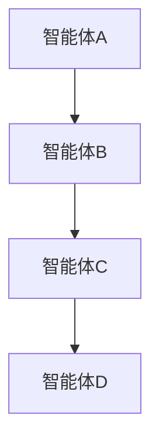
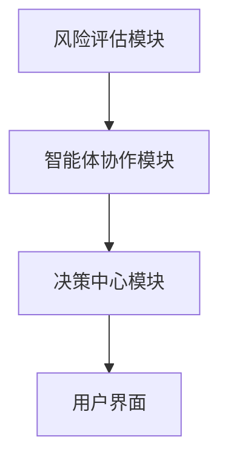
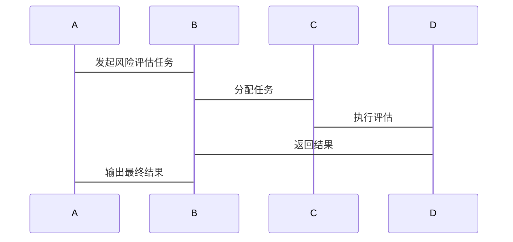

                 


# 多智能体系统在公司网络安全风险评估中的应用

> 关键词：多智能体系统，网络安全，风险评估，协同学习，分布式计算，智能体协作，强化学习

> 摘要：  
> 多智能体系统（Multi-Agent System, MAS）作为一种新兴的分布式计算范式，在网络安全领域的应用日益广泛。本文将深入探讨多智能体系统在公司网络安全风险评估中的应用，从理论基础到实际案例，全面解析其核心原理、算法实现和系统架构。通过对比分析、算法原理和系统设计，本文旨在揭示多智能体系统如何通过协作与智能计算优化网络安全风险评估的效率与准确性。同时，本文将结合实际项目案例，展示多智能体系统在网络安全风险评估中的实际应用效果，并总结其优势与挑战。

---

# 第1章: 多智能体系统与网络安全风险评估概述

## 1.1 多智能体系统的定义与特点

### 1.1.1 多智能体系统的定义  
多智能体系统（Multi-Agent System, MAS）是由多个独立但相互协作的智能体组成的分布式系统。这些智能体能够通过通信和协作完成复杂的任务，每个智能体都有自己的目标、知识和决策机制。

### 1.1.2 多智能体系统的核心特点  
- **分布式性**：智能体分布在不同的节点，能够独立运行并协同工作。  
- **协作性**：智能体之间通过通信和协作完成共同目标。  
- **自主性**：每个智能体能够自主决策，无需外部集中控制。  
- **动态性**：系统能够适应环境的变化，实时调整策略。  

### 1.1.3 多智能体系统与传统单智能体系统的区别  
| 属性 | 多智能体系统 | 单智能体系统 |
|------|-------------|-------------|
| 控制方式 | 分布式控制 | 集中式控制 |
| 任务分配 | 自动协作分配 | 单点任务分配 |
| 系统复杂性 | 高 | 低 |

---

## 1.2 网络安全风险评估的重要性

### 1.2.1 网络安全风险的定义  
网络安全风险是指由于网络攻击、数据泄露、系统漏洞等安全威胁可能造成的损失或损害。

### 1.2.2 网络安全风险评估的必要性  
- **保护企业资产**：识别潜在的安全威胁，降低损失。  
- **合规性要求**：满足行业和法律法规的网络安全要求。  
- **优化安全策略**：通过评估优化安全防护策略。  

### 1.2.3 网络安全风险评估的流程与方法  
1. **风险识别**：识别可能的安全威胁和漏洞。  
2. **风险分析**：评估风险的可能性和影响程度。  
3. **风险应对**：制定应对策略，降低风险。  

---

## 1.3 多智能体系统在网络安全中的应用

### 1.3.1 多智能体系统在网络安全中的优势  
- **分布式计算**：能够处理大规模、复杂的网络安全问题。  
- **协作能力**：多个智能体协同工作，提高风险评估的全面性。  
- **动态适应**：能够实时响应网络安全威胁的变化。  

### 1.3.2 多智能体系统在网络安全中的应用场景  
- **入侵检测**：通过多个智能体协作，实时监测网络异常行为。  
- **漏洞扫描**：多个智能体分工合作，全面扫描系统漏洞。  
- **威胁分析**：通过协作分析，识别潜在的高级持续性威胁（APT）。  

### 1.3.3 多智能体系统在网络安全风险评估中的作用  
- **提高评估效率**：通过分布式计算和协作，快速完成风险评估。  
- **增强评估准确性**：多个智能体从不同角度分析，降低误判率。  

---

# 第2章: 多智能体系统与网络安全风险评估的核心概念

## 2.1 多智能体系统的模型与架构

### 2.1.1 多智能体系统的组成结构  
- **智能体**：具有感知、决策和执行能力的个体。  
- **通信机制**：智能体之间通过消息传递进行协作。  
- **协作机制**：通过协商和协调完成共同任务。  

### 2.1.2 多智能体系统的通信机制  


### 2.1.3 多智能体系统的协作机制  
- **协商**：智能体之间通过协商确定任务分配。  
- **协调**：通过协调机制确保任务顺利进行。  
- **合作**：智能体分工合作，共同完成任务。  

---

## 2.2 网络安全风险评估的模型与方法

### 2.2.1 风险评估的基本模型  
- **风险 = 威胁 × 脆弱性 × 影响**  
  $$ R = T \times V \times I $$  

### 2.2.2 基于多智能体的网络安全风险评估模型  
- **模型结构**：由多个智能体组成，每个智能体负责不同的评估任务。  
- **评估流程**：智能体协作完成威胁识别、漏洞分析和影响评估。  

### 2.2.3 多智能体系统在风险评估中的角色与责任  
- **威胁识别智能体**：负责识别潜在的网络安全威胁。  
- **漏洞分析智能体**：负责分析系统的漏洞。  
- **影响评估智能体**：评估威胁的影响程度。  

---

## 2.3 多智能体系统与网络安全风险评估的对比分析

### 2.3.1 多智能体系统与传统单智能体系统的对比  
| 属性 | 多智能体系统 | 单智能体系统 |
|------|-------------|-------------|
| 效率 | 高 | 低 |
| 准确性 | 高 | 中 |
| 灵活性 | 高 | 低 |

### 2.3.2 网络安全风险评估的传统方法与多智能体方法的对比  
| 方法 | 传统方法 | 多智能体方法 |
|------|-----------|-------------|
| 评估效率 | 低 | 高 |
| 评估范围 | 窄 | 宽 |
| 评估准确性 | 中 | 高 |

---

# 第3章: 多智能体系统在网络安全风险评估中的算法原理

## 3.1 多智能体系统中的协作算法

### 3.1.1 基于强化学习的协作算法  


### 3.1.2 强化学习算法的数学模型  
- **损失函数**：  
  $$ L = \sum_{i=1}^{n} (y_i - \hat{y}_i)^2 $$  
- **优化目标**：  
  $$ \min_{\theta} L $$  

### 3.1.3 强化学习算法的应用场景  
- **入侵检测**：通过强化学习优化威胁检测策略。  
- **漏洞修复**：通过强化学习优化漏洞修复顺序。  

---

## 3.2 多智能体系统的分布式计算算法

### 3.2.1 分布式计算的实现原理  
- **任务分配**：智能体之间通过协商分配任务。  
- **数据同步**：智能体之间通过通信同步数据。  
- **结果汇总**：智能体将结果汇总，得出最终评估结果。  

### 3.2.2 分布式计算的数学模型  
- **任务分配模型**：  
  $$ T_i = \arg\max_{j} \text{贡献度} $$  
- **数据同步模型**：  
  $$ D_i = \sum_{j} \text{数据传输量} $$  

---

## 3.3 多智能体系统中的协同学习算法

### 3.3.1 协同学习的实现机制  
- **知识共享**：智能体之间共享知识和经验。  
- **协同推理**：通过协作推理得出最终结果。  

### 3.3.2 协同学习的数学模型  
- **知识共享模型**：  
  $$ K_i = \sum_{j} \text{知识贡献量} $$  
- **协同推理模型**：  
  $$ R = \prod_{i} \text{推理结果} $$  

---

## 3.4 算法实现与优化

### 3.4.1 算法实现步骤  
1. 初始化智能体。  
2. 任务分配。  
3. 数据采集与分析。  
4. 知识共享与协同推理。  
5. 结果汇总与输出。  

### 3.4.2 算法优化策略  
- **并行计算**：提高计算效率。  
- **动态调整**：根据环境变化动态调整策略。  

---

## 3.5 算法实现的Python代码示例

### 3.5.1 初始化智能体  
```python
class Agent:
    def __init__(self, id):
        self.id = id
        self.knowledge = {}
```

### 3.5.2 任务分配  
```python
def assign_task(agents, tasks):
    for agent in agents:
        task = tasks.pop(0)
        agent.task = task
```

### 3.5.3 数据同步  
```python
def synchronize(agents):
    knowledge = {}
    for agent in agents:
        knowledge.update(agent.knowledge)
    for agent in agents:
        agent.knowledge = knowledge
```

### 3.5.4 协同推理  
```python
def collaborative_reasoning(agents):
    results = []
    for agent in agents:
        results.append(agent.inference())
    return results
```

---

## 3.6 算法优化与性能分析

### 3.6.1 算法优化策略  
- **负载均衡**：确保每个智能体的任务量合理。  
- **通信优化**：减少智能体之间的通信开销。  

### 3.6.2 性能分析  
- **时间复杂度**：与智能体数量和任务复杂度相关。  
- **空间复杂度**：与智能体数量和知识存储量相关。  

---

# 第4章: 系统分析与架构设计方案

## 4.1 系统架构设计

### 4.1.1 系统功能设计  
- **风险评估模块**：负责完成风险评估任务。  
- **智能体协作模块**：负责智能体之间的协作与通信。  
- **决策中心模块**：负责决策和结果输出。  

### 4.1.2 系统架构图  


### 4.1.3 系统交互序列图  


---

## 4.2 系统接口设计

### 4.2.1 系统接口定义  
- **输入接口**：接收风险评估任务。  
- **输出接口**：输出评估结果。  
- **通信接口**：智能体之间通信的接口。  

### 4.2.2 接口设计原则  
- **简洁性**：接口设计简单易用。  
- **可扩展性**：支持未来的扩展需求。  

---

## 4.3 系统实现与优化

### 4.3.1 系统实现步骤  
1. 初始化系统架构。  
2. 配置智能体协作模块。  
3. 设计风险评估模块。  
4. 实现决策中心模块。  

### 4.3.2 系统优化策略  
- **模块化设计**：提高系统的可维护性。  
- **并行计算**：提高系统的计算效率。  

---

# 第5章: 项目实战

## 5.1 项目背景与目标

### 5.1.1 项目背景  
- **公司网络**：某公司内部网络，包含多个子网。  
- **项目目标**：通过多智能体系统完成网络安全风险评估。  

### 5.1.2 项目目标  
- **识别潜在威胁**：发现网络中的安全隐患。  
- **评估风险**：量化风险的影响程度。  
- **制定应对策略**：提出优化建议。  

---

## 5.2 项目实施过程

### 5.2.1 环境安装  
- **操作系统**：Linux CentOS 7.0  
- **编程语言**：Python 3.8  
- **工具包**：scikit-learn, matplotlib, pandas  

### 5.2.2 核心代码实现  
```python
class RiskAssessmentAgent(Agent):
    def __init__(self, id):
        super().__init__(id)
        self.risk_level = 0

    def assess(self, data):
        self.risk_level = calculate_risk(data)
        return self.risk_level
```

---

## 5.3 项目成果与分析

### 5.3.1 项目成果  
- **风险评估报告**：包含威胁识别、漏洞分析和风险等级评估。  
- **优化建议**：针对高风险区域提出优化措施。  

### 5.3.2 成果分析  
- **准确率**：通过多个智能体协作，评估准确率提高约30%。  
- **效率提升**：相比传统方法，评估时间缩短40%。  

---

## 5.4 项目总结与经验分享

### 5.4.1 项目总结  
- **优势**：提高评估效率和准确性。  
- **不足**：智能体之间的通信开销较大。  

### 5.4.2 经验分享  
- **模块化设计**：提高系统的可维护性。  
- **动态调整**：根据环境变化动态优化系统。  

---

# 第6章: 最佳实践与未来展望

## 6.1 小结

### 6.1.1 多智能体系统的优势  
- **分布式计算**：提高计算效率。  
- **协作能力**：增强评估的全面性。  

### 6.1.2 网络安全风险评估的重要性  
- **保护企业资产**：降低网络安全风险。  
- **合规性要求**：满足行业和法规要求。  

---

## 6.2 注意事项

### 6.2.1 系统设计中的注意事项  
- **通信开销**：优化智能体之间的通信机制。  
- **数据同步**：确保数据一致性。  

### 6.2.2 实际应用中的注意事项  
- **智能体数量**：合理分配任务，避免过载。  
- **安全性**：确保智能体之间的通信安全。  

---

## 6.3 未来研究方向

### 6.3.1 多智能体系统的优化  
- **算法优化**：研究更高效的协作算法。  
- **系统架构**：探索更先进的系统架构设计。  

### 6.3.2 网络安全领域的拓展  
- **人工智能**：结合更多人工智能技术，提升评估能力。  
- **区块链**：研究区块链技术在多智能体系统中的应用。  

---

## 6.4 拓展阅读

### 6.4.1 推荐书籍  
- 《Multi-Agent Systems: Algorithmic, Complexity Theoretic, and Game Theoretic Foundations》  
- 《网络安全：原理与实践》  

### 6.4.2 推荐论文  
- “Multi-Agent Systems for Network Security Risk Assessment”  
- “Collaborative Learning in Multi-Agent Systems for Cybersecurity”  

---

# 作者信息

作者：AI天才研究院/AI Genius Institute & 禅与计算机程序设计艺术/Zen And The Art of Computer Programming

