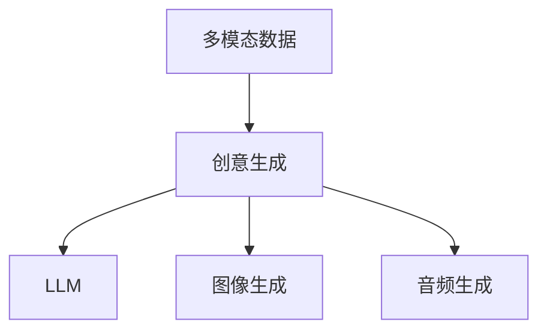
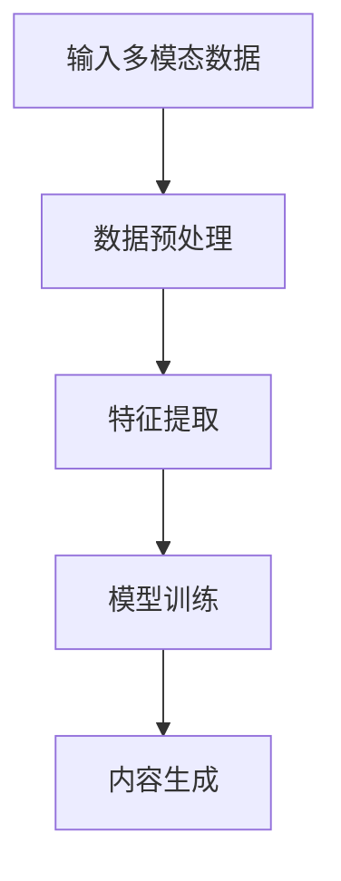
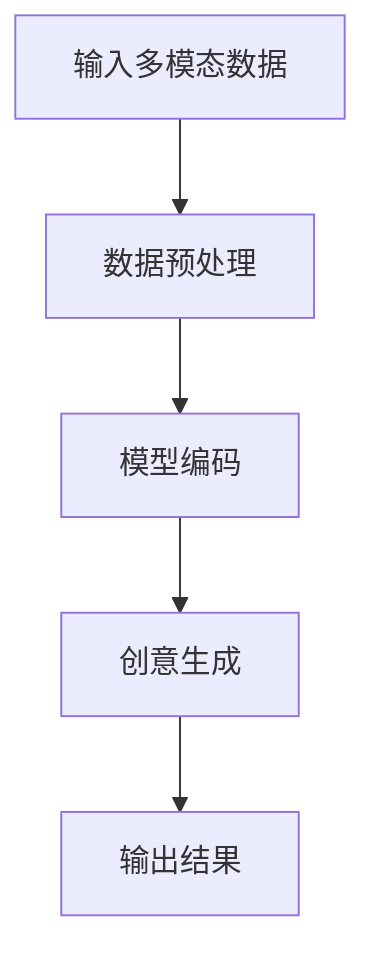
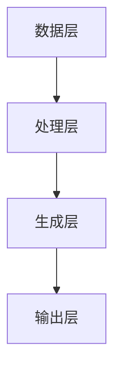
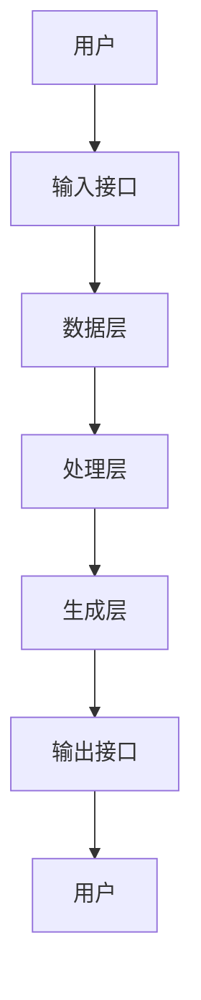

                 


# 多模态创意生成AI Agent：整合LLM与图像、音频生成

---

## 关键词
- 多模态创意生成
- AI Agent
- 大语言模型（LLM）
- 图像生成
- 音频生成
- 跨模态整合

---

## 摘要
本文深入探讨了多模态创意生成AI Agent的构建与应用，重点分析了如何整合大语言模型（LLM）与图像、音频生成技术。文章从背景、核心概念、算法原理、系统架构到项目实战，全面解析了多模态创意生成的技术细节与实现路径，为读者提供了从理论到实践的完整指南。

---

# 第1章: 多模态创意生成的背景与重要性

## 1.1 多模态创意生成的背景
多模态创意生成是指通过整合文本、图像、音频等多种模态数据，利用AI技术生成创意内容的过程。随着AI技术的快速发展，创意生成已经从单一模态（如文本生成）扩展到多模态，从而能够更好地满足多样化的应用场景需求。

### 1.1.1 多模态技术的定义与特点
- **定义**：多模态技术是指整合多种数据形式（如文本、图像、音频、视频等）的技术，旨在通过多种模态信息的协同作用提升AI系统的性能。
- **特点**：
  - **信息互补性**：不同模态的数据可以相互补充，提升系统的理解能力。
  - **用户体验优化**：通过多模态交互，用户可以获得更丰富、更直观的体验。
  - **任务多样性**：多模态技术可以应用于多种任务，如图像描述生成、音频内容生成等。

### 1.1.2 创意生成的定义与目标
- **定义**：创意生成是指通过AI技术生成具有创新性和独特性的内容，如文本、图像、音频等。
- **目标**：
  - 提供多样化的创意内容。
  - 提升生成内容的质量和用户体验。
  - 实现自动化创意生成，降低人工创作的成本。

### 1.1.3 多模态创意生成的必要性
- **需求驱动**：随着用户对多样化内容的需求增加，单一模态生成技术已无法满足市场需求。
- **技术驱动**：AI技术的快速发展为多模态生成提供了技术支持。
- **应用场景扩展**：多模态生成技术可以应用于广告、游戏、教育等多个领域，具有广泛的应用前景。

## 1.2 多模态AI Agent的定义与特点
### 1.2.1 多模态AI Agent的核心概念
- **定义**：多模态AI Agent是一种能够理解和生成多种模态数据的智能体，能够通过多模态交互为用户提供服务。
- **特点**：
  - **多模态感知**：能够处理和理解多种数据形式。
  - **智能决策**：基于多模态数据进行智能决策和生成。
  - **人机协同**：能够与人类用户进行高效协同，提供个性化的服务。

### 1.2.2 多模态AI Agent与传统AI的区别
- **传统AI**：通常专注于单一模态数据的处理，如文本生成或图像识别。
- **多模态AI Agent**：能够整合多种模态数据，实现更复杂、更智能的交互和生成。

### 1.2.3 多模态创意生成AI Agent的应用场景
- **广告设计**：通过多模态生成技术为广告设计提供创意内容。
- **游戏开发**：生成游戏中的场景、角色和故事情节。
- **教育培训**：为学生提供个性化的学习内容和互动体验。

## 1.3 LLM与多模态生成技术的整合
### 1.3.1 LLM的基本原理
- **大语言模型（LLM）**：基于深度学习的自然语言处理模型，能够理解和生成人类语言。
- **基本原理**：
  - 输入文本数据，经过编码和解码过程生成输出。
  - 通过大规模数据训练，模型能够捕捉语言的规律和语义信息。

### 1.3.2 多模态生成技术的基本原理
- **多模态生成技术**：通过整合多种模态数据，生成多样化的内容。
- **技术实现**：
  - 使用深度学习模型（如GAN、VAE等）生成图像或音频。
  - 通过跨模态对齐技术实现不同模态数据的协同生成。

### 1.3.3 LLM与多模态生成技术的整合优势
- **优势**：
  - **跨模态协同**：LLM可以与图像、音频生成模型协同工作，实现多模态创意生成。
  - **提升生成质量**：通过多模态数据的协同作用，生成质量更高的内容。
  - **增强用户体验**：多模态生成技术能够提供更丰富、更直观的用户体验。

---

## 1.4 本章小结
本章从多模态创意生成的背景出发，介绍了多模态技术的定义、特点以及创意生成的目标和必要性。同时，详细阐述了多模态AI Agent的核心概念和应用场景，并探讨了LLM与多模态生成技术的整合优势。这些内容为后续章节的技术分析和实现提供了基础。

---

# 第2章: 多模态创意生成的核心概念与联系

## 2.1 多模态创意生成的核心概念
### 2.1.1 多模态数据的定义与分类
- **多模态数据**：指整合了多种数据形式（如文本、图像、音频等）的数据。
- **分类**：
  - **结构化数据**：如文本、表格数据。
  - **非结构化数据**：如图像、音频、视频。

### 2.1.2 创意生成的定义与目标
- **定义**：通过AI技术生成具有创新性和独特性的内容。
- **目标**：
  - 提供多样化的内容。
  - 提升生成内容的质量。
  - 实现自动化创意生成。

### 2.1.3 多模态创意生成的核心要素
- **输入数据**：多种模态的数据输入。
- **生成模型**：能够处理多模态数据的生成模型。
- **输出结果**：多样化的内容输出。

## 2.2 多模态创意生成的原理
### 2.2.1 多模态数据的融合方式
- **模态融合**：将多种模态数据进行融合，提升生成效果。
- **融合方式**：
  - **早期融合**：在特征提取阶段进行融合。
  - **晚期融合**：在生成阶段进行融合。

### 2.2.2 创意生成的算法流程
- **输入数据预处理**：对多模态数据进行预处理。
- **特征提取**：提取多模态数据的特征。
- **模型训练**：训练生成模型。
- **内容生成**：根据输入生成创意内容。

### 2.2.3 多模态创意生成的数学模型
- **模型结构**：
  - 输入层：接收多模态数据。
  - 隐藏层：对数据进行特征提取和变换。
  - 输出层：生成创意内容。

$$
\text{模型输入：} x = (x_1, x_2, \ldots, x_n)
$$

$$
\text{模型输出：} y = f(x)
$$

其中，$f$ 是生成模型的函数。

## 2.3 多模态创意生成的ER实体关系图


### 2.3.1 实体关系图的解释
- **多模态数据**：输入数据，包括文本、图像、音频等。
- **创意生成**：生成多样化的内容。
- **LLM**：大语言模型，负责文本生成。
- **图像生成**：生成图像内容。
- **音频生成**：生成音频内容。

## 2.4 本章小结
本章详细阐述了多模态创意生成的核心概念，包括多模态数据的定义与分类、创意生成的定义与目标，以及多模态创意生成的核心要素。同时，通过ER实体关系图展示了多模态创意生成的系统架构，为后续章节的算法设计和系统实现提供了理论基础。

---

## 2.5 算法流程图


---

## 2.6 本章小结
本章通过详细分析多模态创意生成的核心概念和原理，为后续章节的技术实现提供了理论基础。通过ER实体关系图和算法流程图，直观地展示了多模态创意生成的系统架构和实现过程。

---

# 第3章: 多模态创意生成的算法原理

## 3.1 多模态创意生成的算法概述
### 3.1.1 多模态数据的预处理
- **数据清洗**：去除噪声数据。
- **数据标准化**：将数据转换为统一格式。

### 3.1.2 创意生成的模型选择
- **模型选择依据**：
  - 模型的性能。
  - 模型的复杂度。
  - 模型的可扩展性。

### 3.1.3 算法的优化与调优
- **优化方法**：
  - 参数调整。
  - 模型结构优化。
  - 训练策略优化。

## 3.2 多模态创意生成的数学模型
### 3.2.1 模型的输入与输出
- **输入**：多模态数据。
- **输出**：生成的内容。

### 3.2.2 模型的损失函数
- **损失函数**：
  - 均方误差（MSE）。
  - 交叉熵损失（Cross-Entropy Loss）。

$$
\text{损失函数：} L = \frac{1}{n}\sum_{i=1}^{n} (y_i - \hat{y}_i)^2
$$

其中，$y_i$ 是真实值，$\hat{y}_i$ 是预测值。

### 3.2.3 模型的优化算法
- **优化算法**：
  - 随机梯度下降（SGD）。
  - Adam优化器。

## 3.3 多模态创意生成的算法流程图


---

## 3.4 本章小结
本章详细介绍了多模态创意生成的算法原理，包括数据预处理、模型选择、优化与调优等内容。同时，通过数学公式和流程图的形式，直观地展示了算法的实现过程，为后续章节的系统设计提供了技术基础。

---

# 第4章: 多模态创意生成的系统架构设计

## 4.1 系统功能设计
### 4.1.1 系统的功能模块划分
- **输入模块**：接收多模态数据。
- **处理模块**：对数据进行预处理和特征提取。
- **生成模块**：利用生成模型生成创意内容。
- **输出模块**：输出生成结果。

### 4.1.2 功能模块的功能描述
- **输入模块**：负责接收用户输入的多模态数据。
- **处理模块**：对数据进行清洗、标准化等预处理操作。
- **生成模块**：基于预处理后的数据，利用生成模型生成创意内容。
- **输出模块**：将生成的内容输出给用户。

### 4.1.3 系统的功能流程
1. 用户输入多模态数据。
2. 系统对数据进行预处理。
3. 系统利用生成模型生成创意内容。
4. 系统输出生成结果。

## 4.2 系统架构设计
### 4.2.1 系统架构的分层设计
- **数据层**：存储多模态数据。
- **处理层**：对数据进行预处理和特征提取。
- **生成层**：利用生成模型生成创意内容。
- **输出层**：输出生成结果。

### 4.2.2 系统架构图


### 4.2.3 系统接口设计
- **输入接口**：接收多模态数据。
- **输出接口**：输出生成内容。

### 4.2.4 系统交互序列图


---

## 4.3 本章小结
本章详细设计了多模态创意生成系统的架构，包括功能模块划分、系统架构设计和接口设计等内容。通过架构图和交互序列图，直观地展示了系统的整体结构和工作流程，为后续章节的项目实战提供了系统设计依据。

---

# 第5章: 多模态创意生成的项目实战

## 5.1 项目背景与目标
### 5.1.1 项目背景
- **项目名称**：多模态创意生成AI Agent。
- **项目目标**：整合LLM与图像、音频生成技术，实现多模态创意生成。

### 5.1.2 项目需求
- **需求分析**：
  - 实现文本生成。
  - 实现图像生成。
  - 实现音频生成。
  - 实现多模态协同生成。

## 5.2 项目环境与工具
### 5.2.1 环境安装
- **Python**：3.8及以上版本。
- **深度学习框架**：TensorFlow或PyTorch。
- **图像生成库**：如OpenCV、Matplotlib。
- **音频生成库**：如 librosa、numpy。

### 5.2.2 工具安装
```bash
pip install numpy
pip install matplotlib
pip install librosa
pip install tensorflow
```

## 5.3 项目核心实现
### 5.3.1 文本生成模块
```python
import tensorflow as tf
import numpy as np

class TextGenerator:
    def __init__(self, model):
        self.model = model

    def generate_text(self, prompt, max_length=50):
        generated_text = self.model.generate(prompt, max_length)
        return generated_text
```

### 5.3.2 图像生成模块
```python
import tensorflow as tf
import numpy as np

class ImageGenerator:
    def __init__(self, model):
        self.model = model

    def generate_image(self, seed, output_size=256):
        generated_image = self.model.generate(seed, output_size)
        return generated_image
```

### 5.3.3 音频生成模块
```python
import librosa
import numpy as np

class AudioGenerator:
    def __init__(self, model):
        self.model = model

    def generate_audio(self, seed, duration=3):
        generated_audio = self.model.generate(seed, duration)
        return generated_audio
```

### 5.3.4 多模态生成模块
```python
class MultiModalGenerator:
    def __init__(self, text_model, image_model, audio_model):
        self.text_model = text_model
        self.image_model = image_model
        self.audio_model = audio_model

    def generate_multi_modal(self, seed, max_length=50, output_size=256, duration=3):
        text = self.text_model.generate_text(seed, max_length)
        image = self.image_model.generate_image(seed, output_size)
        audio = self.audio_model.generate_audio(seed, duration)
        return text, image, audio
```

## 5.4 项目实战案例分析
### 5.4.1 案例背景
- **案例名称**：多模态广告生成。
- **案例目标**：生成包含文本、图像和音频的广告内容。

### 5.4.2 案例实现
```python
text_model = TextGenerator(llm_model)
image_model = ImageGenerator(image_model)
audio_model = AudioGenerator(audio_model)

multi_modal_generator = MultiModalGenerator(text_model, image_model, audio_model)

text, image, audio = multi_modal_generator.generate_multi_modal("广告创意", max_length=100, output_size=256, duration=5)
```

### 5.4.3 案例分析
- **生成文本**：广告文案。
- **生成图像**：广告海报。
- **生成音频**：广告背景音乐。

## 5.5 本章小结
本章通过项目实战，详细展示了多模态创意生成AI Agent的实现过程。从环境安装到核心模块的实现，再到案例分析，为读者提供了从理论到实践的完整指南。

---

# 第6章: 总结与展望

## 6.1 本章总结
本文系统地探讨了多模态创意生成AI Agent的构建与应用，重点分析了如何整合LLM与图像、音频生成技术。通过理论分析和项目实战，全面解析了多模态创意生成的技术细节与实现路径。

## 6.2 未来展望
随着AI技术的不断发展，多模态创意生成将具有更广泛的应用前景。未来的研究方向包括：
- **更高效的生成算法**：提升生成效率和质量。
- **更智能的多模态协同**：实现更自然的多模态协同生成。
- **更丰富的应用场景**：扩展多模态生成技术的应用领域。

---

## 作者：AI天才研究院/AI Genius Institute & 禅与计算机程序设计艺术 /Zen And The Art of Computer Programming

---

通过本文的详细阐述，读者可以全面了解多模态创意生成AI Agent的技术原理和实现方法。无论是理论学习还是实际应用，本文都提供了丰富的内容和实用的指导。

