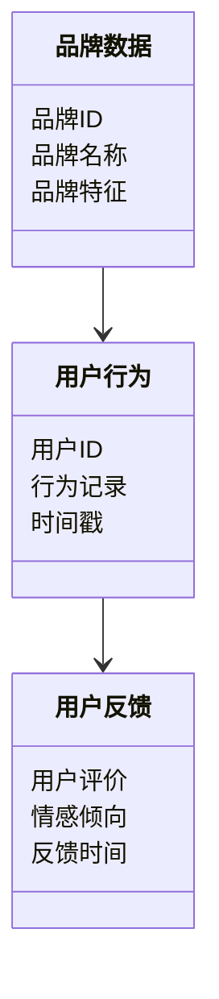
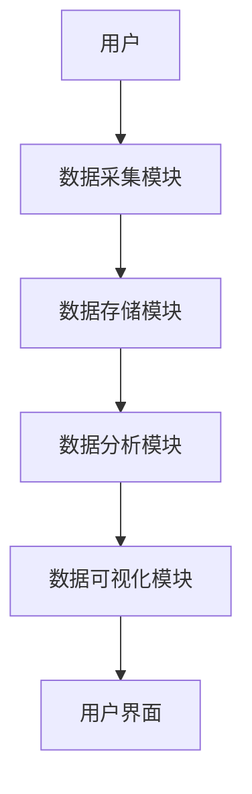

                 


# 巴菲特的品牌忠诚度分析：社交媒体时代的消费者行为

> 关键词：巴菲特，品牌忠诚度，社交媒体，消费者行为，数据分析，算法，系统架构

> 摘要：本文从巴菲特的投资理念出发，分析品牌忠诚度在社交媒体时代的演变及其对消费者行为的影响。通过数据分析和算法模型，探讨如何利用社交媒体数据量化品牌忠诚度，并结合实际案例，提供系统化的解决方案和实践指南。

---

# 第一部分: 巴菲特的品牌忠诚度分析基础

## 第1章: 巴菲特投资理念与品牌忠诚度概述

### 1.1 巴菲特投资理念的核心要素

#### 1.1.1 价值投资的定义与原则
- 价值投资的基本概念
- 巴菲特的价值投资策略
- 长期投资与复利效应

#### 1.1.2 巴菲特的品牌投资策略
- 品牌价值的重要性
- 巴菲特对品牌忠诚度的关注
- 品牌忠诚度与长期投资回报的关系

#### 1.1.3 品牌忠诚度的定义与特征
- 品牌忠诚度的定义
- 品牌忠诚度的分类
- 品牌忠诚度的核心特征

### 1.2 社交媒体时代消费者行为的变化

#### 1.2.1 社交媒体对消费习惯的影响
- 社交媒体的崛起与消费者行为的转变
- 社交媒体对品牌认知的影响
- 用户生成内容（UGC）对消费决策的作用

#### 1.2.2 品牌忠诚度的社交媒体表现
- 社交媒体上的品牌忠诚度表现形式
- 品牌 loyalists 的社交媒体行为特点
- 社交媒体时代品牌忠诚度的测量维度

#### 1.2.3 消费者行为的数据化分析
- 数据驱动的消费者行为分析
- 社交媒体数据在消费者行为分析中的作用
- 从数据中提取品牌忠诚度的指标

### 1.3 巴菲特品牌忠诚度分析的理论框架

#### 1.3.1 品牌忠诚度的测量维度
- 行为忠诚度
- 情感忠诚度
- 认知忠诚度

#### 1.3.2 巴菲特投资模型与品牌忠诚度的关系
- 巴菲特投资模型的核心要素
- 品牌忠诚度在投资决策中的作用
- 巴菲特模型中的品牌忠诚度分析框架

#### 1.3.3 社交媒体数据在品牌忠诚度分析中的应用
- 社交媒体数据的类型与特点
- 数据挖掘与品牌忠诚度分析
- 机器学习在品牌忠诚度预测中的应用

### 1.4 本章小结
- 本章总结了巴菲特投资理念中的品牌忠诚度分析基础
- 强调了社交媒体时代消费者行为的变化及其对品牌忠诚度的影响
- 介绍了品牌忠诚度的测量维度及其在投资分析中的应用

---

## 第2章: 品牌忠诚度的社交媒体数据分析

### 2.1 社交媒体数据的采集与处理

#### 2.1.1 数据采集方法
- 第三方API数据获取
- 网络爬虫技术
- 数据清洗与预处理

#### 2.1.2 数据清洗与预处理
- 数据清洗的基本步骤
- 常见的数据预处理方法
- 数据格式转换与标准化

#### 2.1.3 数据存储与管理
- 数据库设计与存储
- 数据仓库的构建
- 数据安全与隐私保护

### 2.2 品牌忠诚度的社交媒体指标

#### 2.2.1 用户参与度指标
- 点赞、评论、分享的统计与分析
- 用户活跃度与品牌忠诚度的关系
- 用户互动频率与品牌忠诚度的关联

#### 2.2.2 品牌情感分析指标
- 情感分析的基本概念
- 基于文本的情感分析方法
- 情感强度与品牌忠诚度的关联

#### 2.2.3 用户生命周期分析指标
- 用户生命周期的定义与阶段划分
- 用户生命周期与品牌忠诚度的关系
- 用户流失预测与品牌忠诚度维护

### 2.3 数据分析方法与工具

#### 2.3.1 数据可视化工具
- 常用的数据可视化工具（如Tableau、Power BI）
- 数据可视化在品牌忠诚度分析中的应用
- 可视化图表的选择与设计

#### 2.3.2 数据挖掘算法
- 常见的数据挖掘算法（如聚类、分类、关联规则挖掘）
- 算法在品牌忠诚度分析中的应用
- 算法选择与优化策略

#### 2.3.3 自然语言处理工具
- 自然语言处理（NLP）的基本概念
- NLP在社交媒体数据处理中的应用
- 基于NLP的品牌情感分析与主题挖掘

### 2.4 本章小结
- 本章详细介绍了品牌忠诚度的社交媒体数据分析方法
- 探讨了数据采集、处理与存储的关键步骤
- 分析了品牌忠诚度相关的社交媒体指标及其应用场景

---

## 第3章: 巴菲特品牌忠诚度分析的算法原理

### 3.1 品牌忠诚度分析的核心算法

#### 3.1.1 基于情感分析的分类模型
- 情感分析的基本原理
- 基于机器学习的情感分类模型
- 模型在品牌忠诚度分析中的应用

#### 3.1.2 基于聚类分析的用户分群
- 聚类分析的基本概念
- 用户分群的策略与方法
- 用户分群与品牌忠诚度分析的关系

#### 3.1.3 基于回归分析的预测模型
- 回归分析的基本原理
- 品牌忠诚度预测模型的构建
- 回归模型在品牌忠诚度预测中的应用

### 3.2 算法原理的数学模型

#### 3.2.1 情感分析的文本分类模型
- 朴素贝叶斯分类器
- 支持向量机（SVM）
- 长短时记忆网络（LSTM）与情感分类

#### 3.2.2 用户行为预测的回归模型
- 线性回归模型
- 逻辑回归模型
- 时间序列分析模型

#### 3.2.3 品牌忠诚度的评分模型
- 品牌忠诚度评分的数学公式
- 基于多维度指标的评分模型
- 模型的优化与调参策略

### 3.3 算法实现的Python代码示例

#### 3.3.1 情感分析代码
```python
from sklearn.feature_extraction.text import TfidfVectorizer
from sklearn.naive_bayes import MultinomialNB
from sklearn.pipeline import Pipeline
import pandas as pd

# 加载数据
data = pd.read_csv('sentiment_data.csv')

# 创建管道
pipeline = Pipeline([
    ('tfidf', TfidfVectorizer()),
    ('clf', MultinomialNB())
])

# 训练模型
pipeline.fit(data['text'], data['label'])

# 预测
predicted = pipeline.predict(data['text'])
```

#### 3.3.2 用户分群代码
```python
from sklearn.cluster import KMeans
import numpy as np

# 加载数据
X = np.array(data[['feature1', 'feature2']])

# 初始化模型
kmeans = KMeans(n_clusters=3, random_state=0)

# 训练模型
kmeans.fit(X)

# 预测
clusters = kmeans.predict(X)
```

#### 3.3.3 预测模型代码
```python
from sklearn.linear_model import LogisticRegression
import numpy as np

# 加载数据
X = np.array(data[['feature1', 'feature2', 'feature3']])
y = np.array(data['label'])

# 初始化模型
logreg = LogisticRegression()

# 训练模型
logreg.fit(X, y)

# 预测
predicted = logreg.predict(X)
```

### 3.4 本章小结
- 本章详细介绍了品牌忠诚度分析的核心算法
- 通过数学模型和Python代码示例，展示了算法的实现过程
- 强调了算法在品牌忠诚度预测和用户分群中的应用

---

## 第4章: 品牌忠诚度分析的系统架构设计

### 4.1 系统功能模块设计

#### 4.1.1 数据采集模块
- 数据接口设计
- 数据采集流程
- 数据存储管理

#### 4.1.2 数据分析模块
- 数据清洗与预处理
- 情感分析与主题挖掘
- 用户行为分析与预测

#### 4.1.3 可视化展示模块
- 数据可视化需求
- 可视化图表设计
- 界面交互设计

### 4.2 系统架构设计

#### 4.2.1 领域模型设计


#### 4.2.2 系统架构图


#### 4.2.3 接口设计与交互流程
- API接口定义
- 模块间的交互流程
- 接口安全与权限管理

### 4.3 本章小结
- 本章详细描述了品牌忠诚度分析系统的架构设计
- 通过领域模型和系统架构图，展示了各模块的交互关系
- 强调了系统设计在品牌忠诚度分析中的重要性

---

## 第5章: 项目实战

### 5.1 环境安装与配置

#### 5.1.1 安装Python与相关库
- 安装Python
- 安装NumPy、Pandas、Scikit-learn、NLTK等库
- 安装数据可视化工具（如Matplotlib、Seaborn）

#### 5.1.2 安装社交媒体API接口
- Twitter API、Facebook API等的安装与配置
- 数据采集工具的安装与使用

#### 5.1.3 安装机器学习框架
- TensorFlow、Keras、XGBoost等的安装与配置
- 模型训练与部署工具的安装

### 5.2 系统核心实现源代码

#### 5.2.1 数据采集与预处理代码
```python
import requests
import json

# 数据采集代码
url = "https://api.twitter.com/2/tweets/search"
params = {
    "query": " Buffett OR Warren",
    "max_results": 100
}
response = requests.get(url, params=params)
tweets = json.loads(response.text)
```

#### 5.2.2 情感分析与主题挖掘代码
```python
from textblob import TextBlob

# 情感分析代码
def analyze_sentiment(text):
    blob = TextBlob(text)
    return blob.sentiment.polarity

tweets['sentiment'] = tweets['text'].apply(analyze_sentiment)
```

#### 5.2.3 用户行为预测与品牌忠诚度评分代码
```python
from sklearn.ensemble import RandomForestClassifier

# 用户行为预测代码
model = RandomForestClassifier()
model.fit(X_train, y_train)
predicted = model.predict(X_test)
```

### 5.3 实际案例分析与详细解读

#### 5.3.1 案例背景
- 案例来源：假设我们分析的是巴菲特投资的某品牌在社交媒体上的表现
- 数据来源：社交媒体上的用户评论、点赞、分享数据

#### 5.3.2 数据分析过程
- 数据清洗与预处理
- 情感分析与主题挖掘
- 用户行为分析与品牌忠诚度评分

#### 5.3.3 分析结果与解读
- 品牌忠诚度的评分结果
- 用户行为预测结果
- 品牌在社交媒体上的表现分析

### 5.4 项目小结
- 本章通过实际案例，展示了品牌忠诚度分析的全过程
- 强调了数据分析与机器学习在品牌忠诚度分析中的应用
- 总结了项目实施的关键步骤与注意事项

---

## 第6章: 最佳实践与总结

### 6.1 小结

#### 6.1.1 核心内容回顾
- 巴菲特投资理念与品牌忠诚度分析的关系
- 社交媒体时代消费者行为的变化
- 品牌忠诚度的社交媒体数据分析方法
- 算法原理与系统架构设计
- 项目实战与实际案例分析

#### 6.1.2 本章总结
- 本文通过理论与实践相结合的方式，全面探讨了巴菲特品牌忠诚度分析在社交媒体时代的应用
- 强调了数据分析与机器学习在品牌忠诚度预测中的重要性
- 总结了系统架构设计与项目实施的关键步骤

### 6.2 注意事项与建议

#### 6.2.1 数据采集与处理中的注意事项
- 数据的准确性和完整性
- 数据隐私与合规性
- 数据存储与管理的安全性

#### 6.2.2 算法选择与优化的建议
- 根据实际需求选择合适的算法
- 模型的调参与优化
- 多模型对比与评估

#### 6.2.3 系统设计与实施中的建议
- 系统模块化设计
- 模块间的高效交互
- 系统的可扩展性与可维护性

### 6.3 拓展阅读与进一步思考

#### 6.3.1 拓展阅读方向
- 品牌忠诚度的其他影响因素
- 社交媒体时代的品牌危机管理
- 全球化背景下的品牌忠诚度分析

#### 6.3.2 进一步思考
- 人工智能与大数据在品牌忠诚度分析中的潜力
- 品牌忠诚度预测模型的创新与优化
- 社交媒体数据与品牌忠诚度分析的结合

---

## 作者信息

作者：AI天才研究院/AI Genius Institute & 禅与计算机程序设计艺术 /Zen And The Art of Computer Programming

---

以上是《巴菲特的品牌忠诚度分析：社交媒体时代的消费者行为》的技术博客文章目录大纲，涵盖了从理论基础到实践应用的各个方面，结合了技术细节与实际案例分析，为读者提供了全面而深入的指导。

