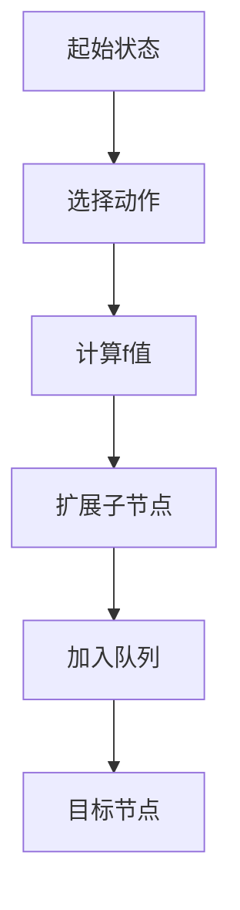
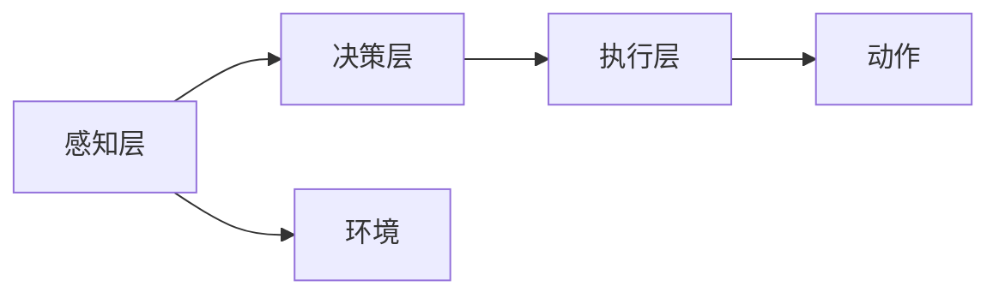
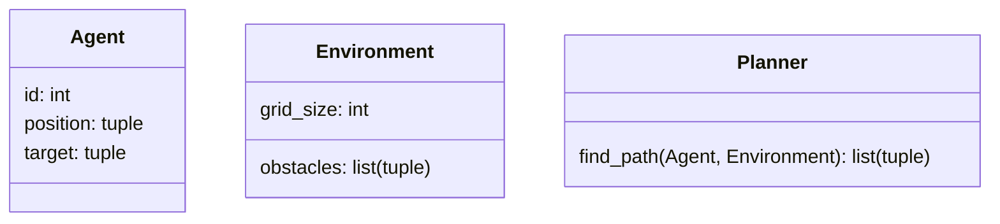
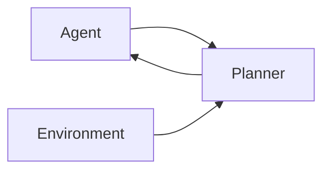

                 


# 开发具有多Agent协同规划能力的系统

> **关键词**：多Agent系统、协同规划、分布式智能、约束规划、路径规划

> **摘要**：本文详细探讨了开发具有多Agent协同规划能力系统的各个方面，从基础概念到算法实现，再到系统架构设计和项目实战，帮助读者全面理解并掌握多Agent协同规划的核心技术。文章内容涵盖多Agent系统概述、协同规划问题建模、协同规划算法、系统架构设计、项目实战以及总结，旨在为开发者提供从理论到实践的完整指南。

---

## 第一部分: 多Agent系统基础

### 第1章: 多Agent系统概述

#### 1.1 多Agent系统的基本概念

**1.1.1 什么是Agent**

Agent（智能体）是指在环境中能够感知并自主行动以实现目标的实体。Agent可以是软件程序、机器人或其他智能系统，具备以下核心特征：

- **自主性**：无需外部干预，自主决策。
- **反应性**：能够感知环境并实时响应。
- **目标导向**：以实现特定目标为导向行动。

**1.1.2 多Agent系统的定义与特点**

多Agent系统（Multi-Agent System, MAS）是由多个智能体组成的系统，这些智能体通过协作完成单个智能体无法完成的任务。其特点包括：

- **分布式智能**：多个智能体协同工作，任务分散在多个节点。
- **自主性**：每个Agent独立决策，减少中心依赖。
- **动态性**：系统状态和任务需求动态变化。

**1.1.3 多Agent系统的应用场景**

多Agent系统广泛应用于以下领域：

- **分布式计算**：如分布式任务分配、资源管理。
- **机器人协作**：如工业机器人协同装配、服务机器人任务分配。
- **游戏AI**：如多人在线游戏中的智能队友。
- **交通控制**：如自动驾驶车辆的协同规划。

#### 1.2 多Agent系统的优势与挑战

**1.2.1 分布式智能的优势**

- **容错性**：单个Agent故障不影响整体系统。
- **灵活性**：任务分配灵活，适应性强。
- **可扩展性**：可轻松添加更多Agent以扩展能力。

**1.2.2 协作规划中的主要挑战**

- **通信开销**：多Agent之间需要频繁通信，可能导致资源消耗过大。
- **协调复杂性**：多个Agent的目标和约束可能冲突，协调难度大。
- **动态环境适应**：环境动态变化时，协作规划需实时调整。

**1.2.3 系统复杂性与可扩展性**

- **复杂性**：随着Agent数量增加，系统复杂性呈指数级上升。
- **可扩展性**：系统设计需考虑扩展性，避免瓶颈。

---

## 第二部分: 多Agent协同规划的核心概念

### 第2章: 协同规划问题建模

#### 2.1 协同规划的基本原理

**2.1.1 问题建模的基本步骤**

协同规划问题建模包括以下步骤：

1. **定义目标**：明确任务目标。
2. **环境建模**：描述任务环境和约束条件。
3. **Agent角色分配**：明确每个Agent的职责和权限。
4. **任务分解**：将整体任务分解为子任务。
5. **约束建模**：定义时间、资源、逻辑等约束条件。
6. **规划生成**：根据约束生成可行规划。
7. **验证与优化**：验证规划可行性并进行优化。

**2.1.2 多目标优化的数学模型**

多目标优化模型可表示为：

$$
\min \quad f(x) = (f_1(x), f_2(x), \dots, f_n(x))
$$

其中，$x$ 是决策变量，$f_i(x)$ 是目标函数。多目标优化的目标是在多个目标之间找到平衡点。

**2.1.3 约束条件与优先级的处理**

约束条件通常表示为：

$$
g(x) \geq 0
$$

优先级处理采用加权法，权重系数$w_i$表示优先级：

$$
\sum_{i=1}^n w_i f_i(x) \rightarrow \min
$$

#### 2.2 多Agent协同规划的数学模型

**2.2.1 状态空间表示**

状态空间表示为：

$$
S = \{s_1, s_2, \dots, s_n\}
$$

其中，$s_i$ 表示状态。

**2.2.2 动作空间与效用函数**

动作空间表示为：

$$
A = \{a_1, a_2, \dots, a_m\}
$$

效用函数表示为：

$$
u(a_i, s_j) = \text{执行动作 } a_i \text{ 在状态 } s_j \text{ 的效用值}
$$

**2.2.3 转换模型与目标函数**

转换模型描述状态转移：

$$
P(s' | s, a) = \text{执行动作 } a \text{ 在状态 } s \text{ 下转移到状态 } s' \text{ 的概率}
$$

目标函数通常是最小化成本或最大化效用：

$$
\min \quad c(x) = \sum_{i=1}^n c_i(x_i)
$$

---

## 第三部分: 多Agent协同规划算法

### 第3章: 基于搜索的协同规划算法

#### 3.1 A*算法的改进与应用

**3.1.1 A*算法的基本原理**

A*算法是一种基于启发式搜索算法，适用于单Agent路径规划。其基本步骤如下：

1. 初始化优先队列，将起始节点加入队列。
2. 取出队列中具有最小$f$值的节点，扩展其子节点。
3. 计算每个子节点的$f$值，将子节点加入队列。
4. 直到找到目标节点。

**3.1.2 多目标优化的A*变种**

改进后的A*算法在多Agent任务分配中的应用：

- 每个Agent独立执行A*算法，但需协调路径以避免冲突。
- 使用改进的启发函数，考虑其他Agent的位置和目标。

**3.1.3 A*在多Agent路径规划中的应用**

A*算法在多Agent路径规划中的应用：

- **路径规划**：为每个Agent规划路径。
- **冲突检测**：检测路径冲突并重新规划。

#### 3.2 分布式A*算法的实现

**3.2.1 分布式搜索的基本思想**

分布式搜索将任务分解为多个子任务，每个子任务由一个Agent完成。多个Agent协同搜索，找到全局最优解。

**3.2.2 分布式A*算法的实现步骤**

1. 初始化每个Agent的起始状态。
2. 每个Agent执行A*算法，生成局部规划。
3. 汇总各Agent的规划，协调冲突。
4. 生成全局最优规划。

**3.2.3 算法流程图**



**3.2.4 算法代码示例**

```python
import heapq

def a_star(start, goal, heuristic):
    open_set = {start}
    came_from = {}
    g_score = {start: 0}
    f_score = {start: heuristic(start, goal)}
    
    while open_set:
        current = heapq.heappop(open_set)
        if current == goal:
            return reconstruct_path(came_from, current)
        for neighbor in neighbors(current):
            tentative_g_score = g_score[current] + cost(current, neighbor)
            if neighbor not in g_score or tentative_g_score < g_score[neighbor]:
                came_from[neighbor] = current
                g_score[neighbor] = tentative_g_score
                f_score[neighbor] = g_score[neighbor] + heuristic(neighbor, goal)
                heapq.heappush(open_set, neighbor)
    return None

def reconstruct_path(came_from, current):
    path = [current]
    while came_from[current] != None:
        current = came_from[current]
        path.append(current)
    return path[::-1]
```

---

## 第四部分: 系统架构与设计

### 第4章: 系统架构设计

#### 4.1 系统整体架构

**4.1.1 分层架构的设计**

系统采用分层架构：

1. **感知层**：负责环境感知和数据采集。
2. **决策层**：负责协同规划和任务分配。
3. **执行层**：负责执行具体动作。

**4.1.2 模块划分与功能分配**

- **通信模块**：负责Agent之间通信。
- **规划模块**：负责任务规划。
- **执行模块**：负责任务执行。

**4.1.3 系统架构图**



#### 4.2 Agent通信协议设计

**4.2.1 通信协议的选择与设计**

选择TCP/IP协议，通过HTTP REST API进行通信。

**4.2.2 通信机制的实现**

- **请求-响应模式**：Agent之间通过请求-响应模式进行通信。
- **广播模式**：在需要时，Agent可以广播消息。

**4.2.3 通信安全与可靠性**

- **加密**：使用SSL/TLS加密通信。
- **可靠性**：通过重试机制确保消息传递。

---

## 第五部分: 项目实战与实现

### 第5章: 项目实战

#### 5.1 项目介绍

**5.1.1 项目目标**

开发一个多Agent协同规划系统，实现任务分配和路径规划。

#### 5.2 系统功能设计

**5.2.1 领域模型设计**

领域模型设计如下：



**5.2.2 系统架构设计**

系统架构设计如下：



#### 5.3 系统核心实现源代码

**5.3.1 环境安装**

需要安装以下库：

- Python 3.x
- NumPy
- Matplotlib
- networkx

**5.3.2 核心代码实现**

```python
import heapq
import networkx as nx
import matplotlib.pyplot as plt

class Agent:
    def __init__(self, id, start, goal):
        self.id = id
        self.start = start
        self.goal = goal

class Environment:
    def __init__(self, grid_size, obstacles):
        self.grid_size = grid_size
        self.obstacles = obstacles

class Planner:
    def __init__(self, agents, environment):
        self.agents = agents
        self.environment = environment

    def a_star(self, start, goal, obstacles, grid_size):
        # 实现A*算法
        pass

    def plan_paths(self):
        # 为每个Agent规划路径
        pass

def main():
    # 初始化环境和Agent
    obstacles = [(2,2), (3,4)]
    env = Environment(10, obstacles)
    agent1 = Agent(1, (0,0), (9,9))
    agent2 = Agent(2, (0,9), (9,0))
    planner = Planner([agent1, agent2], env)
    planner.plan_paths()

if __name__ == "__main__":
    main()
```

#### 5.4 实际案例分析

以两个Agent在网格环境中规划路径为例，环境中有障碍物。每个Agent使用A*算法规划路径，同时避免碰撞。

**5.4.1 代码应用解读与分析**

```python
def a_star(start, goal, obstacles, grid_size):
    open_set = {start}
    came_from = {}
    g_score = {start: 0}
    f_score = {start: (0 - 0)}
    
    while open_set:
        current = heapq.heappop(open_set)
        if current == goal:
            return reconstruct_path(came_from, current)
        for neighbor in get_neighbors(current, grid_size):
            if neighbor in obstacles:
                continue
            tentative_g_score = g_score[current] + 1
            if neighbor not in g_score or tentative_g_score < g_score[neighbor]:
                came_from[neighbor] = current
                g_score[neighbor] = tentative_g_score
                f_score[neighbor] = tentative_g_score + heuristic(neighbor, goal)
                heapq.heappush(open_set, neighbor)
    return None
```

**5.4.2 项目小结**

通过本项目，掌握了多Agent协同规划的核心算法和系统设计方法，能够实现简单的多Agent协同规划系统。

---

## 第六部分: 总结

### 6.1 最佳实践 tips

- **算法选择**：根据具体场景选择合适的算法。
- **通信机制**：设计高效的通信机制。
- **系统扩展性**：设计可扩展的系统架构。

### 6.2 小结

本文详细探讨了多Agent协同规划系统的开发过程，从基础概念到算法实现，再到系统设计和项目实战，帮助读者全面掌握相关知识。

### 6.3 注意事项

- **性能优化**：注意算法的性能优化，避免资源消耗过大。
- **安全性**：确保系统通信的安全性。

### 6.4 拓展阅读

推荐阅读以下书籍和文章：

- 《Multi-Agent Systems: Algorithm and Applications》
- Research papers on distributed planning and coordination.

---

**作者**：AI天才研究院 & 禅与计算机程序设计艺术

