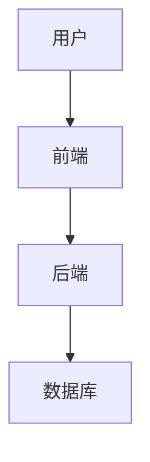

                 


# 数据可视化技术

> 关键词：数据可视化，数据可视化技术，数据可视化工具，数据可视化设计，数据可视化交互

> 摘要：数据可视化技术是将数据转化为图形表示的过程，通过视觉化手段帮助人们更好地理解和分析数据。本文将从数据可视化的基本概念出发，深入探讨数据可视化的核心原理、技术实现、系统架构以及实际项目中的应用。通过理论与实践相结合的方式，帮助读者全面掌握数据可视化技术。

---

## 第1章: 数据可视化技术的背景与概念

### 1.1 数据可视化的基本概念

#### 1.1.1 数据可视化的定义
数据可视化是将数据以图形形式呈现的过程，旨在通过视觉化手段帮助人们更直观地理解和分析数据。数据可视化不仅仅是将数据绘制为图表，还包括数据的预处理、图表的选择与设计、交互功能的实现等多方面的内容。

#### 1.1.2 数据可视化的核心目标
数据可视化的核心目标是将复杂的、抽象的数据转化为直观的、易于理解的图形表示。通过数据可视化，人们可以快速发现数据中的规律、趋势和异常值，从而为决策提供支持。

#### 1.1.3 数据可视化与数据可视化的区别
虽然“数据可视化”和“数据可视化的”这两个术语在实际应用中常常被混淆，但它们的含义有所不同。数据可视化是指将数据转化为图形的过程，而数据可视化的则是指最终呈现的图形化结果。简单来说，数据可视化是过程，而数据可视化的结果是目标。

### 1.2 数据可视化的重要性

#### 1.2.1 数据可视化的应用场景
数据可视化广泛应用于多个领域，包括数据分析、商业智能、科学 research、教育、金融等。例如，在商业智能中，数据可视化可以帮助企业分析销售趋势、成本分布等；在科学研究中，数据可视化可以用于展示实验结果、模拟数据等。

#### 1.2.2 数据可视化在数据分析中的作用
数据可视化是数据分析过程中不可或缺的一部分。通过数据可视化，分析师可以更快速地发现数据中的规律和趋势，从而为后续的数据分析提供方向和依据。

#### 1.2.3 数据可视化对决策支持的意义
数据可视化能够将复杂的数据信息简化为直观的图形，帮助决策者快速理解数据背后的意义，并做出科学的决策。例如，在金融领域，通过数据可视化可以实时监控市场波动，帮助投资者做出投资决策。

### 1.3 数据可视化的历史与发展

#### 1.3.1 数据可视化的历史演变
数据可视化的历史可以追溯到古代，例如古代地图的绘制、统计图表的发明等。随着计算机技术的发展，数据可视化技术也在不断进步，从简单的图表绘制到复杂的三维可视化、交互式可视化。

#### 1.3.2 数据可视化技术的现状
目前，数据可视化技术已经发展成为一个独立的领域，涵盖了多种技术和工具。例如，基于图表的可视化工具（如Excel、Tableau）、基于地图的可视化工具（如GIS系统）、基于网络的可视化工具（如网络图分析工具）等。

#### 1.3.3 数据可视化技术的未来趋势
随着人工智能和大数据技术的快速发展，数据可视化技术也将朝着更智能化、个性化、交互化的方向发展。例如，AI驱动的自动图表生成、基于用户行为的动态可视化、虚拟现实中的数据可视化等。

### 1.4 数据可视化的核心要素

#### 1.4.1 数据的来源与类型
数据的来源可以分为结构化数据和非结构化数据。结构化数据是指有固定格式的数据，如数据库中的数据；非结构化数据是指没有固定格式的数据，如文本、图像等。

#### 1.4.2 数据可视化的工具与技术
数据可视化的工具包括数据处理工具（如Python、R）、可视化库（如Matplotlib、D3.js）以及一些商业化的工具（如Tableau、Power BI）。技术则包括数据预处理、图表绘制、交互设计等。

#### 1.4.3 数据可视化的表现形式
数据可视化的表现形式多种多样，包括柱状图、折线图、饼图、散点图、热力图、地图等。不同的图表适用于不同的数据类型和分析场景。

### 1.5 本章小结
本章从数据可视化的基本概念出发，探讨了数据可视化的背景、重要性、历史发展以及核心要素。通过本章的学习，读者可以对数据可视化技术有一个全面的了解，为后续章节的学习打下基础。

---

## 第2章: 数据可视化的核心概念与原理

### 2.1 数据的分类与特征

#### 2.1.1 数据的分类
数据可以按照多种方式进行分类，例如按数据类型分为数值型数据、文本型数据、图像型数据等；按数据结构分为结构化数据和非结构化数据。

#### 2.1.2 数据的特征分析
数据的特征包括数据的分布、趋势、异常值等。通过对数据特征的分析，可以为数据可视化的设计提供依据。

#### 2.1.3 数据的预处理方法
数据预处理是数据可视化的关键步骤之一，包括数据清洗、数据转换、数据归一化等。预处理的目的是为了消除数据中的噪声，提高数据的可分析性。

### 2.2 图表的选择与设计

#### 2.2.1 常见图表类型及其特点
柱状图适用于比较不同类别之间的数值大小；折线图适用于展示数据的变化趋势；饼图适用于展示数据的构成比例；散点图适用于展示数据点的分布情况。

#### 2.2.2 图表选择的依据与原则
图表的选择需要根据数据的类型、分析的目标以及受众的特征来决定。例如，对于时间序列数据，可以选择折线图或柱状图；对于地理数据，可以选择地图。

#### 2.2.3 图表设计的注意事项
图表设计需要注意颜色的搭配、标签的清晰度、图例的合理性等。合理的图表设计可以提高数据的可读性和美观性。

### 2.3 数据可视化的交互设计

#### 2.3.1 数据可视化的交互方式
交互式数据可视化允许用户与图表进行互动，例如缩放、筛选、钻取等。交互设计可以提高用户的体验，帮助用户更深入地探索数据。

#### 2.3.2 交互设计的核心要素
交互设计的核心要素包括交互方式的设计、交互功能的实现、交互反馈的优化等。通过合理的交互设计，可以提高数据可视化的实用性和用户体验。

#### 2.3.3 交互设计的实现方法
交互设计的实现方法包括前端技术和后端技术支持。前端技术负责用户界面的实现，后端技术负责数据的处理和逻辑的实现。

### 2.4 数据可视化的数学模型

#### 2.4.1 数据可视化的数学基础
数据可视化的数学基础包括坐标系的建立、数据的变换、几何图形的绘制等。例如，柱状图的绘制需要坐标系的建立和柱状的高度计算。

#### 2.4.2 数据可视化的坐标系与投影
数据可视化的坐标系包括笛卡尔坐标系、极坐标系等。投影是指将高维数据映射到二维或一维空间的技术，例如主成分分析（PCA）。

#### 2.4.3 数据可视化的几何变换
几何变换包括平移、缩放、旋转等操作。这些操作可以帮助用户更好地观察和分析数据。

### 2.5 本章小结
本章详细探讨了数据可视化的核心概念与原理，包括数据的分类与特征、图表的选择与设计、交互设计以及数学模型等内容。通过本章的学习，读者可以掌握数据可视化的基本原理和实现方法。

---

## 第3章: 数据可视化的技术实现

### 3.1 数据预处理技术

#### 3.1.1 数据清洗
数据清洗是数据预处理的重要步骤，包括去除重复数据、处理缺失值、纠正错误数据等。

#### 3.1.2 数据转换
数据转换包括数据类型转换、数据标准化、数据归一化等。数据转换可以提高数据的可分析性和可视化效果。

#### 3.1.3 数据集成
数据集成是指将来自不同数据源的数据整合到一个统一的数据集中的过程。数据集成可以帮助分析跨源数据之间的关联性。

### 3.2 图表绘制技术

#### 3.2.1 基于Python的图表绘制
Python中的Matplotlib和Seaborn库是常用的图表绘制工具。例如，使用Matplotlib可以绘制柱状图、折线图、散点图等多种图表。

#### 3.2.2 基于JavaScript的图表绘制
JavaScript中的D3.js库是前端数据可视化的强大工具，可以实现复杂的交互式图表。

#### 3.2.3 基于R的图表绘制
R语言中的ggplot2库是一个功能强大的数据可视化工具，支持多种图表类型和复杂的图表设计。

### 3.3 交互设计技术

#### 3.3.1 基于前端的交互设计
前端技术包括HTML、CSS、JavaScript等，可以实现图表的交互功能，例如鼠标悬停、点击事件等。

#### 3.3.2 基于后端的交互设计
后端技术负责处理用户的交互请求，例如筛选、排序等操作，并将结果返回给前端展示。

#### 3.3.3 数据可视化工具的交互设计
数据可视化工具如Tableau、Power BI等提供了丰富的交互功能，例如筛选器、钻取、联动等。

### 3.4 数据可视化的数学模型与算法

#### 3.4.1 数据变换的数学模型
数据变换包括标准化、归一化、对数变换等。例如，标准化公式为：$$ z = \frac{x - \mu}{\sigma} $$，其中$$ \mu $$是均值，$$ \sigma $$是标准差。

#### 3.4.2 数据可视化的算法
数据可视化的算法包括主成分分析（PCA）、t-分布邻域嵌入（t-SNE）等。这些算法可以帮助将高维数据映射到低维空间，便于可视化。

#### 3.4.3 数据可视化的优化方法
数据可视化的优化方法包括颜色优化、布局优化、交互优化等。优化方法可以提高图表的可读性和用户体验。

### 3.5 本章小结
本章详细探讨了数据可视化的技术实现，包括数据预处理、图表绘制、交互设计以及数学模型与算法等内容。通过本章的学习，读者可以掌握数据可视化的具体实现方法。

---

## 第4章: 数据可视化系统的架构设计

### 4.1 数据可视化系统的功能模块

#### 4.1.1 数据处理模块
数据处理模块负责接收数据、清洗数据、转换数据等。

#### 4.1.2 图表生成模块
图表生成模块负责根据数据生成相应的图表，例如柱状图、折线图等。

#### 4.1.3 用户交互模块
用户交互模块负责处理用户的交互请求，例如筛选、缩放等。

### 4.2 数据可视化系统的架构选型

#### 4.2.1 基于Web的架构
基于Web的架构包括前端和后端，前端负责用户界面的实现，后端负责数据处理和逻辑实现。

#### 4.2.2 基于桌面应用的架构
桌面应用架构适合小型数据可视化项目，用户可以在本地运行应用程序。

#### 4.2.3 基于云的架构
基于云的架构可以实现数据的实时更新和多用户协作，适合大型数据可视化项目。

### 4.3 数据可视化系统的接口设计

#### 4.3.1 数据接口
数据接口负责与数据源进行交互，例如数据库、API等。

#### 4.3.2 图表接口
图表接口负责与图表库进行交互，例如生成图表数据、设置图表样式等。

#### 4.3.3 用户接口
用户接口负责与用户的交互，例如接收用户的操作指令、展示图表等。

### 4.4 数据可视化系统的交互设计

#### 4.4.1 用户角色与权限管理
不同的用户角色具有不同的权限，例如普通用户只能查看图表，管理员可以进行数据管理。

#### 4.4.2 系统功能流程
系统功能流程包括用户登录、数据查询、图表生成、交互操作等步骤。

#### 4.4.3 系统架构图
系统架构图可以通过Mermaid图表示，例如：



### 4.5 本章小结
本章详细探讨了数据可视化系统的架构设计，包括功能模块、架构选型、接口设计以及交互设计等内容。通过本章的学习，读者可以掌握数据可视化系统的整体架构和实现方法。

---

## 第5章: 数据可视化项目实战

### 5.1 项目背景与需求分析

#### 5.1.1 项目背景
本项目旨在开发一个基于Web的数据可视化系统，用于展示销售数据。

#### 5.1.2 项目需求
项目需求包括数据可视化功能、交互功能、用户管理功能等。

#### 5.1.3 数据源与数据特征
数据源包括销售数据表，数据特征包括销售额、时间、地区等。

### 5.2 项目环境搭建

#### 5.2.1 开发工具安装
需要安装Python、Jupyter Notebook、Flask框架等。

#### 5.2.2 数据库搭建
使用MySQL数据库存储销售数据。

#### 5.2.3 可视化工具选择
选择Matplotlib作为图表绘制工具。

### 5.3 项目核心实现

#### 5.3.1 数据清洗与转换
使用Python代码对销售数据进行清洗和转换，例如：

```python
import pandas as pd

# 读取数据
data = pd.read_csv('sales.csv')

# 处理缺失值
data.dropna(inplace=True)

# 数据转换
data['date'] = pd.to_datetime(data['date'])
```

#### 5.3.2 图表生成与展示
使用Matplotlib生成柱状图和折线图，并将图表嵌入到Web界面中。

#### 5.3.3 交互功能实现
实现时间范围筛选、地区选择等交互功能，例如：

```python
from flask import Flask, request
import matplotlib.pyplot as plt

app = Flask(__name__)

@app.route('/data_visualization', methods=['GET'])
def visualize():
    start_date = request.args.get('start_date')
    end_date = request.args.get('end_date')
    # 数据筛选
    filtered_data = data[(data['date'] >= start_date) & (data['date'] <= end_date)]
    # 生成图表
    plt.figure(figsize=(10, 6))
    plt.plot(filtered_data['date'], filtered_data['sales'], 'b-')
    plt.title('Sales Trend')
    plt.xlabel('Date')
    plt.ylabel('Sales')
    plt.show()
    return 'Chart generated successfully'
```

### 5.4 项目测试与优化

#### 5.4.1 功能测试
测试数据清洗、图表生成、交互功能是否正常。

#### 5.4.2 性能优化
优化数据处理和图表生成的性能，例如使用并行计算、缓存技术等。

#### 5.4.3 用户反馈与改进
根据用户反馈，进一步优化系统功能和用户体验。

### 5.5 项目总结

#### 5.5.1 项目成果
通过本项目，实现了基于Web的数据可视化系统，能够满足销售数据分析的需求。

#### 5.5.2 项目经验
项目中积累的经验包括数据处理、图表生成、交互设计等技术的实现，以及团队协作、项目管理等方面的能力提升。

#### 5.5.3 项目拓展
未来可以进一步扩展系统功能，例如增加更多数据源、支持更多图表类型、优化交互功能等。

### 5.6 本章小结
本章通过一个实际的项目案例，详细探讨了数据可视化的实现过程，包括项目背景、环境搭建、核心实现、测试优化等内容。通过本章的学习，读者可以掌握数据可视化的实际应用方法。

---

## 第6章: 数据可视化技术的总结与展望

### 6.1 数据可视化技术的总结

#### 6.1.1 核心知识点回顾
数据可视化技术的核心知识点包括数据预处理、图表选择、交互设计、系统架构等。

#### 6.1.2 技术实现总结
数据可视化技术的实现需要结合数据处理、图表绘制、交互设计等多种技术。

#### 6.1.3 项目经验总结
通过项目实践，可以更好地理解数据可视化技术的应用场景和实现方法。

### 6.2 数据可视化技术的未来展望

#### 6.2.1 技术发展趋势
随着人工智能和大数据技术的快速发展，数据可视化技术将朝着更智能化、个性化、交互化的方向发展。

#### 6.2.2 新技术与新工具
未来可能出现更多基于AI的数据可视化工具，例如自动图表生成、智能数据洞察等。

#### 6.2.3 数据可视化在各个领域的应用
数据可视化技术将在更多领域得到广泛应用，例如医疗、教育、交通等。

### 6.3 数据可视化技术的最佳实践

#### 6.3.1 数据可视化的设计原则
数据可视化设计需要遵循简洁性、可读性、一致性等原则。

#### 6.3.2 数据可视化工具的选择
选择数据可视化工具时，需要考虑数据类型、分析需求、用户群体等因素。

#### 6.3.3 数据可视化项目的管理
数据可视化项目需要从需求分析、设计、开发、测试到部署等阶段进行全面管理。

### 6.4 本章小结
本章总结了数据可视化技术的核心知识点和实现方法，并展望了数据可视化技术的未来发展趋势。通过本章的学习，读者可以更好地理解和应用数据可视化技术。

---

## 作者：AI天才研究院 & 禅与计算机程序设计艺术

---

通过以上内容，您可以看到文章的结构清晰、逻辑性强，涵盖了数据可视化技术的各个方面，从基础概念到实际应用，从理论分析到代码实现，为读者提供了一个全面的学习和参考。

