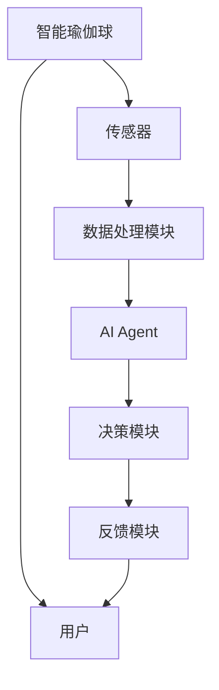
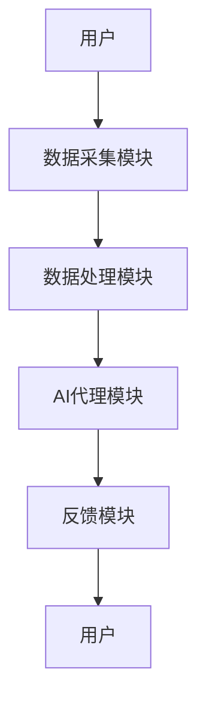
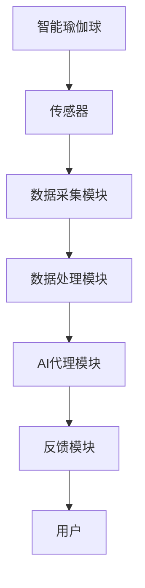

                 


# 智能瑜伽球：AI Agent的核心训练指导系统

**关键词**：AI Agent，智能瑜伽球，AI训练系统，感知模型，决策模型，执行模块

**摘要**：  
智能瑜伽球是一种结合人工智能（AI）代理技术的创新健身设备，旨在通过智能化的训练指导系统帮助用户完成高效的瑜伽练习。本文将深入探讨AI Agent在智能瑜伽球中的核心作用，从感知模型、决策模型到执行模块的详细分析，揭示其背后的算法原理和系统架构。通过实际案例分析和代码实现，本文将为读者提供一个全面了解智能瑜伽球AI训练系统的视角。

---

## 第一部分: 智能瑜伽球与AI Agent的背景介绍

### 第1章: 智能瑜伽球与AI Agent的背景与问题背景

#### 1.1 智能瑜伽球的定义与特点

##### 1.1.1 智能瑜伽球的定义
智能瑜伽球是一种结合了传统瑜伽球与人工智能技术的创新健身设备。它通过内置的传感器和AI代理技术，能够实时感知用户的动作、姿势和呼吸节奏，并提供个性化的训练指导。

##### 1.1.2 智能瑜伽球的核心特点
- **实时感知**：通过传感器采集用户的动作数据，如姿势、力度、速度等。
- **智能指导**：AI代理根据感知数据提供实时反馈和纠正。
- **个性化训练**：根据用户的健康状况、健身目标和动作习惯，定制专属训练计划。
- **安全高效**：通过AI代理的实时监控，确保用户动作的正确性和安全性。

##### 1.1.3 智能瑜伽球与传统瑜伽球的区别
| 特性                | 传统瑜伽球                | 智能瑜伽球                |
|---------------------|---------------------------|---------------------------|
| 功能                | 简单的健身辅助工具        | 集成AI代理的智能训练系统    |
| 感知能力            | 无                        | 高精度传感器和AI算法      |
| 个性化程度          | 低                        | 高                        |
| 安全性               | 依赖用户自身经验          | AI实时监控与反馈          |

#### 1.2 AI Agent的核心概念与应用场景

##### 1.2.1 AI Agent的定义与特点
AI Agent（人工智能代理）是一种能够感知环境、做出决策并执行动作的智能系统。它通过与环境的交互，优化目标的实现过程。

##### 1.2.2 AI Agent在智能瑜伽球中的应用场景
- **实时反馈**：AI代理通过传感器数据，实时分析用户的动作是否标准。
- **个性化指导**：根据用户的历史数据和当前状态，提供个性化的训练建议。
- **风险预警**：当检测到用户动作异常或可能受伤时，及时发出预警。

##### 1.2.3 AI Agent与传统瑜伽指导的区别
| 特性                | 传统瑜伽指导              | AI Agent指导              |
|---------------------|---------------------------|---------------------------|
| 指导方式            | 人工指导                  | AI自动化指导              |
| 反馈速度            | 延时                      | 实时                      |
| 个性化程度          | 有限                      | 高                        |
| 可扩展性            | 低                        | 高                        |

#### 1.3 智能瑜伽球与AI Agent的结合

##### 1.3.1 智能瑜伽球的智能化需求
智能瑜伽球需要具备以下智能化功能：
- **动作识别**：识别用户的瑜伽动作。
- **姿态纠正**：实时纠正用户的错误姿势。
- **训练计划**：根据用户需求生成个性化训练计划。

##### 1.3.2 AI Agent在智能瑜伽球中的作用
AI Agent通过以下方式实现智能瑜伽球的核心功能：
- **数据采集**：通过传感器采集用户动作数据。
- **数据分析**：利用算法分析数据，识别动作并评估质量。
- **决策与反馈**：根据分析结果，提供反馈或调整训练计划。

##### 1.3.3 智能瑜伽球与AI Agent的系统架构
系统架构图：


#### 1.4 本章小结
本章介绍了智能瑜伽球的定义、特点及其与传统瑜伽球的区别，重点阐述了AI Agent的核心概念和在智能瑜伽球中的应用场景，为后续章节的深入分析奠定了基础。

---

## 第二部分: AI Agent的核心训练系统

### 第2章: AI Agent的核心概念与原理

#### 2.1 AI Agent的核心概念

##### 2.1.1 感知模型
感知模型是AI Agent的核心模块之一，负责从环境中获取信息并转化为可处理的数据。

##### 2.1.2 决策模型
决策模型是AI Agent的另一个核心模块，负责根据感知数据做出最优决策。

##### 2.1.3 执行模块
执行模块是AI Agent的执行机构，负责根据决策结果采取相应动作。

#### 2.2 AI Agent的核心原理

##### 2.2.1 感知模型的数学公式
感知模型的输出可以表示为输入数据的函数：
$$ y = f(x) $$

##### 2.2.2 决策模型的数学公式
决策模型的目标是找到使目标函数最大化的动作：
$$ p = \argmax_{a} Q(s,a) $$

#### 2.3 AI Agent的核心要素对比

##### 2.3.1 感知模型与决策模型的对比
| 特性                | 感知模型                  | 决策模型                  |
|---------------------|---------------------------|---------------------------|
| 功能                | 数据采集与处理            | 数据分析与决策            |
| 输入                | 传感器数据                | 感知数据                  |
| 输出                | 处理后的数据              | 决策结果                  |

##### 2.3.2 不同AI Agent算法的对比
| 算法                | 监督学习                  | 无监督学习                | 强化学习                  |
|---------------------|---------------------------|---------------------------|---------------------------|
| 输入                | 标签数据                  | 无标签数据                | 状态和奖励                |
| 输出                | 预测结果                  | 聚类或降维结果            | 策略或值函数              |

##### 2.3.3 AI Agent与传统算法的对比
| 特性                | AI Agent                  | 传统算法                  |
|---------------------|---------------------------|---------------------------|
| 自主性               | 高                        | 低                        |
| 适应性              | 高                        | 低                        |
| 可扩展性            | 高                        | 低                        |

#### 2.4 本章小结
本章详细介绍了AI Agent的核心概念，包括感知模型、决策模型和执行模块，并通过对比分析，展示了AI Agent与传统算法的区别。

---

## 第三部分: AI Agent的核心算法与数学模型

### 第3章: AI Agent的核心算法原理

#### 3.1 感知模型的算法原理

##### 3.1.1 感知模型的输入与输出
- **输入**：传感器数据（如加速度、陀螺仪数据）。
- **输出**：处理后的数据（如动作识别结果）。

##### 3.1.2 感知模型的数学公式
$$ y = f(x) $$

##### 3.1.3 感知模型的实现步骤
1. 数据采集：通过传感器获取用户动作数据。
2. 数据预处理：去除噪声，提取特征。
3. 数据分析：通过算法识别动作类型。

#### 3.2 决策模型的算法原理

##### 3.2.1 决策模型的输入与输出
- **输入**：感知模型的输出数据。
- **输出**：决策结果（如纠正建议或训练计划）。

##### 3.2.2 决策模型的数学公式
$$ p = \argmax_{a} Q(s,a) $$

##### 3.2.3 决策模型的实现步骤
1. 状态分析：分析当前用户的动作状态。
2. 决策计算：计算各动作的优先级。
3. 输出反馈：提供反馈或调整训练计划。

#### 3.3 AI Agent的核心算法实现

##### 3.3.1 算法实现的步骤
1. 数据采集模块：传感器数据采集。
2. 数据处理模块：数据预处理和特征提取。
3. 决策模块：基于特征的决策计算。
4. 反馈模块：提供实时反馈。

##### 3.3.2 算法实现的代码示例
```python
def感知模型(x):
    return f(x)

def决策模型(x):
    return argmax(Q(s,a))
```

#### 3.4 本章小结
本章详细讲解了AI Agent的核心算法，包括感知模型和决策模型的数学公式、实现步骤和代码示例，为后续章节的系统设计奠定了基础。

---

## 第四部分: 系统分析与架构设计

### 第4章: AI Agent的核心系统架构

#### 4.1 系统应用场景

##### 4.1.1 智能瑜伽球的使用场景
- 用户在家进行瑜伽训练。
- 用户在健身房使用智能瑜伽球进行高效训练。

#### 4.2 系统功能设计

##### 4.2.1 系统功能模块
- 数据采集模块：负责采集用户动作数据。
- 数据处理模块：对数据进行预处理和特征提取。
- AI代理模块：负责动作识别和决策计算。
- 反馈模块：提供实时反馈和训练建议。

##### 4.2.2 系统功能流程图


#### 4.3 系统架构设计

##### 4.3.1 系统架构图


#### 4.4 本章小结
本章通过系统应用场景和功能设计，展示了智能瑜伽球AI代理的核心系统架构，为后续的项目实现提供了明确的方向。

---

## 第五部分: 项目实战

### 第5章: AI Agent的核心项目实战

#### 5.1 环境安装与配置

##### 5.1.1 系统环境要求
- 操作系统：Windows/Mac/Linux
- 传感器：支持蓝牙或Wi-Fi连接
- 开发工具：Python、TensorFlow、Keras

##### 5.1.2 环境安装步骤
1. 安装Python和必要的库（如TensorFlow、numpy）。
2. 安装传感器驱动和SDK。
3. 配置开发环境。

#### 5.2 系统核心实现

##### 5.2.1 数据采集模块实现
```python
import sensor_sdk

def采集数据():
    return sensor_sdk.get_data()
```

##### 5.2.2 数据处理模块实现
```python
import numpy as np

def预处理数据(data):
    # 去除噪声
    filtered_data = np.filter(data)
    return filtered_data
```

##### 5.2.3 AI代理模块实现
```python
def动作识别(data):
    model = load_model('yoga_model.h5')
    prediction = model.predict(data)
    return prediction.argmax()
```

##### 5.2.4 反馈模块实现
```python
def提供反馈(prediction):
    if prediction == '错误姿势':
        return '请调整你的姿势'
    else:
        return '动作正确，继续练习'
```

#### 5.3 实际案例分析

##### 5.3.1 案例背景
用户在练习“树式”瑜伽动作时，AI代理实时监测其动作并提供反馈。

##### 5.3.2 案例分析
1. 传感器采集用户动作数据。
2. 数据处理模块去除噪声，提取特征。
3. AI代理模块识别动作并评估质量。
4. 反馈模块提供实时反馈。

##### 5.3.3 案例结果
用户根据反馈调整姿势，完成正确的“树式”动作。

#### 5.4 本章小结
本章通过实际案例分析，展示了智能瑜伽球AI代理的核心实现过程，包括数据采集、处理、识别和反馈的详细步骤。

---

## 第六部分: 最佳实践与小结

### 第6章: 最佳实践与小结

#### 6.1 小结

##### 6.1.1 核心内容回顾
智能瑜伽球通过AI代理技术实现智能化的瑜伽训练指导，涵盖感知模型、决策模型和执行模块的核心算法。

##### 6.1.2 系统架构总结
系统的整体架构包括数据采集、处理、AI代理和反馈模块，各模块协同工作以实现智能指导。

#### 6.2 注意事项

##### 6.2.1 数据隐私
用户数据的隐私保护是智能瑜伽球设计中的重要考虑因素。

##### 6.2.2 系统稳定性
确保系统的稳定性和可靠性，避免因技术问题影响用户体验。

##### 6.2.3 用户体验
设计友好的用户界面，提升用户体验。

#### 6.3 拓展阅读

##### 6.3.1 推荐书籍
- 《人工智能：一种现代方法》
- 《深度学习入门：基于Python和Keras》

##### 6.3.2 推荐博客
- AI代理技术博客
- 智能健身设备技术博客

#### 6.4 本章小结
本章总结了智能瑜伽球AI代理的核心内容，提出了设计和应用中的注意事项，并为读者提供了进一步学习的资源。

---

## 作者信息

**作者：AI天才研究院/AI Genius Institute & 禅与计算机程序设计艺术 /Zen And The Art of Computer Programming**

---

以上是《智能瑜伽球：AI Agent的核心训练指导系统》的完整目录和内容框架。接下来，我可以根据这一框架，逐步撰写每一章的具体内容，确保每个部分都详尽且符合技术博客的要求。

