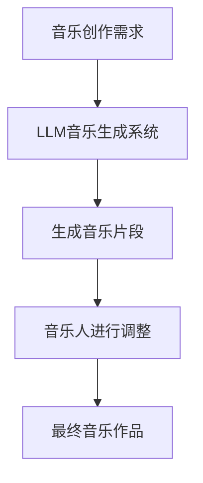
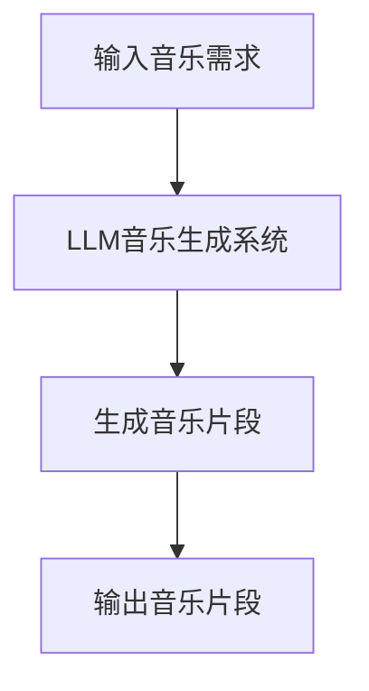
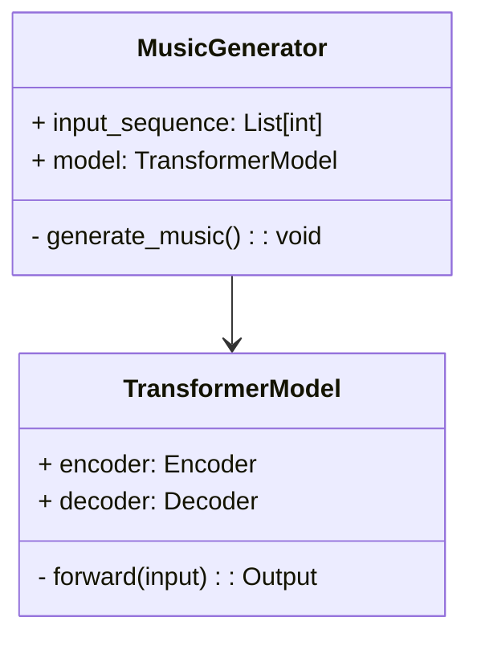
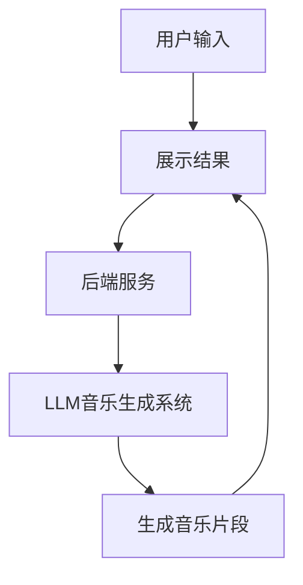
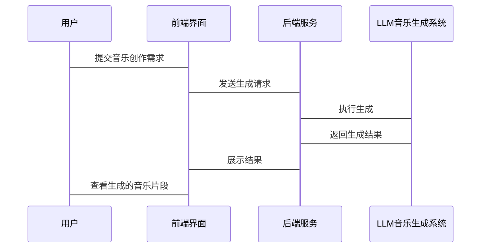

                 


# 智能音乐创作AI Agent：LLM在艺术领域的创新应用

## 关键词：智能音乐创作，LLM，AI，艺术，音乐生成，大语言模型

## 摘要：  
随着人工智能技术的快速发展，大语言模型（LLM）在艺术领域的应用逐渐崭露头角。本文将深入探讨LLM在音乐创作中的创新应用，分析其背景、原理、系统架构及实际案例，揭示智能音乐创作AI Agent的核心技术与未来发展方向。

---

# 第一部分：智能音乐创作的背景与概念

## 第1章：智能音乐创作的背景介绍

### 1.1 问题背景与问题描述

#### 1.1.1 音乐创作的现状与挑战  
音乐创作是一项复杂而富有创造力的活动，传统音乐创作依赖作曲家的灵感和技巧，但这种方式效率低下，且难以快速满足多样化的创作需求。现代音乐产业对高效、个性化的创作工具需求日益增长，尤其是在数字音乐制作和流媒体平台上。

#### 1.1.2 AI技术在艺术领域的潜力  
人工智能技术，特别是大语言模型（LLM），在艺术领域展现出巨大的潜力。LLM能够通过大量音乐数据的学习，生成符合特定风格和情感的音乐作品，为音乐创作提供了新的可能性。

#### 1.1.3 LLM在音乐创作中的独特优势  
与传统的音乐生成算法（如基于规则的生成或随机生成）相比，LLM具有以下优势：  
- **强大的上下文理解能力**：LLM能够理解音乐的情感、风格和结构，生成连贯的音乐片段。  
- **多样化的输出**：LLM可以生成多种风格和形式的音乐，满足不同的创作需求。  
- **高效性**：LLM能够在短时间内生成高质量的音乐片段，显著提高创作效率。

### 1.2 问题解决与边界定义

#### 1.2.1 智能音乐创作的核心目标  
智能音乐创作的核心目标是通过LLM技术，辅助音乐人快速生成高质量的音乐作品，同时保持创作的个性化和艺术性。

#### 1.2.2 边界与外延：AI音乐创作的适用范围  
AI音乐创作适用于以下场景：  
- **灵感启发**：通过生成音乐片段，激发音乐人的创作灵感。  
- **快速原型制作**：帮助音乐人快速生成初步作品，节省时间和成本。  
- **风格迁移**：将一种风格的音乐转换为另一种风格。  

#### 1.2.3 核心要素与组成结构  
智能音乐创作系统的核心要素包括：  
- **音乐数据集**：用于训练LLM的高质量音乐数据。  
- **LLM模型**：负责生成音乐片段的AI模型。  
- **用户交互界面**：用户输入创作需求并接收生成结果的界面。  

---

## 第2章：LLM与音乐创作的核心概念

### 2.1 LLM的基本原理

#### 2.1.1 大语言模型的定义与特点  
大语言模型（LLM）是一种基于Transformer架构的深度学习模型，能够处理和生成大量文本数据。其特点包括：  
- **大规模预训练**：通过海量数据的预训练，模型能够理解复杂的语言结构和上下文关系。  
- **生成能力**：模型可以生成连贯且有意义的文本或音乐片段。  
- **可扩展性**：模型可以应用于多种任务，如文本生成、音乐生成等。

#### 2.1.2 LLM在音乐创作中的应用模式  
LLM在音乐创作中的应用模式包括：  
- **直接生成**：模型直接生成音乐片段。  
- **辅助创作**：模型生成片段作为灵感，供音乐人进一步修改和调整。  
- **风格迁移**：模型将一种风格的音乐转换为另一种风格。  

#### 2.1.3 LLM与音乐生成的关系  
LLM通过将音乐表示为文本（如 MIDI 格式或乐谱）进行处理，生成新的音乐片段。与传统的音乐生成算法相比，LLM能够更好地理解音乐的语义和情感，生成更自然的音乐作品。

### 2.2 核心概念的联系与对比

#### 2.2.1 传统音乐创作与AI音乐创作的对比表格  
| 特性                | 传统音乐创作                | AI音乐创作                |  
|---------------------|-----------------------------|---------------------------|  
| 创作速度            | 较慢，依赖人类灵感           | 较快，自动化生成           |  
| 创作多样性          | 受人类经验和技巧限制         | 可生成多样化的风格和形式   |  
| 创作成本            | 较高，需要专业设备和时间     | 较低，自动化工具降低成本   |  

#### 2.2.2 实体关系图：Mermaid流程图  


---

## 第3章：LLM的算法原理

### 3.1 模型结构与训练机制

#### 3.1.1 Transformer模型的结构特点  
Transformer模型由编码器和解码器两部分组成：  
- **编码器**：将输入数据（如音乐片段）转换为上下文表示。  
- **解码器**：根据编码器的输出生成新的音乐片段。  

#### 3.1.2 大语言模型的训练过程  
训练过程包括以下步骤：  
1. **数据预处理**：将音乐数据转换为文本格式（如 MIDI 格式）。  
2. **模型训练**：使用预处理后的数据训练LLM模型，优化目标函数（如交叉熵损失）。  
3. **微调**：在特定任务上对模型进行微调，以提高生成质量。  

#### 3.1.3 音乐生成的数学模型  
音乐生成的数学模型基于Transformer的解码器部分，生成概率分布，选择下一个音符。  

公式：  
$$ P(y|x) = \frac{1}{\sum_{i} P(y_i|x)} \cdot P(y_i|x) $$  

其中，$x$ 是输入序列，$y$ 是生成的音乐片段。

### 3.2 音乐生成的算法流程

#### 3.2.1 基于LLM的音乐生成流程：Mermaid流程图  


#### 3.2.2 算法实现的Python代码示例  
```python
import torch
import torch.nn as nn

class MusicGenerator:
    def __init__(self, model):
        self.model = model

    def generate_music(self, input_sequence, max_length=100):
        with torch.no_grad():
            for i in range(max_length):
                output = self.model(input_sequence)
                predicted_token = output.argmax(dim=-1).item()
                input_sequence.append(predicted_token)
        return input_sequence

# 示例使用
model = nn.Transformer(...)  # 初始化模型
generator = MusicGenerator(model)
input_seq = [1, 2, 3]  # 示例输入
result = generator.generate_music(input_seq)
print(result)
```

#### 3.2.3 数学公式与模型解释  
音乐生成过程基于Transformer解码器的自注意力机制，公式如下：  
$$ \text{Attention}(Q,K,V) = \text{softmax}\left(\frac{QK^T}{\sqrt{d_k}}\right)V $$  
其中，$Q$ 是查询向量，$K$ 是键向量，$V$ 是值向量。

---

## 第4章：系统分析与架构设计

### 4.1 项目背景与需求分析

#### 4.1.1 项目目标与核心需求  
项目目标：开发一个基于LLM的智能音乐创作系统。  
核心需求：  
- 支持多种音乐风格的生成。  
- 提供用户友好的交互界面。  
- 高效生成音乐片段。  

#### 4.1.2 项目场景与用户角色  
项目场景：音乐制作人需要快速生成音乐片段。  
用户角色：音乐制作人、作曲家、音乐爱好者。  

### 4.2 系统功能设计

#### 4.2.1 功能模块划分  
功能模块包括：  
- **输入模块**：接收用户的音乐创作需求。  
- **生成模块**：基于LLM生成音乐片段。  
- **输出模块**：展示生成的音乐片段。  

#### 4.2.2 领域模型设计：Mermaid类图  


#### 4.2.3 系统架构设计：Mermaid架构图  


### 4.3 系统接口与交互设计

#### 4.3.1 API接口设计  
API接口：  
- `POST /generate-music`：接收音乐创作需求，返回生成的音乐片段。  

#### 4.3.2 用户与系统的交互流程：Mermaid序列图  


---

## 第5章：项目实战与代码实现

### 5.1 环境搭建与数据准备

#### 5.1.1 开发环境安装  
安装Python、TensorFlow或PyTorch框架，以及必要的音乐处理库（如MIDI处理库）。  

#### 5.1.2 数据集的获取与预处理  
获取公开的音乐数据集（如MIDI文件），将其转换为模型可处理的格式。  

#### 5.1.3 模型训练与部署  
训练LLM模型，使用预处理后的数据进行微调，部署模型到服务器。

### 5.2 核心代码实现

#### 5.2.1 数据预处理代码  
```python
import mido

def preprocess_midi(midi_file):
    # 加载MIDI文件
    midi = mido.MidiFile(midi_file)
    # 提取音符序列
    notes = []
    for msg in midi.tracks[0]:
        if msg.type == 'note_on':
            notes.append(msg.note)
    return notes
```

#### 5.2.2 模型训练代码  
```python
import torch
import torch.nn as nn

class MusicLM(nn.Module):
    def __init__(self, vocab_size, d_model, n_head, dff):
        super().__init__()
        self.transformer = nn.Transformer(
            d_model=d_model,
            nhead=n_head,
            dff=dff
        )
        self.embedding = nn.Embedding(vocab_size, d_model)
        self.output = nn.Linear(d_model, vocab_size)

    def forward(self, x):
        embedded = self.embedding(x)
        output = self.transformer(embedded)
        output = self.output(output)
        return output

# 示例使用
vocab_size = 128  # 音符数量
d_model = 512
n_head = 8
dff = 2048
model = MusicLM(vocab_size, d_model, n_head, dff)
```

#### 5.2.3 音乐生成代码  
```python
def generate_music(model, input_sequence, max_length=100):
    with torch.no_grad():
        for i in range(max_length):
            output = model(input_sequence)
            predicted_token = output.argmax(dim=-1).item()
            input_sequence.append(predicted_token)
        return input_sequence

# 示例使用
input_seq = [60]  # 中音C
result = generate_music(model, input_seq, 20)
print(result)
```

### 5.3 案例分析与结果展示

#### 5.3.1 实际案例分析  
通过实际案例分析LLM生成音乐的质量和多样性，与传统音乐生成方法进行对比。

#### 5.3.2 生成结果展示  
展示生成的音乐片段，分析其风格和质量。

---

## 第6章：最佳实践与未来展望

### 6.1 最佳实践 tips

#### 6.1.1 数据质量的重要性  
确保训练数据的质量和多样性，能够显著提高生成音乐的质量。

#### 6.1.2 模型调优技巧  
通过微调和参数调整，优化模型的生成效果。

#### 6.1.3 音乐生成的多样性控制  
通过调整模型参数，控制生成音乐的风格和情感。

### 6.2 项目小结

#### 6.2.1 核心内容回顾  
总结本文的核心内容，强调LLM在音乐创作中的潜力和应用价值。

#### 6.2.2 项目经验总结  
总结项目实施中的经验和教训，为后续研究提供参考。

### 6.3 未来展望

#### 6.3.1 技术发展与趋势  
分析LLM在音乐创作领域的未来发展趋势，如多模态音乐生成、实时交互生成等。

#### 6.3.2 挑战与机遇  
探讨当前技术面临的挑战和未来的机遇。

---

## 结语

智能音乐创作AI Agent通过LLM技术，为音乐创作提供了全新的思路和工具。本文从背景、原理、系统架构到实际案例，全面分析了LLM在音乐创作中的创新应用，为音乐人和AI开发者提供了重要的参考。

---

## 作者：AI天才研究院/AI Genius Institute & 禅与计算机程序设计艺术 /Zen And The Art of Computer Programming

---

以上是《智能音乐创作AI Agent：LLM在艺术领域的创新应用》的技术博客文章目录大纲和部分内容示例。希望对您有所帮助！

