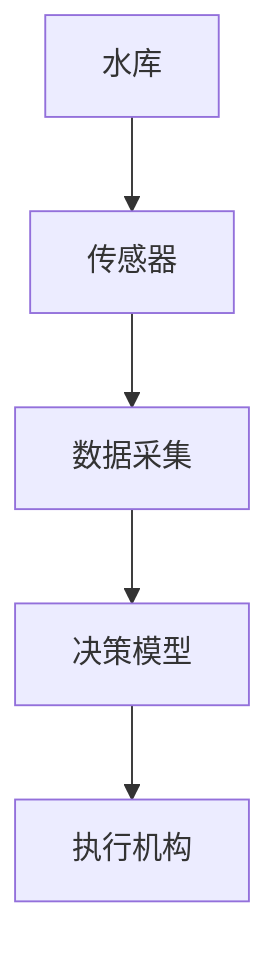
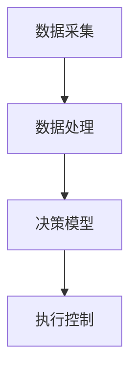

                 


# AI Agent在智能水资源管理系统中的实践

> 关键词：AI Agent, 智能水资源管理, 强化学习, 水资源优化, 自动化管理

> 摘要：随着全球水资源短缺问题的加剧，智能水资源管理成为一个重要研究方向。本文探讨AI Agent在智能水资源管理系统中的应用，从核心概念、算法原理、系统架构到项目实战，全面分析AI Agent在水资源管理中的实践与挑战。

---

# 第一部分: AI Agent与智能水资源管理概述

# 第1章: AI Agent与智能水资源管理概述

## 1.1 智能水资源管理的背景与挑战

### 1.1.1 水资源管理的现状与问题

水资源是人类生存和发展的基础，但随着人口增长和工业化进程的加快，水资源短缺问题日益严重。传统的水资源管理模式主要依赖人工操作和经验判断，存在效率低下、数据孤岛、响应不及时等问题。例如，水库调度、灌溉管理、水质监测等领域仍面临以下挑战：

- 数据来源分散，难以实现实时监控。
- 复杂的环境变化（如降雨、气温）难以准确预测。
- 多目标优化问题（如水量、水质、生态平衡）难以协调。

### 1.1.2 AI Agent在水资源管理中的作用

AI Agent（智能体）是一种能够感知环境、自主决策并执行任务的智能系统。在水资源管理中，AI Agent可以通过以下方式解决上述问题：

- 实时感知：通过传感器和数据采集系统，AI Agent能够实时获取水质、水量、气象等数据。
- 智能决策：基于历史数据和环境模型，AI Agent可以预测未来趋势并制定优化策略。
- 自动执行：通过与执行机构（如水泵、阀门）的联动，AI Agent可以实现自动化管理。

### 1.1.3 本节小结

本节通过分析水资源管理的现状与挑战，引出了AI Agent在智能水资源管理中的重要性。AI Agent能够通过智能化的感知、决策和执行，显著提升水资源管理的效率和效果。

---

## 1.2 AI Agent的基本概念与特点

### 1.2.1 AI Agent的定义

AI Agent是一种具有感知、推理、规划、决策和执行能力的智能系统。它可以独立或协作地完成特定任务。例如，在水资源管理中，AI Agent可以作为一个“智能调度员”，负责协调多个水库的水量分配。

### 1.2.2 AI Agent的核心特点

AI Agent具有以下核心特点：

1. **自主性**：AI Agent能够自主感知环境并做出决策，无需人工干预。
2. **反应性**：AI Agent能够实时感知环境变化并做出快速反应。
3. **学习性**：AI Agent可以通过机器学习算法不断优化自身的决策模型。
4. **协作性**：AI Agent可以与其他Agent或系统协作完成复杂任务。

### 1.2.3 AI Agent与传统自动化的区别

| 特性         | AI Agent                     | 传统自动化                 |
|--------------|------------------------------|---------------------------|
| 智能性       | 高                           | 低                       |
| 学习能力     | 强                           | 无                       |
| 环境适应性   | 强                           | 弱                       |
| 决策能力     | 复杂决策                     | 简单规则                 |

### 1.2.4 本节小结

本节详细介绍了AI Agent的基本概念和特点，并通过对比传统自动化，突出了AI Agent在智能水资源管理中的优势。

---

## 1.3 AI Agent在水资源管理中的应用前景

### 1.3.1 水资源管理的潜在应用场景

AI Agent在水资源管理中的应用场景包括：

1. **水库调度优化**：通过预测降雨量和用水需求，优化水库的蓄水和放水策略。
2. **水质监测与改善**：实时监测水质数据，识别污染源并制定治理方案。
3. **灌溉管理**：根据土壤湿度和天气预报，智能控制灌溉系统的开启和关闭。

### 1.3.2 企业采用AI Agent的优势

1. **提高效率**：AI Agent可以快速处理大量数据，显著提高管理效率。
2. **降低成本**：通过优化资源配置，降低水资源浪费和管理成本。
3. **增强决策能力**：基于数据驱动的决策，提高决策的科学性和准确性。

### 1.3.3 本节小结

本节探讨了AI Agent在水资源管理中的潜在应用场景和企业优势，为后续的深入分析奠定了基础。

---

## 1.4 本章小结

本章从水资源管理的背景与挑战出发，介绍了AI Agent的基本概念、特点和应用前景。AI Agent作为一种智能化的解决方案，能够有效提升水资源管理的效率和效果。

---

# 第二部分: AI Agent的核心概念与原理

# 第2章: AI Agent的核心概念与联系

## 2.1 AI Agent的核心概念

### 2.1.1 AI Agent的感知、决策与执行机制

AI Agent的核心机制包括：

1. **感知**：通过传感器和数据采集系统获取环境信息。
2. **决策**：基于感知信息和历史数据，通过算法生成决策。
3. **执行**：通过执行机构（如水泵、阀门）将决策转化为具体操作。

### 2.1.2 AI Agent的环境模型与知识表示

AI Agent需要建立环境模型来表示其感知到的信息。例如，可以通过状态空间模型表示水库的水量、水质等状态。

### 2.1.3 AI Agent的自主性与适应性

AI Agent的自主性体现在其能够独立完成任务，而适应性则体现在其能够根据环境变化调整自身行为。

---

## 2.2 AI Agent的核心原理

### 2.2.1 知识表示与推理

知识表示是AI Agent理解环境的基础。例如，可以通过逻辑推理或概率推理对环境进行建模。

### 2.2.2 行为决策与规划

行为决策是AI Agent的核心任务。例如，可以通过强化学习算法优化水库调度策略。

### 2.2.3 与环境的交互机制

AI Agent通过与环境的交互不断优化自身的决策模型。

---

## 2.3 AI Agent的实体关系图



---

## 2.4 本章小结

本章详细分析了AI Agent的核心概念与原理，并通过实体关系图展示了AI Agent在水资源管理中的工作流程。

---

# 第三部分: AI Agent的算法原理与数学模型

# 第3章: AI Agent的算法原理

## 3.1 常见AI Agent算法

### 3.1.1 基于规则的AI Agent

基于规则的AI Agent通过预定义的规则进行决策。例如，如果降雨量大于100毫米，则开启水泵。

### 3.1.2 基于强化学习的AI Agent

基于强化学习的AI Agent通过与环境的交互获得奖励，优化自身的决策策略。

### 3.1.3 基于深度学习的AI Agent

基于深度学习的AI Agent通过神经网络模型学习环境的特征，生成最优决策。

---

## 3.2 强化学习算法原理

### 3.2.1 强化学习的基本原理

强化学习的核心在于通过试错的方式优化决策策略。例如，AI Agent可以通过与环境的交互，不断调整动作参数，以获得最大化的累积奖励。

### 3.2.2 Q-learning算法实现

Q-learning算法是一种常用的强化学习算法，其数学模型如下：

$$ Q(s, a) = (1-\alpha) Q(s, a) + \alpha (r + \gamma \max Q(s', a')) $$

其中：
- \( Q(s, a) \) 表示状态 \( s \) 下采取动作 \( a \) 的价值。
- \( \alpha \) 是学习率。
- \( r \) 是奖励。
- \( \gamma \) 是折扣因子。
- \( Q(s', a') \) 是下一个状态 \( s' \) 下的动作价值。

### 3.2.3 强化学习算法的优缺点

| 特性         | 优点                       | 缺点                       |
|--------------|----------------------------|---------------------------|
| 简单性       | 简单实现                   | 需要大量试验数据           |
| 灵活性       | 适用于复杂环境             | 收敛速度慢                 |

---

## 3.3 Q-learning算法实现

### 3.3.1 Q-learning算法实现步骤

1. 初始化Q表。
2. 与环境交互，获取状态和奖励。
3. 更新Q表。
4. 重复步骤2和3，直到收敛。

### 3.3.2 Q-learning算法的代码实现

```python
import numpy as np

# 初始化Q表
Q = np.zeros((state_space, action_space))

# 定义Q-learning算法
def q_learning(state, action):
    next_state = transition(state, action)
    next_action = np.argmax(Q[next_state, :])
    Q[state, action] = Q[state, action] * (1 - alpha) + alpha * (reward + gamma * Q[next_state, next_action])

# 训练过程
for episode in range(episodes):
    state = initial_state()
    while not done:
        action = np.argmax(Q[state, :])
        next_state = transition(state, action)
        reward = get_reward(state, action)
        q_learning(state, action)
        state = next_state
```

---

## 3.4 本章小结

本章详细介绍了AI Agent的常见算法，重点讲解了Q-learning算法的原理和实现。通过数学公式和代码示例，读者可以深入理解强化学习在AI Agent中的应用。

---

# 第四部分: AI Agent在智能水资源管理中的实践

# 第4章: AI Agent在智能水资源管理中的实践

## 4.1 项目背景与目标

### 4.1.1 项目背景

本项目旨在通过AI Agent实现水库的智能调度管理，优化水资源分配。

### 4.1.2 项目目标

1. 实现实时数据采集与监控。
2. 构建水库调度的强化学习模型。
3. 实现AI Agent的自动化调度。

---

## 4.2 系统架构设计

### 4.2.1 系统功能设计

系统功能包括：
1. 数据采集模块：采集水库的水位、降雨量等数据。
2. 数据处理模块：对采集的数据进行清洗和预处理。
3. 决策模型模块：基于强化学习算法生成调度策略。
4. 执行控制模块：根据决策模型的输出控制水泵和阀门。

### 4.2.2 系统架构图



---

## 4.3 系统实现

### 4.3.1 环境配置

需要安装以下依赖：

```bash
pip install numpy matplotlib scikit-learn
```

### 4.3.2 核心代码实现

```python
import numpy as np
import random

# 初始化Q表
Q = np.zeros((state_space, action_space))

# 定义Q-learning算法
def q_learning(state, action):
    next_state = transition(state, action)
    next_action = np.argmax(Q[next_state, :])
    Q[state, action] = Q[state, action] * (1 - alpha) + alpha * (reward + gamma * Q[next_state, next_action])

# 训练过程
for episode in range(episodes):
    state = initial_state()
    while not done:
        action = np.argmax(Q[state, :])
        next_state = transition(state, action)
        reward = get_reward(state, action)
        q_learning(state, action)
        state = next_state
```

---

## 4.4 项目实战

### 4.4.1 案例分析

以水库调度为例，假设水库的容量为100立方米，当前水位为80立方米，降雨量预测为50毫米。AI Agent需要决定是否开启水泵。

### 4.4.2 模拟与结果分析

通过模拟降雨过程，AI Agent能够优化水泵的开启策略，最大化水库的蓄水量。

---

## 4.5 本章小结

本章通过一个水库调度的案例，详细展示了AI Agent在智能水资源管理中的实践应用。通过系统架构设计和代码实现，读者可以深入了解AI Agent的实际应用价值。

---

# 第五部分: 总结与展望

# 第5章: 总结与展望

## 5.1 本项目总结

通过本项目的实践，我们验证了AI Agent在智能水资源管理中的有效性。AI Agent能够显著提高水库调度的效率和效果。

## 5.2 未来展望

未来，随着AI技术的不断发展，AI Agent在水资源管理中的应用将更加广泛。例如，可以通过多Agent协作优化复杂的水资源分配问题。

---

# 作者：AI天才研究院 & 禅与计算机程序设计艺术

---

**本文总结了AI Agent在智能水资源管理系统中的实践与应用，从理论到实践，为读者提供了全面的指导。**

