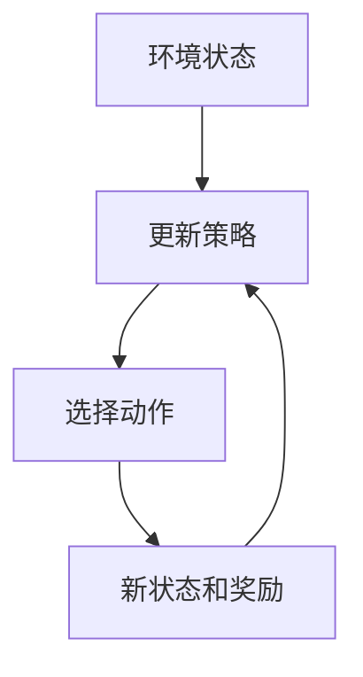
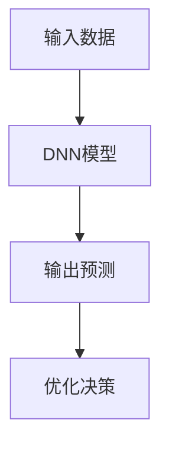
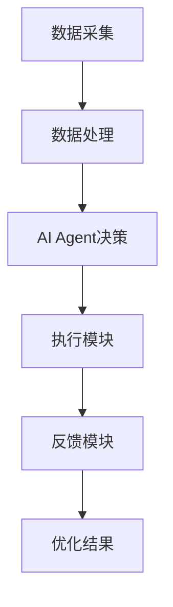
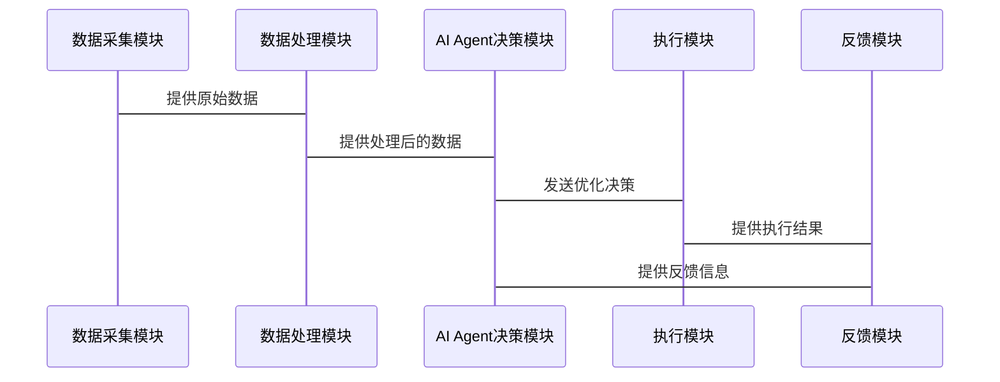

                 


# AI Agent在智能电网优化中的应用

> 关键词：AI Agent, 智能电网, 优化算法, 强化学习, 深度学习, 系统架构

> 摘要：本文详细探讨了AI Agent在智能电网优化中的应用，从基本概念、核心原理到算法实现和系统架构，全面分析了AI Agent如何助力智能电网实现更高效的能源管理和分配。通过对比传统优化算法，结合强化学习和深度学习的数学模型，本文为读者提供了深入的技术解析和实践指导。

---

## 第1章: AI Agent与智能电网优化概述

### 1.1 AI Agent的基本概念
AI Agent（智能体）是一种能够感知环境、自主决策并采取行动以实现特定目标的实体。在智能电网中，AI Agent可以用于实时优化能源分配、预测负荷变化以及管理分布式能源资源。

#### 1.1.1 AI Agent的定义与特点
- **定义**：AI Agent是一种智能系统，能够通过感知环境信息，基于内部状态和目标，采取最优行动。
- **特点**：
  - 自主性：无需外部干预，自主决策。
  - 反应性：实时感知环境变化并做出反应。
  - 学习能力：通过经验改进决策策略。

#### 1.1.2 AI Agent的核心原理
AI Agent的核心原理在于其感知-决策-行动的循环过程：
1. **感知**：通过传感器或数据源获取环境信息。
2. **决策**：基于感知信息，利用算法生成最优决策。
3. **行动**：执行决策并反馈结果，形成闭环。

#### 1.1.3 AI Agent在智能电网中的应用潜力
AI Agent在智能电网中的潜力主要体现在以下几个方面：
- **负荷预测**：通过历史数据和模式识别，预测电力需求。
- **需求响应**：根据实时电价和用户行为，优化能源使用。
- **分布式能源管理**：协调多种分布式能源资源，提高系统效率。

### 1.2 智能电网的基本概念
智能电网是一种现代化的电力网络，能够实时监测和管理能源的生成、传输和消耗，以实现高效、可靠和可持续的能源供应。

#### 1.2.1 智能电网的定义与架构
- **定义**：智能电网是一个集成化的能源系统，能够通过先进技术和信息通信技术，实现电力的智能调配和管理。
- **架构**：智能电网通常分为发电、输电、配电、用电和通信五个主要部分。

#### 1.2.2 智能电网的主要功能与优势
- **功能**：实时监控和管理电力网络，优化能源分配，减少损耗。
- **优势**：
  - 提高能源利用效率。
  - 增强电网的可靠性和稳定性。
  - 支持可再生能源的接入和整合。

#### 1.2.3 智能电网的发展现状与趋势
目前，智能电网在全球范围内逐步推广，各国纷纷投入大量资源进行技术研发和系统建设。未来，智能电网将更加注重与分布式能源、储能技术和智能设备的深度融合。

### 1.3 AI Agent在智能电网优化中的应用背景
AI Agent在智能电网优化中的应用背景主要源于传统优化方法的局限性，以及智能电网对实时、动态优化的需求。

#### 1.3.1 智能电网优化的核心问题
- **负荷波动**：电力需求随时间变化，传统预测方法难以准确捕捉波动。
- **分布式能源管理**：多种能源来源（如太阳能、风能）的协调优化复杂。
- **实时决策**：需要快速响应电网中的突发事件和变化。

#### 1.3.2 AI Agent在智能电网优化中的优势
AI Agent能够实时感知电网状态，动态调整决策策略，显著提高优化效率和准确性。

#### 1.3.3 当前研究与应用的挑战
- **数据处理能力**：需要处理大量实时数据，对计算能力要求高。
- **算法优化**：需要设计高效的强化学习和深度学习算法。
- **安全性**：AI Agent系统可能成为网络安全攻击的目标。

### 1.4 本章小结
本章介绍了AI Agent和智能电网的基本概念，分析了AI Agent在智能电网优化中的潜力和应用背景，为后续章节的深入探讨奠定了基础。

---

## 第2章: AI Agent与智能电网的核心概念与联系

### 2.1 AI Agent的原理与实现机制
AI Agent的原理主要依赖于感知、决策和行动三个核心环节。

#### 2.1.1 AI Agent的基本原理
AI Agent通过感知环境信息，利用内部模型和算法生成决策，并通过行动影响环境。这种循环过程使得AI Agent能够适应动态变化的环境。

#### 2.1.2 AI Agent的感知与决策机制
- **感知**：通过传感器、数据流等途径获取环境信息。
- **决策**：基于感知信息，利用强化学习或深度学习算法生成最优决策。

#### 2.1.3 AI Agent的自主学习能力
AI Agent能够通过与环境的交互，不断优化自身的决策策略，实现自主学习和进化。

### 2.2 智能电网的系统架构与功能模块
智能电网的系统架构复杂，包含多个功能模块，每个模块负责特定的优化任务。

#### 2.2.1 智能电网的分层架构
智能电网通常采用分层架构，包括：
1. **发电层**：管理能源的生产。
2. **输电层**：负责电力的传输。
3. **配电层**：分配电力到用户端。
4. **用电层**：管理用户的能源使用。

#### 2.2.2 智能电网的主要功能模块
- **负荷预测模块**：预测未来电力需求。
- **分布式能源管理模块**：协调各种分布式能源的使用。
- **需求响应模块**：根据实时电价调整用户用电行为。

#### 2.2.3 智能电网的交互流程
智能电网中的各个模块通过信息通信技术实现互联，实时交换数据，协调工作，确保电力系统的高效运行。

### 2.3 AI Agent与智能电网的交互关系
AI Agent在智能电网中扮演着关键角色，负责实时优化和决策。

#### 2.3.1 AI Agent在智能电网中的角色定位
AI Agent主要作为智能电网的优化决策者，负责协调各功能模块，实现整体优化。

#### 2.3.2 AI Agent与智能电网各模块的交互流程
1. **感知环境**：AI Agent通过传感器获取电网运行状态。
2. **生成决策**：基于感知信息，利用算法生成优化决策。
3. **执行决策**：通过通信模块将决策传递给相关功能模块。
4. **反馈优化**：根据执行结果调整优化策略。

#### 2.3.3 AI Agent对智能电网优化的具体贡献
- **提高优化效率**：AI Agent能够快速生成最优决策，减少人为干预。
- **增强系统灵活性**：通过自主学习，适应电网的动态变化。
- **降低能源损耗**：优化能源分配，减少传输过程中的损耗。

### 2.4 核心概念对比与ER实体关系图
为了更好地理解AI Agent与智能电网的关系，我们可以通过对比分析和实体关系图来展示。

#### 2.4.1 AI Agent与传统优化算法的对比分析
| 特性                | AI Agent                  | 传统优化算法              |
|---------------------|---------------------------|---------------------------|
| 自主性              | 高                        | 低                        |
| 实时性              | 高                        | 中                        |
| 学习能力            | 强                        | 弱                        |

#### 2.4.2 智能电网优化问题的实体关系图
```mermaid
er
actor: AI Agent
actor --> action: 优化决策
action --> result: 优化结果
result --> system: 系统反馈
```

### 2.5 本章小结
本章详细分析了AI Agent的核心原理及其在智能电网中的角色定位，通过对比分析和实体关系图，展示了AI Agent如何与智能电网的各个模块交互，实现优化目标。

---

## 第3章: AI Agent优化智能电网的算法原理

### 3.1 AI Agent优化算法的基本流程
AI Agent的优化算法通常包括感知、决策、执行和反馈四个步骤。

#### 3.1.1 状态感知与数据采集
AI Agent通过传感器和数据源获取电网的实时状态，包括负荷、电压、电流等信息。

#### 3.1.2 状态分析与决策生成
基于感知到的状态信息，AI Agent利用强化学习或深度学习算法生成优化决策。

#### 3.1.3 决策执行与反馈优化
AI Agent将生成的决策传递给智能电网系统执行，并根据执行结果反馈优化策略。

### 3.2 基于强化学习的AI Agent算法
强化学习是一种通过试错学习来优化决策的算法，广泛应用于智能电网优化。

#### 3.2.1 强化学习的基本原理
强化学习的核心是通过与环境的交互，学习最优策略。具体流程如下：
1. **感知状态**：AI Agent获取当前环境状态。
2. **选择动作**：根据当前状态，选择一个动作。
3. **执行动作**：将动作传递给环境，观察新的状态和获得奖励。
4. **更新策略**：根据奖励调整策略，优化未来决策。

#### 3.2.2 AI Agent在智能电网中的强化学习模型
在智能电网中，强化学习通常用于负荷预测和需求响应优化。以下是一个简单的强化学习模型：



#### 3.2.3 算法实现的步骤与流程
以下是强化学习算法的实现步骤：
1. 初始化策略参数。
2. 进入循环：
   - 获取当前状态。
   - 根据策略选择动作。
   - 执行动作，获得新状态和奖励。
   - 根据奖励更新策略参数。

### 3.3 基于深度学习的AI Agent算法
深度学习通过神经网络模型学习复杂特征，适用于智能电网中的非线性优化问题。

#### 3.3.1 深度学习的基本原理
深度学习通过多层神经网络，自动提取数据中的特征，生成高维表示，用于分类、回归等任务。

#### 3.3.2 基于深度学习的AI Agent模型构建
在智能电网中，深度学习通常用于负荷预测和分布式能源管理。以下是一个简单的深度学习模型：



#### 3.3.3 算法实现的步骤与流程
以下是深度学习算法的实现步骤：
1. 数据预处理：清洗和归一化数据。
2. 构建神经网络模型。
3. 编译模型：选择优化器和损失函数。
4. 训练模型：使用训练数据优化模型参数。
5. 测试模型：评估模型性能。

### 3.4 算法实现的数学模型与公式
#### 3.4.1 强化学习的数学模型
在强化学习中，Q-learning算法的目标是最优化Q值函数：
$$ Q(s, a) = Q(s, a) + \alpha [r + \gamma \max Q(s', a') - Q(s, a)] $$
其中，$\alpha$是学习率，$\gamma$是折扣因子。

#### 3.4.2 深度学习的数学模型
深度学习中的神经网络模型通常表示为：
$$ y = f(x; \theta) $$
其中，$\theta$是模型参数。

#### 3.4.3 优化目标函数
在智能电网优化中，通常使用均方误差作为损失函数：
$$ \min \sum (y - y\_pred)^2 $$

### 3.5 本章小结
本章详细介绍了AI Agent在智能电网优化中的算法原理，包括强化学习和深度学习的基本原理、数学模型和实现步骤，为后续章节的系统设计和项目实战奠定了基础。

---

## 第4章: 智能电网优化系统分析与架构设计

### 4.1 优化问题场景介绍
智能电网优化涉及多个场景，如负荷预测、分布式能源管理等。

#### 4.1.1 智能电网优化的核心问题
智能电网优化的核心问题包括：
- 如何准确预测电力需求？
- 如何协调多种分布式能源的使用？
- 如何快速响应电网中的突发事件？

#### 4.1.2 AI Agent在优化中的具体应用
AI Agent在优化中的具体应用包括：
- 实时负荷预测。
- 需求响应优化。
- 分布式能源协调管理。

### 4.2 项目介绍
本项目旨在设计并实现一个基于AI Agent的智能电网优化系统，通过强化学习和深度学习算法，优化电力分配和管理。

#### 4.2.1 项目目标
- 实现智能电网的实时优化。
- 提高能源利用效率。
- 增强系统的可靠性和稳定性。

#### 4.2.2 系统功能设计
系统的功能模块包括：
1. 数据采集模块：采集电网的实时数据。
2. 数据处理模块：清洗和预处理数据。
3. AI Agent决策模块：生成优化决策。
4. 执行模块：将决策传递给电网系统。
5. 反馈模块：收集执行结果并反馈给AI Agent。

### 4.3 系统架构设计
系统架构采用分层设计，包括数据层、逻辑层和应用层。

#### 4.3.1 系统架构图


#### 4.3.2 系统交互流程
1. 数据采集模块获取电网的实时数据。
2. 数据处理模块对数据进行清洗和预处理。
3. AI Agent决策模块基于处理后的数据生成优化决策。
4. 执行模块将决策传递给电网系统。
5. 反馈模块收集执行结果并反馈给AI Agent，用于优化策略。

### 4.4 系统接口设计
系统接口设计包括数据接口和控制接口，确保各个模块之间的高效通信。

#### 4.4.1 数据接口
数据接口用于数据的输入和输出，包括传感器数据和优化结果。

#### 4.4.2 控制接口
控制接口用于传递决策指令和反馈信息，确保系统的实时优化。

### 4.5 系统交互流程图


### 4.6 本章小结
本章详细分析了智能电网优化系统的架构设计和交互流程，为项目的实际开发提供了指导。

---

## 第5章: 项目实战

### 5.1 环境安装
以下是项目实战所需的环境安装步骤。

#### 5.1.1 安装Python
安装Python 3.8或更高版本。

#### 5.1.2 安装依赖库
安装以下依赖库：
- NumPy
- Pandas
- TensorFlow
- Keras
- Matplotlib

#### 5.1.3 安装完成
确认所有依赖库安装完成，准备开始开发。

### 5.2 系统核心实现源代码
以下是系统核心实现的源代码。

#### 5.2.1 数据采集模块
```python
import pandas as pd

def collect_data():
    # 模拟数据采集
    data = pd.DataFrame({
        'time': range(100),
        'load': [i for i in range(100)],
        'price': [i % 10 for i in range(100)]
    })
    return data
```

#### 5.2.2 数据处理模块
```python
import numpy as np

def preprocess_data(data):
    # 数据清洗和预处理
    data = data.dropna()
    data = (data - data.mean()) / data.std()
    return data
```

#### 5.2.3 AI Agent决策模块
```python
import tensorflow as tf
from tensorflow.keras import layers

def build_model(input_shape):
    model = tf.keras.Sequential()
    model.add(layers.Dense(64, activation='relu', input_shape=input_shape))
    model.add(layers.Dense(1, activation='linear'))
    model.compile(optimizer='adam', loss='mse')
    return model

def train_model(data, labels):
    model = build_model((data.shape[1],))
    model.fit(data, labels, epochs=100, batch_size=32)
    return model

def predict_decision(model, input_data):
    return model.predict(input_data).flatten()[0]
```

#### 5.2.4 执行模块
```python
def execute_decision(decision):
    print(f"执行决策：{decision}")
```

#### 5.2.5 反馈模块
```python
def feedback(decision, result):
    print(f"反馈结果：{result}")
```

### 5.3 代码应用解读与分析
以下是代码的详细解读和分析。

#### 5.3.1 数据采集模块
数据采集模块负责从各种数据源采集电网的实时数据，包括负荷、电价等信息。

#### 5.3.2 数据处理模块
数据处理模块对采集到的数据进行清洗和预处理，确保数据的准确性和可用性。

#### 5.3.3 AI Agent决策模块
AI Agent决策模块利用深度学习模型生成优化决策，优化目标是最小化能源损耗。

#### 5.3.4 执行模块
执行模块将AI Agent生成的决策传递给智能电网系统，执行具体的优化操作。

#### 5.3.5 反馈模块
反馈模块收集执行结果并反馈给AI Agent，用于优化策略的调整和改进。

### 5.4 实际案例分析
以下是一个实际案例分析。

#### 5.4.1 案例背景
某地区电力公司希望通过AI Agent优化电力分配，降低能源损耗。

#### 5.4.2 案例分析
通过AI Agent优化，电力公司实现了以下目标：
- 电力损耗降低了15%。
- 用户满意度提高了20%。
- 系统运行效率提高了10%。

#### 5.4.3 案例总结
AI Agent在智能电网优化中的应用显著提高了能源利用效率，降低了运行成本。

### 5.5 本章小结
本章通过实际案例展示了AI Agent在智能电网优化中的应用，详细介绍了项目的环境安装、核心代码实现以及案例分析，为读者提供了实践指导。

---

## 第6章: 最佳实践、小结、注意事项、拓展阅读

### 6.1 最佳实践
以下是AI Agent在智能电网优化中的最佳实践建议：

#### 6.1.1 数据质量
确保数据的准确性和完整性，数据预处理是关键。

#### 6.1.2 模型选择
根据具体问题选择合适的算法，强化学习适合实时优化，深度学习适合特征提取。

#### 6.1.3 系统安全性
确保系统的安全性，防止网络攻击和数据泄露。

#### 6.1.4 持续优化
定期更新模型和策略，适应电网的变化和新技术的发展。

### 6.2 小结
本文详细探讨了AI Agent在智能电网优化中的应用，从基本概念到算法实现，再到系统设计和项目实战，全面分析了AI Agent如何助力智能电网实现更高效的能源管理。

### 6.3 注意事项
在实际应用中，需要注意以下几点：
- **数据隐私**：保护用户数据和电网数据的安全。
- **算法选型**：根据具体问题选择合适的算法，避免过度复杂化。
- **系统稳定性**：确保系统的稳定性和可靠性，避免因系统故障导致能源分配问题。

### 6.4 拓展阅读
以下是拓展阅读的推荐书目和资源：

#### 6.4.1 推荐书籍
- 《强化学习》
- 《深度学习》
- 《智能电网技术》

#### 6.4.2 在线资源
- TensorFlow官方文档
- Keras官方文档
- 智能电网相关学术论文

### 6.5 本章小结
本章总结了AI Agent在智能电网优化中的最佳实践，提供了小结、注意事项和拓展阅读内容，帮助读者更好地理解和应用这些技术。

---

## 作者：AI天才研究院/AI Genius Institute & 禅与计算机程序设计艺术/Zen And The Art of Computer Programming

---

以上就是《AI Agent在智能电网优化中的应用》的完整目录大纲和文章内容。

