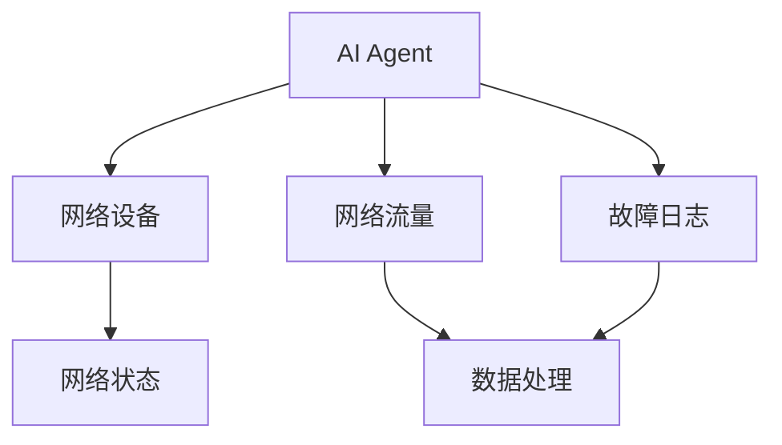
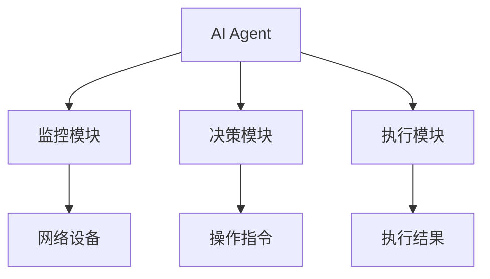
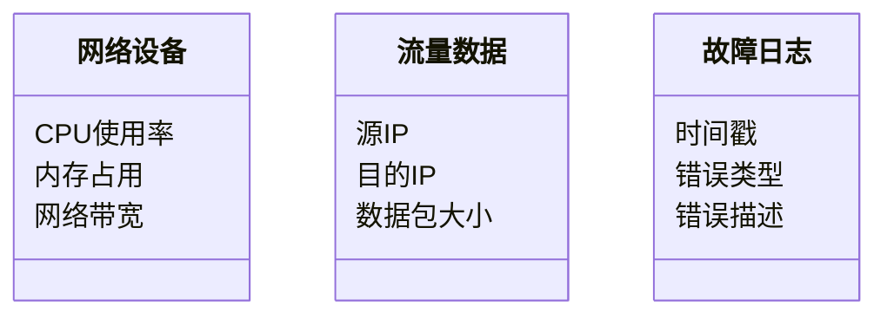
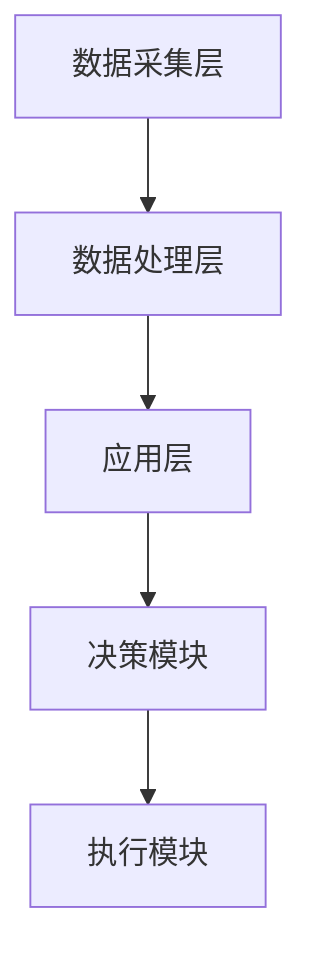
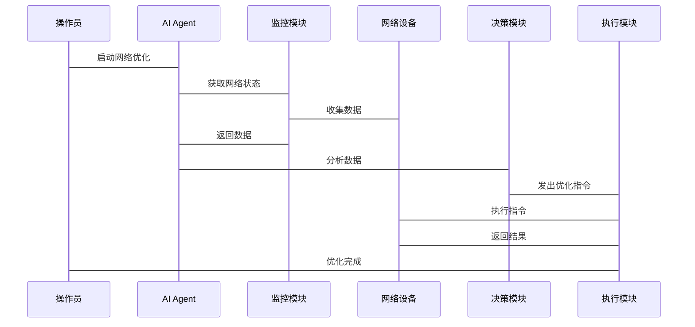

                 


# AI Agent在智能网络管理中的应用

## 关键词：AI Agent、智能网络管理、算法、系统架构、项目实战

## 摘要：本文系统介绍了AI Agent在智能网络管理中的应用，从基本概念到算法实现，再到系统架构设计和项目实战，深入剖析了AI Agent在网络监控、优化和故障诊断中的作用，帮助读者全面理解并掌握相关技术。

---

## 第一部分: AI Agent在智能网络管理中的应用概述

## 第1章: AI Agent与智能网络管理概述

### 1.1 AI Agent的基本概念

#### 1.1.1 什么是AI Agent

AI Agent（人工智能代理）是指能够感知环境、自主决策并采取行动的智能实体。它通过传感器获取信息，利用算法处理数据，并通过执行器与环境互动。AI Agent具备目标导向性，旨在实现特定目标，如优化网络性能或减少故障时间。

**对比表：AI Agent与传统网络管理工具的区别**

| 属性          | AI Agent                     | 传统网络管理工具               |
|---------------|-------------------------------|-------------------------------|
| 决策能力      | 自主学习和决策               | 预定义规则和脚本               |
| 环境适应性     | 高，能自适应动态变化的环境     | 低，依赖预设场景和规则           |
| 效率          | 高，通过机器学习提升效率       | 低，依赖人工配置和规则           |
| 可扩展性       | 高，适用于复杂和动态的网络环境 | 低，难以扩展到大规模和复杂的网络 |

#### 1.1.2 AI Agent的核心特征

1. **自主性**：AI Agent能够独立感知环境并采取行动，无需人工干预。
2. **反应性**：能够实时响应环境变化，调整策略。
3. **目标导向性**：所有行动都围绕实现特定目标展开。
4. **学习能力**：通过机器学习不断优化自身算法和策略。

#### 1.1.3 AI Agent与传统网络管理的区别

AI Agent与传统网络管理工具的区别主要体现在决策方式和环境适应性上。传统工具依赖预设规则，而AI Agent能够自主学习和调整策略，适应动态变化的网络环境。

### 1.2 智能网络管理的背景与意义

#### 1.2.1 网络管理的演进历程

1. **人工管理阶段**：依赖人工监控和手动操作，效率低下。
2. **规则引擎阶段**：利用预定义规则自动执行部分任务，但灵活性有限。
3. **智能管理阶段**：引入AI技术，实现自主决策和优化，显著提升管理效率。

#### 1.2.2 智能网络管理的定义

智能网络管理是指利用人工智能技术，通过自主学习和决策，实现网络监控、优化和故障诊断的智能化管理方式。

#### 1.2.3 智能网络管理的优势与挑战

- **优势**：
  - 提高网络管理效率和准确性。
  - 实现自动化故障诊断和修复。
  - 支持大规模网络环境的管理。
- **挑战**：
  - 数据隐私和安全问题。
  - 算法的可解释性和透明度。
  - 复杂网络环境下的稳定性。

### 1.3 AI Agent在智能网络管理中的作用

#### 1.3.1 AI Agent在网络监控中的应用

AI Agent通过实时监控网络流量和设备状态，识别异常行为，预测潜在风险，从而提高网络监控的效率和准确性。

#### 1.3.2 AI Agent在网络优化中的作用

AI Agent能够根据网络负载和性能数据，优化路由策略，调整资源分配，提升网络整体性能。

#### 1.3.3 AI Agent在网络故障诊断中的价值

AI Agent通过分析故障日志和网络状态，快速定位问题根源，并提出修复建议，减少故障响应时间。

---

## 第2章: AI Agent的核心概念与原理

### 2.1 AI Agent的构成与属性

#### 2.1.1 AI Agent的构成要素

AI Agent的构成包括感知模块、决策模块、执行模块和学习模块。感知模块负责数据采集，决策模块进行策略选择，执行模块负责操作执行，学习模块用于优化算法。

#### 2.1.2 AI Agent的属性对比

| 属性       | 描述                           |
|------------|--------------------------------|
| 感知能力   | 强大的数据采集和分析能力       |
| 决策能力   | 基于数据的自主决策能力         |
| 执行能力   | 可以通过API或指令与系统互动     |
| 学习能力   | 通过反馈不断优化算法和策略       |

#### 2.1.3 AI Agent的实体关系图



### 2.2 AI Agent的工作原理

#### 2.2.1 AI Agent的基本工作流程

1. **感知环境**：通过传感器或API获取网络状态数据。
2. **数据处理**：对数据进行清洗、特征提取和预处理。
3. **决策制定**：基于处理后的数据，选择最优行动方案。
4. **执行行动**：通过执行器或API发送指令。
5. **反馈学习**：根据执行结果更新模型参数。

#### 2.2.2 AI Agent的感知与决策机制

AI Agent的感知机制包括数据采集和特征提取，决策机制基于强化学习或监督学习算法。

#### 2.2.3 AI Agent的执行与反馈过程

执行过程包括指令发送和状态更新，反馈过程用于优化算法和模型。

### 2.3 AI Agent的算法基础

#### 2.3.1 常见AI Agent算法概述

常用的AI Agent算法包括Q-learning、Deep Q-Network（DQN）和策略梯度法（Policy Gradient）。

#### 2.3.2 强化学习在AI Agent中的应用

强化学习通过最大化累积奖励来优化决策策略，适用于动态和复杂的网络环境。

#### 2.3.3 监督学习在AI Agent中的应用

监督学习通过标记数据训练分类器，适用于网络异常检测和故障分类。

---

## 第3章: AI Agent的数学模型与算法实现

### 3.1 AI Agent的数学模型

#### 3.1.1 Q-learning算法的数学模型

Q-learning的目标是通过不断更新Q值表，找到最优策略。数学模型如下：

$$ Q(s, a) = Q(s, a) + \alpha [r + \max_{a'} Q(s', a') - Q(s, a)] $$

其中，$\alpha$是学习率，$r$是奖励值，$s$是当前状态，$a$是当前动作，$s'$是下一状态。

#### 3.1.2 状态空间的表示方法

状态空间可以表示为网络设备的状态集合，每个状态包括CPU使用率、内存占用等指标。

#### 3.1.3 动作空间的表示方法

动作空间包括允许的网络操作，如调整带宽、重启服务等。

### 3.2 AI Agent的算法实现

#### 3.2.1 Q-learning算法的实现步骤

1. 初始化Q值表为零。
2. 进入循环：
   a. 获取当前状态$s$。
   b. 根据当前策略选择动作$a$。
   c. 执行动作$a$，观察下一个状态$s'$和奖励$r$。
   d. 更新Q值表：$$ Q(s, a) = Q(s, a) + \alpha (r + \gamma \max Q(s', a') - Q(s, a)) $$

#### 3.2.2 算法的数学推导

Q-learning算法的收敛性证明基于马尔可夫决策过程，假设环境是可变的，并且策略是贪婪的。

#### 3.2.3 算法的代码实现

```python
import numpy as np

class QAgent:
    def __init__(self, state_size, action_size, gamma=0.99, epsilon=1.0):
        self.state_size = state_size
        self.action_size = action_size
        self.gamma = gamma
        self.epsilon = epsilon
        self.q_table = np.zeros((state_size, action_size))
    
    def get_action(self, state):
        if np.random.random() < self.epsilon:
            return np.random.randint(self.action_size)
        else:
            return np.argmax(self.q_table[state])
    
    def update(self, state, action, reward, next_state):
        self.q_table[state][action] = self.q_table[state][action] + self.gamma * (reward + max(self.q_table[next_state]) - self.q_table[state][action])
```

### 3.3 AI Agent算法的优化与改进

#### 3.3.1 算法优化的基本原则

- 优化算法的收敛速度和稳定性。
- 提高算法的可扩展性和适应性。

#### 3.3.2 常见的算法优化方法

1. **经验回放**：存储过去的经验，随机抽取样本进行训练，减少样本偏差。
2. ** Dueling Network**：将Q值分解为优势和价值函数，提高策略的稳定性。

#### 3.3.3 算法优化的效果评估

通过训练过程中的奖励曲线和收敛速度来评估算法优化的效果。

---

## 第4章: AI Agent的系统架构与设计

### 4.1 系统架构设计

#### 4.1.1 系统整体架构图



#### 4.1.2 系统功能设计

系统包括监控模块、决策模块和执行模块，分别负责数据采集、策略选择和指令执行。

#### 4.1.3 系统架构的优化

采用微服务架构，各模块独立运行，便于扩展和维护。

### 4.2 系统功能设计

#### 4.2.1 领域模型设计

领域模型包括网络设备、流量数据和故障日志等核心实体。



#### 4.2.2 系统架构设计

系统架构采用分层设计，包括数据采集层、处理层和应用层。



#### 4.2.3 系统接口设计

系统接口包括API接口和消息队列，确保各模块之间的高效通信。

#### 4.2.4 系统交互流程设计



---

## 第5章: 项目实战

### 5.1 环境安装与配置

1. 安装Python和相关库：numpy、pandas、scikit-learn。
2. 配置网络设备的API接口，确保数据采集和指令执行的连通性。

### 5.2 核心代码实现

#### 5.2.1 数据采集模块

```python
import requests

class NetworkCollector:
    def __init__(self, host):
        self.host = host
    
    def collect_cpu_usage(self):
        response = requests.get(f"http://{self.host}/api/cpu")
        return response.json()['usage']
    
    def collect_memory_usage(self):
        response = requests.get(f"http://{self.host}/api/memory")
        return response.json()['usage']
```

#### 5.2.2 决策模块实现

```python
class DecisionModule:
    def __init__(self, state_size, action_size):
        self.agent = QAgent(state_size, action_size)
    
    def decide_action(self, state):
        return self.agent.get_action(state)
    
    def update(self, state, action, reward, next_state):
        self.agent.update(state, action, reward, next_state)
```

### 5.3 代码解读与分析

1. **数据采集模块**：通过API接口获取网络设备的CPU和内存使用情况。
2. **决策模块**：使用Q-learning算法选择最优操作，并根据反馈更新Q值表。

### 5.4 实际案例分析

案例：网络设备CPU使用率异常，AI Agent检测到异常后，执行降低带宽的操作，成功恢复网络性能。

### 5.5 项目小结

通过本项目，我们实现了AI Agent在智能网络管理中的应用，验证了算法的有效性和系统的可行性。

---

## 第6章: 最佳实践与小结

### 6.1 最佳实践

1. **数据质量**：确保数据的准确性和及时性。
2. **算法选择**：根据具体场景选择合适的算法。
3. **系统架构**：采用可扩展和易维护的架构设计。

### 6.2 小结

本文详细介绍了AI Agent在智能网络管理中的应用，从基本概念到算法实现，再到系统架构设计和项目实战，帮助读者全面理解并掌握相关技术。

### 6.3 注意事项

- 数据安全和隐私保护是首要任务。
- 算法的可解释性和透明度需要重点关注。
- 系统的稳定性和可靠性是确保应用成功的关键。

### 6.4 拓展阅读

建议读者深入学习强化学习和深度学习的相关知识，以及网络管理领域的最新技术动态。

---

## 作者：AI天才研究院/AI Genius Institute & 禅与计算机程序设计艺术 /Zen And The Art of Computer Programming

