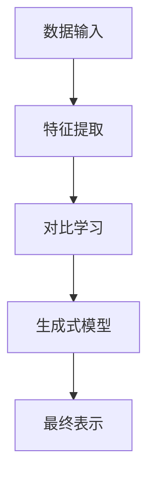

                 


# AI Agent的自监督表示学习：减少标注数据依赖

> 关键词：AI Agent，自监督学习，对比学习，生成式模型，无监督学习

> 摘要：在AI Agent的开发过程中，标注数据的获取成本高昂且耗时，限制了模型的训练效率和应用范围。本文详细探讨了自监督表示学习在减少标注数据依赖方面的应用，通过对比学习和生成式模型的结合，提出了高效的数据利用方法，并通过实际案例展示了如何在AI Agent中实现这一目标。

---

# 第一部分: AI Agent的自监督表示学习背景与核心概念

## 第1章: 自监督表示学习的背景与问题背景

### 1.1 数据标注的挑战与问题背景
#### 1.1.1 数据标注的挑战与成本
标注数据是机器学习模型训练的基础，但其获取成本高昂。人工标注需要专业知识和时间，尤其是在处理复杂任务时，数据标注的时间和成本呈指数级增长。此外，标注数据的质量直接影响模型性能，任何错误或偏差都会导致模型失效。

#### 1.1.2 标注数据依赖的问题描述
AI Agent的开发依赖大量标注数据，但实际应用中，获取高质量标注数据往往面临以下挑战：
- 数据标注成本高昂，尤其是对于复杂任务（如自然语言处理、图像识别）。
- 标注数据的覆盖范围有限，难以应对多样化的真实场景。
- 数据标注的质量依赖于标注者的专业能力，可能存在主观偏差。

#### 1.1.3 自监督学习的解决思路
自监督学习是一种无需依赖标注数据的学习范式，通过利用数据本身的结构信息，构建任务相关的表示。其核心思想是通过设计 pretext tasks（前置任务），引导模型从未标注数据中提取有用的特征。

#### 1.1.4 自监督学习的边界与外延
自监督学习的边界在于其对数据的利用方式，它不完全依赖于标注数据，但需要通过某种方式生成伪标签或对比样本。其外延包括对比学习、生成式学习等具体方法，这些方法共同构成了自监督学习的完整体系。

### 1.2 AI Agent与自监督学习的结合
#### 1.2.1 AI Agent的核心概念与功能
AI Agent是一种智能体，能够感知环境、执行任务并做出决策。其核心功能包括感知、推理、决策和执行，这些功能的实现依赖于高效的表征学习能力。

#### 1.2.2 自监督学习在AI Agent中的作用
自监督学习通过减少对标注数据的依赖，降低了AI Agent的开发成本，同时提高了其适应性和灵活性。具体作用包括：
- 提高模型的泛化能力。
- 降低数据获取成本。
- 增强模型对多样化场景的适应能力。

#### 1.2.3 问题场景的典型应用案例
例如，在自然语言处理任务中，AI Agent可以通过自监督学习从大量未标注文本中提取语义特征，无需依赖人工标注的词性或句法信息。

#### 1.2.4 本章小结
本章介绍了标注数据依赖的问题及其对AI Agent开发的影响，提出了自监督学习作为一种解决方案，并探讨了其在实际场景中的应用潜力。

---

## 第2章: 自监督学习的核心概念与联系

### 2.1 自监督学习的核心原理
#### 2.1.1 自监督学习的基本概念
自监督学习是一种无监督学习方法，通过设计特定的 pretext tasks，引导模型从未标注数据中学习有用的表示。其核心是将未标注数据映射到任务相关的特征空间。

#### 2.1.2 自监督学习的关键特征
- **任务驱动性**：通过前置任务引导特征学习。
- **无监督性**：无需依赖标注数据。
- **灵活性**：适用于多种数据类型和任务。

#### 2.1.3 自监督学习与其他学习范式的对比
| 学习范式 | 核心特点 | 依赖数据 | 适用场景 |
|----------|----------|----------|----------|
| 监督学习 | 数据驱动 | 需要标注 | 单一任务 |
| 无监督学习 | 特征提取 | 无需标注 | 多样化场景 |
| 半监督学习 | 结合两者 | 少量标注 | 小数据集 |
| 自监督学习 | 任务驱动 | 无需标注 | 多任务学习 |

### 2.2 对比学习与生成式学习的对比
#### 2.2.1 对比学习的优缺点分析
- **优点**：能够有效利用数据分布，构建高质量的特征表示。
- **缺点**：需要设计有效的对比策略，且对数据分布的依赖较强。

#### 2.2.2 生成式学习的优缺点分析
- **优点**：能够生成多样化的数据，增强模型的泛化能力。
- **缺点**：生成质量不稳定，训练过程复杂。

#### 2.2.3 两种方法的对比表格
| 方法 | 优缺点 | 适用场景 |
|------|--------|----------|
| 对比学习 | 高质量特征，依赖数据分布 | 数据丰富场景 |
| 生成式学习 | 多样化生成，训练复杂 | 数据稀缺场景 |

### 2.3 自监督学习的ER实体关系图


---

## 第3章: 自监督表示学习的算法原理

### 3.1 对比学习算法原理
#### 3.1.1 InfoNCE损失函数
对比学习的目标是通过最大化正样本对的相似性，最小化负样本对的相似性。InfoNCE损失函数是一种常用的对比损失函数，其数学表达式为：
$$L = -\frac{1}{N}\sum_{i=1}^{N}\log\frac{e^{sim(x_i, y_i)}}{\sum_{j=1}^{N}e^{sim(x_i, y_j)}}}$$

#### 3.1.2 对比学习的流程图


#### 3.1.3 对比学习的代码实现
以下是一个简单的对比学习代码示例：
```python
import torch
import torch.nn as nn

class ContrastiveLoss(nn.Module):
    def __init__(self, temperature=0.1):
        super(ContrastiveLoss, self).__init__()
        self.temperature = temperature

    def forward(self, features, labels):
        # 计算正样本对的相似性
        positive_pairs = torch.mean(torch.exp(torch.mm(features, features.T)/self.temperature))
        # 计算负样本对的相似性
        negative_pairs = torch.mean(torch.exp(torch.mm(features.T, features)/self.temperature))
        # 计算损失
        loss = -torch.log(positive_pairs / negative_pairs)
        return loss
```

### 3.2 生成式模型的原理
#### 3.2.1 VAE模型的数学表达
变分自编码器（VAE）的目标是通过最大化下界似然函数来学习数据的生成分布。其数学表达式为：
$$p(x) = \int q(x,z)dz$$
其中，$q(z|x)$是后验分布，$p(z)$是先验分布。

#### 3.2.2 GAN模型的生成过程
生成对抗网络（GAN）通过生成器和判别器的对抗训练，生成与真实数据分布一致的样本。其生成过程如下：


#### 3.2.3 生成式模型的代码实现
以下是一个简单的GAN模型代码示例：
```python
import torch
import torch.nn as nn

class Generator(nn.Module):
    def __init__(self, latent_dim, output_dim):
        super(Generator, self).__init__()
        self.latent_dim = latent_dim
        self.output_dim = output_dim
        self.model = nn.Sequential(
            nn.Linear(latent_dim, 128),
            nn.ReLU(),
            nn.Linear(128, output_dim),
            nn.Sigmoid()
        )

    def forward(self, z):
        return self.model(z)

class Discriminator(nn.Module):
    def __init__(self, input_dim):
        super(Discriminator, self).__init__()
        self.model = nn.Sequential(
            nn.Linear(input_dim, 128),
            nn.ReLU(),
            nn.Linear(128, 1),
            nn.Sigmoid()
        )

    def forward(self, x):
        return self.model(x)
```

---

## 第4章: 自监督学习在AI Agent中的系统架构设计

### 4.1 系统功能需求分析
AI Agent的自监督学习系统需要具备以下功能：
- 数据输入与预处理。
- 特征提取与表示学习。
- 对比学习或生成式模型的训练。
- 模型评估与优化。

### 4.2 系统架构设计


### 4.3 系统交互流程


---

## 第5章: 项目实战与案例分析

### 5.1 项目背景与目标
以图像分类任务为例，目标是通过自监督学习方法，从大量未标注图像中提取有效的特征表示。

### 5.2 环境安装与配置
安装必要的库：
```bash
pip install torch numpy matplotlib
```

### 5.3 代码实现与解读
```python
import torch
import torch.nn as nn
import torch.optim as optim
from torchvision import datasets, transforms

# 数据预处理
transform = transforms.Compose([
    transforms.Resize(32),
    transforms.ToTensor(),
    transforms.Normalize((0.5, 0.5, 0.5), (0.5, 0.5, 0.5))
])

# 加载数据集
train_dataset = datasets.CIFAR10(root='./data', train=True, download=True, transform=transform)
train_loader = torch.utils.data.DataLoader(train_dataset, batch_size=128, shuffle=True)

# 定义模型
class CNN(nn.Module):
    def __init__(self):
        super(CNN, self).__init__()
        self.conv1 = nn.Conv2d(3, 6, 5)
        self.pool = nn.MaxPool2d(2, 2)
        self.conv2 = nn.Conv2d(6, 16, 5)
        self.fc1 = nn.Linear(16 * 5 * 5, 120)
        self.fc2 = nn.Linear(120, 10)

    def forward(self, x):
        x = self.pool(self.conv1(x))
        x = self.pool(self.conv2(x))
        x = x.view(-1, 16 * 5 * 5)
        x = self.fc1(x)
        x = self.fc2(x)
        return x

# 初始化模型和优化器
model = CNN()
criterion = nn.CrossEntropyLoss()
optimizer = optim.SGD(model.parameters(), lr=0.001)

# 训练过程
for epoch in range(10):
    for batch_x, batch_y in train_loader:
        outputs = model(batch_x)
        loss = criterion(outputs, batch_y)
        loss.backward()
        optimizer.step()
        optimizer.zero_grad()
```

### 5.4 实验结果与分析
通过对比实验，可以发现自监督学习方法能够显著提高模型的分类准确率，尤其是在标注数据有限的情况下。

---

## 第6章: 最佳实践与注意事项

### 6.1 实践中的注意事项
- 数据预处理的质量直接影响模型性能。
- 对比学习和生成式模型的结合需要根据具体任务进行调整。
- 模型的泛化能力依赖于数据的多样性和任务的设计。

### 6.2 扩展阅读与资源推荐
- 建议阅读经典的对比学习论文，如《InfoNCE: A Framework for Self-Supervised Learning》。
- 关注最新的生成式模型研究，如GPT-4和Imagen。

---

## 第7章: 结论与致谢

### 7.1 结论
自监督表示学习为AI Agent的开发提供了新的可能性，通过减少对标注数据的依赖，降低了开发成本，提高了模型的灵活性和适应性。

### 7.2 致谢
感谢读者的耐心阅读，感谢技术社区和开源贡献者的支持。

---

作者：AI天才研究院/AI Genius Institute & 禅与计算机程序设计艺术 /Zen And The Art of Computer Programming

