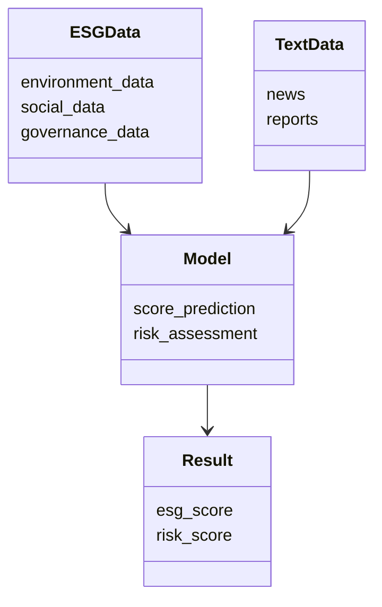
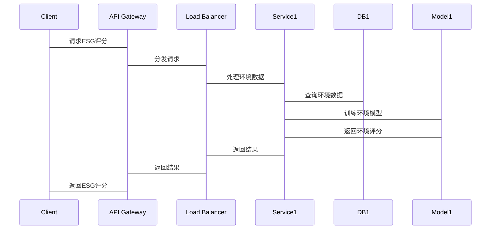

                 


# AI驱动的ESG投资分析

> 关键词：ESG投资分析, AI驱动, 自然语言处理, 机器学习, 环境、社会和治理因素

> 摘要：本文探讨了如何利用人工智能技术提升ESG投资分析的效率和准确性。通过分析环境、社会和治理因素，结合自然语言处理和机器学习模型，本文提供了从数据预处理到模型构建的详细步骤，并展示了如何利用AI技术进行ESG评分预测和风险评估。

---

# 第一部分: AI驱动的ESG投资分析基础

## 第1章: ESG投资分析概述

### 1.1 ESG的定义与重要性

#### 1.1.1 环境（Environmental）的核心概念
- 环境因素关注企业在环境保护方面的表现，包括碳排放、能源消耗、资源利用效率等。通过AI技术，可以对企业的环境数据进行分析，识别潜在的环境风险。

#### 1.1.2 社会责任（Social）的核心概念
- 社会责任关注企业在社会责任方面的表现，包括员工权益、公平劳动、社区参与等。AI技术可以帮助分析企业社会责任报告，评估其在社会方面的表现。

#### 1.1.3 公司治理（Governance）的核心概念
- 公司治理关注企业在治理结构、董事会构成、高管薪酬、股东权利等方面的透明度和有效性。AI技术可以通过分析企业治理数据，识别治理风险。

#### 1.1.4 ESG投资的重要性与发展趋势
- 随着全球对可持续发展的关注增加，ESG投资越来越受到投资者的重视。AI技术的应用可以提高ESG分析的效率和准确性，帮助投资者做出更明智的投资决策。

### 1.2 AI在投资分析中的作用

#### 1.2.1 AI技术在金融领域的应用现状
- AI技术在金融领域的应用广泛，包括股票预测、风险评估、信用评分等。在ESG投资分析中，AI技术可以帮助处理海量数据，发现隐藏的模式和趋势。

#### 1.2.2 AI驱动ESG投资分析的优势
- 高效性：AI技术可以快速处理大量非结构化数据，如新闻报道、公司公告等。
- 准确性：通过机器学习模型，可以预测企业的ESG评分，识别潜在的风险和机会。
- 及时性：AI技术可以实时监控企业的ESG表现，帮助投资者及时调整投资策略。

#### 1.2.3 ESG投资分析中的数据特征
- 数据多样性：ESG数据来源广泛，包括文本、数值和结构化数据。
- 数据的不完整性和噪声：ESG数据可能存在缺失或不一致的情况。
- 数据的动态变化：企业的ESG表现会随着时间变化，需要持续监控和更新。

---

## 第2章: ESG与AI的结合

### 2.1 ESG数据的特征与挑战

#### 2.1.1 ESG数据的多样性
- ESG数据包括环境、社会和治理三个维度，数据类型多样，包括文本、数值和结构化数据。

#### 2.1.2 数据的不完整性和噪声
- ESG数据可能存在缺失或不一致的情况，例如某些公司未公开环境数据或社会责任报告。

#### 2.1.3 数据的动态变化
- 企业的ESG表现会随着时间变化，例如环境政策的变化或公司治理结构的调整。

### 2.2 AI驱动ESG分析的核心要素

#### 2.2.1 自然语言处理（NLP）在ESG文本分析中的应用
- 使用NLP技术分析公司公告、新闻报道等文本数据，提取环境、社会和治理相关的关键词和情感倾向。

#### 2.2.2 机器学习模型在ESG评分预测中的应用
- 使用机器学习模型，如随机森林和梯度提升树，预测企业的ESG评分。

#### 2.2.3 数据挖掘技术在ESG数据中的应用
- 使用数据挖掘技术发现ESG数据中的模式和趋势，例如识别环境风险较高的行业。

### 2.3 ESG与AI结合的案例分析

#### 2.3.1 环境因素的AI分析案例
- 使用NLP技术分析公司的环境报告，提取环境风险和机会。

#### 2.3.2 社会责任的AI分析案例
- 使用机器学习模型预测公司的社会责任评分，帮助投资者评估公司的社会表现。

#### 2.3.3 公司治理的AI分析案例
- 使用自然语言处理技术分析公司治理公告，识别潜在的治理风险。

---

## 第3章: AI驱动ESG投资分析的算法原理

### 3.1 自然语言处理（NLP）在ESG分析中的应用

#### 3.1.1 文本预处理
- 使用NLP技术对文本数据进行清洗和分词，例如去除停用词、分词和句法分析。

#### 3.1.2 文本特征提取
- 使用TF-IDF、Word2Vec或BERT等技术提取文本特征。

#### 3.1.3 情感分析
- 使用情感分析模型评估公司公告中的情感倾向，识别潜在的环境、社会和治理风险。

#### 3.1.4 文本分类
- 使用分类算法（如SVM、随机森林）对文本进行分类，识别环境、社会和治理相关的文本。

#### 3.1.5 NLP在ESG分析中的挑战
- 数据稀疏性：某些ESG主题的文本数据较少，影响模型的准确性。
- 领域特定性：ESG分析需要特定的领域知识，模型需要进行领域适应。

#### 3.1.6 NLP在ESG分析中的代码实现
```python
import pandas as pd
from sklearn.feature_extraction.text import TfidfVectorizer
from sklearn.svm import SVC
from sklearn.metrics import accuracy_score

# 加载文本数据
data = pd.read_csv('esg_text.csv')

# 文本预处理
text = data['text'].apply(lambda x: x.lower())

# 特征提取
vectorizer = TfidfVectorizer(max_features=1000)
X = vectorizer.fit_transform(text)

# 模型训练
model = SVC()
model.fit(X.toarray(), data['label'])

# 模型评估
y_pred = model.predict(X.toarray())
print(accuracy_score(data['label'], y_pred))
```

### 3.2 机器学习模型在ESG评分预测中的应用

#### 3.2.1 数据预处理
- 对ESG评分数据进行标准化或归一化处理。

#### 3.2.2 特征工程
- 提取特征，如公司财务数据、ESG文本特征等。

#### 3.2.3 模型选择
- 使用回归模型（如线性回归、随机森林）预测ESG评分。

#### 3.2.4 模型训练与调优
- 使用交叉验证优化模型参数，提高模型的准确性和稳定性。

#### 3.2.5 模型评估
- 使用均方误差（MSE）、R平方（R²）等指标评估模型的性能。

#### 3.2.6 机器学习模型的数学公式
- 线性回归模型：
  $$ y = \beta_0 + \beta_1 x_1 + \beta_2 x_2 + \dots + \beta_n x_n + \epsilon $$
- 随机森林模型：
  $$ y = \sum_{i=1}^{n} \text{Tree}(x_i) $$

#### 3.2.7 机器学习模型的代码实现
```python
import pandas as pd
from sklearn.ensemble import RandomForestRegressor
from sklearn.metrics import mean_squared_error

# 加载数据
data = pd.read_csv('esg_scores.csv')

# 特征工程
X = data.drop('score', axis=1)
y = data['score']

# 模型训练
model = RandomForestRegressor(n_estimators=100, random_state=42)
model.fit(X, y)

# 预测与评估
y_pred = model.predict(X)
print(mean_squared_error(y, y_pred))
```

### 3.3 数据挖掘技术在ESG分析中的应用

#### 3.3.1 数据挖掘的基本概念
- 数据挖掘是指从大量数据中提取有用信息的过程，常用于发现数据中的模式和趋势。

#### 3.3.2 数据挖掘在ESG分析中的应用
- 发现环境风险较高的行业。
- 识别社会责任表现较好的公司。
- 分析公司治理结构与公司绩效的关系。

#### 3.3.3 数据挖掘的算法选择
- 使用关联规则挖掘（如Apriori算法）发现ESG数据中的关联性。
- 使用聚类算法（如K-means）将公司分为不同的ESG表现类别。

#### 3.3.4 数据挖掘的挑战
- 数据量大：ESG数据量大，需要高效的计算资源。
- 数据复杂性：ESG数据涉及多个维度，数据复杂性高。

#### 3.3.5 数据挖掘的代码实现
```python
from mlxtend.frequent_itemsets import apriori

# 加载数据
data = pd.read_csv('esg_transactions.csv')

# 关联规则挖掘
itemsets = apriori(data, min_support=0.2, use_colnames=True)
print(itemsets)
```

---

## 第4章: ESG投资分析的数学模型和公式

### 4.1 ESG评分预测的数学模型

#### 4.1.1 线性回归模型
- 线性回归模型用于预测ESG评分，假设自变量与因变量之间存在线性关系。
  $$ y = \beta_0 + \beta_1 x_1 + \beta_2 x_2 + \dots + \beta_n x_n + \epsilon $$

#### 4.1.2 随机森林模型
- 随机森林模型是一种集成学习方法，通过多个决策树的投票结果进行预测。
  $$ y = \sum_{i=1}^{n} \text{Tree}(x_i) $$

#### 4.1.3 神经网络模型
- 神经网络模型用于处理复杂的非线性关系，适合处理高维数据。
  $$ y = \sigma(w_1 x_1 + w_2 x_2 + \dots + w_n x_n + b) $$

#### 4.1.4 支持向量机（SVM）
- SVM用于分类问题，适合处理小样本数据。
  $$ y = \text{sign}(w_1 x_1 + w_2 x_2 + \dots + w_n x_n + b) $$

### 4.2 ESG风险评估的数学模型

#### 4.2.1 风险评估公式
- 风险评估公式用于评估企业在环境、社会和治理方面的风险。
  $$ \text{风险评分} = \alpha \cdot \text{环境风险} + \beta \cdot \text{社会风险} + \gamma \cdot \text{治理风险} $$

#### 4.2.2 风险评估的权重确定
- 根据行业特点和投资策略确定各风险因素的权重。

---

## 第5章: 系统分析与架构设计方案

### 5.1 问题场景介绍

#### 5.1.1 问题背景
- 随着ESG投资的兴起，投资者需要高效、准确的ESG分析工具。

#### 5.1.2 问题描述
- 如何利用AI技术构建一个高效的ESG投资分析系统。

### 5.2 项目介绍

#### 5.2.1 项目目标
- 构建一个基于AI的ESG投资分析系统，提供ESG评分预测、风险评估和投资建议。

#### 5.2.2 项目范围
- 环境、社会和治理三个维度的分析。
- 数据预处理、特征提取、模型训练和结果分析。

### 5.3 系统功能设计

#### 5.3.1 领域模型（Mermaid 类图）


#### 5.3.2 系统架构设计（Mermaid 架构图）
```mermaid
archi
    title ESG Investment Analysis System
    client --> API Gateway: API请求
    API Gateway --> Load Balancer: 请求分发
    Load Balancer --> Service1: 处理环境数据
    Load Balancer --> Service2: 处理社会数据
    Load Balancer --> Service3: 处理治理数据
    Service1 --> DB1: 存储环境数据
    Service2 --> DB2: 存储社会数据
    Service3 --> DB3: 存储治理数据
    Service1 --> Model1: 训练环境模型
    Service2 --> Model2: 训练社会模型
    Service3 --> Model3: 训练治理模型
    Model1 --> Result1: 输出环境评分
    Model2 --> Result2: 输出社会评分
    Model3 --> Result3: 输出治理评分
    Result1 --> FinalResult: 综合评分
    Result2 --> FinalResult: 综合评分
    Result3 --> FinalResult: 综合评分
    FinalResult --> Client: 返回结果
```

#### 5.3.3 系统接口设计

- API接口：提供ESG数据查询、模型预测和结果返回的接口。
- 数据接口：与数据源（如公司公告、新闻报道）对接，获取ESG数据。

#### 5.3.4 系统交互设计（Mermaid 序列图）


### 5.4 项目实战

#### 5.4.1 环境安装
- 安装必要的Python库，如scikit-learn、nltk、mlxtend等。

#### 5.4.2 数据收集
- 收集环境、社会和治理相关的数据，包括公司公告、新闻报道、财务数据等。

#### 5.4.3 特征工程
- 对文本数据进行预处理和特征提取。
- 对数值数据进行标准化或归一化处理。

#### 5.4.4 模型实现
- 使用机器学习模型（如随机森林）进行ESG评分预测。
- 使用自然语言处理技术进行文本分析。

#### 5.4.5 结果分析
- 分析模型的预测结果，评估模型的准确性和稳定性。
- 根据结果调整模型参数，优化模型性能。

#### 5.4.6 优化与改进
- 使用超参数调优（如网格搜索）优化模型性能。
- 尝试不同的特征组合，提高模型的准确性。

#### 5.4.7 代码实现
```python
import pandas as pd
from sklearn.ensemble import RandomForestRegressor
from sklearn.metrics import mean_squared_error

# 加载数据
data = pd.read_csv('esg_data.csv')

# 特征工程
X = data.drop('score', axis=1)
y = data['score']

# 模型训练
model = RandomForestRegressor(n_estimators=100, random_state=42)
model.fit(X, y)

# 预测与评估
y_pred = model.predict(X)
print(mean_squared_error(y, y_pred))
```

### 5.5 最佳实践、小结和注意事项

#### 5.5.1 最佳实践
- 数据质量：确保数据的完整性和准确性，避免噪声干扰。
- 模型解释性：选择可解释性较高的模型，便于分析和调整。
- 伦理问题：在使用AI技术进行ESG分析时，需关注数据隐私和伦理问题。

#### 5.5.2 小结
- 本文详细介绍了AI驱动的ESG投资分析的背景、核心概念、算法原理和系统设计。
- 通过实际案例展示了如何利用AI技术进行ESG评分预测和风险评估。

#### 5.5.3 注意事项
- 数据隐私：在处理ESG数据时，需遵守相关法律法规，保护数据隐私。
- 模型更新：定期更新模型，以适应数据的变化和新的投资需求。
- 技术局限性：AI技术在ESG分析中仍存在一些局限性，如数据稀疏性和模型解释性问题。

---

## 第6章: 总结与展望

### 6.1 总结
- 本文探讨了AI技术在ESG投资分析中的应用，提出了基于自然语言处理和机器学习的ESG分析方法。
- 通过实际案例展示了如何利用AI技术进行ESG评分预测和风险评估。

### 6.2 未来展望
- 随着AI技术的不断发展，未来可以进一步提升ESG分析的准确性和效率。
- 结合区块链技术，构建透明、可信的ESG数据共享平台。
- 研究更复杂的模型（如深度学习模型），提高ESG分析的深度和广度。

---

# 作者：AI天才研究院/AI Genius Institute & 禅与计算机程序设计艺术 /Zen And The Art of Computer Programming

---

**注：由于篇幅限制，上述内容是一个简要的框架和部分章节的详细内容。实际撰写时，需要根据具体需求扩展每个部分的细节，并添加相应的代码示例和图表。**

