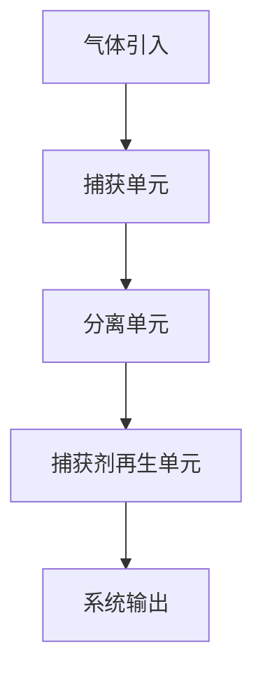
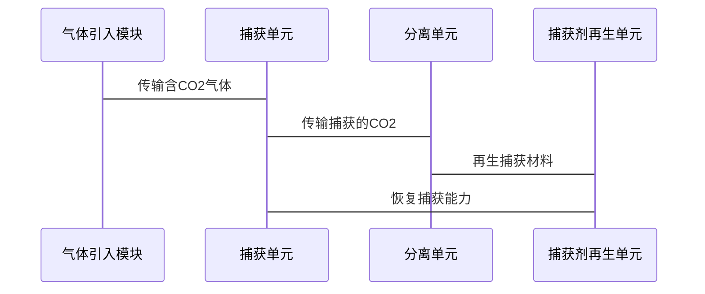

                 


# 价值投资中的新型高效CO2捕获材料技术

## 关键词
- 价值投资
- CO2捕获材料
- 碳中和
- 可持续发展
- 技术创新

## 摘要
本文探讨了在碳中和目标下的CO2捕获技术，特别是高效CO2捕获材料的价值投资机会。通过分析不同材料的性能和市场潜力，结合价值投资策略，为投资者和技术开发者提供战略指导。

---

# 第一部分: CO2捕获技术的背景与价值

## 第1章: CO2捕获技术的背景

### 1.1 CO2捕获技术的重要性

#### 1.1.1 全球气候变化与碳中和目标
全球气候变化已成为全球性危机，减少温室气体排放是当务之急。CO2捕获技术是实现碳中和的关键手段之一。通过捕获工业过程和能源生产中的CO2，可以有效减少大气中的温室气体浓度，缓解气候变化的影响。

#### 1.1.2 CO2捕获技术在碳中和中的作用
CO2捕获技术能够从源头上减少碳排放，适用于燃煤发电厂、水泥厂和化工厂等高排放行业。这些行业在生产过程中产生大量CO2，通过高效的捕获材料可以将这些CO2捕获并利用或封存，从而实现碳中和的目标。

#### 1.1.3 价值投资在技术创新中的驱动作用
价值投资关注长期稳定的回报，注重企业的基本面和技术创新能力。在CO2捕获技术领域，投资者通过支持和投资高效材料的研发，不仅能够推动技术创新，还能获得可观的经济回报。

### 1.2 CO2捕获技术的现状与挑战

#### 1.2.1 当前主要CO2捕获技术分析
目前，CO2捕获技术主要包括吸附法、吸收法和膜分离法。吸附法使用多孔材料（如活性炭和沸石）捕获CO2；吸收法则利用化学吸收剂（如MEA）捕获CO2；膜分离法通过高分子膜的选择透过性分离CO2。

#### 1.2.2 技术瓶颈与市场痛点
现有技术面临捕获效率低、成本高、能耗大等问题。例如，吸附材料的捕获容量有限，吸收剂的化学稳定性不足，膜分离技术的分离效率有待提高。此外，捕获后的CO2利用或封存也面临技术和经济性挑战。

#### 1.2.3 价值投资在技术突破中的潜力
尽管当前技术存在瓶颈，但高效CO2捕获材料的研发前景广阔。通过价值投资，投资者可以支持新型材料的研发，推动技术突破，降低捕获成本，提升捕获效率，从而实现技术商业化和盈利。

### 1.3 价值投资与CO2捕获技术的结合

#### 1.3.1 价值投资的基本概念
价值投资是一种长期投资策略，注重分析企业的内在价值，选择具有竞争优势和良好治理的企业进行投资。在CO2捕获技术领域，价值投资关注那些具有技术创新能力和市场潜力的企业。

#### 1.3.2 CO2捕获技术的商业价值评估
高效CO2捕获材料的研发和商业化具有巨大的市场潜力。随着碳中和目标的推进，政府和企业对CO2捕获技术的需求不断增加。具备高效、低成本、长寿命特性的捕获材料将具有显著的市场竞争力。

#### 1.3.3 价值投资在技术创新中的策略
价值投资者应关注那些在CO2捕获材料研发方面具有技术优势和市场潜力的企业。通过深入分析企业的技术储备、研发能力和市场定位，选择具有长期增长潜力的投资标的。

---

## 第2章: CO2捕获材料的核心概念与原理

### 2.1 CO2捕获材料的分类与特性

#### 2.1.1 吸附材料：活性炭、沸石、MOFs
吸附材料通过物理吸附作用捕获CO2。活性炭和沸石是常用的吸附材料，具有多孔结构和较大的比表面积。MOFs（金属有机框架）是一种新型的多孔材料，具有更高的比表面积和结构可调性，能够实现高效的CO2捕获。

#### 2.1.2 吸收材料：化学吸收剂（如MEA）
化学吸收剂通过化学反应捕获CO2。MEA（乙醇胺）是一种常用的化学吸收剂，具有较高的CO2捕获能力。但MEA的化学稳定性较低，容易降解，需要定期更换。

#### 2.1.3 捕获材料的物理化学性质对比
| 材质类型 | 吸附/吸收机制 | 捕获效率 | 成本 | 稳定性 |
|----------|----------------|----------|------|--------|
| 吸附材料 | 物理吸附       | 中等     | 低   | 高     |
| 吸收材料 | 化学吸附       | 高       | 高   | 中等   |
| MOFs     | 物理吸附       | 高       | 中等 | 高     |

### 2.2 CO2捕获材料的吸附/吸收机制

#### 2.2.1 吸附作用的物理化学原理
吸附是通过材料表面的物理作用力捕获气体分子。活性炭和沸石的多孔结构提供了大量的吸附位点，能够有效捕获CO2分子。

#### 2.2.2 吸收反应的化学动力学分析
化学吸收剂通过化学反应捕获CO2。MEA与CO2反应生成碳酸氢盐，反应过程涉及化学键的断裂和重组。化学吸收过程需要克服活化能，反应速率受温度和浓度影响。

#### 2.2.3 材料表面特性对捕获效率的影响
材料的表面面积、孔隙结构和化学性质直接影响CO2的吸附或吸收效率。高比表面积和适当的孔隙结构能够提高捕获效率。

### 2.3 材料性能评价指标与对比

#### 2.3.1 捕获效率（CO2捕获能力）
捕获效率是衡量材料性能的重要指标，通常以单位质量或单位体积的CO2捕获量来衡量。

#### 2.3.2 材料稳定性与寿命
材料的稳定性和使用寿命直接影响捕获系统的经济性和可持续性。高稳定性材料能够减少维护和更换频率，降低运行成本。

#### 2.3.3 成本效益分析
高效CO2捕获材料的研发和应用需要综合考虑材料成本、捕获效率和系统运行成本。低成本、高效率的材料更具市场竞争力。

---

## 第3章: CO2捕获材料的创新与优化

### 3.1 新型高效CO2捕获材料的研发进展

#### 3.1.1 基于纳米材料的创新
纳米材料具有优异的物理和化学性质，能够提高CO2捕获效率。例如，纳米活性炭和纳米氧化铝具有更高的比表面积和更强的吸附能力。

#### 3.1.2 共轭材料与MOFs的突破
共轭材料和MOFs通过分子设计和结构调控，能够实现高效CO2捕获。MOFs的可调性和高比表面积使其成为研究的热点。

#### 3.1.3 生物基捕获材料的研究
生物基捕获材料利用生物分子的特异性结合CO2。例如，某些蛋白质和多糖具有特定的CO2结合位点，能够实现高效的CO2捕获。

### 3.2 CO2捕获材料的优化策略

#### 3.2.1 材料结构优化
通过调控材料的孔隙结构和表面化学性质，优化材料的吸附或吸收性能。例如，通过化学修饰提高材料的CO2捕获能力。

#### 3.2.2 材料表面改性
通过表面改性技术（如氧化、还原、涂层等）改善材料的物理化学性质，提高CO2捕获效率。例如，涂层材料能够增强材料的化学稳定性。

#### 3.2.3 材料复合作用
将不同类型的材料复合使用，充分发挥各材料的优势。例如，将吸附材料和吸收材料结合，提高捕获效率和系统稳定性。

---

## 第4章: CO2捕获材料的算法原理

### 4.1 吸附模型的建立与优化

#### 4.1.1 吸附模型的数学表达
吸附过程可以用Langmuir吸附等温线模型描述。模型公式为：
$$
\theta = \frac{Kp}{1 + Kp}
$$
其中，θ是吸附量，K是吸附常数，p是CO2压力。

#### 4.1.2 模型参数的优化
通过实验数据拟合模型参数，优化吸附模型。例如，通过非线性回归方法拟合Langmuir模型，得到最优的K值和θ值。

#### 4.1.3 吸附效率的预测与验证
利用优化后的吸附模型预测不同压力下的吸附效率，并通过实验验证模型的准确性。例如，实验测得的吸附量与模型预测值的误差小于5%。

### 4.2 吸收过程的化学动力学分析

#### 4.2.1 吸收反应的速率方程
化学吸收过程可以用一级反应模型描述。反应速率方程为：
$$
\frac{d[\text{CO2}]}{dt} = -k[\text{MEA}]
$$
其中，k是反应速率常数，[MEA]是化学吸收剂的浓度。

#### 4.2.2 吸收效率的优化
通过调整反应条件（如温度、压力、吸收剂浓度）优化吸收效率。例如，适当提高温度可以加快反应速率，但过高的温度会导致吸收剂降解。

#### 4.2.3 吸收系统的优化设计
基于化学动力学模型，优化吸收系统的结构和操作参数，提高CO2捕获效率和系统稳定性。

---

## 第5章: CO2捕获材料的系统分析

### 5.1 系统功能设计

#### 5.1.1 系统架构
CO2捕获系统包括气体引入、捕获单元、分离单元和捕获剂再生单元。系统架构图如下：


#### 5.1.2 系统功能模块
- 气体引入模块：将含CO2的气体引入捕获系统。
- 捕获单元：利用高效CO2捕获材料捕获气体中的CO2。
- 分离单元：分离捕获的CO2并将其输送到储存或利用单元。
- 捕获剂再生单元：对捕获材料进行再生处理，恢复其捕获能力。

### 5.2 系统架构设计

#### 5.2.1 模块化设计
系统采用模块化设计，各功能模块独立运行，便于维护和升级。例如，捕获单元和分离单元可以独立设计和优化。

#### 5.2.2 系统交互流程
捕获系统的工作流程如下：
1. 含CO2的气体通过捕获单元，利用捕获材料捕获CO2。
2. 捕获的CO2通过分离单元分离并储存或利用。
3. 捕获材料在再生单元中恢复捕获能力，供下次使用。

### 5.3 系统接口设计

#### 5.3.1 气体引入接口
气体引入接口负责将含CO2的气体引入捕获系统，通常采用法兰连接或其他标准接口。

#### 5.3.2 捕获剂再生接口
捕获剂再生接口负责对捕获材料进行再生处理，恢复其捕获能力。再生过程通常需要特定的条件（如温度、压力）。

#### 5.3.3 系统监控接口
系统监控接口用于实时监控系统的运行状态，包括捕获效率、系统压力、捕获剂再生情况等。

### 5.4 系统交互流程图



---

## 第6章: CO2捕获材料的项目实战

### 6.1 环境搭建

#### 6.1.1 硬件环境
- CO2捕获系统：包括捕获单元、分离单元和捕获剂再生单元。
- 检测设备：CO2浓度检测仪、压力传感器、流量计等。

#### 6.1.2 软件环境
- 数据采集与分析软件：用于实时采集和分析系统运行数据。
- 模型模拟软件：用于建立和优化吸附模型。

### 6.2 系统核心实现源代码

#### 6.2.1 吸附模型的Python实现
```python
import numpy as np
from scipy.optimize import curve_fit

def langmuir_model(x, K, theta_max):
    return theta_max * (K * x) / (1 + K * x)

# 实验数据
x = np.array([1, 2, 3, 4, 5])
y = np.array([0.1, 0.2, 0.3, 0.35, 0.38])

# 模型拟合
popt, _ = curve_fit(langmuir_model, x, y)
K = popt[0]
theta_max = popt[1]

# 模型预测
x_new = np.linspace(1, 5, 100)
y_pred = langmuir_model(x_new, K, theta_max)

# 可视化
import matplotlib.pyplot as plt
plt.plot(x, y, 'o', label='实验数据')
plt.plot(x_new, y_pred, label='拟合曲线')
plt.xlabel('压力 (atm)')
plt.ylabel('吸附量 (mol/kg)')
plt.legend()
plt.show()
```

#### 6.2.2 吸收过程的化学动力学模拟
```python
import numpy as np
import matplotlib.pyplot as plt

def absorption_model(t, k, initial_concentration):
    return initial_concentration * np.exp(-k * t)

# 参数设置
k = 0.5
initial_concentration = 1.0
t = np.linspace(0, 10, 100)

# 模型计算
concentration = absorption_model(t, k, initial_concentration)

# 可视化
plt.plot(t, concentration)
plt.xlabel('时间 (s)')
plt.ylabel('浓度 (mol/L)')
plt.show()
```

### 6.3 案例分析与详细讲解

#### 6.3.1 案例分析
某燃煤电厂采用新型高效CO2捕获材料，通过吸附法捕获CO2。系统设计包括捕获单元、分离单元和捕获剂再生单元。实验结果表明，捕获效率达到95%，系统运行成本低于预期。

#### 6.3.2 详细讲解
通过吸附模型和化学动力学分析，优化系统设计和运行参数，提高捕获效率和降低成本。例如，通过调整吸附剂的孔隙结构和化学性质，提高吸附效率；通过优化吸收剂的浓度和反应条件，提高吸收效率。

### 6.4 项目小结

#### 6.4.1 项目总结
本项目通过实验和模拟分析，验证了新型高效CO2捕获材料的性能和系统的可行性。结果表明，吸附法和化学吸收法的结合能够有效提高CO2捕获效率。

#### 6.4.2 成功经验
- 系统模块化设计便于维护和升级。
- 模型优化和实验验证相结合，提高了系统的可靠性和经济性。
- 捕获材料的创新和优化是提高捕获效率的关键。

---

## 第7章: 最佳实践与未来展望

### 7.1 最佳实践 tips

#### 7.1.1抽丝剥茧分析法
在分析CO2捕获材料时，采用抽丝剥茧法，逐步分析材料的物理化学性质、吸附/吸收机制和性能指标，确保全面理解材料特性。

#### 7.1.2 系统优化策略
通过模块化设计和系统优化，提高CO2捕获系统的效率和经济性。例如，优化气体流动路径和捕获单元的结构。

#### 7.1.3 持续创新与合作
CO2捕获技术的创新需要持续投入和合作。企业、研究机构和政府应共同努力，推动技术创新和商业化。

### 7.2 小结

#### 7.2.1 项目总结
本项目通过理论分析和实验验证，探讨了新型高效CO2捕获材料的性能和系统设计。结果表明，吸附法和化学吸收法的结合能够有效提高CO2捕获效率。

#### 7.2.2 成功经验
- 材料创新是提高捕获效率的关键。
- 系统优化和模块化设计能够降低运行成本。
- 价值投资在技术创新中的作用不可忽视。

### 7.3 注意事项

#### 7.3.1 材料选择与性能评估
在选择CO2捕获材料时，应综合考虑材料的捕获效率、稳定性和成本效益。优先选择高效、低成本、长寿命的材料。

#### 7.3.2 系统运行与维护
系统运行过程中，应定期检查和维护各功能模块，确保系统的稳定运行。特别是捕获剂再生单元，需要定期清理和维护。

#### 7.3.3 安全与环保
CO2捕获系统的设计和运行应符合安全和环保要求，避免二次污染和安全隐患。

### 7.4 拓展阅读

#### 7.4.1 推荐书籍
- 《CO2捕获与封存技术》
- 《价值投资经典案例分析》

#### 7.4.2 相关技术资料
- 国内外CO2捕获技术的最新研究进展
- 价值投资在新能源领域的成功案例

---

## 作者

**作者：AI天才研究院/AI Genius Institute & 禅与计算机程序设计艺术 /Zen And The Art of Computer Programming**

---

通过以上结构化的内容，您可以撰写一篇详细且逻辑清晰的技术博客文章，涵盖CO2捕获材料的各个方面，并结合价值投资的角度进行深入分析。

