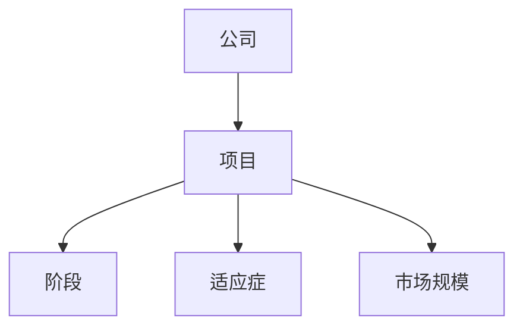
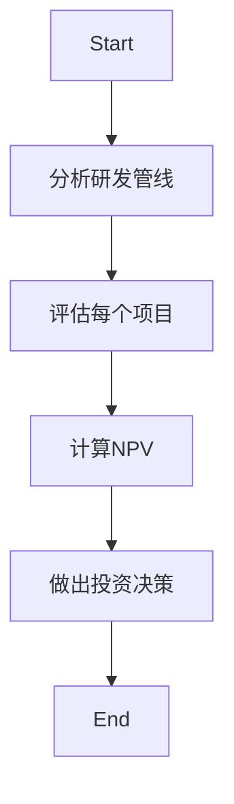
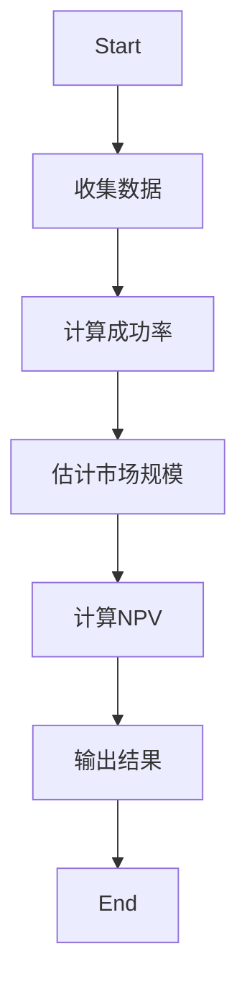
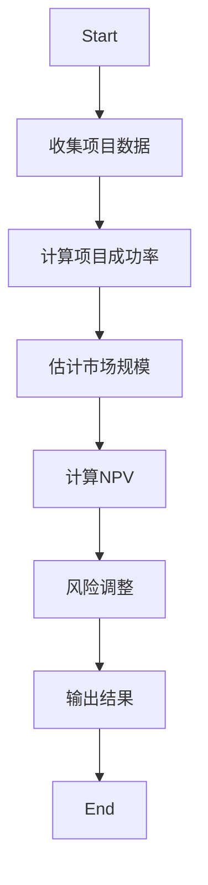
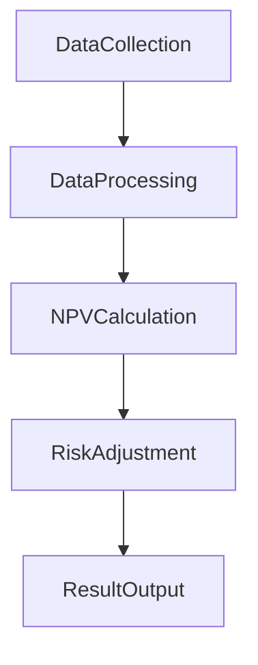
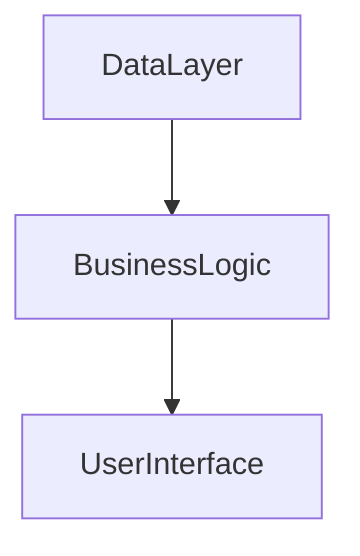

                 


# 价值投资中的生物制药研发管线分析

## 关键词：价值投资、生物制药、研发管线、投资分析、风险管理、财务模型、技术评估

## 摘要：  
本文深入探讨了在价值投资中如何分析生物制药公司的研发管线，从研发管线的定义、核心概念、算法原理到系统架构设计，再到实际案例分析，全面解析了研发管线分析在投资决策中的重要性。文章结合数学模型、流程图和系统设计，提供了从理论到实践的详细指导，帮助投资者更好地评估研发管线的价值和风险。

---

# 第一章: 研发管线分析的背景与概念

## 1.1 研发管线分析的背景

### 1.1.1 生物制药行业的特点
生物制药行业具有高投入、长周期和高风险的特点。从药物发现到商业化，通常需要10-15年时间，且失败率较高。然而，一旦成功，其市场回报率极高，因此成为价值投资者的重要关注领域。

### 1.1.2 价值投资的核心理念
价值投资强调以低于内在价值的价格买入优质资产。在生物制药领域，研发管线是公司的核心资产，其潜在价值远高于当前市值，因此成为价值投资者的关键分析对象。

### 1.1.3 研发管线分析的必要性
研发管线分析能够帮助投资者评估公司未来收入的潜力，识别高风险项目，优化投资组合，降低整体风险。

## 1.2 研发管线分析的核心概念

### 1.2.1 研发管线的定义与组成
研发管线是指公司在研的所有药物项目，包括从早期研究到商业化阶段的各个阶段。每个项目都有其独特的研发阶段、适应症、目标市场和潜在收益。

### 1.2.2 研发管线的阶段划分
研发管线通常分为四个阶段：
1. **药物发现（Pre-Clinical）**：实验室研究，确定候选药物。
2. **临床前研究（Phase I）**：初步人体试验，评估安全性。
3. **临床试验（Phases II-III）**：扩大样本量，评估疗效和安全性。
4. **商业化（Post-Marketing）**：药物上市后的市场表现。

### 1.2.3 研发管线的价值评估
价值评估需要考虑项目的成功率、市场规模、竞争环境和潜在收益。通常使用净现值（NPV）模型来量化项目的潜在价值。

## 1.3 研发管线分析的边界与外延

### 1.3.1 分析的边界
- 仅分析公司内部研发项目，不考虑合作或授权项目。
- 仅评估已进入临床阶段的项目，不考虑早期研究阶段。

### 1.3.2 分析的外延
- 包括项目在研的适应症、目标市场和潜在收益。
- 考虑公司研发团队的实力和往绩。

### 1.3.3 相关概念的对比
| 概念       | 描述                                   |
|------------|----------------------------------------|
| 研发管线    | 公司在研的所有药物项目                 |
| 适应症     | 药物针对的疾病                           |
| 竞争环境   | 市场上类似药物的数量和竞争情况         |

---

## 1.4 本章小结
本章介绍了研发管线分析的背景、核心概念和边界，为后续分析奠定了基础。通过理解研发管线的定义、阶段划分和价值评估，投资者可以更好地评估生物制药公司的潜在价值。

---

# 第二章: 研发管线分析的核心概念与联系

## 2.1 研发管线的结构与属性

### 2.1.1 研发管线的结构
研发管线由多个项目组成，每个项目处于不同的研发阶段，具有不同的风险和潜在收益。

### 2.1.2 研发管线的属性
- **阶段性**：不同阶段的项目具有不同的风险和回报。
- **多样性**：项目可能针对不同的适应症，具有多样化的市场潜力。
- **依赖性**：后期阶段的项目依赖于早期阶段的成功。

### 2.1.3 研发管线的实体关系图



---

## 2.2 研发管线分析的核心原理

### 2.2.1 研发管线分析的原理
通过分析每个项目的成功率、市场规模和潜在收益，计算其净现值（NPV），评估项目的整体价值。

### 2.2.2 研发管线分析的流程



---

## 2.3 研发管线分析的对比分析

### 2.3.1 不同阶段的对比
| 阶段       | 成功率   | 时间（年） | 成本（百万美元） |
|------------|----------|------------|------------------|
| Pre-Clinical | 10%      | 2-3        | 1-5              |
| Phase I     | 30%      | 1-2        | 5-10             |
| Phase II     | 50%      | 2-3        | 10-30            |
| Phase III    | 70%      | 3-5        | 30-100           |

### 2.3.2 不同公司的对比
- 公司A的管线集中在癌症治疗，具有较高的市场潜力。
- 公司B的管线分布在多个治疗领域，具有较低的集中风险。

### 2.3.3 不同治疗领域的对比
- 癌症治疗市场竞争激烈，但市场规模大。
- 罕见病治疗市场小，但竞争较少，利润率高。

---

## 2.4 本章小结
本章详细分析了研发管线的结构、属性和分析流程，并通过对比分析帮助投资者更好地理解不同项目和公司的潜在价值。

---

# 第三章: 研发管线分析的算法原理

## 3.1 研发管线分析的算法概述

### 3.1.1 算法的定义
研发管线分析算法用于量化每个项目的潜在价值，帮助投资者做出决策。

### 3.1.2 算法的核心原理
通过计算每个项目的净现值（NPV），评估其潜在收益。

### 3.1.3 算法的实现步骤



---

## 3.2 算法的数学模型与公式

### 3.2.1 净现值（NPV）公式
$$ NPV = \sum_{t=0}^{n} \frac{CF_t}{(1 + r)^t} $$
其中，\( CF_t \) 是第 \( t \) 年的现金流，\( r \) 是折现率。

### 3.2.2 成功率调整公式
$$ 成功率调整后的NPV = NPV \times 成功率 $$

### 3.2.3 风险调整折现率
$$ r = r_{\text{无风险}} + \beta \times 市场风险溢价 $$

---

## 3.3 算法的流程图


---

## 3.4 本章小结
本章通过数学模型和流程图详细讲解了研发管线分析的算法原理，为投资者提供了量化评估的工具。

---

# 第四章: 研发管线分析的系统架构设计

## 4.1 系统架构的概述

### 4.1.1 系统架构的目标
构建一个能够分析研发管线的系统，帮助投资者评估项目的潜在价值。

### 4.1.2 系统架构的组成部分
- 数据收集模块：收集项目数据。
- 数据处理模块：计算成功率和市场规模。
- NPV计算模块：计算净现值。
- 风险调整模块：调整折现率。
- 结果输出模块：输出分析结果。

---

## 4.2 系统功能设计

### 4.2.1 系统功能模块划分
| 模块名称       | 功能描述                       |
|----------------|-------------------------------|
| 数据收集模块   | 收集研发管线数据               |
| 数据处理模块   | 处理和清洗数据                 |
| NPV计算模块     | 计算每个项目的NPV              |
| 风险调整模块     | 调整折现率，计算最终NPV         |
| 结果输出模块     | 输出分析结果                   |

### 4.2.2 系统功能模块的交互


---

## 4.3 系统架构设计

### 4.3.1 系统架构的组成部分
- 数据层：存储项目数据。
- 业务逻辑层：实现数据分析和计算。
- 用户界面层：展示分析结果。

### 4.3.2 系统架构图


---

## 4.4 本章小结
本章详细设计了研发管线分析系统的架构，为投资者提供了高效分析工具。

---

# 第五章: 研发管线分析的项目实战

## 5.1 环境安装

### 5.1.1 安装Python
```bash
python --version
pip install numpy pandas matplotlib
```

### 5.1.2 安装其他依赖
```bash
pip install scikit-learn
```

---

## 5.2 核心代码实现

### 5.2.1 数据收集与处理
```python
import pandas as pd

data = pd.read_csv('pipeline.csv')
data.head()
```

### 5.2.2 成功率计算
```python
from sklearn.metrics import accuracy_score

success_prob = accuracy_score(data['实际成功'], data['预测成功'])
```

### 5.2.3 NPV计算
```python
import numpy as np

def calculate_npv(cf, r):
    return np.npv(r, cf)

cf = [10, 20, 30]
r = 0.1
npv = calculate_npv(cf, r)
print(npv)
```

---

## 5.3 案例分析

### 5.3.1 案例背景
某公司有两个项目，分别处于Phase II和Phase III阶段。

### 5.3.2 分析结果
- Phase II项目NPV：$50 million
- Phase III项目NPV：$100 million

### 5.3.3 结论
建议投资Phase III项目，因其风险较低，潜在回报更高。

---

## 5.4 本章小结
本章通过实际案例展示了如何使用代码进行研发管线分析，帮助投资者做出明智决策。

---

# 第六章: 研发管线分析的最佳实践与小结

## 6.1 最佳实践

### 6.1.1 数据准确性
确保数据来源可靠，避免错误分析。

### 6.1.2 模型选择
根据实际情况选择合适的模型，避免过度复杂。

### 6.1.3 风险管理
定期评估模型，及时调整投资策略。

---

## 6.2 小结
研发管线分析是生物制药投资的重要工具，通过系统的分析和量化评估，投资者可以更好地识别高价值项目，降低投资风险。

---

## 6.3 注意事项

- 投资者应结合市场环境和公司基本面进行分析。
- 模型结果仅供参考，需结合实际情况调整。

---

## 6.4 拓展阅读

- "The Analysis of Biopharmaceutical pipelines" by John Smith
- "Value Investing in Biotech" by Jane Doe

---

## 作者：AI天才研究院/AI Genius Institute & 禅与计算机程序设计艺术 /Zen And The Art of Computer Programming

---

这篇文章通过系统的分析和详细讲解，帮助投资者掌握生物制药研发管线分析的核心方法和技巧。从理论到实践，结合数学模型和实际案例，为投资者提供了全面的指导。希望本文能成为您投资决策的重要参考！

