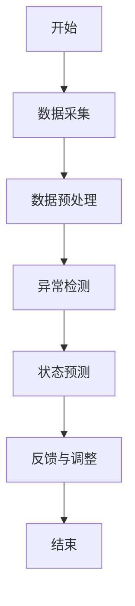

                 


# 《企业AI Agent的实时监控系统》

---

## 关键词：
- 企业AI Agent
- 实时监控系统
- 数据流分析
- 系统架构设计
- 异常检测算法
- 状态预测模型

---

## 摘要：
企业AI Agent的实时监控系统是一种用于监测和管理AI代理运行状态的技术解决方案。本文从系统概述、核心概念、算法原理、架构设计、项目实战等多维度进行深入分析，探讨如何构建高效可靠的实时监控系统。通过详细的技术解析和实际案例，帮助读者理解实时监控系统的核心原理及其在企业中的应用价值。

---

## 目录大纲

# 第一部分: 企业AI Agent实时监控系统概述

## 第1章: 企业AI Agent与实时监控系统概述

### 1.1 企业AI Agent的定义与核心概念

#### 1.1.1 什么是企业AI Agent
- AI Agent的基本定义
- 企业AI Agent的特征：自主性、反应性、主动性
- 企业AI Agent的应用场景：客服、供应链管理、智能推荐

#### 1.1.2 AI Agent的核心特征
- 自主性：无需外部干预
- 反应性：实时感知环境变化
- 主动性：主动执行任务
- 学习能力：通过数据优化性能

#### 1.1.3 企业AI Agent的分类与应用场景
- 分类：基于规则的AI Agent、基于模型的AI Agent、混合型AI Agent
- 应用场景：企业内部自动化、客户交互、数据处理

### 1.2 实时监控系统的基本概念

#### 1.2.1 实时监控系统的定义
- 实时监控系统的定义：实时采集、分析和反馈系统运行状态的技术手段

#### 1.2.2 实时监控系统的功能与作用
- 数据采集：实时获取系统运行数据
- 数据分析：识别异常和趋势
- 报警与反馈：及时通知相关人员并采取措施
- 可视化：提供直观的监控界面

#### 1.2.3 企业AI Agent实时监控的必要性
- 确保AI Agent的稳定运行
- 及时发现并解决问题
- 提高系统的可靠性和用户体验

### 1.3 企业AI Agent实时监控系统的边界与外延

#### 1.3.1 系统的边界定义
- 数据采集的边界：仅限于AI Agent的相关数据
- 监控范围的边界：不包括其他系统的运行状态
- 功能的边界：仅限于实时监控，不包括系统维护

#### 1.3.2 系统的外延范围
- 数据分析的外延：支持多种数据格式和来源
- 报警机制的外延：支持多种通知方式（邮件、短信、报警）
- 界面展示的外延：支持多维度的数据可视化

#### 1.3.3 系统与相关系统的区别与联系
- 区别：实时监控系统仅关注AI Agent的运行状态
- 联系：与企业其他系统（如日志系统、报警系统）进行数据交互

### 1.4 系统的核心要素组成

#### 1.4.1 数据采集模块
- 数据来源：AI Agent的运行日志、性能指标、用户反馈
- 数据类型：文本、数值、时间戳
- 数据采集方式：日志文件采集、API接口调用

#### 1.4.2 数据分析模块
- 数据清洗：去除无效数据
- 数据转换：将数据转换为可分析的形式
- 数据存储：将数据存储在数据库中，支持后续分析

#### 1.4.3 监控界面模块
- 数据可视化：使用图表展示系统运行状态
- 报警展示：实时显示报警信息
- 用户交互：允许用户进行查询和配置操作

#### 1.4.4 报警与反馈模块
- 报警规则：定义报警的触发条件
- 报警方式：支持多种通知方式（邮件、短信、报警）
- 反馈机制：向AI Agent发送反馈，调整其行为

---

## 第2章: 企业AI Agent实时监控系统的背景与需求

### 2.1 企业AI Agent的应用现状

#### 2.1.1 AI Agent在企业中的应用领域
- 企业内部自动化：流程自动化、任务分配
- 客户交互：智能客服、个性化推荐
- 数据处理：数据清洗、数据分析

#### 2.1.2 当前企业AI Agent应用中的问题
- 系统稳定性问题：AI Agent可能出现卡顿或崩溃
- 数据一致性问题：数据采集不全或不准确
- 技术瓶颈：算法性能不足，无法满足实时性要求

### 2.2 实时监控系统的需求分析

#### 2.2.1 为什么需要实时监控
- 确保AI Agent的稳定运行
- 及时发现并解决问题
- 提高系统的可靠性和用户体验

#### 2.2.2 监控系统的核心需求
- 实时性：数据采集和分析必须实时进行
- 准确性：监控数据必须准确无误
- 可扩展性：系统能够支持未来的扩展需求

#### 2.2.3 企业对实时监控系统的期望
- 高可用性：系统必须稳定运行，不能中断
- 易用性：用户界面友好，操作简单
- 高效性：能够快速响应并处理问题

### 2.3 问题背景与问题描述

#### 2.3.1 AI Agent运行中的潜在问题
- 系统崩溃：AI Agent因错误终止运行
- 性能下降：系统负载过高导致响应变慢
- 数据偏差：数据不准确导致决策错误

#### 2.3.2 实时监控系统需要解决的核心问题
- 实时监控AI Agent的运行状态
- 及时发现并处理异常情况
- 提供数据支持优化AI Agent性能

#### 2.3.3 系统的目标与边界
- 目标：实现AI Agent的实时监控和管理
- 边界：仅监控AI Agent的运行状态，不涉及其他系统

---

## 第3章: 企业AI Agent实时监控系统的概念结构

### 3.1 系统的核心概念与联系

#### 3.1.1 AI Agent与实时监控的关系
- AI Agent提供数据，实时监控系统进行分析和反馈
- 监控系统通过数据流与AI Agent进行交互

#### 3.1.2 数据流与监控流程的关联
- 数据流是监控流程的基础
- 监控流程通过数据流进行实时分析和反馈

#### 3.1.3 系统模块之间的依赖关系
- 数据采集模块依赖AI Agent的日志和接口
- 数据分析模块依赖数据清洗和转换
- 监控界面模块依赖数据可视化和用户交互

### 3.2 核心概念的ER实体关系图

```mermaid
erDiagram
    actor User {
        +id : int
        +username : string
        +role : string
    }
    actor System_Admin {
        +id : int
        +username : string
        +role : string
    }
    component AI-Agent {
        +id : int
        +name : string
        +status : string
    }
    component Real-Time_Monitor {
        +id : int
        +monitor_type : string
        +status : string
    }
    User --> Real-Time_Monitor : 监控
    System_Admin --> Real-Time_Monitor : 管理
    AI-Agent --> Real-Time_Monitor : 提供数据
```

---

## 第4章: 系统的算法原理

### 4.1 算法原理概述

#### 4.1.1 数据采集与预处理
- 数据采集：通过日志文件和API接口获取AI Agent的运行数据
- 数据清洗：去除无效数据，确保数据准确
- 数据转换：将数据转换为适合分析的形式

#### 4.1.2 数据分析与异常检测
- 数据分析：使用统计学方法和机器学习算法进行分析
- 异常检测：通过对比正常数据和异常数据，识别系统中的异常情况

#### 4.1.3 状态预测与反馈
- 状态预测：基于历史数据，预测系统未来的状态
- 反馈机制：根据预测结果，调整AI Agent的行为

### 4.2 算法实现细节

#### 4.2.1 异常检测算法
- 使用Isolation Forest算法进行异常检测
- 数据预处理：标准化和归一化
- 模型训练：使用训练数据训练模型
- 预测与评估：对实时数据进行预测，并评估模型的准确性

#### 4.2.2 状态预测模型
- 使用LSTM（长短期记忆网络）进行状态预测
- 数据预处理：将时间序列数据转化为适合模型输入的形式
- 模型训练：使用历史数据训练模型
- 预测与评估：对实时数据进行预测，并评估模型的准确性

### 4.3 算法流程图



---

## 第5章: 系统分析与架构设计

### 5.1 问题场景介绍

#### 5.1.1 企业AI Agent的运行环境
- 系统架构：分布式架构，支持高并发和高可用性
- 数据来源：AI Agent的日志、性能指标、用户反馈

#### 5.1.2 监控系统的功能需求
- 实时监控：实时采集和分析数据
- 报警通知：及时通知相关人员
- 数据可视化：提供直观的监控界面

### 5.2 项目介绍

#### 5.2.1 项目目标
- 实现企业AI Agent的实时监控
- 提供高效的报警和反馈机制
- 提供直观的数据可视化界面

#### 5.2.2 项目范围
- 监控AI Agent的运行状态
- 实时采集和分析数据
- 提供报警和反馈机制
- 提供数据可视化界面

### 5.3 系统功能设计

#### 5.3.1 领域模型
- 使用领域模型描述系统的功能模块
- 领域模型包括数据采集、数据分析、报警与反馈、数据可视化四个模块

#### 5.3.2 系统架构设计
- 使用分层架构：数据采集层、数据处理层、监控界面层
- 数据采集层：负责采集AI Agent的数据
- 数据处理层：负责数据清洗、转换和存储
- 监控界面层：负责数据可视化和用户交互

#### 5.3.3 系统接口设计
- 数据采集接口：通过API接口采集AI Agent的数据
- 数据处理接口：通过数据库接口进行数据存储和查询
- 监控界面接口：通过前端接口展示数据

#### 5.3.4 系统交互设计
- 用户通过监控界面查看系统运行状态
- 系统通过API接口采集AI Agent的数据
- 系统通过报警机制通知相关人员

### 5.4 系统交互流程图

```mermaid
sequenceDiagram
    User -> Real-Time_Monitor: 请求查看监控数据
    Real-Time_Monitor -> Data_Collection: 获取实时数据
    Data_Collection -> AI-Agent: 采集数据
    Data_Collection -> Real-Time_Monitor: 返回数据
    Real-Time_Monitor -> Data_Analysis: 分析数据
    Data_Analysis -> Real-Time_Monitor: 返回分析结果
    Real-Time_Monitor -> User: 显示监控结果
    when 发生异常时
        Real-Time_Monitor -> Alarm_System: 发送报警
        Alarm_System -> User: 收到报警通知
```

---

## 第6章: 项目实战

### 6.1 环境安装

#### 6.1.1 系统环境要求
- 操作系统：Linux/Windows/MacOS
- Python版本：3.6以上
- 依赖库：numpy、pandas、scikit-learn、flask、mysql-connector

#### 6.1.2 安装步骤
1. 安装Python
2. 安装依赖库：`pip install numpy pandas scikit-learn flask mysql-connector`
3. 安装完成

### 6.2 系统核心实现

#### 6.2.1 数据采集模块

##### 数据采集代码
```python
import logging
import time

def collect_data():
    # 从AI Agent采集数据
    data = {
        'timestamp': time.time(),
        'status': 'running',
        'performance': 85.0
    }
    return data

# 示例代码：采集数据并保存到数据库
def main():
    while True:
        data = collect_data()
        # 保存到数据库
        # 数据库连接代码省略
        logging.info(f'数据采集成功：{data}')
        time.sleep(1)

if __name__ == '__main__':
    main()
```

#### 6.2.2 数据分析模块

##### 数据分析代码
```python
import pandas as pd
from sklearn.ensemble import IsolationForest

def preprocess_data(data):
    # 数据预处理
    df = pd.DataFrame(data)
    # 数据标准化
    df = (df - df.mean()) / df.std()
    return df

def detect_anomalies(data):
    # 异常检测
    model = IsolationForest(n_estimators=100, random_state=42)
    model.fit(data)
    # 预测异常
    y_pred = model.predict(data)
    anomalies = data[y_pred == -1]
    return anomalies

# 示例代码：数据预处理和异常检测
def main():
    data = {
        'timestamp': [1, 2, 3, 4, 5],
        'status': ['running', 'running', 'stopped', 'running', 'running'],
        'performance': [85, 85, 85, 85, 85]
    }
    df = preprocess_data(data)
    anomalies = detect_anomalies(df)
    print(f'检测到异常数据：{anomalies}')

if __name__ == '__main__':
    main()
```

#### 6.2.3 数据可视化模块

##### 数据可视化代码
```python
import flask
from flask import Flask, render_template

app = Flask(__name__)

@app.route('/')
def index():
    return render_template('index.html')

if __name__ == '__main__':
    app.run(debug=True)
```

##### 监控界面模板（index.html）
```html
<!DOCTYPE html>
<html>
<head>
    <title>AI Agent实时监控</title>
</head>
<body>
    <h1>AI Agent实时监控</h1>
    <div id="chart"></div>
    <script src="https://cdn.jsdelivr.net/npm/chart.js"></script>
    <script>
        // 示例代码：绘制图表
        new Chart(document.getElementById('chart').getContext('2d'), {
            type: 'line',
            data: {
                labels: [1, 2, 3, 4, 5],
                datasets: [{
                    label: '性能',
                    data: [85, 85, 85, 85, 85]
                }]
            }
        });
    </script>
</body>
</html>
```

### 6.3 实际案例分析

#### 6.3.1 案例背景
- 某企业AI Agent出现性能下降问题
- 监控系统采集并分析数据，发现异常情况
- 通过报警机制通知相关人员进行处理

#### 6.3.2 案例分析
- 数据采集：AI Agent的运行日志和性能指标
- 数据分析：使用Isolation Forest算法检测异常
- 数据可视化：通过图表展示系统运行状态
- 报警与反馈：当异常发生时，系统发送报警通知

### 6.4 项目总结

#### 6.4.1 项目成果
- 成功实现企业AI Agent的实时监控
- 提供高效的报警和反馈机制
- 提供直观的数据可视化界面

#### 6.4.2 经验总结
- 数据采集是关键，必须确保数据的准确性和完整性
- 异常检测算法的选择对系统的性能有重要影响
- 系统的可扩展性和易用性是用户关注的重点

---

## 第7章: 最佳实践、小结、注意事项、拓展阅读

### 7.1 最佳实践

#### 7.1.1 数据采集
- 确保数据的准确性和完整性
- 选择合适的数据采集方式
- 定期检查数据采集的稳定性

#### 7.1.2 数据分析
- 使用多种算法进行对比和优化
- 定期更新模型，避免过时
- 确保数据分析的实时性和高效性

#### 7.1.3 系统架构
- 采用分层架构，便于系统的扩展和维护
- 使用高可用性的数据库和服务器
- 确保系统的安全性和稳定性

### 7.2 小结

通过本文的详细分析和实际案例，我们了解了企业AI Agent实时监控系统的核心概念、算法原理、系统架构以及项目实现的全过程。实时监控系统在企业中的应用越来越重要，能够帮助企业更好地管理和优化AI Agent的运行状态，提高系统的可靠性和用户体验。

### 7.3 注意事项

- 数据安全：确保数据的安全性，防止数据泄露
- 系统稳定性：确保系统的高可用性，避免因系统故障导致监控中断
- 用户权限：合理分配用户权限，确保系统的安全性
- 系统性能：定期优化系统性能，确保系统的高效运行

### 7.4 拓展阅读

- 《机器学习实战》
- 《深入浅出分布式系统》
- 《实时数据分析与可视化》
- 《Python网络编程》

---

## 作者：AI天才研究院/AI Genius Institute & 禅与计算机程序设计艺术 /Zen And The Art of Computer Programming

