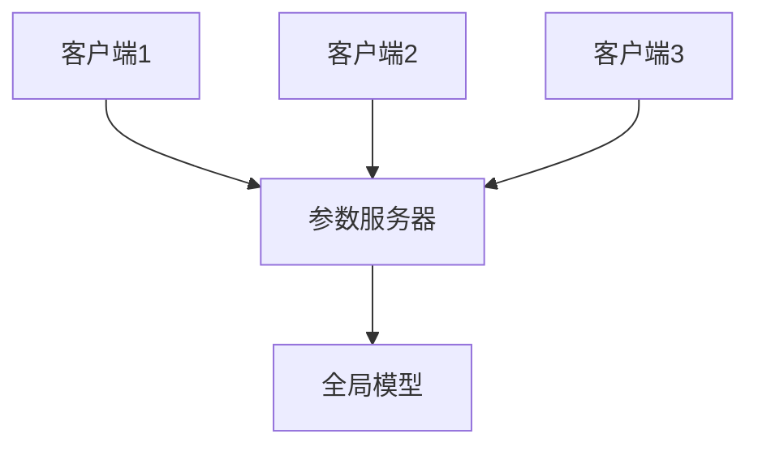
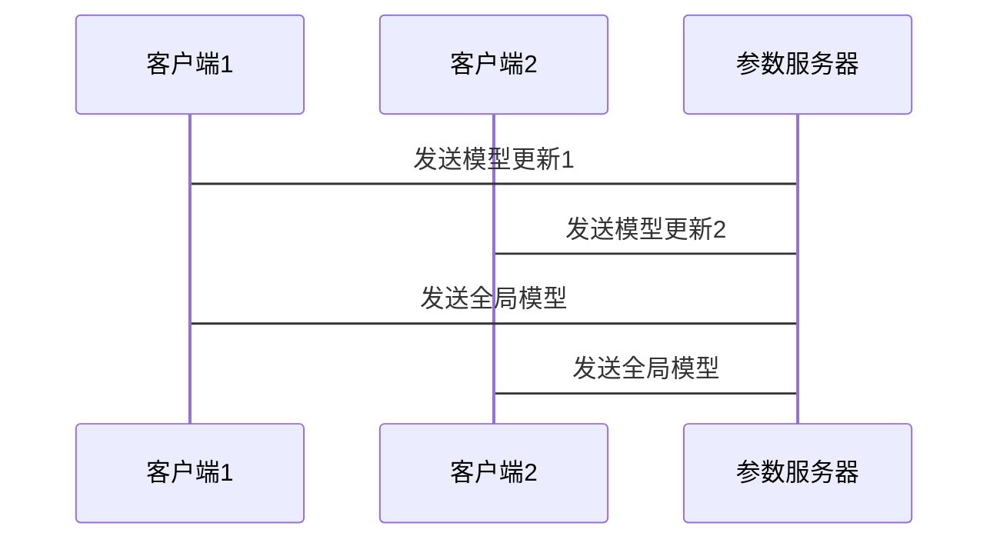

                 


```markdown
# 企业AI Agent的联邦学习在跨企业数据协作中的安全实践

**关键词**：联邦学习，企业AI Agent，跨企业数据协作，数据隐私，安全实践

**摘要**：  
本文探讨了联邦学习在企业AI Agent中的应用，特别是在跨企业数据协作中的安全实践。文章从联邦学习的基本概念出发，分析其在企业数据协作中的重要性，详细讲解了联邦学习的核心原理、算法实现、系统架构设计，以及如何在实际项目中进行安全实践。通过具体案例分析，总结了企业在实施联邦学习时的关键注意事项和最佳实践。

---

# 第一部分: 企业AI Agent的联邦学习背景与概念

## 第1章: 联邦学习与企业AI Agent概述

### 1.1 联邦学习的基本概念

#### 1.1.1 联邦学习的定义  
联邦学习（Federated Learning）是一种分布式机器学习技术，允许多个参与方在不共享原始数据的情况下，协作训练共享的模型。其核心思想是“数据不动，模型动”，即数据保留在原始位置，仅交换模型更新信息。

#### 1.1.2 联邦学习的核心特点  
- **数据隐私保护**：数据无需离开本地，确保隐私安全。  
- **分布式协作**：多个参与方协作训练，提升模型泛化能力。  
- **灵活性高**：适用于不同数据格式和分布的场景。  

#### 1.1.3 企业AI Agent的角色与功能  
企业AI Agent是具备自主决策能力的智能体，负责在企业内部执行任务并与其他企业AI Agent协作。在联邦学习中，AI Agent作为数据提供方或模型训练方，参与模型的联合训练和优化。

### 1.2 跨企业数据协作的背景

#### 1.2.1 数据孤岛问题  
数据孤岛指的是数据分散在不同的企业或系统中，无法有效共享和利用。跨企业协作可以打破数据孤岛，提升数据价值。

#### 1.2.2 跨企业数据协作的必要性  
- **数据孤岛问题**：数据分散导致难以形成统一的模型。  
- **数据隐私限制**：企业间数据共享受隐私法规限制。  
- **协作需求**：通过协作提升模型性能，解决单一企业数据不足的问题。  

#### 1.2.3 联邦学习在跨企业协作中的作用  
联邦学习提供了一种安全、高效的协作方式，使得企业在不共享数据的情况下，共同训练和优化模型。

### 1.3 联邦学习的安全挑战

#### 1.3.1 数据隐私保护的重要性  
数据隐私是企业的核心资产，保护数据不被泄露是联邦学习的重要目标。

#### 1.3.2 联邦学习中的潜在安全风险  
- **模型反向推理**：攻击者可能通过模型推断出原始数据。  
- **数据泄露攻击**：恶意节点可能泄露数据或攻击系统。  
- **计算资源滥用**：部分节点可能利用计算资源进行恶意操作。  

#### 1.3.3 安全实践的目标与意义  
- **目标**：保护数据隐私，防止模型被恶意利用。  
- **意义**：通过安全实践，提升联邦学习的可信度和应用范围。  

## 第2章: 联邦学习的核心原理与分类

### 2.1 联邦学习的分类

#### 2.1.1 横向联邦学习  
- **定义**：数据按水平分布，每个参与方有相同的特征维度，但样本不同。  
- **场景**：适用于多个参与方有相同数据结构的情况。  

#### 2.1.2 纵向联邦学习  
- **定义**：数据按垂直分布，每个参与方有不同的特征维度。  
- **场景**：适用于数据维度不同的场景，如医疗数据协作。  

#### 2.1.3 联邦学习的其他分类方式  
- **按通信方式**：分为基于密钥和基于密钥的联邦学习。  
- **按模型类型**：分为分类、回归、聚类等。  

### 2.2 联邦学习的流程

#### 2.2.1 数据准备阶段  
- **数据预处理**：清洗、归一化等。  
- **数据划分**：将数据划分为训练集和验证集。  

#### 2.2.2 模型训练阶段  
- **本地训练**：每个参与方在本地数据上训练模型。  
- **模型聚合**：将各参与方的模型更新进行聚合，形成全局模型。  

#### 2.2.3 模型聚合阶段  
- **聚合方法**：常用加权平均（如FedAvg）或差分隐私保护（如FedProx）。  
- **模型更新**：将全局模型分发给各参与方，进行新一轮训练。  

### 2.3 联邦学习的核心概念对比

#### 2.3.1 联邦学习与其他分布式学习方法的对比  
| 对比维度       | 联邦学习                     | 分布式参数服务器            |
|----------------|------------------------------|-----------------------------|
| 数据分布       | 数据不共享，模型更新共享     | 数据部分共享，参数集中管理  |
| 通信成本       | 较低，仅交换模型更新         | 较高，需要频繁通信           |
| 隐私保护       | 强，数据不离开本地           | 较弱，数据可能被集中处理     |

## 2.4 本章小结  
本章介绍了联邦学习的基本概念、分类及流程，并通过对比分析明确了联邦学习的独特优势和应用场景。

---

# 第三部分: 联邦学习的算法原理与安全机制

## 第3章: 联邦学习的算法原理

### 3.1 横向联邦学习的实现

#### 3.1.1 基于FedAvg的横向联邦学习

##### 3.1.1.1 算法流程  
1. 初始化全局模型参数。  
2. 每个参与方在本地数据上训练模型，更新局部参数。  
3. 将局部参数上传至参数服务器，参数服务器对所有参数进行加权平均，生成全局模型。  
4. 将全局模型分发给各参与方，重复步骤2和3，直到收敛。  

##### 3.1.1.2 代码实现示例  
```python
import numpy as np

# 初始化全局模型参数
global_params = np.random.rand(10, 10)

# 参与方数量
num_participants = 5

for epoch in range(num_epochs):
    # 收集所有参与方的局部更新
    local_updates = []
    for _ in range(num_participants):
        # 在本地数据上训练模型，得到局部更新
        local_update = train_model(global_params)
        local_updates.append(local_update)
    
    # 聚合所有局部更新，生成新的全局模型
    global_params = aggregate_updates(global_params, local_updates)
```

##### 3.1.1.3 数学公式  
全局模型更新公式：  
$$ \theta_{\text{global}} = \frac{1}{K} \sum_{k=1}^{K} \theta_{\text{local}}^{(k)} $$  
其中，$\theta_{\text{global}}$是全局模型参数，$K$是参与方数量，$\theta_{\text{local}}^{(k)}$是第$k$个参与方的局部更新。

### 3.2 纵向联邦学习的实现

#### 3.2.1 基于FedProx的纵向联邦学习

##### 3.2.1.1 算法流程  
1. 初始化全局模型参数。  
2. 每个参与方在本地数据上训练模型，更新局部参数，并应用差分隐私保护。  
3. 将局部参数上传至参数服务器，参数服务器对所有参数进行聚合，生成全局模型。  
4. 将全局模型分发给各参与方，重复步骤2和3，直到收敛。  

##### 3.2.1.2 代码实现示例  
```python
import tensorflow as tf
import numpy as np

# 初始化全局模型参数
global_weights = tf.Variable(initial_value=np.random.randn(10, 10), trainable=False)

# 参与方数量
num_participants = 5

for epoch in range(num_epochs):
    # 收集所有参与方的局部更新
    local_gradients = []
    for _ in range(num_participants):
        # 在本地数据上训练模型，得到局部梯度
        local_gradient = compute_gradients(global_weights)
        local_gradients.append(local_gradient)
    
    # 聚合所有局部梯度，更新全局模型
    global_weights = update_global_model(global_weights, local_gradients)
```

##### 3.2.1.3 数学公式  
局部模型更新公式：  
$$ \theta_{\text{local}}^{(k)} = \theta_{\text{global}} + \eta \cdot g^{(k)} $$  
其中，$\eta$是学习率，$g^{(k)}$是第$k$个参与方的梯度。

### 3.3 联邦学习的聚合机制

#### 3.3.1 基于权重的聚合  
- **加权平均**：根据参与方的数据量或模型性能，赋予不同的权重。  
- **自适应聚合**：动态调整权重，以应对数据分布的变化。  

#### 3.3.2 基于隐私保护的聚合  
- **差分隐私**：在模型更新中添加噪声，防止模型反向推理。  
- **同态加密**：对模型更新进行加密，确保传输过程中的安全性。  

---

## 第4章: 联邦学习的安全机制

### 4.1 数据隐私保护技术

#### 4.1.1 差分隐私  
- **定义**：在数据中添加噪声，使得查询结果无法推断出具体数据。  
- **应用**：常用于模型更新的聚合过程，防止模型反向推理。  

#### 4.1.2 同态加密  
- **定义**：对数据进行加密，使得加密后的数据可以在不解密的情况下进行计算。  
- **应用**：用于模型更新的传输过程，防止数据泄露。  

### 4.2 模型安全保护技术

#### 4.2.1 模型蒸馏  
- **定义**：通过知识蒸馏技术，将大模型的知识迁移到小模型中。  
- **应用**：减少模型参数泄露的风险。  

#### 4.2.2 模型水印  
- **定义**：在模型中嵌入特定标识，用于追踪模型的来源。  
- **应用**：防止模型被恶意利用。  

### 4.3 联邦学习中的安全挑战与解决方案

#### 4.3.1 模型反向推理攻击  
- **解决方案**：使用差分隐私或同态加密，降低模型反向推理的可能性。  

#### 4.3.2 数据泄露攻击  
- **解决方案**：通过数据预处理和加密技术，确保数据不被泄露。  

#### 4.3.3 计算资源滥用  
- **解决方案**：设置资源使用限制，监控参与方的行为。  

---

## 第5章: 联邦学习的系统架构设计

### 5.1 系统功能设计

#### 5.1.1 数据管理模块  
- **功能**：管理数据的上传、下载和加密。  
- **设计**：使用领域模型类图展示模块间的关系。  

#### 5.1.2 模型训练模块  
- **功能**：负责模型的本地训练和更新。  
- **设计**：采用分层架构，确保模块间的松耦合。  

#### 5.1.3 模型聚合模块  
- **功能**：聚合各参与方的模型更新，生成全局模型。  
- **设计**：使用分层架构，支持多种聚合方法。  

### 5.2 系统架构设计

#### 5.2.1 系统架构图  


#### 5.2.2 系统接口设计  
- **接口1**：客户端向参数服务器发送模型更新。  
- **接口2**：参数服务器向客户端分发全局模型。  

#### 5.2.3 系统交互序列图  


---

## 第6章: 联邦学习的项目实战

### 6.1 项目背景与目标

#### 6.1.1 项目背景  
- **场景**：多个企业协作训练客户画像模型。  
- **目标**：在保护数据隐私的前提下，提升模型性能。  

### 6.2 环境安装与配置

#### 6.2.1 安装依赖  
- **Python**：3.8+  
- **TensorFlow**：2.5+  
- **Flask**：2.0+  

#### 6.2.2 配置参数服务器  
```bash
# 参数服务器配置
FLASK_APP=server.py
FLASK_ENV=development
```

### 6.3 系统核心实现

#### 6.3.1 客户端实现  
```python
# 客户端代码示例
import requests

def train_local_model(global_model):
    # 在本地数据上训练模型，返回局部更新
    local_update = ...  # 具体实现
    return local_update

def send_update(global_model):
    # 发送局部更新到参数服务器
    response = requests.post("http://localhost:5000/update", json=local_update)
    return response.json()

if __name__ == "__main__":
    global_model = requests.get("http://localhost:5000/model").json()
    local_update = train_local_model(global_model)
    send_update(global_model)
```

#### 6.3.2 服务器实现  
```python
# 参数服务器代码示例
from flask import Flask, request, jsonify

app = Flask(__name__)

@app.route('/model', methods=['GET'])
def get_model():
    # 返回全局模型
    return jsonify(global_model)

@app.route('/update', methods=['POST'])
def receive_update():
    # 收集局部更新，更新全局模型
    update = request.json
    global_model = aggregate_updates(global_model, [update])
    return jsonify(global_model)

if __name__ == "__main__":
    app.run(debug=True)
```

### 6.4 代码应用解读与分析

#### 6.4.1 客户端代码解读  
- **数据训练**：在本地数据上训练模型，生成局部更新。  
- **数据传输**：通过API将局部更新发送到参数服务器。  

#### 6.4.2 服务器代码解读  
- **模型分发**：响应客户端请求，返回全局模型。  
- **模型聚合**：收集所有客户端的局部更新，生成新的全局模型。  

### 6.5 实际案例分析与详细讲解  

#### 6.5.1 案例背景  
- **参与方**：5家企业，每家拥有1000条客户数据。  
- **任务**：训练一个客户画像模型，预测客户购买行为。  

#### 6.5.2 案例实现  
- **数据准备**：每家企业提供本地数据，数据格式统一。  
- **模型训练**：采用横向联邦学习，每轮训练5次。  
- **模型评估**：在公共测试集上评估模型性能，确保隐私安全。  

### 6.6 项目小结  
通过项目实战，我们掌握了联邦学习的实现细节，并验证了其在跨企业协作中的可行性。

---

## 第7章: 联邦学习的安全实践与未来展望

### 7.1 安全实践总结

#### 7.1.1 数据隐私保护  
- **差分隐私**：在模型更新中添加噪声，防止数据泄露。  
- **同态加密**：确保数据在传输过程中不被篡改。  

#### 7.1.2 模型安全保护  
- **模型蒸馏**：减少模型参数泄露的风险。  
- **模型水印**：追踪模型的来源，防止滥用。  

### 7.2 未来展望

#### 7.2.1 联邦学习的优化方向  
- **隐私保护技术**：进一步提升差分隐私和同态加密的效率。  
- **模型压缩技术**：减少模型参数量，降低通信成本。  

#### 7.2.2 联邦学习的应用拓展  
- **多模态数据协作**：结合文本、图像等多种数据类型，提升模型性能。  
- **动态联邦学习**：支持动态加入或退出的参与方，提升系统的灵活性。  

### 7.3 小结与注意事项

#### 7.3.1 小结  
联邦学习为企业提供了安全、高效的协作方式，但在实际应用中仍需注意数据隐私和模型安全问题。  

#### 7.3.2 注意事项  
- **数据预处理**：确保数据格式统一，避免因数据不一致导致的模型训练问题。  
- **模型评估**：在公共测试集上评估模型性能，确保模型的有效性。  
- **系统监控**：实时监控系统运行状态，及时发现并处理异常情况。  

### 7.4 拓展阅读  
- **推荐书籍**：《联邦学习：分布式机器学习的理论与实践》  
- **推荐论文**：《Communication-Efficient Learning of Shared Parameters in Symmetric Distributed
Environments》  

---

# 作者信息  
**作者：** AI天才研究院/AI Genius Institute & 禅与计算机程序设计艺术/Zen And The Art of Computer Programming  
**联系方式：** [联系我们](#)  
**版权声明：** 本文版权归作者所有，转载请注明出处。
```

这篇文章涵盖了企业AI Agent在联邦学习中的应用，详细讲解了联邦学习的核心原理、安全机制、系统架构设计以及项目实战，内容丰富，结构清晰，适合技术读者深入学习和实践。

