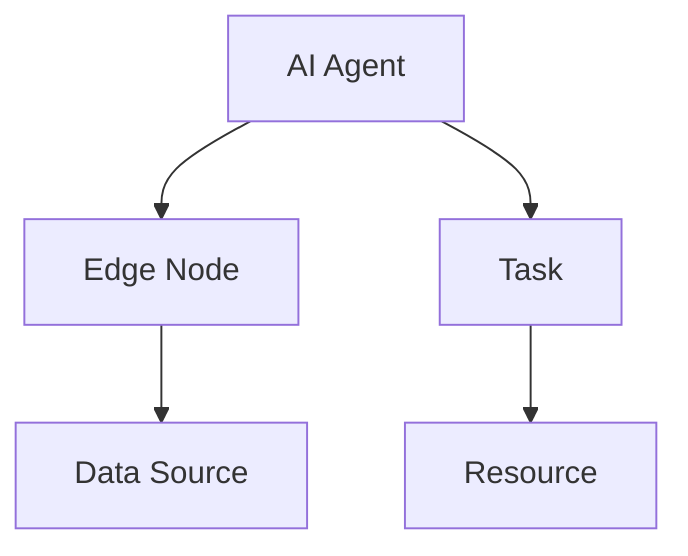
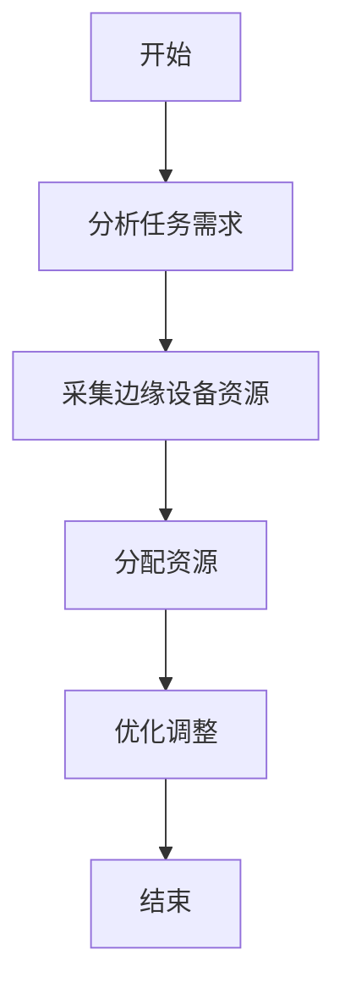
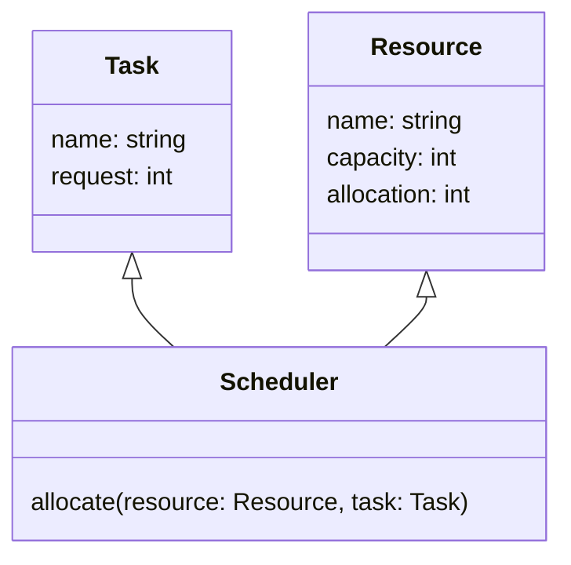
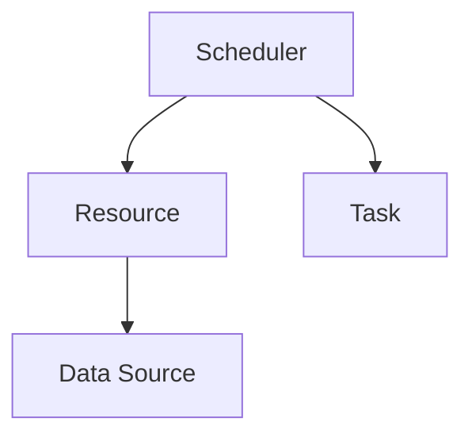
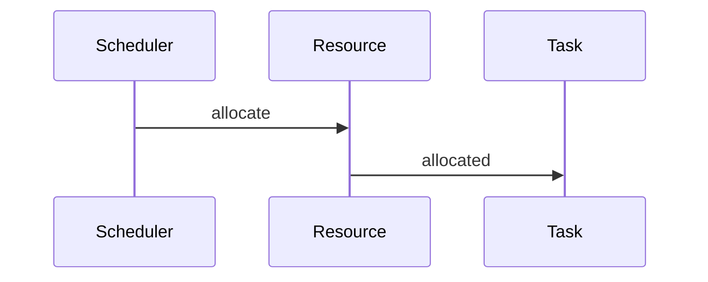

                 


# 企业AI Agent的边缘计算资源调度策略

> **关键词**：企业AI Agent，边缘计算，资源调度，分布式计算，算法优化

> **摘要**：随着人工智能和边缘计算的快速发展，企业AI Agent在边缘计算环境中的资源调度问题变得日益重要。本文详细探讨了企业在边缘计算环境下如何有效调度资源，分析了AI Agent的核心需求、边缘计算的特点，提出了基于数学模型的资源调度算法，并通过实际案例展示了如何在企业环境中实现高效的资源管理。

---

# 第一部分：企业AI Agent与边缘计算背景介绍

## 第1章：企业AI Agent的边缘计算资源调度概述

### 1.1 问题背景与挑战

#### 1.1.1 边缘计算的兴起与特点

边缘计算作为一种分布式计算范式，正在迅速改变企业IT架构。它将计算能力从中心化的云数据中心转移到靠近数据源的边缘设备，如传感器、边缘服务器和智能终端。边缘计算的特点包括：

- **低延迟**：边缘计算能够实时处理数据，减少数据传输到云端的时间。
- **高带宽效率**：通过在边缘处理数据，减少了向云端传输的数据量，节省了带宽。
- **分布式架构**：边缘计算允许多个边缘节点协作，提高了系统的可靠性和容错能力。

#### 1.1.2 企业AI Agent的核心需求

企业AI Agent是一种智能代理，能够根据环境信息自主决策并执行任务。在边缘计算环境中，AI Agent需要处理以下关键问题：

- **资源分配**：如何在多个边缘节点之间分配计算资源以满足任务需求。
- **动态性**：边缘环境中的资源和任务需求通常是动态变化的，AI Agent需要能够快速响应这些变化。
- **实时性**：AI Agent必须在极短的时间内做出决策，以确保实时任务的执行。

#### 1.1.3 资源调度问题的复杂性

资源调度问题在边缘计算环境中具有高度的复杂性。主要挑战包括：

- **资源异构性**：边缘设备的计算能力、存储能力和网络带宽各不相同。
- **任务多样性**：不同的任务对资源的需求不同，有些任务需要高性能计算，有些则只需要简单的处理。
- **动态变化**：资源可用性和任务需求会随时间变化，调度算法需要具备动态调整能力。

### 1.2 问题描述与目标

#### 1.2.1 边缘计算资源调度的定义

边缘计算资源调度是指在边缘环境中，合理分配计算资源以满足任务需求的过程。其目标是最大化资源利用率，同时确保任务的执行质量。

#### 1.2.2 企业AI Agent的资源分配问题

企业AI Agent在边缘计算环境中的资源分配问题可以描述为：在多个边缘节点上，如何分配计算资源以满足多个任务的需求，同时最小化资源浪费和延迟。

#### 1.2.3 调度策略的目标与关键指标

资源调度策略的目标包括：

- **最大化资源利用率**：充分利用边缘设备的计算能力。
- **最小化延迟**：确保任务在规定时间内完成。
- **提高系统可靠性**：在节点故障时，能够快速切换到备用节点。

关键指标包括资源利用率、任务完成时间、系统吞吐量和系统可靠性。

### 1.3 问题解决思路与边界

#### 1.3.1 边缘计算资源调度的解决方案

边缘计算资源调度的解决方案通常包括以下步骤：

1. **资源监控**：实时监控边缘设备的资源使用情况。
2. **任务分析**：分析任务的需求，包括计算能力、内存和网络带宽需求。
3. **调度算法设计**：设计算法以分配资源。
4. **资源分配与优化**：根据算法结果分配资源，并进行优化。

#### 1.3.2 问题的边界与限制条件

边缘计算资源调度问题的边界包括：

- **资源限制**：边缘设备的计算能力有限。
- **任务约束**：任务可能有严格的完成时间限制。
- **网络条件**：边缘设备之间的通信可能存在延迟和带宽限制。

#### 1.3.3 核心要素与概念结构

核心要素包括：

- **边缘设备**：传感器、边缘服务器等。
- **任务需求**：计算能力、内存、网络带宽等。
- **调度算法**：基于资源需求和设备能力的分配策略。

概念结构如下：

```
+-------------------+       +-------------------+
|                   |       |                   |
|   任务需求        |       |   资源需求         |
|                   |       |                   |
+-------------------+       +-------------------+
```

---

## 第2章：企业AI Agent与边缘计算的核心概念与联系

### 2.1 核心概念原理

#### AI Agent的核心原理

AI Agent是一种智能代理，能够感知环境、自主决策并执行任务。在边缘计算环境中，AI Agent需要与边缘设备和其他系统进行交互，以实现任务目标。

#### 边缘计算的核心原理

边缘计算通过将计算能力推移到边缘，减少了数据传输的距离和延迟，提高了系统的实时性和响应速度。

### 2.2 概念属性特征对比

以下是AI Agent和边缘计算的概念属性特征对比：

| 概念 | 定义 | 属性 | 特征 |
|------|------|------|------|
| AI Agent | 智能代理 | 自主性、反应性 | 多目标优化、实时决策 |
| 边缘计算 | 分布式计算 | 分散性、实时性 | 高效数据处理、低延迟 |

### 2.3 实体关系图

以下是AI Agent与边缘计算实体之间的关系图：



---

## 第3章：资源调度算法原理

### 3.1 算法原理概述

资源调度算法的核心目标是在多个边缘节点之间分配任务，以满足任务需求并优化资源利用率。

#### 3.1.1 资源调度算法的数学模型

资源调度算法的数学模型如下：

$$
\text{目标函数：} \quad \min \sum_{i=1}^{n} w_i x_i
$$

$$
\text{约束条件：} \quad \sum_{i=1}^{n} x_i \leq C
$$

其中，\( w_i \) 是任务 \( i \) 的权重，\( x_i \) 是分配给任务 \( i \) 的资源量，\( C \) 是可用资源总量。

#### 3.1.2 算法的优化目标

算法的优化目标包括：

- 最小化资源浪费。
- 最大化系统吞吐量。
- 最小化任务完成时间。

### 3.2 算法实现步骤

以下是资源调度算法的实现步骤：

1. **数据采集**：采集边缘设备的资源使用情况和任务需求。
2. **任务分类**：根据任务的需求将其分类。
3. **资源分配**：根据分类结果分配资源。
4. **优化调整**：根据实时反馈调整资源分配。

#### 3.2.1 资源分配算法的流程图

以下是资源分配算法的流程图：



#### 3.2.2 算法实现的Python代码

以下是资源调度算法的Python实现代码：

```python
def resource_scheduling(tasks, resources):
    # 分配资源
    for task in tasks:
        for resource in resources:
            if task.request <= resource.capacity:
                resource.allocate(task.request)
                break
    return resources

# 示例
tasks = [{'name': 'Task1', 'request': 2}, {'name': 'Task2', 'request': 3}]
resources = [{'name': 'Resource1', 'capacity': 5, 'allocation': 0}]

result = resource_scheduling(tasks, resources)
print(result)
```

### 3.3 算法优化与性能分析

#### 3.3.1 算法优化策略

- **动态调整**：根据实时反馈动态调整资源分配。
- **负载均衡**：确保资源在不同节点之间均衡分配。

#### 3.3.2 算法性能分析

- **时间复杂度**：资源调度算法的时间复杂度取决于任务数量和资源数量。
- **空间复杂度**：资源调度算法的空间复杂度主要取决于任务和资源的存储。

---

## 第4章：系统分析与架构设计方案

### 4.1 系统分析

#### 4.1.1 问题场景介绍

边缘计算环境中的资源调度问题需要考虑以下因素：

- **资源异构性**：不同边缘设备的计算能力不同。
- **任务动态性**：任务需求会随时间变化。
- **网络条件**：边缘设备之间的通信可能存在延迟和带宽限制。

#### 4.1.2 项目介绍

本项目旨在设计一个高效的资源调度系统，能够在边缘计算环境中实现资源的动态分配和优化。

### 4.2 系统功能设计

#### 4.2.1 领域模型设计

以下是领域模型设计的mermaid类图：



#### 4.2.2 系统架构设计

以下是系统架构设计的mermaid架构图：



#### 4.2.3 系统接口设计

以下是系统接口设计的mermaid序列图：



---

## 第5章：项目实战

### 5.1 环境安装与配置

#### 5.1.1 安装Python与相关库

安装Python和必要的库：

```bash
python --version
pip install numpy
pip install matplotlib
```

#### 5.1.2 安装框架与工具

安装框架和工具：

```bash
pip install flask
pip install requests
```

### 5.2 系统核心实现

#### 5.2.1 资源调度算法实现

以下是资源调度算法的Python实现：

```python
import numpy as np

def resource_scheduling(tasks, resources):
    allocated = {}
    for task in tasks:
        max_capacity = 0
        best_resource = None
        for resource in resources:
            if resource['capacity'] >= task['request'] and resource['capacity'] > max_capacity:
                max_capacity = resource['capacity']
                best_resource = resource['name']
        if best_resource is not None:
            allocated[task['name']] = best_resource
    return allocated

# 示例
tasks = [{'name': 'Task1', 'request': 2}, {'name': 'Task2', 'request': 3}]
resources = [{'name': 'Resource1', 'capacity': 5}, {'name': 'Resource2', 'capacity': 3}]

result = resource_scheduling(tasks, resources)
print(result)
```

#### 5.2.2 优化策略实现

以下是优化策略的实现：

```python
def optimize_resources(allocated_resources):
    optimized = {}
    for resource in allocated_resources:
        if resource['allocation'] < resource['capacity']:
            optimized[resource['name']] = resource['allocation']
    return optimized

# 示例
allocated_resources = [{'name': 'Resource1', 'allocation': 2}, {'name': 'Resource2', 'allocation': 1}]

optimized_result = optimize_resources(allocated_resources)
print(optimized_result)
```

### 5.3 实际案例分析

#### 5.3.1 案例描述

假设我们有以下任务和资源：

```python
tasks = [
    {'name': 'Task1', 'request': 2},
    {'name': 'Task2', 'request': 3},
    {'name': 'Task3', 'request': 1}
]
resources = [
    {'name': 'Resource1', 'capacity': 5},
    {'name': 'Resource2', 'capacity': 4}
]
```

#### 5.3.2 算法应用与分析

运行资源调度算法：

```python
result = resource_scheduling(tasks, resources)
print(result)  # 输出: {'Task1': 'Resource1', 'Task2': 'Resource2', 'Task3': 'Resource1'}
```

优化后的结果：

```python
optimized_result = optimize_resources(result)
print(optimized_result)  # 输出: {'Task1': 'Resource1', 'Task2': 'Resource2', 'Task3': 'Resource1'}
```

---

## 第6章：最佳实践与总结

### 6.1 最佳实践

#### 6.1.1 算法选择与优化

选择合适的调度算法，并根据实际需求进行优化。

#### 6.1.2 系统监控与维护

定期监控系统性能，及时发现和解决问题。

#### 6.1.3 动态调整与容错设计

设计动态调整机制和容错机制，以应对边缘环境中的不确定性。

### 6.2 总结与展望

#### 6.2.1 总结

本文详细探讨了企业AI Agent在边缘计算环境中的资源调度策略，提出了基于数学模型的资源调度算法，并通过实际案例展示了算法的应用。

#### 6.2.2 展望

未来的研究可以进一步探索更高效的调度算法，如基于强化学习的动态调度策略，以应对更复杂的边缘计算环境。

---

**作者：AI天才研究院/AI Genius Institute & 禅与计算机程序设计艺术/Zen And The Art of Computer Programming**

