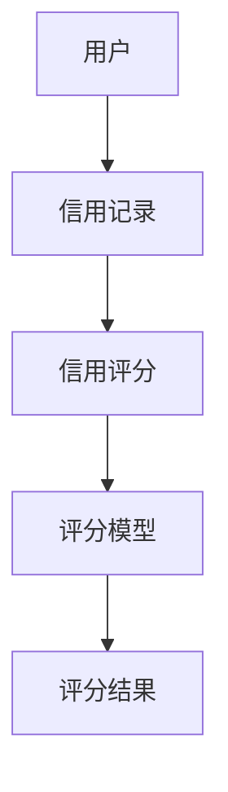
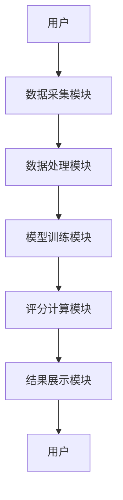

                 


# 智能信用评分系统

> 关键词：智能信用评分系统，人工智能，信用评分，大数据，机器学习，算法实现，系统架构设计

> 摘要：智能信用评分系统是基于人工智能和大数据技术的创新应用，通过先进的算法和系统架构设计，实现对信用评分的智能化、精准化和高效化。本文将从背景、核心概念、算法原理、系统架构设计、项目实战等多个维度，全面剖析智能信用评分系统的构建与实现。

---

## 第一部分: 智能信用评分系统概述

### 第1章: 智能信用评分系统的背景与意义

#### 1.1 信用评分的定义与作用
- **1.1.1 信用评分的基本概念**
  - 信用评分是对个人或企业的信用状况进行量化评估的指标，用于衡量其偿还债务的能力和意愿。
  - 信用评分在金融行业具有重要的决策作用，例如银行贷款审批、信用卡额度确定等。

- **1.1.2 信用评分在金融领域的应用**
  - 信用评分是金融机构评估客户信用风险的核心工具。
  - 传统信用评分方法依赖于历史数据和统计模型，存在局限性。

- **1.1.3 智能信用评分系统的优势**
  - 智能信用评分系统通过引入人工智能技术，能够处理海量数据，发现传统方法难以捕捉的复杂模式。
  - 提高信用评分的准确性和实时性，降低金融机构的信贷风险。

#### 1.2 传统信用评分的局限性
- **1.2.1 传统信用评分方法的不足**
  - 传统评分模型通常基于线性回归或简单的统计分析，难以捕捉非线性关系。
  - 数据维度有限，无法充分利用大数据的优势。

- **1.2.2 数据量与复杂性带来的挑战**
  - 传统方法在处理高维数据和复杂关系时表现不佳。
  - 缺乏对非结构化数据（如文本、图像）的处理能力。

- **1.2.3 传统模型的可解释性问题**
  - 一些复杂的模型（如神经网络）虽然性能优秀，但缺乏可解释性，影响实际应用。

#### 1.3 智能信用评分的兴起
- **1.3.1 人工智能在信用评分中的应用**
  - 基于机器学习的算法（如逻辑回归、随机森林、梯度提升树等）能够处理海量数据，发现复杂的信用特征。
  - 自然语言处理和深度学习技术的应用，使得非结构化数据也能为信用评分提供支持。

- **1.3.2 大数据技术对信用评分的影响**
  - 大数据技术为信用评分系统提供了丰富的数据来源，包括交易数据、社交数据、行为数据等。
  - 数据的实时性显著提高，信用评分可以动态更新，及时反映客户的信用状况。

- **1.3.3 智能信用评分系统的未来发展趋势**
  - 结合区块链技术，实现信用评分的去中心化和安全性。
  - 利用边缘计算技术，提升信用评分的实时性和响应速度。

---

## 第2章: 智能信用评分系统的核心概念与技术基础

### 2.1 智能信用评分系统的定义与特点
- **2.1.1 系统的核心定义**
  - 智能信用评分系统是一种基于人工智能和大数据技术，利用先进的算法对信用主体的信用状况进行量化评估的系统。

- **2.1.2 系统的主要特点**
  - **数据驱动**：系统依赖于海量数据，包括结构化数据和非结构化数据。
  - **实时性**：能够实时更新信用评分，反映最新的信用状况。
  - **可扩展性**：支持大规模数据处理和高并发请求。

- **2.1.3 系统的边界与外延**
  - 系统的输入是信用主体的相关数据，输出是信用评分和风险预警。
  - 外延包括数据采集、数据预处理、模型训练、评分计算和结果展示等环节。

### 2.2 核心概念与联系
- **2.2.1 数据特征与评分模型的关系**
  - 数据特征是评分模型的输入，特征的选择和处理直接影响模型的性能。
  - 常见的信用数据特征包括收入、负债、交易记录、社交网络等。

- **2.2.2 模型算法与评分标准的对比**
  - 不同的模型算法（如逻辑回归、随机森林、梯度提升树）在信用评分中的表现各有优劣。
  - 需根据具体场景选择合适的模型和评分标准。

- **2.2.3 系统架构的ER实体关系图**


### 2.3 算法原理与数学模型
- **2.3.1 逻辑回归算法**
  - **算法流程**：
  1. 数据预处理：清洗、特征选择、数据标准化。
  2. 模型训练：通过极大似然估计求解参数。
  3. 模型预测：根据输入特征计算信用评分。
  - **数学模型**：
  $$ P(y=1|x) = \frac{1}{1 + e^{- (w \cdot x + b)}} $$
  - **优缺点**：
    - 优点：简单易懂，可解释性强。
    - 缺点：假设数据是线性的，可能无法捕捉复杂的信用特征。

- **2.3.2 随机森林算法**
  - **算法流程**：
  1. 数据预处理：清洗、特征选择、数据标准化。
  2. 模型训练：通过随机采样生成多棵决策树。
  3. 模型预测：通过投票机制得出最终评分。
  - **数学模型**：
  $$ y = \sum_{i=1}^{n} \text{Tree}_i(x) $$
  - **优缺点**：
    - 优点：能够捕捉复杂的信用特征，抗过拟合能力强。
    - 缺点：模型可解释性较差。

---

## 第3章: 智能信用评分系统的算法实现

### 3.1 算法选择与优化
- **3.1.1 逻辑回归与随机森林的对比**
  - 逻辑回归适合数据线性可分的场景，随机森林适合数据复杂、高维的场景。
  - 在实际应用中，可以通过交叉验证选择最优模型。

- **3.1.2 算法调优与参数优化**
  - 参数调整：如逻辑回归的正则化系数、随机森林的树的数量等。
  - 超参数优化：使用网格搜索或随机搜索选择最优参数。

- **3.1.3 模型评估与验证**
  - 评估指标：准确率、召回率、F1分数、AUC-ROC曲线等。
  - 交叉验证：通过K折交叉验证评估模型的泛化能力。

### 3.2 算法实现的Python代码
```python
import pandas as pd
from sklearn.model_selection import train_test_split
from sklearn.linear_model import LogisticRegression
from sklearn.ensemble import RandomForestClassifier
from sklearn.metrics import accuracy_score, roc_auc_score

# 数据加载与预处理
data = pd.read_csv('credit_data.csv')
X = data.drop('target', axis=1)
y = data['target']

# 数据分割
X_train, X_test, y_train, y_test = train_test_split(X, y, test_size=0.2, random_state=42)

# 逻辑回归模型训练
lr_model = LogisticRegression(max_iter=1000, random_state=42)
lr_model.fit(X_train, y_train)

# 随机森林模型训练
rf_model = RandomForestClassifier(n_estimators=100, random_state=42)
rf_model.fit(X_train, y_train)

# 模型预测与评估
y_lr_pred = lr_model.predict(X_test)
y_rf_pred = rf_model.predict(X_test)

print("逻辑回归准确率:", accuracy_score(y_test, y_lr_pred))
print("随机森林准确率:", accuracy_score(y_test, y_rf_pred))
print("逻辑回归AUC:", roc_auc_score(y_test, lr_model.predict_proba(X_test)[:, 1]))
print("随机森林AUC:", roc_auc_score(y_test, rf_model.predict_proba(X_test)[:, 1]))
```

### 3.3 算法实现的数学模型
- **逻辑回归模型**：
  $$ P(y=1|x) = \frac{1}{1 + e^{-(w \cdot x + b)}} $$
  - 模型的输出是一个概率值，表示信用评分高的概率。
  - 在实际应用中，通常将概率值转化为具体的评分，例如通过分桶的方法。

- **随机森林模型**：
  $$ y = \sum_{i=1}^{n} \text{Tree}_i(x) $$
  - 每棵决策树输出一个预测值，最终通过投票机制得出最终结果。
  - 每棵决策树的预测值通常是0或1，最终结果为预测值的平均值或多数投票结果。

---

## 第4章: 智能信用评分系统的系统架构设计

### 4.1 系统功能设计
- **用户模块**：负责输入信用数据，包括用户的基本信息、交易记录等。
- **数据处理模块**：对输入数据进行清洗、特征提取和数据标准化。
- **模型训练模块**：基于预处理后的数据，训练信用评分模型。
- **评分计算模块**：根据输入数据和训练好的模型，计算信用评分。
- **结果展示模块**：将信用评分结果以可视化的方式展示给用户。

### 4.2 系统架构设计
- **分层架构**：
  - **数据层**：存储原始数据和预处理后的数据。
  - **业务逻辑层**：处理用户的请求，调用模型进行评分计算。
  - **表现层**：展示信用评分结果和相关分析。

- **模块化设计**：
  - 数据采集模块：负责数据的获取和存储。
  - 数据处理模块：负责数据的清洗和特征提取。
  - 模型训练模块：负责模型的训练和优化。
  - 评分计算模块：负责信用评分的计算和输出。

### 4.3 系统接口设计
- **数据接口**：
  - 数据输入接口：接收用户的信用数据。
  - 数据输出接口：返回处理后的数据和评分结果。

- **模型接口**：
  - 模型训练接口：接收训练数据，输出训练好的模型。
  - 模型预测接口：接收输入数据，输出信用评分。

### 4.4 系统交互流程


---

## 第5章: 智能信用评分系统的项目实战

### 5.1 环境安装与配置
- **安装Python环境**：推荐使用Anaconda或Miniconda。
- **安装依赖库**：包括pandas、numpy、scikit-learn、xgboost等。
- **数据集准备**：获取信用评分相关的数据集，例如Kaggle上的公开数据集。

### 5.2 系统核心实现
- **数据预处理**：
  ```python
  import pandas as pd
  import numpy as np

  data = pd.read_csv('credit_data.csv')
  data = data.dropna()
  data = pd.get_dummies(data)
  ```

- **模型训练与优化**：
  ```python
  from sklearn.model_selection import GridSearchCV

  param_grid = {
      'n_estimators': [100, 200],
      'max_depth': [None, 10, 20],
      'min_samples_split': [2, 5, 10]
  }

  grid_search = GridSearchCV(RandomForestClassifier(random_state=42), param_grid, cv=5)
  grid_search.fit(X_train, y_train)
  best_model = grid_search.best_estimator_
  ```

- **结果展示**：
  ```python
  import matplotlib.pyplot as plt
  from sklearn.metrics import confusion_matrix, precision_recall_curve

  y_pred = best_model.predict(X_test)
  cm = confusion_matrix(y_test, y_pred)
  plt.matshow(cm, cmap='viridis')
  plt.colorbar()
  plt.show()
  ```

### 5.3 实际案例分析
- **案例背景**：某银行希望通过智能信用评分系统对信用卡申请人进行风险评估。
- **数据特征**：包括收入、负债、交易记录、信用历史等。
- **模型选择**：经过对比实验，随机森林模型在准确率和AUC-ROC指标上表现优于逻辑回归模型。

### 5.4 项目总结
- **项目成果**：
  - 成功构建了一个基于随机森林算法的智能信用评分系统。
  - 系统能够实时更新信用评分，支持大规模数据处理。

- **经验总结**：
  - 数据预处理是关键，尤其是缺失值处理和特征工程。
  - 模型选择需要结合实际业务需求和数据特征。
  - 系统架构设计要注重模块化和可扩展性。

---

## 第6章: 智能信用评分系统的最佳实践与注意事项

### 6.1 最佳实践
- **数据安全**：确保数据的隐私和安全，防止数据泄露。
- **模型解释性**：在实际应用中，模型的可解释性非常重要，尤其是在金融领域。
- **实时性优化**：通过技术手段（如流数据处理、边缘计算）提升信用评分的实时性。

### 6.2 小结
智能信用评分系统是人工智能和大数据技术在金融领域的典型应用。通过本文的介绍，读者可以深入了解智能信用评分系统的构建与实现，掌握核心算法和系统架构设计的关键点。

### 6.3 注意事项
- **数据质量**：数据的质量直接影响模型的性能，需要高度重视数据的清洗和特征工程。
- **模型部署**：在实际应用中，模型的部署和维护需要专业的技术支持。
- **合规性**：遵守相关法律法规，确保信用评分系统的合法性和合规性。

### 6.4 拓展阅读
- 推荐阅读《机器学习实战》、《Python机器学习》等书籍，深入理解机器学习算法和实际应用。

---

## 作者

作者：AI天才研究院/AI Genius Institute & 禅与计算机程序设计艺术 /Zen And The Art of Computer Programming

---

通过以上目录大纲和内容框架，我们可以清晰地看到智能信用评分系统的构建过程，从理论到实践，从算法到系统架构设计，层层深入，帮助读者全面掌握智能信用评分系统的核心技术与实际应用。

