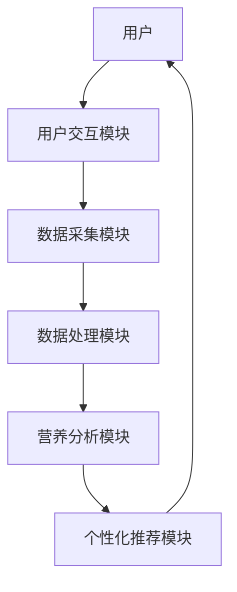
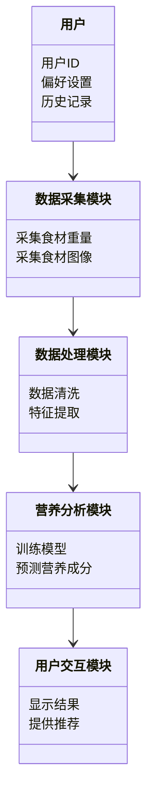
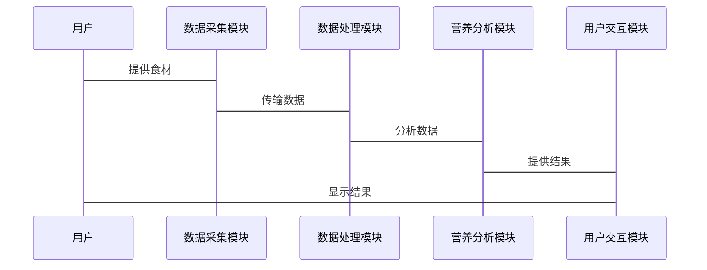

                 


# 智能厨房秤：AI Agent的营养成分分析

**关键词：智能厨房秤、AI Agent、营养成分分析、机器学习、健康饮食**

**摘要：**  
智能厨房秤结合AI Agent技术，通过精准的营养成分分析，为用户提供个性化的饮食建议和健康管理方案。本文从背景、技术原理、系统架构到项目实战，全面解析智能厨房秤在营养成分分析中的应用，探讨其在健康饮食领域的潜力和发展趋势。

---

# 第一部分: 背景与概念

## 第1章: 智能厨房秤的发展与应用

### 1.1 智能厨房秤的背景与现状

#### 1.1.1 厨房秤的传统功能与局限性
传统厨房秤主要用于测量食材的重量，但在营养成分分析方面存在局限性，无法提供详细的营养信息和健康建议。

#### 1.1.2 智能化趋势的推动因素
随着人工智能和物联网技术的发展，智能厨房秤逐渐成为厨房中的必备工具，能够帮助用户实现智能化的饮食管理。

#### 1.1.3 当前市场上的智能厨房秤产品分析
当前市场上的智能厨房秤大多具备重量测量、食材识别、营养成分分析等功能，但AI Agent的应用还处于发展阶段。

### 1.2 AI Agent的基本概念与特点

#### 1.2.1 人工智能代理的定义
AI Agent是指能够感知环境、执行任务并进行决策的智能体，能够在复杂环境中为用户提供个性化服务。

#### 1.2.2 AI Agent的核心特点与优势
- **自主性**：能够在没有外部干预的情况下自主运行。
- **反应性**：能够实时感知环境变化并做出反应。
- **学习能力**：通过数据训练不断提升分析精度。

#### 1.2.3 AI Agent在智能厨房秤中的应用潜力
AI Agent可以用于食材识别、营养分析、个性化推荐等领域，为用户提供智能化的饮食管理服务。

### 1.3 营养成分分析的必要性与挑战

#### 1.3.1 营养均衡的重要性
合理的营养摄入对身体健康至关重要，营养成分分析能够帮助用户实现均衡饮食。

#### 1.3.2 营养成分分析的技术难点
- 数据采集的准确性
- 多样化食材的识别与分析
- 个性化推荐的算法优化

#### 1.3.3 智能厨房秤在营养管理中的作用
智能厨房秤通过AI Agent技术，能够实时分析食材的营养成分，并为用户提供个性化的饮食建议。

### 1.4 本章小结
本章介绍了智能厨房秤的发展现状、AI Agent的基本概念及其在营养成分分析中的应用潜力，为后续内容奠定了基础。

---

## 第2章: 智能厨房秤与AI Agent的结合

### 2.1 AI Agent在智能厨房秤中的角色

#### 2.1.1 AI Agent作为数据处理的核心
AI Agent负责采集食材数据、分析营养成分并生成报告。

#### 2.1.2 AI Agent作为用户交互的中介
通过自然语言处理技术，AI Agent能够与用户进行实时互动，提供个性化的饮食建议。

#### 2.1.3 AI Agent作为系统管理的中枢
AI Agent协调系统各模块，确保智能厨房秤的高效运行。

### 2.2 智能厨房秤的营养成分分析流程

#### 2.2.1 数据采集与处理
- **食材称重**：通过高精度传感器采集食材重量。
- **图像识别**：利用摄像头识别食材种类和数量。

#### 2.2.2 数据分析与营养评估
- **营养成分数据库**：建立包含常见食材营养成分的数据库。
- **数据分析**：通过机器学习算法计算食材的热量、蛋白质、脂肪等营养成分。

#### 2.2.3 结果呈现与用户反馈
- **可视化报告**：以图表形式展示营养成分分析结果。
- **个性化建议**：根据用户需求提供饮食建议。

### 2.3 AI Agent在营养成分分析中的具体应用

#### 2.3.1 数据预处理与特征提取
- **数据清洗**：去除噪声数据，确保数据准确性。
- **特征提取**：从食材重量和种类中提取关键特征。

#### 2.3.2 模型训练与预测
- **训练数据准备**：收集大量食材的营养成分数据。
- **模型选择**：选择合适的机器学习算法（如随机森林、神经网络）进行训练。
- **预测与优化**：通过模型预测食材的营养成分，并不断优化模型性能。

#### 2.3.3 结果优化与个性化推荐
- **个性化推荐**：根据用户的饮食习惯和健康目标，推荐适合的食材组合。
- **动态调整**：根据用户的反馈实时调整推荐方案。

### 2.4 本章小结
本章详细探讨了AI Agent在智能厨房秤中的具体应用，重点分析了营养成分分析的流程和实现方法。

---

## 第3章: 智能厨房秤的系统架构与核心算法

### 3.1 系统架构设计

#### 3.1.1 系统模块划分
- **数据采集模块**：负责采集食材的重量和图像信息。
- **数据处理模块**：对采集的数据进行预处理和特征提取。
- **营养分析模块**：利用机器学习算法进行营养成分分析。
- **用户交互模块**：与用户进行互动，提供个性化建议。

#### 3.1.2 系统功能设计
- **食材识别**：通过图像识别技术快速识别食材种类。
- **营养评估**：分析食材的热量、蛋白质、脂肪等营养成分。
- **个性化推荐**：根据用户需求推荐健康食谱。

#### 3.1.3 系统架构图（Mermaid）



### 3.2 核心算法原理

#### 3.2.1 数据预处理算法

##### 数据清洗
- **去除噪声数据**：删除无效数据，确保数据的准确性。
- **归一化处理**：将数据标准化，便于模型训练。

##### 特征提取
- **提取关键特征**：从食材重量和图像中提取有助于模型分析的特征。

#### 3.2.2 营养成分分析算法

##### 机器学习模型选择
- **随机森林**：适合分类和回归任务，能够处理多维数据。
- **神经网络**：适合复杂的数据关系，但需要大量数据支持。

##### 模型训练与优化
- **训练数据准备**：收集大量食材的营养成分数据。
- **模型训练**：使用训练数据训练模型，调整参数以优化性能。
- **模型评估**：通过测试数据评估模型的准确性和鲁棒性。

#### 3.2.3 个性化推荐算法

##### 基于用户偏好的推荐
- **协同过滤**：根据用户的饮食习惯推荐相似食材。
- **内容推荐**：根据食材的营养成分推荐健康食谱。

##### 动态调整机制
- **实时反馈**：根据用户的反馈动态调整推荐策略。
- **模型更新**：定期更新模型参数，确保推荐的准确性。

### 3.3 算法实现与优化

#### 3.3.1 算法实现步骤

##### 数据预处理
```python
import pandas as pd
import numpy as np

# 数据清洗
data = pd.read_csv('nutrition_data.csv')
data = data.dropna()
data = (data - data.mean()) / data.std()  # 归一化处理
```

##### 模型训练
```python
from sklearn.ensemble import RandomForestRegressor
from sklearn.metrics import mean_squared_error

# 训练随机森林模型
model = RandomForestRegressor(n_estimators=100)
model.fit(X_train, y_train)

# 模型评估
y_pred = model.predict(X_test)
print('MSE:', mean_squared_error(y_test, y_pred))
```

##### 模型优化
```python
# 调整模型参数
from sklearn.model_selection import GridSearchCV

param_grid = {
    'n_estimators': [100, 200],
    'max_depth': [None, 10, 20]
}

grid_search = GridSearchCV(model, param_grid, cv=5)
grid_search.fit(X_train, y_train)
best_model = grid_search.best_estimator_
```

#### 3.3.2 算法优化策略
- **参数调优**：通过网格搜索找到最优模型参数。
- **数据增强**：增加多样化的数据以提高模型的泛化能力。
- **模型集成**：结合多种算法（如随机森林和神经网络）进行预测，提高准确性。

#### 3.3.3 算法效果评估
- **评估指标**：均方误差（MSE）、准确率、召回率等。
- **性能优化**：通过交叉验证和超参数优化提升模型性能。

### 3.4 本章小结
本章详细介绍了智能厨房秤的系统架构设计和核心算法实现，重点讲解了数据预处理、模型训练和个性化推荐的具体步骤和优化策略。

---

## 第4章: 智能厨房秤的系统分析与架构设计方案

### 4.1 问题场景介绍
用户在使用智能厨房秤时，需要快速获取食材的营养成分分析，并获得个性化的饮食建议。

### 4.2 项目介绍
本项目旨在开发一款结合AI Agent的智能厨房秤，能够实时分析食材的营养成分，并为用户提供健康饮食建议。

### 4.3 系统功能设计

#### 4.3.1 领域模型（Mermaid类图）



### 4.4 系统架构设计（Mermaid架构图）


### 4.5 系统接口设计
- **数据采集接口**：与传感器和摄像头连接，获取食材的重量和图像。
- **用户交互接口**：通过手机APP或语音助手与用户互动，显示分析结果和推荐。

### 4.6 系统交互流程（Mermaid序列图）



### 4.7 本章小结
本章通过系统架构设计和交互流程分析，详细描述了智能厨房秤的实现方案，为后续的项目开发奠定了基础。

---

## 第5章: 项目实战

### 5.1 环境安装与配置

#### 5.1.1 系统需求
- **硬件**：支持AI处理的处理器，摄像头，重量传感器。
- **软件**：Python 3.8+, TensorFlow, OpenCV, scikit-learn。

#### 5.1.2 安装依赖
```bash
pip install numpy pandas scikit-learn tensorflow keras open-cv-python
```

### 5.2 系统核心实现源代码

#### 5.2.1 数据采集模块

```python
import cv2
import numpy as np

# 图像采集
cap = cv2.VideoCapture(0)
while True:
    ret, frame = cap.read()
    cv2.imshow('Camera', frame)
    if cv2.waitKey(1) & 0xFF == ord('q'):
        break
cap.release()
cv2.destroyAllWindows()
```

#### 5.2.2 数据处理模块

```python
import pandas as pd
from sklearn.preprocessing import StandardScaler

# 数据预处理
data = pd.read_csv('nutrition_data.csv')
scaler = StandardScaler()
data_scaled = scaler.fit_transform(data)
```

#### 5.2.3 营养分析模块

```python
from sklearn.ensemble import RandomForestRegressor
from sklearn.metrics import mean_squared_error

# 训练随机森林模型
model = RandomForestRegressor(n_estimators=100)
model.fit(X_train, y_train)

# 模型评估
y_pred = model.predict(X_test)
print('MSE:', mean_squared_error(y_test, y_pred))
```

#### 5.2.4 用户交互模块

```python
import json
import requests

# 提供个性化推荐
response = requests.get('https://api.example.com/recipes')
recipes = json.loads(response.text)
print('推荐食谱:', recipes)
```

### 5.3 实际案例分析与详细解读

#### 5.3.1 案例背景
用户希望根据提供的食材推荐低热量的晚餐食谱。

#### 5.3.2 数据采集与处理
用户称量并拍照上传食材，系统自动识别并提取营养成分数据。

#### 5.3.3 模型预测与推荐
系统根据用户的需求和模型分析结果，推荐适合的食谱。

### 5.4 项目小结
本章通过实际案例展示了智能厨房秤的实现过程，详细讲解了各模块的代码实现和系统交互流程。

---

## 第6章: 最佳实践与小结

### 6.1 最佳实践 tips
- **数据质量管理**：确保数据的准确性和完整性。
- **模型优化**：通过参数调优和数据增强提高模型性能。
- **用户隐私保护**：确保用户数据的安全性和隐私性。

### 6.2 小结
智能厨房秤结合AI Agent技术，通过精准的营养成分分析和个性化的饮食建议，为用户提供了高效便捷的健康饮食管理方式。

### 6.3 注意事项
- **数据安全**：防止用户数据泄露。
- **用户体验**：确保系统的易用性和交互性。
- **模型更新**：定期更新模型以适应新的食材和用户需求。

### 6.4 拓展阅读
- **相关书籍**：《机器学习实战》、《人工智能：一种现代方法》。
- **技术博客**：关注AI领域最新动态，学习前沿技术。

---

# 作者：AI天才研究院/AI Genius Institute & 禅与计算机程序设计艺术 /Zen And The Art of Computer Programming

