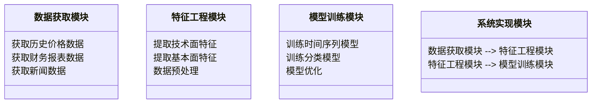
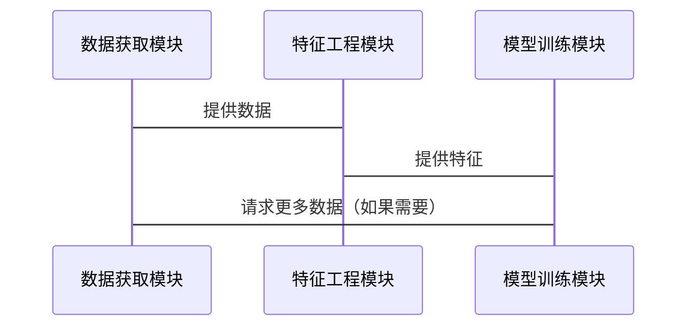

                 


# 机器学习增强技术面与基本面分析

> 关键词：机器学习，技术面分析，基本面分析，金融预测，深度学习

> 摘要：本文深入探讨了机器学习在技术面与基本面分析中的应用，通过分析机器学习算法的核心原理、系统架构设计和实际案例，展示了如何利用机器学习提升金融分析的准确性和效率。文章从基础概念到高级应用，逐步展开，结合数学公式、算法流程图和实际代码示例，为读者提供了一个全面的技术视角。

---

# 第1章: 机器学习增强技术面与基本面分析概述

## 1.1 机器学习与金融分析的背景

### 1.1.1 机器学习的基本概念
机器学习是一种人工智能技术，通过数据训练模型，使其能够从经验中学习并做出预测或决策。核心在于通过算法优化目标函数，寻找输入与输出之间的关系。例如，线性回归是最简单的机器学习模型之一，其数学表达式为：
$$ y = \theta_0 + \theta_1 x $$

### 1.1.2 金融分析的定义与分类
金融分析主要分为技术面分析和基本面分析。技术面分析关注价格走势和交易量等市场行为，而基本面分析关注公司的财务状况和行业趋势。两者的结合可以帮助投资者做出更全面的投资决策。

### 1.1.3 机器学习在金融分析中的应用前景
机器学习通过处理大量非结构化数据（如新闻、社交媒体）和结构化数据（如财务报表），为技术面和基本面分析提供了新的可能性。例如，使用LSTM网络预测股票价格走势。

---

## 1.2 技术面与基本面分析的核心概念

### 1.2.1 技术面分析的定义与方法
技术面分析通过研究历史价格数据，预测未来走势。常用的技术指标包括移动平均线（MA）、相对强弱指数（RSI）等。

### 1.2.2 基本面分析的定义与方法
基本面分析研究公司的财务状况、行业地位和宏观经济环境。例如，计算市盈率（P/E）和市净率（P/B）等指标。

### 1.2.3 机器学习如何增强技术面与基本面分析
机器学习可以将技术面和基本面数据结合起来，构建更复杂的预测模型。例如，使用随机森林算法对多维数据进行特征选择，提高预测精度。

---

## 1.3 本章小结
本章介绍了机器学习的基本概念、技术面与基本面分析的核心内容，以及机器学习在金融分析中的应用前景。接下来将深入探讨机器学习的基础知识。

---

# 第2章: 机器学习基础

## 2.1 机器学习的基本原理

### 2.1.1 监督学习与无监督学习
- **监督学习**：有标签数据训练模型，如线性回归和逻辑回归。
- **无监督学习**：无标签数据训练模型，如聚类算法（K-means）。

### 2.1.2 分类、回归与聚类
- **分类**：将数据分为不同类别，如支持向量机（SVM）。
- **回归**：预测连续值，如线性回归。
- **聚类**：将数据分为相似的组，如K-means。

### 2.1.3 机器学习算法的优缺点对比
| 算法 | 优点 | 缺点 |
|------|------|------|
| 线性回归 | 简单高效 | 无法处理非线性关系 |
| SVM   | 高精度 | 参数敏感 |
| 随机森林 | 抗过拟合 | 计算复杂 |

---

## 2.2 机器学习的核心算法

### 2.2.1 线性回归与逻辑回归
线性回归的数学模型为：
$$ y = \theta_0 + \theta_1 x + \epsilon $$
逻辑回归用于分类问题，其概率函数为：
$$ P(y=1|x) = \frac{e^{\theta^T x}}{1 + e^{\theta^T x}} $$

### 2.2.2 支持向量机（SVM）
SVM通过找到最大间隔超平面进行分类，数学形式为：
$$ y = \text{sign}(\theta^T x + b) $$

### 2.2.3 随机森林与梯度提升树
随机森林通过集成学习提高准确率，梯度提升树（如XGBoost）通过逐步优化目标函数提升性能。

### 2.2.4 神经网络与深度学习
神经网络通过多层结构模拟人脑，深度学习在处理复杂数据时表现优异，如图像识别和自然语言处理。

---

## 2.3 特征工程与数据预处理

### 2.3.1 特征选择与特征提取
特征选择通过过滤法或包裹法选择重要特征，特征提取则通过主成分分析（PCA）等方法降低维度。

### 2.3.2 数据清洗与标准化
数据清洗包括处理缺失值和异常值，标准化通过归一化处理使数据分布均匀。

### 2.3.3 数据增强与样本平衡
数据增强通过增加样本数量提高模型鲁棒性，样本平衡通过调整类别比例防止偏斜。

---

## 2.4 本章小结
本章介绍了机器学习的基本原理和核心算法，强调了特征工程与数据预处理的重要性。接下来将探讨机器学习在技术面分析中的具体应用。

---

# 第3章: 机器学习在技术面分析中的应用

## 3.1 技术面分析的核心要素

### 3.1.1 K线图与技术指标
K线图展示价格走势，常用技术指标包括MA、RSI和MACD。

### 3.1.2 趋势线与支撑阻力
趋势线帮助识别价格趋势，支撑阻力位帮助判断价格波动区间。

### 3.1.3 市场情绪与波动性
市场情绪影响价格波动，可通过新闻 sentiment 分析等方法量化。

---

## 3.2 机器学习在技术面分析中的算法选择

### 3.2.1 时间序列分析
时间序列分析通过ARIMA模型预测未来走势，其数学形式为：
$$ y_t = \phi y_{t-1} + \theta e_{t-1} + e_t $$

### 3.2.2 基于RNN的序列建模
RNN擅长处理序列数据，LSTM通过遗忘门和记忆单元增强长期依赖关系，数学形式为：
$$ f_t = \text{tanh}(F \cdot [h_{t-1}, x_t]) $$

### 3.2.3 基于LSTM的股价预测
使用LSTM网络预测股票价格，训练数据包括历史价格和交易量。

---

## 3.3 技术面分析的机器学习模型实现

### 3.3.1 数据特征提取与模型训练
从历史价格数据中提取特征，训练LSTM模型预测未来价格。

### 3.3.2 模型评估与优化
使用均方误差（MSE）评估模型性能，通过网格搜索优化超参数。

### 3.3.3 实际案例分析
以某股票为例，展示模型训练和预测过程。

---

## 3.4 本章小结
本章探讨了机器学习在技术面分析中的应用，重点介绍了时间序列分析和深度学习模型。接下来将探讨基本面分析的机器学习应用。

---

# 第4章: 机器学习在基本面分析中的应用

## 4.1 基本面分析的核心要素

### 4.1.1 公司财务报表分析
分析收入、利润和资产负债等财务指标，评估公司财务健康状况。

### 4.1.2 行业分析与宏观经济指标
考虑行业趋势和宏观经济环境，如GDP增长率和通货膨胀率。

### 4.1.3 公司治理与管理层分析
评估公司治理结构和管理层能力，判断公司长期发展潜力。

---

## 4.2 机器学习在基本面分析中的算法选择

### 4.2.1 文本挖掘与情感分析
通过自然语言处理技术分析公司财报和新闻，提取情感特征。

### 4.2.2 基于SVM的分类模型
使用支持向量机对财务数据进行分类，预测公司评级。

### 4.2.3 基于随机森林的特征选择
通过随机森林算法选择重要财务指标，提高模型预测精度。

---

## 4.3 基于机器学习的多因素模型

### 4.3.1 CAPM模型
资本资产定价模型（CAPM）用于评估资产预期收益，其数学公式为：
$$ E(r_i) = r_f + \beta_i (E(r_m) - r_f) $$

### 4.3.2 Fama-French三因子模型
扩展CAPM模型，考虑规模溢价和价值溢价，数学公式为：
$$ E(r_i) = r_f + \beta_i (E(r_m) - r_f) + 0.3 \times SMB + 0.3 \times HML $$

---

## 4.4 本章小结
本章探讨了机器学习在基本面分析中的应用，介绍了文本挖掘、特征选择和多因素模型。接下来将讨论系统架构与实现。

---

# 第5章: 机器学习增强技术面与基本面分析的系统架构与实现

## 5.1 系统功能设计

### 5.1.1 领域模型设计
使用Mermaid类图展示系统模块和类的关系。



---

## 5.2 系统架构设计

### 5.2.1 模块划分
系统分为数据获取、特征工程、模型训练和结果展示四个模块。

### 5.2.2 模块交互流程
使用Mermaid序列图展示模块交互流程。



---

## 5.3 系统接口设计

### 5.3.1 数据接口
API接口用于获取历史价格和财务数据。

### 5.3.2 模型接口
API接口用于调用训练好的模型进行预测。

---

## 5.4 系统实现细节

### 5.4.1 数据获取模块实现
使用Python的pandas库获取数据。

```python
import pandas as pd
data = pd.read_csv('data.csv')
```

### 5.4.2 特征工程模块实现
使用sklearn库进行特征提取。

```python
from sklearn.preprocessing import StandardScaler
scaler = StandardScaler()
features = scaler.fit_transform(features)
```

### 5.4.3 模型训练模块实现
使用Keras库训练LSTM模型。

```python
from keras.models import Sequential
from keras.layers import LSTM, Dense
model = Sequential()
model.add(LSTM(64, input_shape=(timesteps, features)))
model.add(Dense(1))
model.compile(loss='mean_squared_error', optimizer='adam')
```

---

## 5.5 本章小结
本章设计了系统的架构和接口，详细展示了模块的交互和实现过程。接下来将通过项目实战进一步验证系统的设计。

---

# 第6章: 项目实战——构建机器学习驱动的金融分析系统

## 6.1 环境搭建与数据获取

### 6.1.1 安装必要的库
使用以下命令安装Python库：
```bash
pip install pandas numpy scikit-learn tensorflow
```

### 6.1.2 数据获取
从金融数据API获取股票价格和财务数据。

---

## 6.2 系统核心实现

### 6.2.1 特征工程实现
对数据进行清洗和标准化处理。

```python
import pandas as pd
import numpy as np

# 假设data是包含历史价格和财务数据的DataFrame
# 提取技术面特征
data['MA_5'] = data['收盘价'].rolling(5).mean()
data['RSI'] = ta.rsi(data['收盘价'], window=14)

# 提取基本面特征
data['PE_ratio'] = data['净利润'] / data['股价']
data['ROE'] = data['净利润'] / data['净资产']
```

### 6.2.2 模型训练与优化
训练LSTM模型并进行超参数优化。

```python
from keras.callbacks import ModelCheckpoint
from sklearn.model_selection import GridSearchCV

# 定义模型结构
def create_model(neurons, dropout_rate):
    model = Sequential()
    model.add(LSTM(neurons, dropout=dropout_rate, input_shape=(timesteps, features)))
    model.add(Dense(1))
    model.compile(loss='mean_squared_error', optimizer='adam')
    return model

# 超参数优化
parameters = {'neurons': [32, 64, 128], 'dropout_rate': [0.2, 0.5]}
grid_search = GridSearchCV(estimator=create_model(), param_grid=parameters, cv=5)
grid_search.fit(X_train, y_train)
best_model = grid_search.best_estimator_
```

---

## 6.3 实际案例分析

### 6.3.1 数据预处理与模型训练
以某股票为例，展示数据预处理和模型训练过程。

### 6.3.2 模型评估与结果展示
使用测试数据评估模型性能，并展示预测结果。

### 6.3.3 模型优化与部署
通过超参数优化和模型部署，提升预测精度并实现自动化交易。

---

## 6.4 本章小结
本章通过项目实战展示了机器学习在金融分析中的具体应用，从环境搭建到模型部署，完整地实现了系统设计。接下来将总结最佳实践和注意事项。

---

# 第7章: 高级主题与扩展阅读

## 7.1 模型调优与优化

### 7.1.1 超参数优化
使用网格搜索和随机搜索优化模型性能。

### 7.1.2 模型融合与集成学习
通过集成学习结合多个模型的预测结果，提升整体性能。

---

## 7.2 风险管理与回测策略

### 7.2.1 风险管理策略
制定止损和止盈策略，控制投资风险。

### 7.2.2 回测策略设计
通过回测验证模型在历史数据上的表现，评估模型的有效性。

---

## 7.3 机器学习在金融领域的伦理与法律问题

### 7.3.1 数据隐私与合规性
确保数据收集和使用符合相关法律法规。

### 7.3.2 模型透明度与可解释性
提高模型的透明度，便于监管和解释。

---

## 7.4 本章小结
本章总结了机器学习在金融分析中的高级主题和扩展方向，强调了模型调优、风险管理以及伦理法律问题的重要性。

---

# 作者：AI天才研究院/AI Genius Institute & 禅与计算机程序设计艺术 /Zen And The Art of Computer Programming

---

这篇文章系统地介绍了机器学习在技术面与基本面分析中的应用，从基础概念到高级主题，逐步展开，结合数学公式、算法流程图和实际代码示例，为读者提供了一个全面的技术视角。

