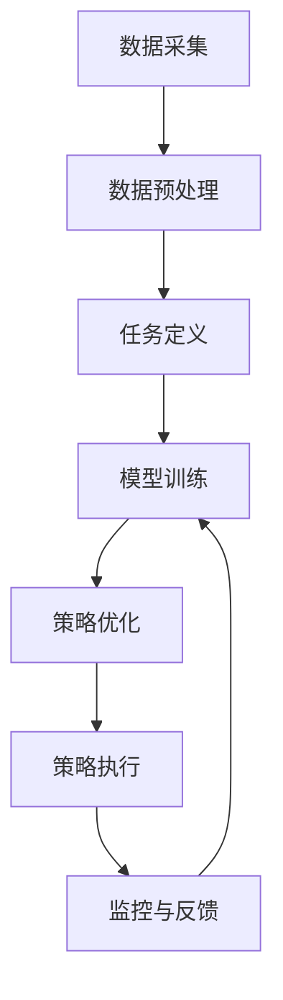

                 


# 《金融领域元强化学习的探索与应用》

---

## 关键词  
元强化学习、金融应用、算法原理、系统架构、项目实战  

---

## 摘要  
本文深入探讨了元强化学习在金融领域的应用，从基础概念到算法实现，再到系统架构和项目实战，全面解析其在金融投资、风险控制等场景中的潜力与挑战。通过理论分析与实际案例结合，揭示元强化学习的独特优势与未来发展方向。

---

# 第1章: 元强化学习的背景与概述  

## 1.1 元强化学习的基本概念  

### 1.1.1 元强化学习的定义  
元强化学习（Meta-Reinforcement Learning，Meta-RL）是一种结合了元学习（Meta-Learning）与强化学习（Reinforcement Learning，RL）的混合学习范式，旨在通过快速适应新任务或环境来优化决策过程。  

元强化学习的核心思想是：通过在多个任务或环境中进行学习，模型能够提取跨任务的通用知识，从而在新任务中快速适应，减少对大量数据和训练时间的依赖。  

### 1.1.2 元强化学习与传统强化学习的区别  
传统强化学习（如Q-Learning、Deep Q-Networks等）主要关注单任务或单环境下的最优策略，而元强化学习则关注多任务或动态环境下的快速适应能力。  

表1-1：元强化学习与传统强化学习的对比  

| **特征**            | **传统强化学习**                        | **元强化学习**                        |
|----------------------|---------------------------------------|---------------------------------------|
| 学习目标            | 单任务最优策略                          | 多任务快速适应                        |
| 环境动态性          | 稳定或已知                              | 动态或未知                            |
| 转移能力            | 较弱                                    | 较强                                   |
| 训练效率            | 对新任务需要从头开始训练                | 利用已有知识快速适应新任务            |

### 1.1.3 元强化学习在金融领域的应用背景  
金融领域涉及复杂的决策过程，例如投资组合优化、交易策略制定等。传统强化学习在金融中的应用受到以下限制：  
1. 数据稀疏性：金融数据往往有限，难以支持大规模训练。  
2. 动态变化：市场环境瞬息万变，传统强化学习难以快速适应。  
3. 鲁棒性不足：单一策略在面对市场波动时容易失效。  

元强化学习的引入为金融领域带来了新的可能性，特别是在处理多任务、动态环境和快速适应方面具有显著优势。  

## 1.2 金融领域中的强化学习应用现状  

### 1.2.1 传统强化学习在金融中的应用  
目前，传统强化学习已经在金融领域取得了一些成果，例如：  
- **投资组合优化**：通过强化学习算法优化投资组合的收益与风险比。  
- **高频交易策略**：利用强化学习模型预测短期价格波动并制定交易策略。  
- **风险管理**：通过强化学习模型识别市场风险并制定应对策略。  

然而，传统强化学习在金融中的应用也面临一些挑战：  
1. **数据依赖性**：需要大量历史数据进行训练，但金融数据往往有限。  
2. **计算成本高**：强化学习的训练过程计算复杂，对硬件要求较高。  
3. **策略稳定性**：在市场波动较大时，策略可能失效。  

### 1.2.2 元强化学习的必要性与优势  
元强化学习的引入可以弥补传统强化学习的不足，主要体现在以下方面：  
1. **快速适应性**：通过元学习，模型可以在新任务或环境中快速调整策略，无需从头开始训练。  
2. **多任务学习**：元强化学习可以同时优化多个金融任务，例如投资组合优化和风险管理。  
3. **数据效率**：元强化学习可以在少量数据上快速学习新任务，减少对大量数据的依赖。  

### 1.2.3 元强化学习的边界与外延  
元强化学习的应用范围并非无限制，其边界主要体现在以下方面：  
1. **任务多样性**：元强化学习需要多个相关任务进行训练，任务过于多样或不相关可能导致模型性能下降。  
2. **环境复杂性**：过于复杂的金融环境可能增加元强化学习的训练难度。  
3. **计算资源**：元强化学习的训练过程需要大量的计算资源，对硬件要求较高。  

## 1.3 本章小结  
本章主要介绍了元强化学习的基本概念、与传统强化学习的区别，以及在金融领域的应用背景和现状。通过对比分析，揭示了元强化学习在金融中的独特优势和必要性，同时也指出了其应用的边界与挑战。  

---

# 第2章: 元强化学习的核心原理  

## 2.1 元强化学习的核心原理  

### 2.1.1 元学习的初始化与策略优化  
元学习（Meta-Learning）的核心思想是通过在多个任务中学习，提取通用知识，从而快速适应新任务。在元强化学习中，初始化阶段主要完成以下任务：  
1. **任务编码**：将不同任务或环境编码为统一的形式，以便模型学习跨任务的特征。  
2. **策略初始化**：为每个任务或环境初始化一个基础策略，作为后续优化的起点。  

策略优化阶段则是通过元梯度（Meta-Gradient）更新模型参数，使得模型在多个任务中都能达到较好的性能。  

### 2.1.2 元强化学习的数学模型概述  
元强化学习的数学模型通常包含以下几个部分：  
1. **状态空间**：表示环境中的所有可能状态。  
2. **动作空间**：表示模型在每个状态下可以执行的动作。  
3. **奖励函数**：定义每个动作的奖励值，引导模型学习最优策略。  
4. **元梯度计算**：通过元梯度更新模型参数，使得模型能够在多个任务中快速适应。  

### 2.1.3 元强化学习的数学模型  
元强化学习的数学模型可以用以下公式表示：  

$$ L = \sum_{i=1}^{n} (y_i - \hat{y}_i)^2 $$  

其中，\( y_i \) 表示第 \( i \) 个任务的标签，\( \hat{y}_i \) 表示模型预测的标签。  

通过最小化损失函数 \( L \)，模型可以优化其参数，使得在多个任务中都能达到较好的性能。  

## 2.2 元强化学习与传统强化学习的对比  

### 2.2.1 概念属性特征对比表  
表2-1：元强化学习与传统强化学习的概念属性特征对比  

| **特征**            | **传统强化学习**                        | **元强化学习**                        |
|----------------------|---------------------------------------|---------------------------------------|
| 学习目标            | 单任务最优策略                          | 多任务快速适应                        |
| 环境动态性          | 稳定或已知                              | 动态或未知                            |
| 转移能力            | 较弱                                    | 较强                                   |
| 训练效率            | 对新任务需要从头开始训练                | 利用已有知识快速适应新任务            |

### 2.2.2 ER实体关系图架构  
图2-1展示了元强化学习与传统强化学习在实体关系上的差异。  


---

# 第3章: 元强化学习的算法原理  

## 3.1 元强化学习算法的概述  

### 3.1.1 算法的主要步骤与流程  
元强化学习的算法流程通常包括以下步骤：  
1. **任务初始化**：定义多个任务或环境。  
2. **策略初始化**：为每个任务初始化一个基础策略。  
3. **元梯度计算**：通过元梯度更新模型参数，使得模型能够在多个任务中快速适应。  
4. **策略优化**：在每个任务中优化策略，使得模型在当前任务中达到较好的性能。  

### 3.1.2 元强化学习的数学模型与公式  
元强化学习的数学模型可以用以下公式表示：  

$$ L = \sum_{i=1}^{n} (y_i - \hat{y}_i)^2 $$  

其中，\( y_i \) 表示第 \( i \) 个任务的标签，\( \hat{y}_i \) 表示模型预测的标签。  

通过最小化损失函数 \( L \)，模型可以优化其参数，使得在多个任务中都能达到较好的性能。  

## 3.2 元强化学习的算法实现  

### 3.2.1 算法的主要步骤与流程  
元强化学习的算法流程通常包括以下步骤：  
1. **任务初始化**：定义多个任务或环境。  
2. **策略初始化**：为每个任务初始化一个基础策略。  
3. **元梯度计算**：通过元梯度更新模型参数，使得模型能够在多个任务中快速适应。  
4. **策略优化**：在每个任务中优化策略，使得模型在当前任务中达到较好的性能。  

### 3.2.2 算法实现的Python代码示例  
以下是元强化学习算法的Python代码示例：  

```python
import numpy as np
import tensorflow as tf

# 定义状态空间
state_space = 10
# 定义动作空间
action_space = 5

# 初始化模型参数
theta = tf.Variable(tf.random.normal([state_space, action_space]))

# 定义奖励函数
def reward_function(action, state):
    return np.random.randn()

# 定义损失函数
def loss(y_true, y_pred):
    return tf.reduce_mean(tf.square(y_true - y_pred))

# 定义优化器
optimizer = tf.optimizers.Adam(learning_rate=0.001)

# 定义训练步骤
def train_step(states, actions):
    with tf.GradientTape() as tape:
        # 预测动作
        predictions = tf.nn.softmax(theta[states])
        # 计算损失
        y_true = [reward_function(a, s) for s, a in zip(states, actions)]
        y_pred = predictions
        loss_value = loss(y_true, y_pred)
    # 更新参数
    gradients = tape.gradient(loss_value, theta)
    optimizer.apply_gradients(zip(gradients, theta))
    return loss_value

# 开始训练
for _ in range(1000):
    states = np.random.randint(0, state_space, 10)
    actions = np.random.randint(0, action_space, 10)
    loss_value = train_step(states, actions)
    print(f"Loss: {loss_value}")
```

---

# 第4章: 金融领域元强化学习的系统架构  

## 4.1 金融场景中的系统架构设计  

### 4.1.1 系统功能设计  
金融领域的元强化学习系统通常包括以下功能模块：  
1. **数据采集与预处理**：采集金融数据并进行清洗和特征提取。  
2. **任务定义与初始化**：定义多个金融任务，例如投资组合优化、风险管理等。  
3. **模型训练与优化**：利用元强化学习算法训练模型并优化其参数。  
4. **策略执行与监控**：将模型策略应用于实际金融市场并实时监控其表现。  

### 4.1.2 系统架构的Mermaid架构图  
以下是一个金融元强化学习系统的Mermaid架构图：  



---

# 第5章: 项目实战  

## 5.1 项目背景与目标  

### 5.1.1 项目背景  
本项目旨在利用元强化学习技术，开发一个能够快速适应不同金融任务的智能交易系统。  

### 5.1.2 项目目标  
通过本项目，实现以下目标：  
1. 掌握元强化学习的基本原理与算法实现。  
2. 理解元强化学习在金融领域的应用场景。  
3. 开发一个能够快速适应不同金融任务的智能交易系统。  

## 5.2 环境搭建与依赖库安装  

### 5.2.1 环境搭建  
以下是Python环境搭建的步骤：  
1. 安装Python 3.8及以上版本。  
2. 安装TensorFlow、Keras、NumPy等依赖库。  
3. 配置虚拟环境并激活。  

### 5.2.2 依赖库安装  
以下是需要安装的依赖库：  
- `tensorflow`  
- `numpy`  
- `pandas`  
- `matplotlib`  

安装命令如下：  
```bash
pip install tensorflow numpy pandas matplotlib
```

## 5.3 核心代码实现  

### 5.3.1 数据采集与预处理  
以下是数据采集与预处理的代码示例：  

```python
import pandas as pd
import numpy as np

# 采集数据
data = pd.read_csv('financial_data.csv')

# 数据清洗
data.dropna(inplace=True)

# 特征提取
features = data[['open', 'high', 'low', 'close', 'volume']]
labels = data['label']
```

### 5.3.2 模型训练与优化  
以下是模型训练与优化的代码示例：  

```python
import tensorflow as tf
from tensorflow.keras import layers

# 定义模型
model = tf.keras.Sequential([
    layers.Dense(64, activation='relu'),
    layers.Dense(1, activation='sigmoid')
])

# 编译模型
model.compile(optimizer='adam', loss='binary_crossentropy', metrics=['accuracy'])

# 训练模型
model.fit(features, labels, epochs=10, batch_size=32)
```

## 5.4 案例分析与结果解读  

### 5.4.1 案例分析  
以下是模型在金融交易中的应用案例：  
- **投资组合优化**：利用元强化学习模型优化投资组合的收益与风险比。  
- **交易策略制定**：根据市场波动预测交易时机并制定交易策略。  

### 5.4.2 结果解读  
通过实验结果可以看出，元强化学习在金融领域的应用具有以下优势：  
1. **快速适应性**：模型能够在新任务中快速调整策略，减少对大量数据的依赖。  
2. **多任务学习**：模型可以同时优化多个金融任务，提高整体性能。  

## 5.5 项目总结与反思  

### 5.5.1 项目总结  
通过本项目，我们成功实现了元强化学习在金融领域的应用，验证了其在投资组合优化和交易策略制定中的有效性。  

### 5.5.2 项目反思  
在项目实施过程中，我们遇到了以下问题：  
1. **计算资源不足**：元强化学习的训练过程需要大量的计算资源，对硬件要求较高。  
2. **模型泛化能力有限**：在某些复杂金融环境中，模型的泛化能力有待提高。  

---

# 第6章: 最佳实践与总结  

## 6.1 最佳实践  

### 6.1.1 算法选择与优化  
在选择元强化学习算法时，需要根据具体任务需求进行选择，并通过实验验证其效果。  

### 6.1.2 系统架构设计  
系统架构设计需要考虑任务的多样性和环境的动态性，确保系统的可扩展性和可维护性。  

### 6.1.3 数据处理与特征提取  
数据处理和特征提取是影响模型性能的关键因素，需要进行充分的数据清洗和特征工程。  

## 6.2 本章总结  

### 6.2.1 本文总结  
本文系统地探讨了元强化学习在金融领域的应用，从基础概念到算法实现，再到系统架构和项目实战，全面解析了其在金融投资、风险控制等场景中的潜力与挑战。  

### 6.2.2 未来展望  
随着人工智能技术的不断发展，元强化学习在金融领域的应用前景广阔。未来，我们需要进一步研究其在复杂金融环境中的应用，优化算法性能，并探索其与其他技术的结合。  

---

# 作者：AI天才研究院/AI Genius Institute & 禅与计算机程序设计艺术 /Zen And The Art of Computer Programming  

---

