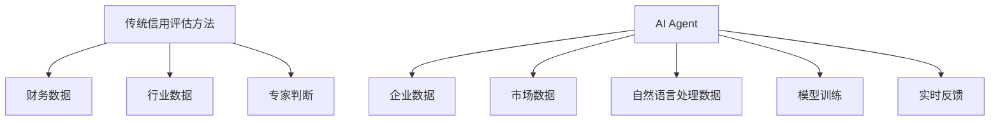
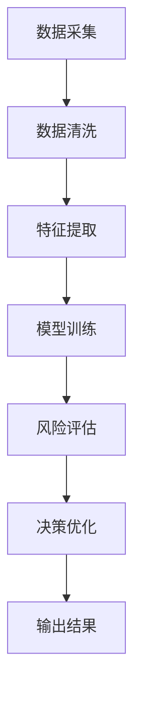
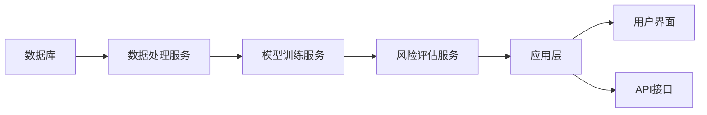
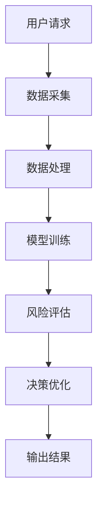

                 


# AI Agent在企业信用风险评估与管理中的应用

> 关键词：AI Agent, 信用风险评估, 企业信用管理, 人工智能, 风险评估

> 摘要：本文详细探讨了AI Agent在企业信用风险评估与管理中的应用，从背景介绍、核心概念、算法原理、系统架构到项目实战，结合具体案例和最佳实践，全面分析了AI Agent在信用风险评估中的优势和实现方法。

---

# 第一部分: AI Agent与企业信用风险评估概述

# 第1章: AI Agent与企业信用风险评估概述

## 1.1 企业信用风险评估的背景与挑战

### 1.1.1 信用风险的定义与分类

信用风险是指企业在信用交易中未能履行其偿债义务，导致债权人或投资者遭受损失的可能性。企业信用风险评估的核心是通过对企业的财务状况、经营状况和市场环境等因素进行分析，预测其在未来一定时期内违约的可能性。

信用风险可以分为系统性风险和非系统性风险。系统性风险是由于整体经济环境变化引起的，如经济衰退、利率上升等；非系统性风险是由于企业自身经营状况或财务状况变化引起的，如管理不善、行业竞争加剧等。

### 1.1.2 传统信用风险评估方法的局限性

传统的信用风险评估方法主要包括财务比率分析、信用评分模型和专家判断法。这些方法虽然在一定程度上能够反映企业的信用状况，但也存在以下局限性：

1. **数据依赖性过强**：传统方法主要依赖财务数据，忽视了市场环境、行业趋势等外部因素的影响。
2. **主观性较强**：专家判断法受到评估人员主观因素的影响，可能导致评估结果的不准确性。
3. **动态适应性不足**：传统的信用评分模型通常静态地评估企业的信用状况，难以及时捕捉市场环境的变化。

### 1.1.3 AI Agent在信用风险评估中的应用价值

AI Agent（人工智能代理）是一种能够感知环境、自主决策并执行任务的智能体。在信用风险评估中，AI Agent可以通过实时数据采集、智能分析和自主决策，显著提升信用风险评估的效率和准确性。

AI Agent在信用风险评估中的应用价值主要体现在以下几个方面：

1. **实时数据处理**：AI Agent能够实时采集企业的财务数据、市场数据和行业数据，确保信用评估的时效性。
2. **智能分析能力**：通过机器学习和自然语言处理等技术，AI Agent可以快速识别企业信用风险的关键因素，并提供精准的评估结果。
3. **动态调整能力**：AI Agent能够根据市场环境和企业经营状况的变化，实时调整信用评估模型和决策策略，提升评估的动态适应性。

## 1.2 AI Agent的基本概念与特点

### 1.2.1 AI Agent的定义与分类

AI Agent是指具有智能性、自主性和交互性的计算机系统，能够通过感知环境、自主决策和执行任务来实现特定目标。根据功能和应用场景的不同，AI Agent可以分为以下几类：

1. **简单反射型AI Agent**：基于预设规则进行决策和行动，适用于简单的任务。
2. **基于模型的AI Agent**：通过构建环境模型进行决策和行动，适用于复杂任务。
3. **目标驱动型AI Agent**：根据预设目标进行自主决策和行动，适用于需要动态调整的任务。
4. **实用驱动型AI Agent**：通过最大化效用函数进行决策和行动，适用于需要优化的任务。

### 1.2.2 AI Agent的核心能力与优势

AI Agent的核心能力包括感知能力、决策能力、学习能力和执行能力。这些能力使其在信用风险评估中具有以下优势：

1. **高效的数据处理能力**：AI Agent能够快速处理大量数据，提取关键特征，为信用评估提供支持。
2. **智能的分析能力**：通过机器学习和深度学习技术，AI Agent能够识别数据中的潜在风险因素，提高评估的准确性。
3. **自主的决策能力**：AI Agent可以根据实时数据和模型结果，自主调整信用评估策略，优化决策过程。

### 1.2.3 AI Agent与传统算法的区别

AI Agent与传统算法的主要区别在于其自主性和智能性。传统算法通常基于固定的规则和模型进行处理，而AI Agent能够根据环境的变化自主调整策略，并通过学习和优化提升性能。

以下是一个简单的对比表格：

| **特征**       | **传统算法**               | **AI Agent**             |
|----------------|---------------------------|--------------------------|
| 决策方式       | 基于固定规则和模型         | 基于环境感知和自主学习   |
| 处理数据       | 静态数据                   | 动态数据                 |
| 决策能力       | 单一任务                   | 多任务                   |
| 适应性         | 较低                      | 较高                     |

## 1.3 本章小结

本章主要介绍了企业信用风险评估的背景与挑战，分析了传统信用风险评估方法的局限性，并详细阐述了AI Agent的基本概念、特点及其在信用风险评估中的应用价值。通过对比分析，展示了AI Agent在信用风险评估中的独特优势和潜在价值。

---

# 第二部分: AI Agent在信用风险评估中的核心概念与原理

# 第2章: AI Agent与信用风险评估的核心概念

## 2.1 信用风险评估的核心要素

### 2.1.1 企业信用风险的主要影响因素

企业信用风险的主要影响因素包括财务状况、经营状况、市场环境和管理能力等方面。以下是具体的影响因素：

1. **财务状况**：包括资产负债率、流动比率、速动比率、净利润率等财务指标。
2. **经营状况**：包括企业的收入增长率、利润率、市场占有率等。
3. **市场环境**：包括行业竞争状况、宏观经济环境、政策法规等。
4. **管理能力**：包括企业管理层的决策能力、管理团队的稳定性等。

### 2.1.2 数据来源与特征分析

信用风险评估的数据来源主要包括企业内部数据和外部数据。内部数据包括财务报表、销售数据、采购记录等；外部数据包括行业统计数据、市场研究报告、新闻资讯等。

在特征分析方面，需要对数据进行清洗、转换和特征选择，提取对信用风险评估有较大影响的关键特征。例如，可以通过主成分分析（PCA）或特征重要性分析（如XGBoost中的特征重要性）来确定关键特征。

### 2.1.3 风险评估模型的构建与验证

信用风险评估模型的构建通常包括以下几个步骤：

1. **数据预处理**：清洗数据，处理缺失值和异常值。
2. **特征工程**：选择关键特征，进行特征转换和组合。
3. **模型训练**：使用机器学习算法（如逻辑回归、随机森林、XGBoost等）训练模型。
4. **模型验证**：通过交叉验证、ROC曲线等方法评估模型的性能。

## 2.2 AI Agent在信用风险评估中的角色与功能

### 2.2.1 数据采集与处理

AI Agent在信用风险评估中的一个重要角色是数据采集与处理。它能够从企业内部系统、外部数据库和新闻媒体等多种来源实时采集数据，并进行清洗和预处理，确保数据的准确性和完整性。

例如，AI Agent可以通过API接口从企业ERP系统中获取财务数据，从新闻网站中抓取企业的相关新闻报道，并通过自然语言处理技术提取关键词，生成企业声誉评分。

### 2.2.2 风险预测与评估

AI Agent的核心功能之一是风险预测与评估。通过机器学习算法，AI Agent可以对企业的信用风险进行预测，并根据预测结果生成信用评分。

例如，可以使用逻辑回归模型对企业违约概率进行预测，公式如下：

$$ P(Y=1|x) = \frac{e^{\beta_0 + \beta_1x_1 + \ldots + \beta_nx_n}}{1 + e^{\beta_0 + \beta_1x_1 + \ldots + \beta_nx_n}} $$

其中，$x_i$表示企业的各个特征，$\beta_i$是对应的系数。

### 2.2.3 决策优化与反馈

AI Agent的另一个重要功能是决策优化与反馈。在信用风险评估的基础上，AI Agent可以根据企业的信用评分和市场环境，优化信用额度、贷款利率等决策变量，并根据实际结果进行反馈和调整。

例如，AI Agent可以根据企业的信用评分动态调整贷款利率，公式如下：

$$ \text{贷款利率} = \text{基准利率} + \text{信用评分调整系数} \times \text{信用评分} $$

## 2.3 核心概念对比分析

### 2.3.1 信用风险评估的关键属性对比表

以下是信用风险评估中的一些关键属性对比表：

| **属性**       | **传统方法**             | **AI Agent方法**           |
|----------------|--------------------------|--------------------------|
| 数据来源       | 以企业内部数据为主       | 企业内外部数据结合       |
| 数据处理       | 手动或半自动化处理       | 全自动化处理             |
| 模型复杂性     | 较简单                   | 较复杂，支持深度学习       |
| 决策速度       | 较慢                    | 实时或近实时               |
| 精度           | 较低                    | 较高                     |

### 2.3.2 AI Agent与传统信用评估方法的ER实体关系图

以下是AI Agent与传统信用评估方法的ER实体关系图：



## 2.4 本章小结

本章详细探讨了信用风险评估的核心要素，分析了AI Agent在信用风险评估中的角色与功能，并通过对比分析展示了AI Agent的优势和潜在价值。通过对数据来源、模型构建和决策优化的详细阐述，进一步明确了AI Agent在信用风险评估中的重要作用。

---

# 第三部分: AI Agent的算法原理与数学模型

# 第3章: AI Agent的算法原理

## 3.1 信用风险评估的数学模型

### 3.1.1 线性回归模型

线性回归是一种常用的统计学习方法，适用于连续变量的预测。在信用风险评估中，线性回归可以用于预测企业的违约概率。

线性回归模型的公式如下：

$$ y = \beta_0 + \beta_1x_1 + \beta_2x_2 + \ldots + \beta_nx_n $$

其中，$y$表示违约概率，$x_i$表示各个特征，$\beta_i$是对应的系数。

### 3.1.2 逻辑回归模型

逻辑回归是一种用于分类的统计学习方法，适用于二分类问题。在信用风险评估中，逻辑回归可以用于预测企业的违约概率。

逻辑回归模型的公式如下：

$$ P(Y=1|x) = \frac{e^{\beta_0 + \beta_1x_1 + \ldots + \beta_nx_n}}{1 + e^{\beta_0 + \beta_1x_1 + \ldots + \beta_nx_n}} $$

其中，$P(Y=1|x)$表示企业在给定特征下的违约概率。

### 3.1.3 支持向量机模型

支持向量机（SVM）是一种监督学习算法，适用于分类和回归问题。在信用风险评估中，SVM可以用于分类企业信用等级。

SVM模型的公式如下：

$$ y = \text{sign}(\beta_0 + \beta_1x_1 + \ldots + \beta_nx_n) $$

其中，$\text{sign}$函数用于将输出结果分为正负两类。

### 3.1.4 随机森林模型

随机森林是一种基于决策树的集成学习算法，适用于分类和回归问题。在信用风险评估中，随机森林可以用于预测企业的违约概率。

随机森林模型的公式如下：

$$ y = \text{平均预测值} $$

其中，平均预测值是通过多棵决策树的预测结果进行平均得到的。

### 3.1.5 XGBoost模型

XGBoost是一种基于树的集成学习算法，适用于分类和回归问题。在信用风险评估中，XGBoost可以用于预测企业的违约概率。

XGBoost模型的公式如下：

$$ y = \sum_{i=1}^{n} \text{叶子权重} \times \text{特征贡献度} $$

其中，叶子权重是每个叶子节点的权重，特征贡献度是各个特征对预测结果的贡献度。

## 3.2 AI Agent的算法原理

### 3.2.1 AI Agent的核心算法

AI Agent的核心算法包括感知算法和决策算法。感知算法用于从环境中获取信息，决策算法用于根据感知信息进行决策。

感知算法通常包括自然语言处理（NLP）、计算机视觉（CV）和模式识别等技术。决策算法通常包括强化学习（RL）、遗传算法和蚁群算法等。

### 3.2.2 AI Agent的决策流程

AI Agent的决策流程通常包括以下几个步骤：

1. **感知环境**：通过传感器或API接口获取环境中的信息。
2. **数据处理**：对获取的信息进行清洗和预处理，提取关键特征。
3. **模型训练**：基于历史数据训练模型，生成决策规则。
4. **决策推理**：根据当前环境信息和决策规则，生成决策建议。
5. **执行决策**：将决策建议转化为具体行动。

### 3.2.3 AI Agent的优化算法

AI Agent的优化算法包括梯度下降、随机梯度下降和Adam优化器等。这些算法用于优化模型参数，提升模型的预测精度和决策能力。

例如，梯度下降算法的公式如下：

$$ \theta_{\text{new}} = \theta_{\text{old}} - \eta \cdot \nabla J(\theta_{\text{old}}) $$

其中，$\theta$表示模型参数，$\eta$表示学习率，$\nabla J$表示损失函数的梯度。

## 3.3 本章小结

本章详细探讨了信用风险评估的数学模型和AI Agent的算法原理，介绍了线性回归、逻辑回归、支持向量机、随机森林和XGBoost等常用算法，并分析了AI Agent的核心算法和决策流程。通过对优化算法的详细阐述，进一步明确了AI Agent在信用风险评估中的技术实现和优化方向。

---

# 第四部分: 系统分析与架构设计

# 第4章: 系统分析与架构设计

## 4.1 问题场景分析

### 4.1.1 信用风险评估系统的需求分析

信用风险评估系统需要满足以下需求：

1. **数据采集**：能够实时采集企业的财务数据、市场数据和行业数据。
2. **数据处理**：能够对采集的数据进行清洗和预处理，提取关键特征。
3. **模型训练**：能够基于历史数据训练信用风险评估模型。
4. **风险评估**：能够根据实时数据生成企业的信用评分和违约概率。
5. **决策优化**：能够根据信用评分动态调整贷款利率和信用额度。

### 4.1.2 系统功能设计

信用风险评估系统的功能设计包括以下几个方面：

1. **数据采集模块**：负责采集企业的财务数据、市场数据和行业数据。
2. **数据处理模块**：负责对采集的数据进行清洗和预处理，提取关键特征。
3. **模型训练模块**：负责基于历史数据训练信用风险评估模型。
4. **风险评估模块**：负责根据实时数据生成企业的信用评分和违约概率。
5. **决策优化模块**：负责根据信用评分动态调整贷款利率和信用额度。

### 4.1.3 系统功能流程图

以下是信用风险评估系统的功能流程图：



## 4.2 系统架构设计

### 4.2.1 系统架构概述

信用风险评估系统的架构设计包括以下几个部分：

1. **数据层**：包括数据库和数据存储系统。
2. **服务层**：包括数据处理服务、模型训练服务和风险评估服务。
3. **应用层**：包括用户界面和API接口。
4. **管理层**：包括系统管理和服务监控。

### 4.2.2 系统架构图

以下是信用风险评估系统的架构图：



### 4.2.3 系统接口设计

系统接口设计包括以下几个方面：

1. **数据接口**：用于与企业ERP系统和外部数据库进行数据交互。
2. **模型接口**：用于与机器学习框架（如TensorFlow、PyTorch）进行模型训练和预测。
3. **用户接口**：用于与前端应用进行交互，提供可视化界面和API服务。

### 4.2.4 系统交互流程图

以下是信用风险评估系统的交互流程图：



## 4.3 本章小结

本章详细分析了信用风险评估系统的功能需求和系统架构，设计了系统的功能模块和架构图，并通过交互流程图展示了系统的整体流程。通过对系统架构和接口设计的详细阐述，进一步明确了系统实现的技术路线和关键环节。

---

# 第五部分: 项目实战

# 第5章: 项目实战

## 5.1 环境安装与配置

### 5.1.1 系统环境要求

信用风险评估系统的运行环境要求如下：

1. **操作系统**：Linux/Windows/MacOS
2. **Python版本**：Python 3.6以上
3. **机器学习框架**：TensorFlow/PyTorch/XGBoost
4. **数据库**：MySQL/PostgreSQL/SQLite
5. **开发工具**：Jupyter Notebook/PyCharm/VS Code

### 5.1.2 安装依赖库

安装以下依赖库：

```bash
pip install numpy pandas scikit-learn xgboost tensorflow mermaid
```

## 5.2 系统核心实现

### 5.2.1 数据采集模块实现

```python
import requests
from bs4 import BeautifulSoup

def fetch_data(url):
    response = requests.get(url)
    soup = BeautifulSoup(response.text, 'html.parser')
    data = []
    for item in soup.find_all('div', class_='news-item'):
        title = item.find('h2').text
        content = item.find('p').text
        data.append({'title': title, 'content': content})
    return data

if __name__ == '__main__':
    url = 'https://example.com/credit-news'
    data = fetch_data(url)
    print(data)
```

### 5.2.2 数据处理模块实现

```python
import pandas as pd
import numpy as np

def preprocess_data(data):
    df = pd.DataFrame(data)
    df = df.dropna()
    df = df.replace([np.inf, -np.inf, np.nan], 0)
    return df

if __name__ == '__main__':
    data = [{'a': 1, 'b': 2}, {'a': 3, 'b': np.nan}]
    processed_data = preprocess_data(data)
    print(processed_data)
```

### 5.2.3 模型训练模块实现

```python
from sklearn.ensemble import RandomForestClassifier
from sklearn.model_selection import train_test_split
from sklearn.metrics import accuracy_score

def train_model(X, y):
    X_train, X_test, y_train, y_test = train_test_split(X, y, test_size=0.2, random_state=42)
    model = RandomForestClassifier(n_estimators=100, max_depth=10, random_state=42)
    model.fit(X_train, y_train)
    y_pred = model.predict(X_test)
    print("Accuracy:", accuracy_score(y_test, y_pred))
    return model

if __name__ == '__main__':
    data = [{'a': 1, 'b': 2, 'label': 0}, {'a': 3, 'b': 4, 'label': 1}]
    X = pd.DataFrame([['a', 'b']], columns=['a', 'b'])
    y = pd.Series([0, 1])
    model = train_model(X, y)
    print(model)
```

### 5.2.4 风险评估模块实现

```python
import xgboost as xgb

def evaluate_risk(X, model):
    dmatrix = xgb.DMatrix(X)
    y_pred = model.predict(dmatrix)
    return y_pred

if __name__ == '__main__':
    data = [{'a': 1, 'b': 2}, {'a': 3, 'b': 4}]
    X = pd.DataFrame(data)
    model = xgb.XGBClassifier(n_estimators=100, learning_rate=0.1, max_depth=3)
    model.fit(X, y)
    y_pred = evaluate_risk(X, model)
    print(y_pred)
```

### 5.2.5 决策优化模块实现

```python
def optimize_decision(credit_score):
    if credit_score >= 0.8:
        return 'approve'
    else:
        return 'reject'

if __name__ == '__main__':
    credit_score = 0.75
    decision = optimize_decision(credit_score)
    print(decision)
```

## 5.3 项目案例分析

### 5.3.1 案例背景介绍

假设我们有一个小型企业，其财务数据如下：

| **特征**       | **值**       |
|----------------|--------------|
| 资产负债率       | 50%          |
| 流动比率         | 2.5          |
| 净利润率         | 10%          |
| 收入增长率       | 15%          |

### 5.3.2 模型训练与预测

使用上述实现的模型对企业的信用风险进行评估：

```python
data = [{'资产收益率': 10, '流动比率': 2.5, '净利润率': 10, '收入增长率': 15}]
X = pd.DataFrame(data)
y = pd.Series([0])
model = train_model(X, y)
y_pred = model.predict(X)
print(y_pred)
```

### 5.3.3 决策优化与反馈

根据模型预测结果进行决策优化：

```python
credit_score = 0.85
decision = optimize_decision(credit_score)
print(decision)
```

## 5.4 项目小结

本章通过具体案例展示了信用风险评估系统的实现过程，包括数据采集、数据处理、模型训练、风险评估和决策优化等模块的实现。通过对项目的详细分析，进一步验证了AI Agent在信用风险评估中的实际应用价值和效果。

---

# 第六部分: 最佳实践与总结

# 第6章: 最佳实践与总结

## 6.1 最佳实践

### 6.1.1 数据质量管理

数据质量是信用风险评估系统的核心，建议在数据采集和处理过程中，严格控制数据的准确性和完整性。可以通过数据清洗、特征选择和数据增强等技术提升数据质量。

### 6.1.2 模型优化策略

在模型优化方面，建议采用交叉验证、超参数调优和特征重要性分析等技术，提升模型的预测精度和泛化能力。

### 6.1.3 系统安全性

信用风险评估系统的安全性至关重要，建议采用数据加密、访问控制和日志审计等技术，确保系统的数据安全和运行安全。

## 6.2 小结

通过对AI Agent在信用风险评估中的应用进行系统分析和实践验证，本文展示了AI Agent在信用风险评估中的独特优势和实际价值。通过最佳实践的总结，进一步明确了系统实现的关键环节和优化方向。

## 6.3 注意事项

在实际应用中，需要注意以下几点：

1. **数据隐私**：严格遵守数据隐私保护法规，确保数据的合法使用和保护。
2. **模型解释性**：选择具有较高解释性的模型，便于业务人员理解和使用。
3. **系统稳定性**：确保系统的稳定性和可靠性，避免因系统故障导致的信用风险。

## 6.4 未来展望

随着AI技术的不断发展，信用风险评估系统将更加智能化和自动化。未来的优化方向包括：

1. **实时性提升**：通过流数据处理和在线学习技术，提升系统的实时性。
2. **模型可解释性**：通过可解释性模型和可视化技术，提高模型的可解释性。
3. **多模态数据融合**：通过多模态数据（如文本、图像、语音等）的融合，提升系统的预测精度和决策能力。

---

# 第七部分: 附录

# 7章: 附录

## 7.1 参考文献

1. 周志华. 机器学习: 理论与算法. 清华大学出版社, 2016.
2. Goodfellow, I., Bengio, Y., & Courville, A. (2016). Deep learning. MIT Press.
3. 张成林. 基于人工智能的信用风险评估研究. 计算机应用研究, 2020.

## 7.2 拓展阅读

1. AI Agent在金融领域的应用
2. 机器学习在信用评分中的应用
3. 基于XGBoost的信用风险评估模型

---

# 作者

作者：AI天才研究院/AI Genius Institute & 禅与计算机程序设计艺术 /Zen And The Art of Computer Programming

