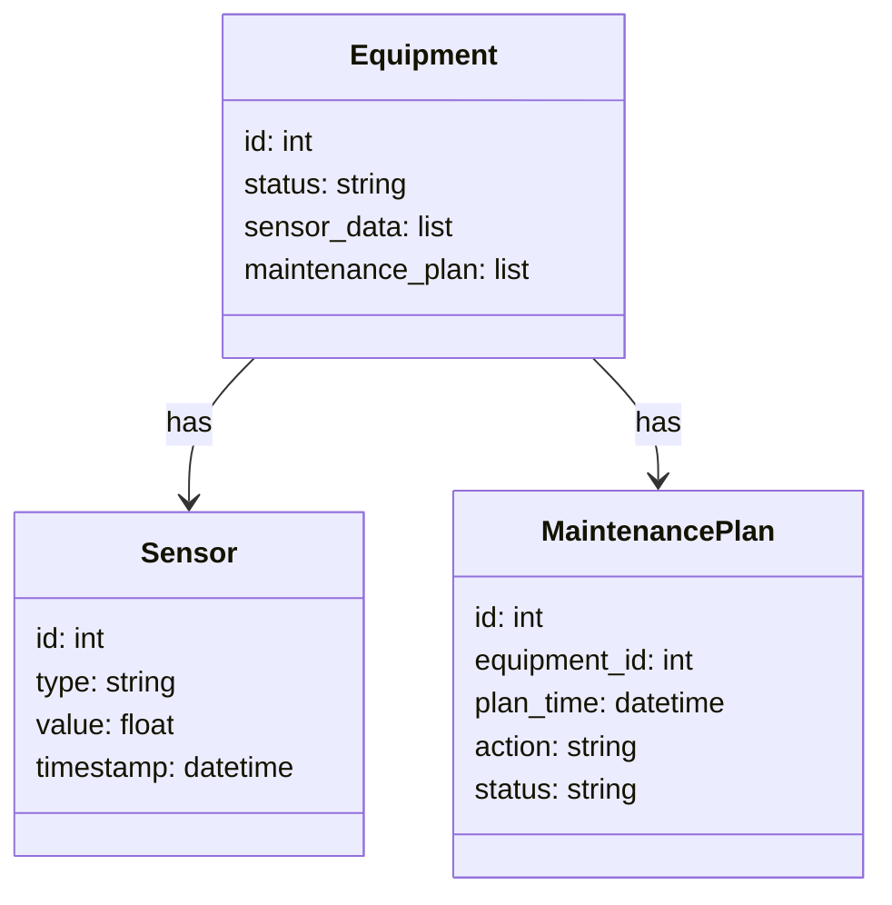
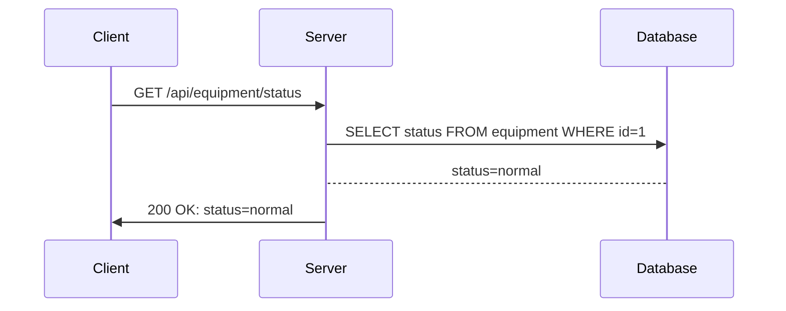
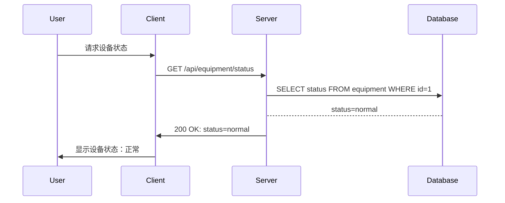

                 


# AI Agent在企业设备预测性维护中的应用

## 关键词：AI Agent, 预测性维护, 企业设备, 机器学习, 预测模型, 数据分析, 系统架构

## 摘要：
本文详细探讨了AI Agent在企业设备预测性维护中的应用，从背景、核心技术到算法实现，再到系统架构和项目实战，层层深入，展示了如何利用AI技术提升设备维护效率和降低成本。通过具体案例和代码实现，帮助读者理解并掌握AI Agent在预测性维护中的实际应用。

## 第一部分: AI Agent与预测性维护概述

## 第1章: AI Agent与预测性维护的背景与概念

### 1.1 企业设备维护的背景与挑战

#### 1.1.1 传统设备维护模式的局限性
传统的设备维护模式主要依赖于定期检查和事后维修，这种方式存在以下问题：
- **高成本**：定期检查和维修可能在设备正常运行时进行，导致生产中断。
- **低效率**：事后维修可能导致设备故障后长时间停机，维修成本高昂。
- **不可预测性**：无法提前预知设备故障，导致维护计划难以合理安排。

#### 1.1.2 预测性维护的定义与优势
预测性维护是一种基于设备运行数据和状态，通过数据分析和模型预测，提前预知设备可能出现的故障，并在故障发生前进行维护的策略。其优势包括：
- **减少停机时间**：通过提前预测故障，可以在设备发生故障前进行维护，避免生产中断。
- **降低维修成本**：通过预测性维护，可以减少不必要的定期检查和维修，降低维修成本。
- **延长设备寿命**：通过及时发现和处理潜在故障，可以延长设备的使用寿命。

#### 1.1.3 AI Agent在预测性维护中的作用
AI Agent（智能代理）是一种能够感知环境、执行任务并做出决策的智能系统。在预测性维护中，AI Agent可以用于：
- **实时监控设备状态**：通过传感器数据实时监控设备运行状态，识别潜在故障。
- **预测设备故障**：基于历史数据和机器学习模型，预测设备可能出现的故障。
- **优化维护计划**：根据预测结果，优化维护计划，确保维护工作高效进行。

### 1.2 AI Agent的核心概念

#### 1.2.1 AI Agent的基本定义
AI Agent是一种能够感知环境、执行任务并做出决策的智能系统。它可以分为以下几类：
- **简单反射型Agent**：基于当前感知做出反应，不依赖历史信息。
- **基于模型的反射型Agent**：基于内部模型和历史信息做出决策。
- **目标驱动型Agent**：根据目标和环境信息进行决策。
- **效用驱动型Agent**：通过最大化效用函数来优化决策。

#### 1.2.2 AI Agent的分类与特点
AI Agent可以根据功能和应用场景进行分类：
- **监视型Agent**：主要用于监控设备状态，如传感器数据监控。
- **控制型Agent**：用于控制设备运行，如自动调整设备参数。
- **决策型Agent**：用于决策维护策略，如预测设备故障并制定维护计划。
- **协作型Agent**：用于多设备协同工作，如协调不同设备的维护计划。

#### 1.2.3 AI Agent在企业设备维护中的应用场景
- **实时监控**：通过传感器数据实时监控设备运行状态。
- **故障预测**：基于历史数据和机器学习模型，预测设备可能出现的故障。
- **优化维护计划**：根据预测结果，优化维护计划，确保维护工作高效进行。

## 第2章: 预测性维护的技术背景

### 2.1 数据驱动的预测性维护

#### 2.1.1 数据采集与分析的重要性
预测性维护的核心是数据分析，数据的准确性和完整性直接影响预测结果。数据采集包括以下几种方式：
- **传感器数据**：设备运行过程中产生的温度、压力、振动等数据。
- **日志数据**：设备运行过程中产生的日志信息，如错误代码、警告信息等。
- **历史数据**：设备的历史维修记录、运行记录等。

#### 2.1.2 大数据分析在预测性维护中的应用
大数据分析技术在预测性维护中的应用包括：
- **数据清洗**：处理缺失值、异常值等，确保数据质量。
- **特征提取**：从原始数据中提取有用的特征，用于模型训练。
- **模型训练**：基于特征数据训练机器学习模型，用于故障预测。

### 2.2 AI技术在预测性维护中的发展

#### 2.2.1 机器学习与深度学习的引入
机器学习和深度学习技术在预测性维护中的应用包括：
- **监督学习**：基于标签数据训练分类模型，用于故障分类。
- **无监督学习**：基于无标签数据发现异常模式，用于异常检测。
- **深度学习**：基于神经网络模型，如LSTM，进行时间序列预测。

#### 2.2.2 自然语言处理与计算机视觉在预测性维护中的应用
自然语言处理和计算机视觉技术在预测性维护中的应用包括：
- **自然语言处理**：用于分析设备日志和文档，提取有用信息。
- **计算机视觉**：用于设备图像分析，如通过摄像头检测设备表面缺陷。

### 2.3 AI Agent在预测性维护中的技术优势

#### 2.3.1 自动化监测与决策的优势
AI Agent可以通过自动化监测和决策，显著提高预测性维护的效率和准确性：
- **自动化监测**：实时监控设备状态，自动识别潜在故障。
- **自动化决策**：基于预测结果自动制定维护计划，减少人工干预。

#### 2.3.2 多设备协同优化的可能性
AI Agent可以通过多设备协同优化，实现资源的最优配置：
- **协同监测**：多个AI Agent协同工作，共同监测设备状态。
- **协同决策**：多个AI Agent协同决策，优化维护计划，减少资源浪费。

---

## 第二部分: AI Agent的核心技术与原理

## 第3章: AI Agent的核心技术原理

### 3.1 数据采集与特征提取

#### 3.1.1 数据采集的常见方法
数据采集的常见方法包括：
- **传感器数据采集**：通过传感器实时采集设备运行数据。
- **日志数据采集**：采集设备运行过程中的日志信息。
- **历史数据采集**：采集设备的历史维修记录和运行记录。

#### 3.1.2 设备数据的特征提取与分析
特征提取是数据分析的关键步骤，以下是几种常见的特征提取方法：
- **统计特征**：均值、方差、最大值、最小值等。
- **时间序列特征**：趋势、周期性、波动性等。
- **频域特征**：通过傅里叶变换提取频域特征。

### 3.2 预测模型的构建与优化

#### 3.2.1 时间序列分析模型的构建
时间序列分析模型是预测性维护中常用的模型之一。以下是几种常见的时间序列分析模型：
- **ARIMA模型**：自回归积分滑动平均模型，适用于线性时间序列数据。
- **LSTM模型**：长短期记忆网络，适用于非线性时间序列数据。

#### 3.2.2 基于机器学习的预测模型优化
机器学习模型的优化可以通过以下步骤进行：
- **数据预处理**：清洗数据，处理缺失值、异常值等。
- **特征选择**：选择对预测结果影响较大的特征。
- **模型训练**：基于训练数据训练模型，并调整模型参数。
- **模型评估**：通过测试数据评估模型性能，如准确率、召回率等。

### 3.3 决策机制的设计与实现

#### 3.3.1 多目标优化的决策机制
多目标优化的决策机制可以通过以下步骤实现：
- **目标定义**：定义多个优化目标，如最小化停机时间、最大化设备利用率等。
- **权重分配**：根据目标的重要程度分配权重。
- **决策规则**：根据目标和权重制定决策规则，指导维护计划的制定。

#### 3.3.2 自适应学习的决策机制
自适应学习的决策机制可以通过以下步骤实现：
- **在线学习**：根据实时数据不断更新模型。
- **反馈机制**：根据维护结果反馈调整决策策略。

---

## 第四部分: 算法原理

## 第4章: 算法原理与实现

### 4.1 时间序列分析算法

#### 4.1.1 ARIMA模型的实现

##### ARIMA模型的公式
$$ARIMA(p, d, q)$$
其中：
- p：自回归阶数
- d：差分阶数
- q：移动平均阶数

##### ARIMA模型的实现步骤
1. **数据预处理**：对数据进行差分，使其平稳。
2. **模型参数选择**：通过网格搜索选择最优参数。
3. **模型训练**：基于训练数据训练ARIMA模型。
4. **模型预测**：基于测试数据预测未来值。

##### 代码示例
```python
from statsmodels.tsa.arima_model import ARIMA

# 数据预处理
data = df['value'].values
diff = data.diff().dropna()

# 模型训练
model = ARIMA(diff, order=(5, 1, 0))
model_fit = model.fit()

# 模型预测
forecast = model_fit.forecast(steps=5)
print(forecast)
```

#### 4.1.2 LSTM模型的实现

##### LSTM模型的结构
LSTM（长短期记忆网络）是一种特殊的RNN，包含输入门、遗忘门和输出门。

##### LSTM模型的公式
$$
i_t = \sigma(w_i x_t + u_i h_{t-1} + b_i) \\
f_t = \sigma(w_f x_t + u_f h_{t-1} + b_f) \\
o_t = \sigma(w_o x_t + u_o h_{t-1} + b_o) \\
g_t = \tanh(w_g x_t + u_g h_{t-1} + b_g) \\
h_t = i_t g_t + f_t h_{t-1} \\
o_t = o_t \tanh(h_t)
$$

##### LSTM模型的实现步骤
1. **数据预处理**：将时间序列数据转换为样本-时序数据。
2. **模型构建**：构建LSTM模型，并编译模型。
3. **模型训练**：基于训练数据训练LSTM模型。
4. **模型预测**：基于测试数据预测未来值。

##### 代码示例
```python
import numpy as np
from tensorflow.keras.models import Sequential
from tensorflow.keras.layers import LSTM, Dense

# 数据预处理
data = df['value'].values
X = []
y = []
for i in range(len(data) - 5):
    X.append(data[i:i+5])
    y.append(data[i+5])
X = np.array(X).reshape(len(X), 5, 1)
y = np.array(y)

# 模型构建
model = Sequential()
model.add(LSTM(5, input_shape=(5, 1)))
model.add(Dense(1))
model.compile(loss='mean_squared_error', optimizer='adam')

# 模型训练
model.fit(X, y, epochs=100, batch_size=32)

# 模型预测
test_X = np.array([data[-5:]]).reshape(1, 5, 1)
test_forecast = model.predict(test_X)
print(test_forecast)
```

### 4.2 异常检测算法

#### 4.2.1 基于Isolation Forest的异常检测

##### Isolation Forest算法的实现步骤
1. **数据预处理**：对数据进行标准化处理。
2. **模型训练**：基于训练数据训练Isolation Forest模型。
3. **异常检测**：基于测试数据检测异常点。

##### 代码示例
```python
from sklearn.ensemble import IsolationForest

# 数据预处理
data = df['value'].values
data_normalized = (data - data.mean()) / data.std()

# 模型训练
model = IsolationForest(n_estimators=100, random_state=42)
model.fit(data_normalized.reshape(-1, 1))

# 异常检测
test_data = np.array([1000, 500, 200, 150, 100]).reshape(-1, 1)
test_data_normalized = (test_data - data.mean()) / data.std()
outlier_score = model.predict(test_data_normalized.reshape(-1, 1))
print(outlier_score)
```

### 4.3 强化学习算法

#### 4.3.1 基于Q-Learning的强化学习

##### Q-Learning算法的实现步骤
1. **状态定义**：定义设备状态，如正常运行、轻微故障、严重故障等。
2. **动作定义**：定义维护动作，如更换零件、调整参数等。
3. **奖励机制**：定义奖励函数，根据状态和动作给予奖励。
4. **Q值更新**：根据奖励函数更新Q值表。

##### 代码示例
```python
import numpy as np

# 状态定义
states = ['normal', 'minor_failure', 'major_failure']

# 动作定义
actions = ['replace_part', 'adjust_parameter']

# 奖励机制
rewards = {
    ('normal', 'replace_part'): 0,
    ('normal', 'adjust_parameter'): 0,
    ('minor_failure', 'replace_part'): 1,
    ('minor_failure', 'adjust_parameter'): 0,
    ('major_failure', 'replace_part'): 0,
    ('major_failure', 'adjust_parameter'): -1
}

# Q值表初始化
Q = { (s, a): 0 for s in states for a in actions }

# Q值更新
learning_rate = 0.1
gamma = 0.9

# 训练过程
for episode in range(100):
    current_state = 'normal'
    while current_state != 'major_failure':
        action = np.random.choice(actions)
        next_state = 'minor_failure' if action == 'replace_part' else 'major_failure'
        reward = rewards[(current_state, action)]
        Q[(current_state, action)] += learning_rate * (reward + gamma * max(Q[(next_state, a)] for a in actions) - Q[(current_state, action)])
        current_state = next_state

print(Q)
```

---

## 第五部分: 系统分析与架构设计

## 第5章: 系统分析与架构设计

### 5.1 项目背景介绍

#### 5.1.1 项目目标
本项目旨在通过AI Agent实现企业设备的预测性维护，提高设备维护效率，降低维修成本。

#### 5.1.2 项目范围
项目范围包括设备数据采集、特征提取、模型训练、异常检测、决策制定和维护执行等环节。

### 5.2 系统功能设计

#### 5.2.1 领域模型
以下是领域模型的mermaid类图：



#### 5.2.2 系统架构
以下是系统架构的mermaid架构图：


### 5.3 接口设计

#### 5.3.1 API接口设计
以下是API接口的mermaid序列图：



### 5.4 交互设计

#### 5.4.1 用户与系统交互
以下是用户与系统交互的mermaid序列图：



---

## 第六部分: 项目实战

## 第6章: 项目实战与案例分析

### 6.1 环境搭建

#### 6.1.1 安装Python环境
安装Python 3.8及以上版本，并安装以下库：
- numpy
- pandas
- scikit-learn
- tensorflow
- statsmodels
- mermaid
- matplotlib

#### 6.1.2 数据准备
准备设备运行数据，包括传感器数据、日志数据和历史维修记录。

### 6.2 核心代码实现

#### 6.2.1 数据采集与预处理

##### 数据采集代码
```python
import pandas as pd
import numpy as np
import requests
import time

# 传感器数据采集
def get_sensor_data():
    try:
        response = requests.get('http://localhost:8000/sensor_data')
        data = response.json()
        return data
    except Exception as e:
        print(f"Error getting sensor data: {e}")
        return None

# 数据预处理
def preprocess_data(data):
    df = pd.DataFrame(data)
    df['timestamp'] = pd.to_datetime(df['timestamp'])
    df.set_index('timestamp', inplace=True)
    df = df.resample('1T').mean().dropna()
    return df

# 数据存储
def store_data(df, filename):
    df.to_csv(filename, index=False)

# 主程序
if __name__ == '__main__':
    while True:
        data = get_sensor_data()
        if data is not None:
            df = preprocess_data(data)
            store_data(df, 'equipment_data.csv')
        time.sleep(60)
```

#### 6.2.2 模型训练与预测

##### 模型训练代码
```python
import pandas as pd
import numpy as np
from sklearn.ensemble import IsolationForest
from tensorflow.keras.models import Sequential
from tensorflow.keras.layers import LSTM, Dense

# 数据加载
df = pd.read_csv('equipment_data.csv')

# 数据分割
train_size = int(len(df) * 0.8)
train_data = df.iloc[:train_size]['value'].values
test_data = df.iloc[train_size:]['value'].values

# LSTM模型训练
model = Sequential()
model.add(LSTM(5, input_shape=(5, 1)))
model.add(Dense(1))
model.compile(loss='mean_squared_error', optimizer='adam')

train_X = []
train_y = []
for i in range(len(train_data) - 5):
    train_X.append(train_data[i:i+5])
    train_y.append(train_data[i+5])
train_X = np.array(train_X).reshape(len(train_X), 5, 1)
train_y = np.array(train_y)

model.fit(train_X, train_y, epochs=100, batch_size=32)

# 模型预测
test_X = []
for i in range(len(test_data) - 5):
    test_X.append(test_data[i:i+5])
test_X = np.array(test_X).reshape(len(test_X), 5, 1)

test_forecast = model.predict(test_X)
print(test_forecast)
```

#### 6.2.3 决策机制实现

##### 决策机制代码
```python
import numpy as np
from sklearn.ensemble import IsolationForest

# 异常检测
model = IsolationForest(n_estimators=100, random_state=42)
model.fit(train_data.reshape(-1, 1))

# 决策机制
def decide_maintenance(action_score):
    if action_score > 0.5:
        return 'schedule_maintenance'
    else:
        return 'no_maintenance'

# 测试数据
test_action_score = 0.6
decision = decide_maintenance(test_action_score)
print(decision)
```

### 6.3 案例分析

#### 6.3.1 数据分析与可视化
以下是数据分析与可视化的代码：

```python
import pandas as pd
import matplotlib.pyplot as plt

# 数据加载
df = pd.read_csv('equipment_data.csv')

# 数据可视化
plt.figure(figsize=(10, 6))
plt.plot(df['timestamp'], df['value'])
plt.title('Equipment Data Visualization')
plt.xlabel('Time')
plt.ylabel('Value')
plt.show()
```

#### 6.3.2 模型评估与优化
以下是模型评估与优化的代码：

```python
from sklearn.metrics import mean_squared_error
from sklearn.metrics import mean_absolute_error

# 模型评估
test_forecast = model.predict(test_X)
mse = mean_squared_error(test_y, test_forecast)
mae = mean_absolute_error(test_y, test_forecast)
print(f'MSE: {mse}, MAE: {mae}')
```

### 6.4 项目总结

#### 6.4.1 项目成果
通过本项目，我们实现了基于AI Agent的企业设备预测性维护系统，提高了设备维护效率，降低了维修成本。

#### 6.4.2 经验与教训
在项目实施过程中，我们总结出以下经验和教训：
- **数据质量**：数据的准确性和完整性对模型性能影响较大。
- **模型选择**：选择合适的模型和算法是项目成功的关键。
- **系统架构**：系统的可扩展性和可维护性需要充分考虑。

---

## 第七部分: 最佳实践与总结

## 第7章: 最佳实践与总结

### 7.1 最佳实践

#### 7.1.1 数据质量管理
确保数据的准确性和完整性，数据预处理是关键。

#### 7.1.2 模型选择与优化
根据具体场景选择合适的模型，并通过参数调优和模型评估不断优化。

#### 7.1.3 系统架构设计
系统架构设计要充分考虑可扩展性、可维护性和可移植性。

### 7.2 总结与展望

#### 7.2.1 项目总结
通过本项目，我们成功实现了基于AI Agent的企业设备预测性维护系统，验证了AI技术在预测性维护中的应用价值。

#### 7.2.2 未来展望
未来，随着AI技术的不断发展，预测性维护将更加智能化和自动化。我们可以进一步研究以下方向：
- **边缘计算**：将AI Agent部署在设备边缘，实现本地化的实时监控和决策。
- **5G技术**：利用5G高带宽、低延迟的特点，实现设备数据的实时传输和快速响应。
- **知识图谱**：构建设备知识图谱，实现设备故障的智能诊断和维护策略的自适应优化。

---

## 作者：AI天才研究院/AI Genius Institute & 禅与计算机程序设计艺术 /Zen And The Art of Computer Programming

