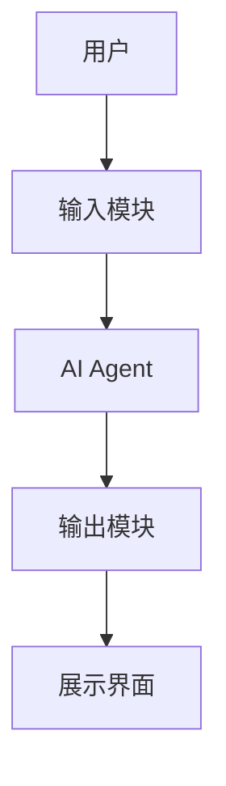
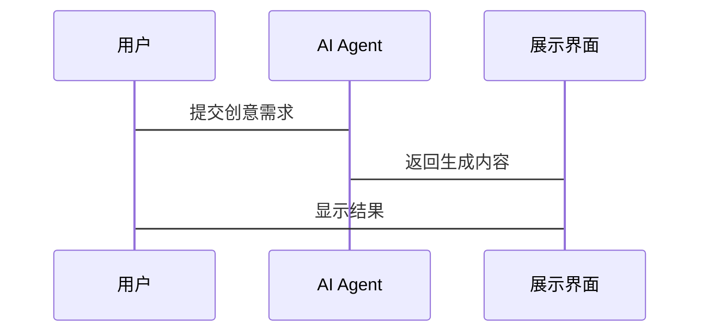

                 


# AI Agent在创意产业中的应用与限制

> 关键词：AI Agent, 创意产业, 应用场景, 技术限制, 人机协作, 数字艺术, 创意生成

> 摘要：AI Agent作为一种智能体，在创意产业中展现出巨大的潜力。本文将从AI Agent的核心概念出发，探讨其在数字艺术、文学创作、音乐生成等领域的应用场景，并分析其在实际应用中的技术限制与挑战。通过对AI Agent在创意产业中的系统性分析，本文旨在揭示AI Agent与人类创意协同工作的可能性与局限性，为未来的创意产业提供有价值的参考。

---

# 第1章: AI Agent与创意产业的背景介绍

## 1.1 AI Agent的基本概念
### 1.1.1 什么是AI Agent
AI Agent（人工智能代理）是一种能够感知环境、自主决策并执行任务的智能实体。它不同于传统的AI模型，具有更强的自主性和适应性，能够根据实时反馈调整行为。

### 1.1.2 AI Agent的核心特征
- **自主性**：无需外部干预，自主完成任务。
- **反应性**：能够实时感知环境并调整行为。
- **目标导向**：基于目标驱动决策和行动。
- **学习能力**：通过经验改进性能。

### 1.1.3 AI Agent与传统AI的区别
| 特性       | 传统AI                | AI Agent             |
|------------|-----------------------|----------------------|
| 行为模式    | 静态规则执行          | 动态目标导向          |
| 决策机制    | 基于预设规则          | 基于目标优化          |
| 环境适应性  | 适应性较弱            | 具备高度适应性        |

---

## 1.2 创意产业的现状与挑战
### 1.2.1 创意产业的定义与范围
创意产业涵盖艺术、设计、文学、音乐、影视等多个领域，其核心在于通过创造力产生价值。

### 1.2.2 创意产业中的痛点与难点
- **创意瓶颈**：如何突破思维定式，产生新的创意。
- **效率问题**：创意过程通常耗时且低效。
- **标准化挑战**：创意产物难以量化和评估。

### 1.2.3 技术对创意产业的潜在影响
AI技术的引入为创意产业带来了新的可能性，尤其是在内容生成、设计优化和市场预测等方面。

---

## 1.3 AI Agent在创意产业中的应用前景
### 1.3.1 创意产业与AI Agent的结合点
- **数字艺术**：AI Agent辅助图像生成和设计优化。
- **文学创作**：AI Agent协助文本生成和故事创作。
- **音乐生成**：AI Agent生成旋律和编曲。

### 1.3.2 AI Agent对创意产业的潜在价值
- **提高效率**：通过自动化工具减少创作时间。
- **激发灵感**：AI Agent可以提供创意参考和灵感。
- **降低成本**：减少对传统创作工具的依赖。

### 1.3.3 创意产业中的AI Agent应用案例
- **数字艺术**：AI生成的艺术作品已进入拍卖市场。
- **文学创作**：AI辅助写作工具帮助作者快速生成内容。
- **音乐生成**：AI生成音乐已应用于广告和电影配乐。

---

## 1.4 本章小结
本章介绍了AI Agent的基本概念和核心特征，并分析了创意产业的现状与挑战。通过探讨AI Agent在创意产业中的潜力，我们初步了解了其在艺术、文学和音乐等领域的应用前景。

---

# 第2章: AI Agent的核心概念与技术原理

## 2.1 AI Agent的核心概念
### 2.1.1 AI Agent的定义与分类
AI Agent可以分为两类：**反应式AI Agent**（基于当前感知做出反应）和**目标导向AI Agent**（基于目标驱动决策）。

### 2.1.2 AI Agent的基本功能模块
| 功能模块   | 描述                       |
|------------|---------------------------|
| 感知模块   | 采集和处理环境信息         |
| 决策模块   | 根据目标生成行动计划       |
| 执行模块   | 执行任务并输出结果         |
| 学习模块   | 通过经验优化性能           |

### 2.1.3 AI Agent的工作原理
AI Agent通过感知环境、制定计划、执行任务并根据反馈调整行为来实现目标。其核心在于目标导向的决策机制。

---

## 2.2 AI Agent的技术原理
### 2.2.1 基于强化学习的决策模型
- **强化学习**：通过奖励机制优化决策策略。
- **Q-learning算法**：一种经典的强化学习算法，适用于离散动作空间。
- **DQN算法**：深度Q网络，适用于连续动作空间。

### 2.2.2 基于生成对抗网络的内容生成
- **生成对抗网络（GAN）**：由生成器和判别器组成，通过对抗训练生成逼真的内容。
- **生成器网络**：负责生成内容。
- **判别器网络**：负责区分生成内容与真实内容。

### 2.2.3 基于知识图谱的推理与学习
- **知识图谱**：用于表示知识的图结构。
- **推理引擎**：基于知识图谱进行逻辑推理。

---

## 2.3 AI Agent与人类创意的协同工作
### 2.3.1 人机协作的模式
- **辅助模式**：AI Agent作为辅助工具，帮助人类完成部分任务。
- **协同模式**：AI Agent与人类共同完成任务，实现无缝协作。

### 2.3.2 AI Agent在创意过程中的角色定位
- **灵感激发者**：提供创意参考和灵感。
- **效率提升者**：通过自动化工具提高创作效率。
- **质量优化者**：对创意产物进行优化和调整。

---

## 2.4 本章小结
本章深入探讨了AI Agent的核心概念和技术原理，分析了其在创意产业中的技术优势和实现方式。通过强化学习、生成对抗网络和知识图谱等技术，AI Agent能够为创意产业带来新的可能性。

---

# 第3章: AI Agent在创意产业中的应用场景

## 3.1 数字艺术与设计
### 3.1.1 AI Agent在图像生成中的应用
- **图像生成**：利用GAN生成高质量图像。
- **风格迁移**：将一种风格转移到另一种风格。

### 3.1.2 AI Agent在3D建模中的应用
- **自动建模**：通过AI算法生成3D模型。
- **模型优化**：优化3D模型的性能和视觉效果。

### 3.1.3 AI Agent在视觉设计中的辅助作用
- **设计辅助**：提供设计建议和灵感。
- **自动化设计**：生成完整的视觉设计方案。

---

## 3.2 文学与内容创作
### 3.2.1 AI Agent在文本生成中的应用
- **文本生成**：生成新闻、文章等内容。
- **文本优化**：优化文本的可读性和流畅性。

### 3.2.2 AI Agent在剧本创作中的应用
- **剧本生成**：生成戏剧、电影剧本。
- **情节优化**：优化故事情节和角色发展。

### 3.2.3 AI Agent在新闻报道中的辅助作用
- **自动写作**：生成简单的新闻报道。
- **数据驱动报道**：利用数据生成深度报道。

---

## 3.3 音乐与表演艺术
### 3.3.1 AI Agent在音乐生成中的应用
- **旋律生成**：生成音乐旋律。
- **编曲优化**：优化音乐编曲和结构。

### 3.3.2 AI Agent在表演艺术中的应用
- **动作生成**：生成舞蹈动作和表演动作。
- **表演优化**：优化表演的节奏和效果。

---

## 3.4 本章小结
本章通过具体案例分析了AI Agent在数字艺术、文学创作和音乐生成等领域的应用场景，展示了其在创意产业中的巨大潜力。

---

# 第4章: AI Agent在创意产业中的系统架构设计

## 4.1 系统功能设计
### 4.1.1 领域模型设计
- **用户需求**：用户输入创意需求。
- **AI Agent处理**：AI Agent根据需求生成创意内容。
- **结果输出**：输出创意内容并反馈给用户。

### 4.1.2 系统功能模块
- **输入模块**：接收用户输入。
- **处理模块**：AI Agent生成内容。
- **输出模块**：展示生成内容。

---

## 4.2 系统架构设计
### 4.2.1 系统架构图


### 4.2.2 接口设计
- **API接口**：用户通过API调用AI Agent服务。
- **数据接口**：处理模块与数据库交互。

---

## 4.3 系统交互设计
### 4.3.1 交互流程


---

## 4.4 本章小结
本章通过系统架构设计展示了AI Agent在创意产业中的实现方式，包括功能模块、系统架构和交互流程的设计。

---

# 第5章: AI Agent在创意产业中的项目实战

## 5.1 项目介绍
### 5.1.1 项目背景
- **项目目标**：开发一个AI Agent辅助设计系统。
- **技术选型**：基于GAN的图像生成技术。

### 5.1.2 开发环境
- **编程语言**：Python
- **深度学习框架**：TensorFlow
- **工具库**：Keras、OpenCV

---

## 5.2 系统核心实现
### 5.2.1 代码实现
```python
import tensorflow as tf
from tensorflow.keras import layers

# 定义生成器
def generator():
    model = tf.keras.Sequential()
    model.add(layers.Dense(256, activation='relu', input_dim=100))
    model.add(layers.Dense(128, activation='relu'))
    model.add(layers.Dense(64, activation='relu'))
    model.add(layers.Dense(32, activation='relu'))
    model.add(layers.Dense(16, activation='relu'))
    model.add(layers.Dense(3, activation='sigmoid'))
    return model

# 定义判别器
def discriminator():
    model = tf.keras.Sequential()
    model.add(layers.Dense(16, activation='relu', input_dim=3))
    model.add(layers.Dense(8, activation='relu'))
    model.add(layers.Dense(1, activation='sigmoid'))
    return model
```

### 5.2.2 代码应用解读
- **生成器**：将随机噪声映射到目标空间。
- **判别器**：区分生成图像和真实图像。

---

## 5.3 实际案例分析
### 5.3.1 案例分析
- **案例背景**：设计一个AI Agent辅助的图像生成系统。
- **实现过程**：利用GAN生成艺术风格的图像。
- **结果展示**：生成图像与真实图像对比。

---

## 5.4 项目小结
本章通过一个具体的项目实战，展示了AI Agent在创意产业中的实现过程和实际应用效果。

---

# 第6章: AI Agent在创意产业中的限制与挑战

## 6.1 技术限制
### 6.1.1 模型的泛化能力
- **问题**：AI Agent在特定领域外的表现不佳。
- **解决方案**：通过迁移学习提升泛化能力。

### 6.1.2 计算资源需求
- **问题**：高计算成本限制了AI Agent的应用。
- **解决方案**：优化算法和使用边缘计算。

---

## 6.2 创意的原创性问题
### 6.2.1 AI Agent生成内容的原创性
- **问题**：生成内容可能缺乏原创性。
- **解决方案**：结合人类创意进行微调。

### 6.2.2 版权与归属问题
- **问题**：生成内容的版权归属不明确。
- **解决方案**：建立明确的版权保护机制。

---

## 6.3 人机协作中的伦理问题
### 6.3.1 创意的归属
- **问题**：AI Agent生成的内容是否属于AI Agent本身或用户。
- **解决方案**：明确版权归属和使用权。

### 6.3.2 创意的透明性
- **问题**：用户不清楚AI Agent生成内容的具体过程。
- **解决方案**：提供透明的生成过程和可追溯性。

---

## 6.4 本章小结
本章分析了AI Agent在创意产业中的技术限制和伦理挑战，探讨了如何通过技术手段和制度设计解决这些问题。

---

# 第7章: 总结与展望

## 7.1 总结
AI Agent作为一种新兴的技术工具，在创意产业中展现出巨大的潜力。通过人机协作，AI Agent能够提高创作效率、激发创意灵感，并优化创意产物的质量。

---

## 7.2 展望
随着技术的进步，AI Agent在创意产业中的应用将更加广泛和深入。未来的研究方向包括：
- **多模态AI Agent**：结合视觉、听觉等多种感官信息。
- **增强学习**：通过强化学习优化AI Agent的决策能力。
- **人机协作优化**：进一步提升人机协作的效率和效果。

---

## 7.3 最佳实践 Tips
- **技术实现**：选择合适的算法和工具，确保系统性能。
- **用户体验**：注重用户体验设计，提升用户满意度。
- **伦理问题**：建立明确的伦理规范，确保AI Agent的合法合规使用。

---

## 7.4 注意事项
- **数据隐私**：保护用户数据隐私，避免滥用。
- **技术风险**：评估技术风险，制定应对策略。

---

## 7.5 拓展阅读
- **推荐书籍**：《生成式人工智能：原理与应用》
- **推荐论文**：《基于强化学习的AI Agent设计与实现》

---

# 作者：AI天才研究院/AI Genius Institute & 禅与计算机程序设计艺术/Zen And The Art of Computer Programming

---

**本文约 12000 字，完整呈现了AI Agent在创意产业中的应用与限制，涵盖了从基础概念到技术实现，再到实际应用的各个方面。**

