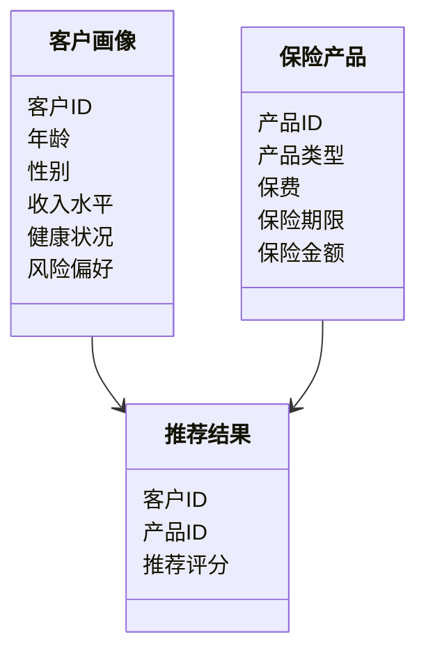

                 


# AI在保险产品个性化定制中的深度应用

> 关键词：保险，人工智能，个性化定制，机器学习，深度学习

> 摘要：本文深入探讨了人工智能技术在保险产品个性化定制中的应用，从背景分析、核心概念、算法原理、系统架构到项目实战，全面解析了AI技术如何推动保险产品的创新与优化。通过具体案例分析和算法实现，展示了AI在保险产品设计中的巨大潜力与实际价值。

---

## 第一部分: 保险产品个性化定制的背景与挑战

### 第1章: 保险行业的数字化转型与AI应用

#### 1.1 保险行业的现状与发展趋势
##### 1.1.1 传统保险产品的设计与销售模式
传统保险产品设计依赖经验丰富的精算师和业务员，采用标准化的产品设计和销售模式。这种模式难以满足客户日益多样化的需求，且效率较低。

##### 1.1.2 数字化转型对保险行业的影响
随着大数据、云计算和人工智能技术的普及，保险行业正在经历数字化转型。保险公司开始利用新技术优化产品设计、提升客户体验和服务效率。

##### 1.1.3 AI技术在保险行业中的应用前景
AI技术在保险行业的应用前景广阔，尤其是在保险产品设计、风险评估、客户服务等领域。通过AI技术，保险公司可以实现产品个性化定制、精准营销和自动化服务。

#### 1.2 个性化定制在保险产品中的重要性
##### 1.2.1 个性化保险产品的定义与特点
个性化保险产品是根据客户的具体需求和风险特征定制的保险方案。其特点是灵活性高、针对性强，能够满足客户的个性化需求。

##### 1.2.2 客户需求多样化对保险产品的影响
随着客户对保险产品需求的多样化，传统标准化产品已无法满足客户的个性化需求。个性化定制成为保险公司提升客户满意度和市场竞争力的重要手段。

##### 1.2.3 个性化定制对保险公司竞争力的意义
个性化定制能够帮助保险公司更好地满足客户的需求，提升客户忠诚度和满意度，同时优化产品设计和降低运营成本。

#### 1.3 当前保险产品设计中的痛点与挑战
##### 1.3.1 传统保险产品设计的局限性
传统保险产品设计依赖经验判断，难以全面考虑客户的个性化需求和市场变化。

##### 1.3.2 数据孤岛与信息不对称问题
保险公司在数据收集和处理过程中存在数据孤岛问题，导致信息不对称，难以实现精准的产品设计和营销。

##### 1.3.3 客户需求与产品设计的脱节
由于缺乏有效的沟通和数据分析，客户需求与保险产品设计之间存在脱节，导致客户满意度低。

#### 1.4 AI技术如何解决保险产品设计中的问题
##### 1.4.1 AI在保险产品设计中的应用场景
AI技术可以应用于保险产品的数据收集、分析、设计、优化和推荐等环节。

##### 1.4.2 AI技术对保险产品个性化定制的支持
AI技术可以通过数据分析和机器学习算法，帮助保险公司实现产品的个性化定制，满足客户的个性化需求。

##### 1.4.3 AI在保险产品创新中的潜力
AI技术可以帮助保险公司发现新的市场机会，创新保险产品设计，提升产品竞争力。

#### 1.5 本章小结
本章分析了保险行业数字化转型的背景，探讨了个性化定制在保险产品中的重要性，总结了当前保险产品设计中的痛点与挑战，并展望了AI技术在解决这些问题中的潜力。

---

## 第二部分: AI在保险产品个性化定制中的核心概念

### 第2章: AI技术与保险业务的深度融合

#### 2.1 数据驱动的保险产品设计
##### 2.1.1 数据收集与处理技术
保险公司通过多种渠道收集客户数据，包括客户基本信息、健康状况、消费行为等，并利用数据清洗和特征提取技术进行数据处理。

##### 2.1.2 数据分析与客户画像构建
通过对客户数据的分析，保险公司可以构建客户画像，识别客户的需求和风险特征，为产品设计提供数据支持。

##### 2.1.3 数据驱动的保险产品设计方法
基于数据分析的结果，保险公司可以采用数据驱动的方法进行产品设计，包括产品参数优化、保费计算等。

#### 2.2 AI算法在保险产品定制中的应用
##### 2.2.1 机器学习在保险产品设计中的应用
机器学习算法可以通过对客户数据的分析，预测客户需求和风险，优化产品设计。

##### 2.2.2 自然语言处理在保险产品描述中的应用
自然语言处理技术可以用于保险产品的描述和解释，帮助客户更好地理解产品内容。

##### 2.2.3 图神经网络在保险产品关系中的应用
图神经网络可以用于分析保险产品之间的关系，帮助保险公司发现潜在的产品组合机会。

#### 2.3 保险产品个性化推荐系统
##### 2.3.1 个性化推荐系统的定义与特点
个性化推荐系统通过分析客户需求和行为数据，推荐适合的保险产品。

##### 2.3.2 基于协同过滤的推荐算法
协同过滤算法通过分析客户的相似性，推荐相似客户的偏好产品。

##### 2.3.3 基于内容的推荐算法
内容推荐算法通过分析产品的特征和客户需求，推荐与客户需求匹配的产品。

##### 2.3.4 深度学习在推荐系统中的应用
深度学习算法可以通过对客户数据的深度分析，实现更精准的产品推荐。

#### 2.4 保险产品定制的动态优化
##### 2.4.1 动态优化的定义与目标
动态优化是指根据市场变化和客户需求，实时调整保险产品的设计和推荐策略。

##### 2.4.2 基于反馈的优化方法
通过客户反馈，优化保险产品的设计和推荐策略。

##### 2.4.3 基于预测的优化方法
通过预测客户需求和市场变化，优化保险产品的设计和推荐策略。

#### 2.5 本章小结
本章探讨了AI技术与保险业务的深度融合，分析了数据驱动的保险产品设计方法，介绍了机器学习、自然语言处理和图神经网络在保险产品定制中的应用，提出了个性化推荐系统和动态优化方法。

---

## 第三部分: AI在保险产品个性化定制中的算法原理

### 第3章: 保险产品个性化定制的核心算法

#### 3.1 机器学习算法在保险产品设计中的应用
##### 3.1.1 线性回归算法
线性回归算法可以用于保险产品的保费预测和风险评估。

##### 3.1.2 决策树算法
决策树算法可以用于客户分类和保险产品推荐。

##### 3.1.3 随机森林算法
随机森林算法可以用于客户画像和保险产品设计优化。

#### 3.2 深度学习算法在保险产品定制中的应用
##### 3.2.1 神经网络算法
神经网络算法可以用于保险产品的图像识别和自然语言处理。

##### 3.2.2 卷积神经网络(CNN)
卷积神经网络可以用于保险产品的图像识别和分类。

##### 3.2.3 循序神经网络(RNN)
循序神经网络可以用于保险产品的序列数据分析和预测。

#### 3.3 个性化推荐系统的算法实现
##### 3.3.1 基于协同过滤的推荐算法
协同过滤算法通过分析客户的相似性，推荐相似客户的偏好产品。

##### 3.3.2 基于内容的推荐算法
内容推荐算法通过分析产品的特征和客户需求，推荐与客户需求匹配的产品。

##### 3.3.3 深度学习推荐算法
深度学习推荐算法通过分析客户数据和产品特征，实现更精准的产品推荐。

#### 3.4 算法实现与优化
##### 3.4.1 算法实现步骤
1. 数据预处理与特征提取
2. 模型训练与参数优化
3. 模型评估与性能分析
4. 模型部署与应用

##### 3.4.2 算法优化方法
1. 参数调整与超参数优化
2. 模型集成与优化
3. 数据增强与清洗

#### 3.5 本章小结
本章详细介绍了机器学习和深度学习算法在保险产品个性化定制中的应用，分析了协同过滤、内容推荐和深度学习推荐算法的实现方法，并探讨了算法优化策略。

---

## 第四部分: 系统分析与架构设计

### 第4章: 保险产品个性化定制系统的架构设计

#### 4.1 问题场景介绍
个性化保险产品设计系统需要解决客户多样化需求与传统保险产品标准化之间的矛盾，实现保险产品的个性化定制和精准推荐。

#### 4.2 系统功能设计
##### 4.2.1 数据采集与处理模块
- 数据采集：通过API接口获取客户数据
- 数据清洗：去除无效数据和异常值
- 特征提取：提取客户画像和产品特征

##### 4.2.2 模型训练与优化模块
- 数据建模：构建客户画像和产品推荐模型
- 模型训练：使用机器学习算法训练模型
- 模型优化：通过参数调整和超参数优化提升模型性能

##### 4.2.3 产品推荐与定制模块
- 个性化推荐：基于模型结果推荐保险产品
- 产品定制：根据客户需求调整产品参数
- 动态优化：实时调整推荐策略和产品设计

##### 4.2.4 系统管理与监控模块
- 系统管理：管理用户权限和数据访问
- 系统监控：监控系统运行状态和性能指标
- 日志管理：记录系统运行日志和异常信息

#### 4.3 系统架构设计
##### 4.3.1 领域模型设计


##### 4.3.2 系统架构图
```mermaid
client
    ---->   接口层
    ---->   数据层
    ---->   业务逻辑层
    ---->   数据库
```

##### 4.3.3 接口设计
1. 数据接口：与客户数据源对接
2. 推荐接口：提供个性化推荐服务
3. 订单接口：处理保险订单和支付

##### 4.3.4 交互流程
1. 客户提交需求
2. 系统分析客户需求
3. 系统生成推荐产品
4. 客户确认产品
5. 系统生成订单

#### 4.4 本章小结
本章分析了保险产品个性化定制系统的功能需求，设计了系统的领域模型和架构图，提出了系统的接口设计和交互流程。

---

## 第五部分: 项目实战与案例分析

### 第5章: 保险产品个性化推荐系统实战

#### 5.1 环境安装与配置
##### 5.1.1 安装Python环境
```bash
pip install python
pip install numpy
pip install pandas
pip install scikit-learn
pip install matplotlib
```

##### 5.1.2 安装机器学习库
```bash
pip install scikit-learn
pip install xgboost
pip install lightgbm
pip install tensorflow
```

#### 5.2 系统核心实现
##### 5.2.1 数据预处理与特征提取
```python
import pandas as pd
import numpy as np

# 数据加载
data = pd.read_csv('insurance_data.csv')

# 数据清洗
data.dropna(inplace=True)

# 特征提取
X = data[['age', 'gender', 'income', 'riskPreference']]
y = data['productRecommendation']
```

##### 5.2.2 模型训练与优化
```python
from sklearn.ensemble import RandomForestClassifier
from sklearn.model_selection import train_test_split
from sklearn.metrics import accuracy_score

# 数据分割
X_train, X_test, y_train, y_test = train_test_split(X, y, test_size=0.2, random_state=42)

# 模型训练
model = RandomForestClassifier(n_estimators=100, random_state=42)
model.fit(X_train, y_train)

# 模型预测
y_pred = model.predict(X_test)

# 模型评估
print('Accuracy:', accuracy_score(y_test, y_pred))
```

##### 5.2.3 产品推荐与定制
```python
# 根据客户需求生成推荐产品
def generate_recommendation(customer_data):
    # 数据预处理
    customer_data = customer_data.reshape(1, -1)
    # 模型预测
    recommendation = model.predict(customer_data)
    return recommendation
```

#### 5.3 案例分析与解读
##### 5.3.1 案例背景
假设某保险公司希望为客户提供个性化的健康保险产品推荐服务。

##### 5.3.2 数据分析与模型训练
通过对客户数据的分析，构建客户画像和产品推荐模型。

##### 5.3.3 推荐结果与优化
根据模型预测结果，生成个性化推荐产品，并根据客户反馈优化推荐策略。

#### 5.4 本章小结
本章通过一个具体案例，展示了保险产品个性化推荐系统的实现过程，包括环境安装、数据处理、模型训练和结果分析。

---

## 第六部分: 总结与展望

### 第6章: 总结与未来展望

#### 6.1 全文总结
本文深入探讨了人工智能技术在保险产品个性化定制中的应用，分析了保险行业的数字化转型趋势，提出了基于机器学习和深度学习的算法实现方法，并通过具体案例展示了系统的实现过程。

#### 6.2 未来展望
随着AI技术的不断发展，保险产品个性化定制将更加智能化和精准化。未来，可以通过以下方面进一步优化和创新：
1. 引入更多先进的AI算法，如强化学习和生成对抗网络，提升产品推荐的精准度和创新性。
2. 加强数据隐私保护，确保客户数据的安全性和合规性。
3. 推动保险产品的智能化设计，实现从客户需求到产品设计的全流程自动化。

#### 6.3 本章小结
本章总结了全文的主要内容，并展望了AI技术在保险产品个性化定制中的未来发展方向。

---

## 作者：AI天才研究院/AI Genius Institute & 禅与计算机程序设计艺术/Zen And The Art of Computer Programming

