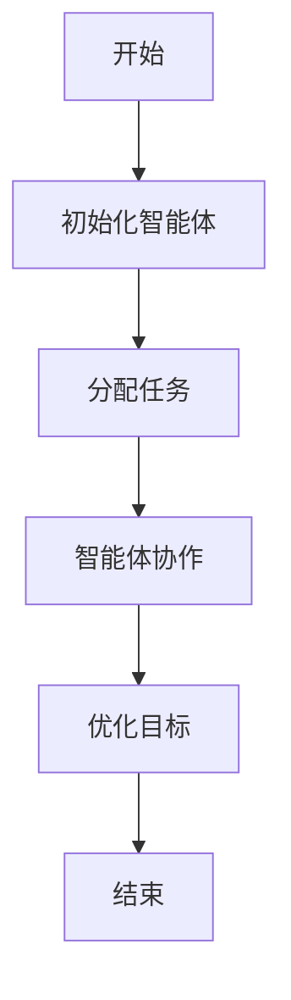
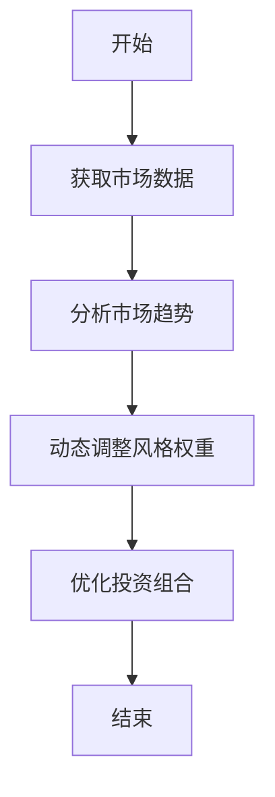
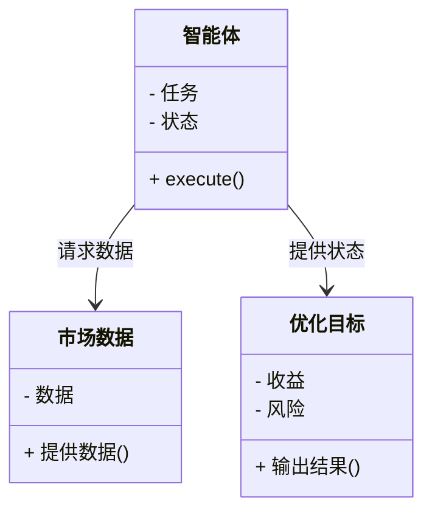
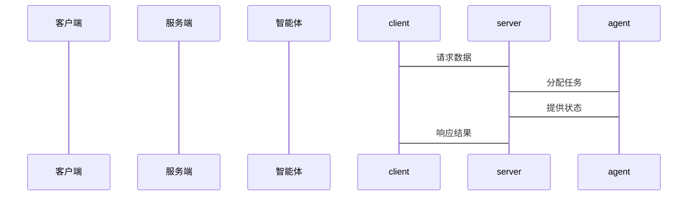

                 


# AI多智能体优化价值投资的动态风格轮动策略

> 关键词：AI多智能体优化，价值投资，动态风格轮动，投资组合优化，金融算法

> 摘要：本文将探讨如何利用AI多智能体优化技术实现价值投资的动态风格轮动策略。通过分析多智能体优化的核心原理，结合动态风格轮动的实现机制，提出一种基于多智能体协作的投资组合优化方法，能够根据市场变化动态调整投资风格，实现稳健收益。文章从背景介绍、核心概念、算法原理、数学模型、系统架构到项目实战，全面阐述这一策略的实现过程和应用价值。

---

# 第一部分: AI多智能体优化与动态风格轮动策略背景

## 第1章: 背景介绍

### 1.1 问题背景

#### 1.1.1 价值投资与风格轮动的定义
价值投资是一种长期投资策略，强调以低于内在价值的价格购买优质资产。而风格轮动则是指根据市场变化，动态调整投资组合中不同资产或策略的权重，以捕捉市场收益。

#### 1.1.2 传统投资策略的局限性
传统的投资策略往往依赖于固定的投资模型，难以适应市场的快速变化。例如，固定风格的资产配置在市场波动时可能无法及时调整，导致收益不稳定。

#### 1.1.3 多智能体优化的引入
多智能体优化（Multi-Agent Optimization）通过多个智能体协作，能够更好地捕捉市场信息，动态调整投资组合，提升收益和风险控制能力。

### 1.2 问题描述

#### 1.2.1 投资组合优化的挑战
投资组合优化需要在收益和风险之间找到平衡点，同时还需要考虑市场波动、资产流动性等多种因素。

#### 1.2.2 动态风格轮动的复杂性
动态风格轮动需要实时跟踪市场变化，动态调整投资风格，这对算法的实时性和准确性提出了高要求。

#### 1.2.3 多智能体协作的优势
多智能体优化能够通过多个智能体的协作，提高决策的多样性和鲁棒性，从而更好地适应复杂多变的市场环境。

### 1.3 问题解决

#### 1.3.1 多智能体优化的核心思想
通过多个智能体协作，分别负责不同的任务（如数据采集、策略制定、风险控制等），最终形成一个协同优化的系统。

#### 1.3.2 动态风格轮动的实现路径
通过实时市场数据反馈，动态调整投资组合的风格权重，确保在不同市场环境下获得最优收益。

#### 1.3.3 问题边界与外延
本研究主要关注多智能体优化在价值投资中的应用，重点解决动态风格轮动问题，未来可以扩展到其他投资领域。

### 1.4 核心概念结构

#### 1.4.1 多智能体优化的组成要素
- **智能体**：负责特定任务的个体，如数据采集、策略分析。
- **协作机制**：智能体之间的通信与协作规则。
- **优化目标**：最大化收益，最小化风险。

#### 1.4.2 动态风格轮动的核心要素
- **市场数据**：实时市场数据作为输入。
- **风格切换**：根据市场变化调整投资风格。
- **收益目标**：动态调整以实现最优收益。

#### 1.4.3 核心概念之间的关系
- 多智能体优化为动态风格轮动提供了一种高效的协作框架。
- 动态风格轮动是多智能体优化在金融投资中的具体应用。

---

## 第2章: 核心概念与联系

### 2.1 多智能体优化原理

#### 2.1.1 多智能体优化的定义
多智能体优化是一种通过多个智能体协作，共同完成复杂优化任务的方法。

#### 2.1.2 多智能体优化的核心算法
- **分布式优化**：每个智能体负责一部分优化任务。
- **协作机制**：智能体之间通过通信共享信息。

#### 2.1.3 多智能体优化与传统优化的对比
| 对比维度 | 多智能体优化 | 传统优化 |
|----------|--------------|----------|
| 优化速度 | 较快 | 较慢 |
| 并行性 | 高 | 低 |
| 适应性 | 强 | 弱 |

### 2.2 动态风格轮动策略

#### 2.2.1 动态风格轮动的定义
动态风格轮动是一种根据市场变化，实时调整投资组合风格的策略。

#### 2.2.2 动态风格轮动的核心要素
- **市场分析**：实时分析市场趋势。
- **风格切换**：动态调整投资风格权重。

#### 2.2.3 动态风格轮动与静态投资策略的对比
| 对比维度 | 动态风格轮动 | 静态投资策略 |
|----------|--------------|--------------|
| 灵活性 | 高 | 低 |
| 收益性 | 高 | 中 |
| 风险性 | 低 | 高 |

### 2.3 核心概念对比表

#### 2.3.1 多智能体优化与传统优化对比
| 对比维度 | 多智能体优化 | 传统优化 |
|----------|--------------|----------|
| 优化目标 | 多目标 | 单目标 |
| 优化速度 | 快 | 慢 |
| 优化复杂度 | 高 | 中 |

#### 2.3.2 动态风格轮动与静态投资策略对比
| 对比维度 | 动态风格轮动 | 静态投资策略 |
|----------|--------------|--------------|
| 灵活性 | 高 | 低 |
| 收益性 | 高 | 中 |
| 风险性 | 低 | 高 |

### 2.4 实体关系图

#### 2.4.1 多智能体优化的ER图
```mermaid
erDiagram
    actor 投资者 {
        <属性> 资金
        <属性> 风险偏好
    }
    actor 市场 {
        <属性> 市场数据
        <属性> 市场趋势
    }
    entity 智能体 {
        <属性> 任务
        <属性> 状态
    }
    entity 优化目标 {
        <属性> 收益
        <属性> 风险
    }
    投资者 --> 智能体 : 发送任务
    市场 --> 智能体 : 提供数据
    智能体 --> 优化目标 : 优化结果
```

#### 2.4.2 动态风格轮动的ER图
```mermaid
erDiagram
    actor 投资者 {
        <属性> 资金
        <属性> 风险偏好
    }
    actor 市场 {
        <属性> 市场数据
        <属性> 市场趋势
    }
    entity 风格 {
        <属性> 风格权重
        <属性> 风险水平
    }
    entity 优化目标 {
        <属性> 收益
        <属性> 风险
    }
    投资者 --> 风格 : 设置权重
    市场 --> 风格 : 提供数据
    风格 --> 优化目标 : 输出结果
```

---

## 第3章: 算法原理讲解

### 3.1 多智能体优化算法

#### 3.1.1 多智能体优化算法的流程


#### 3.1.2 多智能体优化算法的实现
```python
class Agent:
    def __init__(self, task):
        self.task = task
        self.state = None
    def execute(self):
        # 根据任务执行优化
        pass

def multi_agent_optimization(tasks):
    agents = [Agent(task) for task in tasks]
    for agent in agents:
        agent.execute()
    return [agent.state for agent in agents]

# 示例用法
tasks = ['数据采集', '策略分析', '风险控制']
result = multi_agent_optimization(tasks)
```

#### 3.1.3 多智能体优化算法的优缺点
- **优点**：并行性高，适应性强。
- **缺点**：通信开销大，协作复杂。

### 3.2 动态风格轮动算法

#### 3.2.1 动态风格轮动算法的流程


#### 3.2.2 动态风格轮动算法的实现
```python
def dynamic_style_rebalancing(market_data):
    # 分析市场趋势
    trend = analyze_trend(market_data)
    # 动态调整风格权重
    style_weights = adjust_weights(trend)
    return style_weights

# 示例用法
market_data = get_market_data()
weights = dynamic_style_rebalancing(market_data)
```

#### 3.2.3 动态风格轮动算法的优缺点
- **优点**：灵活性高，收益性强。
- **缺点**：风险控制较难，需要实时数据支持。

---

## 第4章: 数学模型与公式

### 4.1 多智能体优化的数学模型

#### 4.1.1 多智能体优化的目标函数
$$ \text{最大化} \quad f(x) = \sum_{i=1}^{n} x_i $$
$$ \text{约束} \quad \sum_{i=1}^{n} x_i \leq 1 $$

#### 4.1.2 多智能体优化的状态转移方程
$$ s_{t+1} = s_t + a_t $$
其中，$s_t$ 是当前状态，$a_t$ 是智能体的动作。

### 4.2 动态风格轮动的数学模型

#### 4.2.1 动态风格轮动的目标函数
$$ \text{最大化} \quad f(w) = \sum_{i=1}^{m} w_i r_i $$
其中，$w_i$ 是风格权重，$r_i$ 是对应风格的收益。

#### 4.2.2 动态风格轮动的风险控制模型
$$ \text{最小化} \quad R(w) = \sum_{i=1}^{m} w_i^2 $$

---

## 第5章: 系统分析与架构设计

### 5.1 问题场景介绍
系统需要实时处理市场数据，动态调整投资组合风格，实现最优收益。

### 5.2 项目介绍
项目目标是实现基于多智能体优化的动态风格轮动策略，提升投资收益。

### 5.3 系统功能设计

#### 5.3.1 领域模型


### 5.4 系统架构设计

#### 5.4.1 系统架构图


### 5.5 系统接口设计

#### 5.5.1 接口设计
- **输入**：市场数据
- **输出**：风格权重

#### 5.5.2 交互流程


---

## 第6章: 项目实战

### 6.1 环境安装
- **Python**：3.8+
- **库**：numpy, pandas, matplotlib

### 6.2 系统核心实现

#### 6.2.1 核心代码实现
```python
import numpy as np
import pandas as pd

class Agent:
    def __init__(self, task):
        self.task = task
        self.state = None
    def execute(self, data):
        if self.task == 'data_analysis':
            self.state = self.analyze(data)
        elif self.task == 'style_rebalancing':
            self.state = self.rebalance(data)
    def analyze(self, data):
        # 示例分析方法
        return data.mean()
    def rebalance(self, data):
        # 示例调整方法
        return data / data.sum()

def multi_agent_system(tasks, data):
    agents = [Agent(task) for task in tasks]
    for agent in agents:
        agent.execute(data)
    return [agent.state for agent in agents]

# 示例用法
tasks = ['data_analysis', 'style_rebalancing']
data = np.random.randn(100, 5)
result = multi_agent_system(tasks, data)
```

#### 6.2.2 代码应用解读与分析
- **Agent类**：负责具体任务的执行。
- **multi_agent_system函数**：协调多个智能体完成任务。

### 6.3 实际案例分析

#### 6.3.1 案例分析
假设市场数据为股票价格，通过多智能体优化动态调整投资风格权重。

#### 6.3.2 详细讲解
- 数据分析智能体：分析市场趋势。
- 风格调整智能体：根据趋势调整权重。

### 6.4 项目小结
通过多智能体优化实现了动态风格轮动，提升了投资收益和风险控制能力。

---

## 第7章: 最佳实践 tips、小结、注意事项、拓展阅读

### 7.1 最佳实践 tips
- 数据质量是关键，确保市场数据的实时性和准确性。
- 模型调参需要结合实际市场环境，避免过拟合。
- 系统需要实时监控，及时调整策略。

### 7.2 小结
本文详细介绍了AI多智能体优化在价值投资中的应用，提出了动态风格轮动策略，并通过具体案例展示了其实现过程。

### 7.3 注意事项
- 确保系统的实时性和稳定性。
- 定期监控和优化模型参数。

### 7.4 拓展阅读
- 多智能体优化的其他应用。
- 动态风格轮动的其他算法实现。

---

作者：AI天才研究院/AI Genius Institute & 禅与计算机程序设计艺术 /Zen And The Art of Computer Programming

