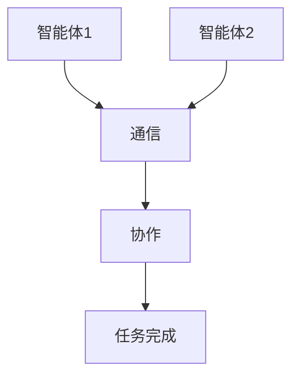

                 


# 多智能体在宏观经济分析中的应用

## 关键词：多智能体系统，宏观经济分析，经济建模，Agent建模，系统架构设计

## 摘要：  
随着人工智能技术的快速发展，多智能体系统（Multi-Agent System, MAS）在宏观经济分析中的应用日益广泛。本文将从多智能体系统的定义、特点、核心概念入手，详细探讨其在宏观经济分析中的应用。通过构建多智能体模型，分析经济主体的行为、市场机制和宏观经济指标的预测，本文将展示多智能体系统在宏观经济分析中的独特优势。同时，本文还将讨论多智能体系统的系统架构设计、数学模型构建以及实际案例分析，为读者提供全面的理论和技术指导。

---

# 第一部分：多智能体系统基础

## 第1章：多智能体系统概述

### 1.1 多智能体系统的定义与特点

#### 1.1.1 多智能体系统的定义
多智能体系统（Multi-Agent System, MAS）是由多个智能体（Agent）组成的分布式系统，这些智能体能够通过自主决策和协作完成特定任务。智能体是指具有感知环境、做出决策、执行动作能力的实体。

#### 1.1.2 多智能体系统的五大核心特点
| 特点 | 描述 |
|------|------|
| 分布性 | 智能体独立运行，不存在集中控制中心。 |
| 交互性 | 智能体之间通过通信和协作完成任务。 |
| 反应性 | 智能体能够实时感知环境并做出响应。 |
| 社会性 | 智能体之间存在社会关系和协作机制。 |
| 多目标性 | 智能体的目标可能相互冲突或协作。 |

#### 1.1.3 多智能体系统与传统单智能体系统的区别
- **单智能体系统**：单个智能体完成任务，决策过程集中化。
- **多智能体系统**：多个智能体协作完成任务，决策过程分布化。



---

### 1.2 多智能体系统的组成与架构

#### 1.2.1 多智能体系统的组成要素
- **智能体**：具有感知、决策和执行能力的实体。
- **环境**：智能体运行的外部环境。
- **通信机制**：智能体之间的信息交互方式。
- **协作机制**：智能体之间协作完成任务的规则。

#### 1.2.2 多智能体系统的常见架构模式
- **反应式架构**：基于当前感知做出实时反应。
- **基于模型的架构**：利用内部模型进行规划和决策。
- **混合式架构**：结合反应式和基于模型的决策方式。

#### 1.2.3 多智能体系统的通信机制
- **直接通信**：智能体之间直接交换信息。
- **间接通信**：通过中间媒介进行信息传递。

---

### 1.3 多智能体系统的应用领域

#### 1.3.1 宏观经济分析中的应用
- 经济周期模拟
- 金融市场建模
- 宏观政策评估

#### 1.3.2 其他领域的应用案例
- 智能交通系统
- 多人在线游戏
- 分布式计算

#### 1.3.3 多智能体系统的未来发展趋势
- 更强的自主性和智能性
- 更高效的协作机制
- 更广泛的应用场景

---

## 第2章：宏观经济分析基础

### 2.1 宏观经济分析的核心概念

#### 2.1.1 宏观经济的主要指标
- 国内生产总值（GDP）
- 失业率
- 通货膨胀率
- 利率

#### 2.1.2 宏观经济的基本理论框架
- 宏观经济学的基本假设
- 经济增长理论
- 宏观经济政策

#### 2.1.3 宏观经济分析的目标与方法
- 目标：预测经济趋势，评估政策效果。
- 方法：建立经济模型，进行模拟分析。

---

### 2.2 宏观经济模型的分类

#### 2.2.1 宏观经济模型的类型
- **总量模型**：研究整体经济指标。
- **结构模型**：分析经济体系的内部结构。
- **动态模型**：考虑经济变量的变化趋势。

#### 2.2.2 宏观经济模型的优缺点对比
| 模型类型 | 优点 | 缺点 |
|---------|------|------|
| 总量模型 | 简单易懂 | 精度较低 |
| 结构模型 | 精度高 | 复杂性高 |
| 动态模型 | 能够模拟动态变化 | 计算复杂 |

#### 2.2.3 多智能体模型在宏观经济中的优势
- 更贴近实际经济主体的行为。
- 能够模拟复杂的市场机制。
- 适合分析非线性经济现象。

---

## 第3章：多智能体模型的构建与设计

### 3.1 多智能体模型的设计原则

#### 3.1.1 模型的可扩展性
- 模型能够适应不同规模的经济系统。

#### 3.1.2 模型的可交互性
- 模型能够模拟智能体之间的交互行为。

#### 3.1.3 模型的可验证性
- 模型的结果能够通过实证数据进行验证。

---

### 3.2 多智能体模型的构建方法

#### 3.2.1 基于Agent的建模方法
- **Agent的定义**：每个经济主体（如企业、消费者）作为一个独立的智能体。
- **行为规则**：定义智能体的行为决策规则。

#### 3.2.2 多智能体模型的开发流程
1. 确定问题目标
2. 设计智能体的行为模型
3. 实现智能体的通信机制
4. 进行系统仿真和分析

#### 3.2.3 常用的多智能体建模工具
- **NetLogo**：用于多智能体模拟的工具。
- **Repast**：基于Java的多智能体建模框架。
- **Mesa**：用于经济建模的Python框架。

---

### 3.3 多智能体模型的数学基础

#### 3.3.1 基本数学模型
- **线性回归模型**：用于预测经济指标。
- **差分方程**：描述经济变量的变化趋势。

#### 3.3.2 多智能体模型的数学表达
- 智能体的决策规则可以用数学公式表示：
  $$ d_i = \argmax_{d} \{ u(i, d) \} $$
  其中，$u(i, d)$ 是智能体 $i$ 在决策 $d$ 下的效用函数。

#### 3.3.3 常用的数学工具与库
- **NumPy**：用于矩阵运算。
- **SciPy**：用于科学计算。
- **SymPy**：用于符号数学计算。

---

## 第4章：多智能体模型在宏观经济分析中的应用

### 4.1 宏观经济中的多智能体建模案例

#### 4.1.1 经济周期模拟
- **案例描述**：模拟经济周期波动。
- **模型设计**：智能体包括企业和消费者。
- **仿真结果**：展示GDP和失业率的变化趋势。

#### 4.1.2 金融市场建模
- **案例描述**：模拟股票市场的波动。
- **模型设计**：智能体包括投资者和交易员。
- **仿真结果**：展示股票价格的变化趋势。

#### 4.1.3 宏观政策评估
- **案例描述**：评估货币政策的效果。
- **模型设计**：智能体包括企业和消费者。
- **仿真结果**：展示政策对经济指标的影响。

---

### 4.2 多智能体模型的经济行为模拟

#### 4.2.1 经济主体的行为建模
- **消费者行为**：基于效用最大化的决策。
- **企业行为**：基于利润最大化的决策。

#### 4.2.2 市场机制的模拟
- **供需机制**：模拟市场均衡过程。
- **价格调整**：模拟价格的动态变化。

#### 4.2.3 宏观经济指标的预测
- **GDP预测**：基于多智能体模型预测GDP的变化。
- **失业率预测**：基于多智能体模型预测失业率的变化。

---

### 4.3 多智能体模型的优缺点分析

#### 4.3.1 多智能体模型的优势
- 更贴近实际经济主体的行为。
- 能够模拟复杂的市场机制。
- 适合分析非线性经济现象。

#### 4.3.2 多智能体模型的局限性
- 计算复杂度高。
- 需要大量的参数调校。
- 模型的可解释性较低。

#### 4.3.3 多智能体模型的改进方向
- 提高模型的可解释性。
- 优化计算效率。
- 增强模型的适应性。

---

## 第5章：多智能体系统的系统架构设计

### 5.1 系统架构设计概述

#### 5.1.1 系统架构的目标
- 确保系统的可扩展性和可维护性。
- 提高系统的运行效率。

#### 5.1.2 系统架构的设计原则
- **模块化设计**：将系统划分为独立的模块。
- **分层设计**：将系统分为多个层次，如感知层、决策层、执行层。

#### 5.1.3 系统架构的优缺点对比
| 设计原则 | 优点 | 缺点 |
|---------|------|------|
| 模块化设计 | 独立性高 | 开发复杂性高 |
| 分层设计 | 结构清晰 | 跨层通信复杂 |

---

### 5.2 系统功能设计

#### 5.2.1 问题场景介绍
- **目标**：模拟经济主体的行为。
- **范围**：涵盖企业和消费者的行为。

#### 5.2.2 系统功能设计
- **功能模块**：
  - 智能体行为模块
  - 通信模块
  - 仿真模块

#### 5.2.3 系统功能设计的领域模型
```mermaid
classDiagram
    class 智能体 {
        属性：状态
        方法：感知环境，做出决策
    }
    class 环境 {
        属性：经济指标
        方法：提供反馈
    }
    智能体 --> 环境：感知
    环境 --> 智能体：反馈
```

---

### 5.3 系统架构设计

#### 5.3.1 系统架构设计的优缺点对比
| 架构模式 | 优点 | 缺点 |
|---------|------|------|
| 分布式架构 | 高度灵活 | 难以维护 |
| 集中式架构 | 容易维护 | 灵活性差 |

#### 5.3.2 系统架构设计的实现
- **分布式架构**：智能体分布在不同的节点上，通过通信模块进行交互。
- **集中式架构**：所有智能体在同一个节点上运行，通过集中控制进行管理。

---

### 5.4 系统接口设计

#### 5.4.1 系统接口设计的实现
- **通信接口**：定义智能体之间的通信协议。
- **数据接口**：定义数据的输入和输出格式。

#### 5.4.2 系统接口设计的优缺点对比
| 接口类型 | 优点 | 缺点 |
|---------|------|------|
| REST API | 开发简单 | 通信效率低 |
| RPC接口 | 通信效率高 | 开发复杂 |

---

### 5.5 系统交互设计

#### 5.5.1 系统交互设计的实现
- **通信机制**：智能体之间通过消息队列进行交互。
- **协作机制**：智能体之间通过协商达成共识。

#### 5.5.2 系统交互设计的优缺点对比
| 交互机制 | 优点 | 缺点 |
|---------|------|------|
| 直接通信 | 实时性高 | 安全性差 |
| 间接通信 | 安全性高 | 实时性低 |

---

## 第6章：项目实战

### 6.1 环境安装

#### 6.1.1 安装Python
```bash
# 安装Python
python --version
```

#### 6.1.2 安装多智能体建模工具
```bash
pip install mesa
pip install numpy
pip install matplotlib
```

---

### 6.2 系统核心实现源代码

#### 6.2.1 经济主体的行为模型
```python
class Consumer:
    def __init__(self, id):
        self.id = id
        self.consumption = 0
        self.income = 100

    def make_decision(self):
        self.consumption = min(self.income * 0.8, 100)
        return self.consumption

class Firm:
    def __init__(self, id):
        self.id = id
        self.production = 0
        self.price = 50

    def make_decision(self, market_demand):
        if market_demand > 100:
            self.price *= 1.1
        else:
            self.price *= 0.9
        self.production = market_demand * self.price
        return self.production
```

---

### 6.3 代码应用解读与分析

#### 6.3.1 经济主体的行为模拟
- **消费者行为**：消费者根据收入决定消费水平。
- **企业行为**：企业根据市场需求调整价格和产量。

#### 6.3.2 模拟结果分析
- **GDP预测**：通过消费者和企业的交互，预测GDP的变化。
- **失业率预测**：通过劳动力市场的动态变化，预测失业率的变化。

---

### 6.4 实际案例分析

#### 6.4.1 案例描述
- **目标**：模拟经济周期波动。
- **范围**：涵盖消费者、企业和政府。

#### 6.4.2 案例分析
- **仿真结果**：展示GDP和失业率的变化趋势。
- **政策评估**：评估政府政策对企业行为的影响。

---

### 6.5 项目小结

#### 6.5.1 项目成果
- 成功构建多智能体模型。
- 完成经济周期的模拟。
- 评估了宏观政策的效果。

#### 6.5.2 项目经验
- 多智能体模型的构建需要详细的经济理论支持。
- 系统架构设计需要充分考虑可扩展性和可维护性。
- 仿真结果需要结合实证数据进行验证。

---

## 第7章：总结与展望

### 7.1 多智能体系统的应用成果
- 在宏观经济分析中，多智能体系统能够更准确地模拟经济主体的行为。
- 通过多智能体模型，可以更好地理解经济系统的动态变化。

### 7.2 多智能体系统的局限性
- 计算复杂度高。
- 模型的可解释性较低。
- 需要大量的参数调校。

### 7.3 多智能体系统的未来发展趋势
- 提高模型的可解释性。
- 优化计算效率。
- 增强模型的适应性。

### 7.4 最佳实践 Tips
- 在构建多智能体模型时，需要充分理解经济理论。
- 系统架构设计需要考虑可扩展性和可维护性。
- 仿真结果需要结合实证数据进行验证。

---

## 作者：AI天才研究院/AI Genius Institute & 禅与计算机程序设计艺术/Zen And The Art of Computer Programming

---

以上是《多智能体在宏观经济分析中的应用》的技术博客文章的完整目录和内容概要，涵盖从基础概念到实际应用的各个方面，力求通过详细的理论分析和实际案例，为读者提供全面的指导。

