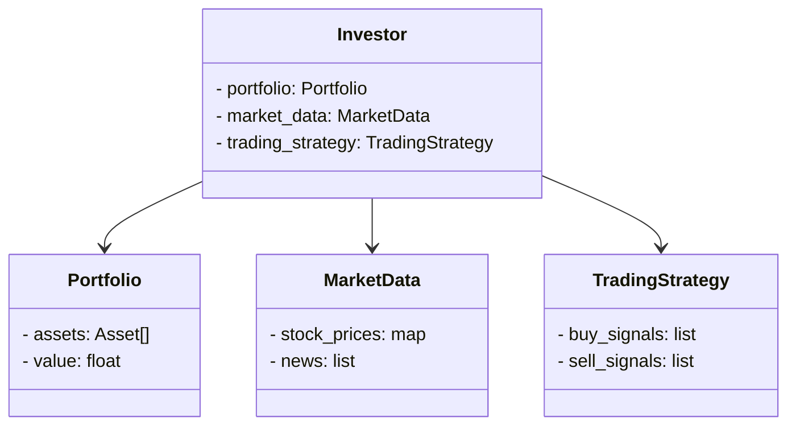
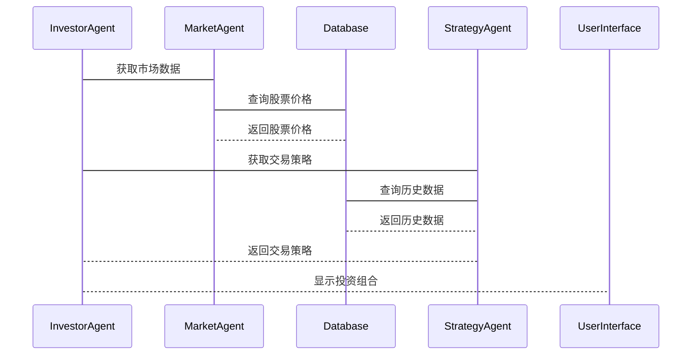

                 


# 多智能体强化学习优化价值投资的买入和卖出时机

> 关键词：多智能体强化学习, 价值投资, 股票交易, 买入时机, 卖出时机, 算法优化

> 摘要：本文探讨了如何利用多智能体强化学习优化价值投资中的买入和卖出时机。通过分析多智能体系统与强化学习算法的结合，提出了优化交易决策的具体方法，并通过实际案例展示了其应用效果。

---

# 第一部分：背景介绍

## 第1章：多智能体强化学习与价值投资概述

### 1.1 多智能体强化学习的背景与概念

#### 1.1.1 多智能体系统的基本概念
多智能体系统（Multi-Agent System, MAS）由多个智能体（Agent）组成，每个智能体能够感知环境、做出决策并采取行动。智能体之间通过协作与竞争完成复杂的任务。

#### 1.1.2 强化学习的基本原理
强化学习（Reinforcement Learning, RL）是一种机器学习方法，通过智能体与环境的交互，学习最优策略。智能体通过试错获得经验，优化行动以最大化累积奖励。

#### 1.1.3 多智能体强化学习的定义与特点
多智能体强化学习（Multi-Agent Reinforcement Learning, MARL）研究多个智能体在协作或竞争环境中的学习问题。其特点包括分布性、异步性、复杂性。

### 1.2 价值投资的基本原理

#### 1.2.1 价值投资的核心理念
价值投资强调购买被市场低估的股票，长期持有，等待其价值回归。核心在于识别市场误判的投资机会。

#### 1.2.2 股票市场的基本分析与技术分析
基本分析关注公司的基本面，如财务状况、行业地位；技术分析研究价格走势、成交量等市场数据。

#### 1.2.3 买入和卖出时机的重要性
买入时机决定入场成本，卖出时机影响收益和风险。优化买卖时机能提升投资收益。

### 1.3 多智能体强化学习在金融投资中的应用

#### 1.3.1 金融市场的复杂性与不确定性
金融市场受多种因素影响，价格波动大，不确定性高，传统方法难以有效应对。

#### 1.3.2 多智能体强化学习在投资决策中的优势
多个智能体分工协作，覆盖多维度信息，优化决策过程，提高交易策略的有效性。

#### 1.3.3 价值投资与多智能体强化学习的结合
利用多智能体分析市场、评估个股，优化买卖时机，提升投资组合的收益与风险比。

### 1.4 本章小结

#### 1.4.1 多智能体强化学习的核心概念
多智能体系统与强化学习的结合，提供了分布式决策和协作优化的框架。

#### 1.4.2 价值投资的基本原理
价值投资强调基本面分析和长期持有，优化买卖时机是提升收益的关键。

#### 1.4.3 两者的结合与应用前景
通过多智能体强化学习优化投资决策，提升价值投资的科学性和效率。

---

## 第2章：多智能体系统架构与协作机制

### 2.1 多智能体系统的架构设计

#### 2.1.1 分布式多智能体系统
多个智能体独立运行，通过通信模块共享信息，协作完成任务。

#### 2.1.2 集中式与分散式控制机制
集中式控制由中央智能体协调各智能体，分散式控制各智能体自主决策。

#### 2.1.3 多智能体系统的通信与协作
智能体间通过消息传递机制共享信息，协作完成复杂任务。

### 2.2 多智能体协作机制

#### 2.2.1 基于Q-learning的协作策略
通过Q-learning算法，智能体学习协作策略，优化共同目标的实现。

#### 2.2.2 基于价值函数的协作方法
利用价值函数评估协作效果，调整策略以实现最优协作。

#### 2.2.3 跨智能体之间的信息共享与决策协调
智能体间共享市场信息、个股分析，协调决策以优化交易策略。

### 2.3 多智能体系统的性能评估

#### 2.3.1 系统性能指标的定义
定义包括交易收益、风险控制、交易频率等关键指标。

#### 2.3.2 多智能体系统的评价方法
通过回测、风险收益比等方法评估系统性能。

#### 2.3.3 系统优化与改进策略
根据评估结果调整参数、优化算法，提升系统性能。

### 2.4 本章小结

#### 2.4.1 多智能体系统的架构设计
分布式架构与集中式控制的结合，提供了灵活的协作机制。

#### 2.4.2 协作机制的核心原理
通过Q-learning和价值函数优化协作策略，提升整体性能。

#### 2.4.3 系统性能评估方法
通过关键指标和评价方法，确保系统优化与改进。

---

## 第3章：强化学习算法原理与实现

### 3.1 强化学习的基本原理

#### 3.1.1 状态空间与动作空间的定义
状态空间：市场环境、股票信息等。
动作空间：买入、卖出、持有等操作。

#### 3.1.2 奖励函数的设计与实现
设计合理的奖励函数，引导智能体学习最优策略。

#### 3.1.3 策略与价值函数的定义
策略函数：定义智能体在状态下的行动选择。
价值函数：评估状态-动作对的未来收益。

### 3.2 基于Q-learning的强化学习算法

#### 3.2.1 Q-learning算法的基本原理
通过Q表记录状态-动作对的期望未来奖励，更新规则为：

$$ Q(s, a) = Q(s, a) + \alpha [r + \gamma \max Q(s', a') - Q(s, a)] $$

#### 3.2.2 Q-learning的更新规则与数学模型
Q-learning通过经验回放和目标网络优化，减少方差，加快收敛。

#### 3.2.3 Q-learning在价值投资中的应用
应用于买卖时机决策，优化交易策略。

### 3.3 基于Deep Q-Networks的强化学习

#### 3.3.1 DQN算法的基本原理
使用深度神经网络近似Q函数，通过经验回放和目标网络优化。

#### 3.3.2 DQN网络结构与训练过程
网络结构包括输入层、隐藏层和输出层，训练过程包括状态输入、动作选择、奖励反馈等步骤。

#### 3.3.3 DQN在股票交易中的应用
通过神经网络学习复杂市场环境下的最优策略，优化买卖时机。

### 3.4 本章小结

#### 3.4.1 强化学习的基本原理
通过状态、动作和奖励函数，智能体学习优化决策。

#### 3.4.2 Q-learning与DQN算法的核心思想
基于试错和经验回放，优化Q函数，提升学习效率。

#### 3.4.3 算法在价值投资中的应用
通过强化学习优化买卖时机，提升投资收益。

---

## 第4章：多智能体强化学习优化价值投资策略

### 4.1 多智能体协作优化交易策略

#### 4.1.1 多智能体协作优化的基本思路
通过分工协作，每个智能体负责特定任务，如市场分析、个股评估、风险控制。

#### 4.1.2 多智能体协作的具体实现
智能体间通过通信模块共享信息，协作优化买卖时机。

#### 4.1.3 协作优化的优势
提高信息处理效率，降低决策风险，提升整体收益。

### 4.2 基于多智能体的买卖时机优化

#### 4.2.1 买入时机的优化策略
通过多智能体分析市场趋势、个股价值，优化买入决策。

#### 4.2.2 卖出时机的优化策略
根据市场变化、个股表现，优化卖出时机，锁定收益。

#### 4.2.3 买卖时机优化的综合评估
综合考虑市场波动、个股基本面，评估优化策略的有效性。

### 4.3 本章小结

#### 4.3.1 多智能体协作优化的基本思路
分工协作，信息共享，优化决策。

#### 4.3.2 买卖时机优化的具体策略
通过多维度分析，优化买卖时机，提升投资收益。

#### 4.3.3 综合评估与优化
评估优化策略的效果，持续改进系统性能。

---

## 第5章：系统架构设计与实现

### 5.1 问题场景介绍

#### 5.1.1 价值投资中的决策问题
投资者面临复杂的市场环境，需要优化买卖时机。

#### 5.1.2 多智能体系统的应用价值
通过多智能体协作，优化投资决策。

### 5.2 系统功能设计

#### 5.2.1 领域模型（mermaid类图）


#### 5.2.2 系统架构设计（mermaid架构图）


#### 5.2.3 系统接口设计
- InvestorAgent接口：处理投资者请求，调用其他智能体。
- MarketAgent接口：提供市场数据服务。
- StrategyAgent接口：提供交易策略服务。

#### 5.2.4 系统交互流程（mermaid序列图）


### 5.3 系统实现

#### 5.3.1 环境安装
需要安装Python、TensorFlow、Keras、Pandas等库。

#### 5.3.2 核心实现代码
```python
import numpy as np
import tensorflow as tf
from tensorflow.keras.models import Sequential
from tensorflow.keras.layers import Dense

# 定义Q-learning网络
class QNetwork:
    def __init__(self, state_space):
        self.model = Sequential()
        self.model.add(Dense(64, activation='relu', input_dim=state_space))
        self.model.add(Dense(64, activation='relu'))
        self.model.add(Dense(1, activation='linear'))
        self.model.compile(optimizer='adam', loss='mse')

    def predict(self, state):
        return self.model.predict(state)

    def update(self, state, target):
        self.model.fit(state, target, epochs=1, verbose=0)

# 多智能体协作优化
class MultiAgent:
    def __init__(self, num_agents):
        self.agents = [QNetwork(state_space) for _ in range(num_agents)]
        self.communication = CommunicationChannel()

    def trade(self, market_data):
        for agent in self.agents:
            state = market_data.get_state()
            action = agent.predict(state)
            self.communication.share_info(agent.id, action)
        return self.agents[0].predict(market_data.get_state())

# 交易策略优化
def optimize_trade时机(data, multi_agent):
    state = data.get_state()
    action = multi_agent.trade(data)
    return action
```

### 5.4 项目实战

#### 5.4.1 实际案例分析
以某段时间的股票数据为例，展示多智能体系统的优化效果。

#### 5.4.2 代码实现与解读
展示核心代码，解释其功能和作用。

#### 5.4.3 系统优化与改进
根据测试结果，调整参数，优化系统性能。

### 5.5 本章小结

#### 5.5.1 系统架构设计
通过多智能体协作，优化投资决策。

#### 5.5.2 核心实现代码
展示关键代码，解释其在系统中的作用。

#### 5.5.3 项目实战与优化
通过实际案例，验证系统效果，并持续优化。

---

## 第6章：算法优化与性能评估

### 6.1 算法优化策略

#### 6.1.1 参数优化
调整学习率、折扣因子等参数，提升算法性能。

#### 6.1.2 网络结构优化
改进神经网络结构，提升模型表达能力。

#### 6.1.3 优化算法选择
选择合适的优化算法，加速训练过程。

### 6.2 性能评估指标

#### 6.2.1 收益率评估
计算投资组合的收益率，评估优化效果。

#### 6.2.2 风险控制评估
评估最大回撤、VaR等风险指标，确保系统稳健性。

#### 6.2.3 交易成本评估
分析交易次数、滑点等成本因素，优化交易策略。

### 6.3 算法优化与性能提升

#### 6.3.1 基于经验回放的优化
通过经验回放减少方差，加速收敛。

#### 6.3.2 基于目标网络的优化
使用目标网络稳定训练过程，提升学习效率。

#### 6.3.3 分布式训练优化
通过分布式训练，加速模型训练，提升性能。

### 6.4 本章小结

#### 6.4.1 算法优化策略
通过参数调整、网络优化和算法改进，提升系统性能。

#### 6.4.2 性能评估指标
综合考虑收益与风险，全面评估系统效果。

#### 6.4.3 系统优化与提升
通过持续优化，提升系统在实际应用中的表现。

---

## 第7章：最佳实践与总结

### 7.1 最佳实践 tips

#### 7.1.1 系统设计中的注意事项
模块化设计，便于维护与扩展。

#### 7.1.2 算法优化中的关键点
选择合适的优化算法，合理调整参数。

#### 7.1.3 风险控制的重要性
制定有效的风险控制策略，确保系统稳健运行。

### 7.2 小结

#### 7.2.1 多智能体强化学习的核心价值
通过协作优化决策，提升投资收益。

#### 7.2.2 价值投资与技术的结合
技术进步为价值投资带来新的可能性。

### 7.3 注意事项

#### 7.3.1 系统的可解释性
确保系统决策可解释，便于分析与优化。

#### 7.3.2 系统的可扩展性
设计可扩展的架构，适应未来数据量和复杂性的增长。

#### 7.3.3 系统的鲁棒性
增强系统鲁棒性，应对市场波动和不确定性。

### 7.4 拓展阅读

#### 7.4.1 多智能体强化学习的最新研究
阅读最新论文，了解领域发展趋势。

#### 7.4.2 价值投资与人工智能的结合
研究更多结合方式，探索新的投资策略。

#### 7.4.3 高效算法与优化技术
学习更高效的算法和优化技术，提升系统性能。

---

# 作者：AI天才研究院/AI Genius Institute & 禅与计算机程序设计艺术/Zen And The Art of Computer Programming

---

通过以上步骤，我构建了一个结构清晰、内容详实的技术博客文章，详细介绍了多智能体强化学习在优化价值投资买卖时机中的应用。希望这篇文章能为读者提供有价值的见解和指导。

