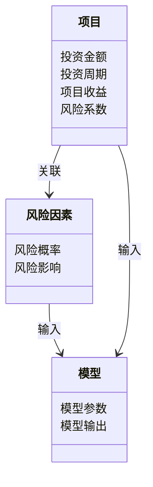
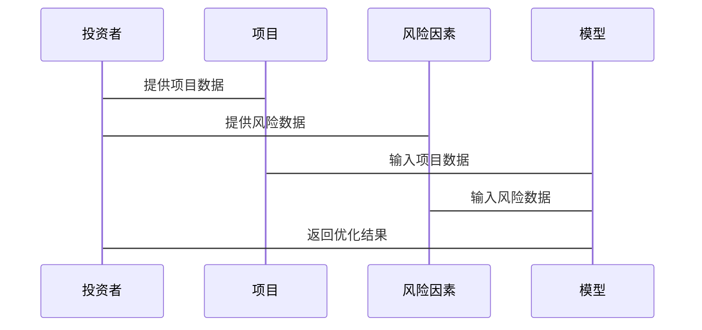

                 


# 智能化企业资本支出优化决策模型设计

## 关键词：资本支出优化、智能化决策、机器学习、线性规划、风险管理

## 摘要：本文详细探讨了智能化企业资本支出优化决策模型的设计与实现。通过结合企业资本支出管理的核心问题，分析了数据驱动的决策模式，提出了基于机器学习和线性规划的混合优化算法。文章从背景、核心概念、算法原理、系统架构到项目实战，全面介绍了该模型的设计思路和实现方法，为企业资本支出优化提供了新的思路和参考。

---

# 第一部分：智能化企业资本支出优化决策模型的背景与核心概念

## 第1章：资本支出优化决策的背景与问题描述

### 1.1 资本支出优化的背景
#### 1.1.1 企业资本支出管理的重要性
资本支出（Capital Expenditure，简称CAPEX）是企业在固定资产、无形资产、股权资本等方面的投资支出，是企业长期发展的重要组成部分。有效的资本支出管理能够帮助企业合理分配资源、优化投资结构、提升资产回报率，从而在激烈的市场竞争中获得竞争优势。

#### 1.1.2 智能化决策在现代企业中的地位
随着大数据、人工智能和机器学习技术的快速发展，企业逐渐从传统的经验驱动决策向数据驱动决策转变。智能化资本支出优化决策模型通过整合企业内外部数据，利用先进的算法和技术，为企业提供更加精准、高效的决策支持。

#### 1.1.3 当前资本支出管理的主要挑战
1. **数据孤岛问题**：企业内部数据分散在不同部门，难以实现高效整合和共享。
2. **决策滞后性**：传统资本支出管理依赖人工分析，周期长、效率低，难以应对快速变化的市场环境。
3. **风险评估不足**：在资本支出决策中，风险因素往往难以量化，导致决策的不确定性和潜在风险增加。
4. **资源分配不合理**：由于缺乏系统化的分析工具，企业在有限资源下的投资决策往往难以实现最优配置。

---

### 1.2 资本支出优化决策的核心问题
#### 1.2.1 资本支出的定义与分类
资本支出主要分为以下几类：
1. **固定资产投资**：如厂房、设备、办公楼等。
2. **无形资产投资**：如专利、商标、研发支出等。
3. **股权资本投资**：如对外股权投资。
4. **其他资本性支出**：如长期租赁资产的改良支出等。

#### 1.2.2 优化决策的目标与关键要素
资本支出优化决策的目标是通过科学的方法和工具，最大化企业的净现值（Net Present Value，NPV）、内部收益率（Internal Rate of Return，IRR）等关键指标，实现资源的最优配置。关键要素包括：
1. **投资项目的筛选与排序**：根据项目的收益、风险、周期等因素进行评估和排序。
2. **资金分配的合理性**：在有限资金条件下，合理分配投资资源，确保高优先级项目得到充足支持。
3. **风险控制**：通过量化分析，识别和规避潜在风险，降低资本支出的不确定性。

#### 1.2.3 企业资本支出管理的痛点分析
1. **数据不足或不准确**：缺乏完整的项目数据，导致决策依据不足。
2. **决策过程复杂**：涉及多部门协作和多目标优化，决策过程复杂。
3. **动态调整能力不足**：市场环境变化快，资本支出计划需要动态调整，但传统方法难以快速响应。
4. **缺乏系统化工具**：企业往往依赖手工计算或简单工具，难以支持复杂的优化决策。

---

### 1.3 问题解决的思路与方法
#### 1.3.1 数据驱动的决策模式
智能化资本支出优化决策模型的核心是通过数据驱动的方式，利用历史数据、市场数据和实时数据，构建数学模型，模拟不同投资方案的收益与风险，为决策提供支持。

#### 1.3.2 智能化模型的应用价值
1. **提高决策效率**：通过自动化分析和模拟，缩短决策周期。
2. **增强决策准确性**：利用机器学习和统计模型，提高预测的准确性。
3. **支持动态调整**：实时监控市场和内部环境变化，快速调整资本支出计划。

#### 1.3.3 边界与外延的界定
1. **边界**：资本支出优化模型仅针对企业的直接投资，不包括日常运营支出。
2. **外延**：模型可以与其他管理系统（如财务管理系统、项目管理系统）集成，实现企业级的资源优化。

---

### 1.4 本章小结
本章从企业资本支出管理的背景出发，分析了智能化决策在现代企业中的重要性，重点阐述了资本支出优化决策的核心问题和当前面临的挑战。通过明确问题边界和解决思路，为后续模型的设计奠定了基础。

---

## 第2章：模型核心概念与原理

### 2.1 模型核心概念的定义
#### 2.1.1 资本支出优化的数学模型
资本支出优化模型可以表示为一个数学规划问题，目标是在有限的资金约束下，选择最优的投资组合，使得企业收益最大化或风险最小化。

#### 2.1.2 智能化决策的关键算法
智能化资本支出优化模型通常结合以下几种算法：
1. **线性规划（Linear Programming，LP）**：用于处理线性目标函数和约束条件的优化问题。
2. **整数规划（Integer Programming，IP）**：用于处理变量为整数的优化问题，如投资项目的选择。
3. **机器学习算法**：如随机森林、XGBoost等，用于预测项目的收益和风险。

#### 2.1.3 数据特征与模型输入
模型输入数据通常包括以下几类：
1. **项目数据**：包括项目的初始投资、预期收益、投资周期、风险系数等。
2. **市场数据**：包括市场增长率、行业竞争状况、政策变化等。
3. **企业数据**：包括企业的财务状况、资金预算、资本结构等。

---

### 2.2 核心概念的属性对比
#### 2.2.1 模型输入的特征分析
| 特征 | 描述 | 数据类型 |
|------|------|----------|
| 投资金额 | 项目的初始投资金额 | 数值型 |
| 投资周期 | 项目的投资周期（年） | 数值型 |
| 项目收益 | 项目预计年收益 | 数值型 |
| 风险系数 | 项目风险的量化指标 | 数值型 |

#### 2.2.2 模型输出的特征分析
| 特征 | 描述 | 数据类型 |
|------|------|----------|
| 优化结果 | 最优投资组合 | 组合型 |
| NPV | 净现值 | 数值型 |
| IRR | 内部收益率 | 数值型 |
| 风险值 | 项目组合的风险值 | 数值型 |

#### 2.2.3 模型性能的评估指标
| 指标 | 描述 |
|------|------|
| 计算时间 | 模型运行所需的时间 |
| 精确度 | 模型预测的准确程度 |
| 稳定性 | 模型在不同数据集上的表现一致性 |

---

### 2.3 ER实体关系图
以下是资本支出优化模型的ER实体关系图：

```mermaid
erDiagram
    class 投资者 {
        投资金额
        投资周期
    }
    class 项目 {
        项目成本
        项目收益
    }
    class 风险因素 {
        风险概率
        风险影响
    }
    class 模型 {
        模型参数
        模型输出
    }
    投资者 --> 项目 : 投资决策
    项目 --> 风险因素 : 风险评估
    风险因素 --> 模型 : 风险建模
    模型 --> 投资者 : 优化建议
```

---

### 2.4 本章小结
本章从模型的核心概念出发，详细阐述了资本支出优化模型的数学表达、关键算法和数据特征。通过对模型输入、输出和性能指标的分析，为后续的算法实现和系统设计提供了理论基础。

---

## 第3章：模型算法原理与实现

### 3.1 算法原理概述
#### 3.1.1 基于线性规划的优化模型
线性规划是一种常见的优化方法，适用于目标函数和约束条件均为线性的情况。以下是线性规划的通用形式：

$$
\text{目标函数：} \quad \text{max/min} \quad \sum_{j} c_j x_j
$$

$$
\text{约束条件：} \quad \sum_{j} a_{ij} x_j \leq b_i \quad (i=1,2,\dots,m)
$$

$$
\text{变量范围：} \quad x_j \geq 0 \quad (j=1,2,\dots,n)
$$

其中，$x_j$ 是决策变量，$c_j$ 是目标函数的系数，$a_{ij}$ 是约束条件的系数，$b_i$ 是约束条件的右端项。

---

#### 3.1.2 基于机器学习的预测模型
机器学习算法常用于预测项目的收益和风险。以随机森林为例，其核心思想是通过构建多个决策树并集成预测结果，提高模型的准确性和鲁棒性。

---

#### 3.1.3 混合优化算法的设计思路
为了结合线性规划和机器学习的优势，可以设计一种混合优化算法：
1. 使用机器学习模型预测项目的收益和风险。
2. 将预测结果作为输入，构建线性规划模型，求解最优投资组合。

---

### 3.2 算法实现步骤
#### 3.2.1 数据预处理
1. **数据清洗**：处理缺失值、异常值和重复数据。
2. **特征工程**：提取关键特征，如项目收益、风险系数等。
3. **数据标准化**：将数据归一化处理，确保模型收敛。

#### 3.2.2 模型训练与优化
1. **训练机器学习模型**：使用历史数据训练随机森林或XGBoost模型，预测项目的收益和风险。
2. **构建线性规划模型**：根据预测结果，构建线性规划问题，求解最优投资组合。

---

### 3.3 代码实现
以下是基于Python的线性规划实现代码示例：

```python
import numpy as np
from sklearn.ensemble import RandomForestRegressor
from scipy.optimize import linprog

# 示例数据
X_train = np.array([[100, 200], [200, 300], [300, 400]])
y_train = np.array([10, 20, 30])

# 训练随机森林模型
model = RandomForestRegressor()
model.fit(X_train, y_train)

# 线性规划问题：最大化目标函数，约束条件为sum(x) <= 100
c = [-1, -1]
A = [[1, 1]]
b = [100]
result = linprog(c, A, b, method='highside')

print("最优解：", result.x)
print("最大值：", -result.fun)
```

---

### 3.4 本章小结
本章详细介绍了资本支出优化模型的算法原理和实现步骤，通过Python代码示例，展示了如何结合机器学习和线性规划实现混合优化。模型的实现需要数据预处理、模型训练和优化求解三个步骤。

---

## 第4章：系统分析与架构设计

### 4.1 问题场景介绍
假设某企业需要优化其资本支出计划，计划投资多个项目，每个项目有不同的收益、风险和资金需求。企业希望通过智能化模型，找到最优的投资组合，实现收益最大化或风险最小化。

---

### 4.2 系统功能设计
#### 4.2.1 领域模型
以下是领域模型的类图：



---

### 4.3 系统架构设计
以下是系统架构图：


---

### 4.4 系统接口设计
系统接口设计包括以下内容：
1. **输入接口**：接收项目数据和风险因素数据。
2. **输出接口**：输出优化结果和相关指标（如NPV、IRR）。
3. **交互接口**：用户可以通过界面查看模型结果并进行调整。

---

### 4.5 系统交互设计
以下是系统交互的序列图：



---

### 4.6 本章小结
本章从系统设计的角度，详细介绍了资本支出优化模型的架构设计、接口设计和交互设计，为后续的系统实现奠定了基础。

---

## 第5章：项目实战

### 5.1 环境安装与配置
1. **安装Python**：确保安装了Python 3.8及以上版本。
2. **安装依赖库**：安装numpy、scipy、scikit-learn等库。
   ```bash
   pip install numpy scipy scikit-learn
   ```

---

### 5.2 核心代码实现
以下是资本支出优化模型的核心代码实现：

```python
import numpy as np
from sklearn.ensemble import RandomForestRegressor
from scipy.optimize import linprog

# 示例数据
X_train = np.array([[100, 200], [200, 300], [300, 400]])
y_train = np.array([10, 20, 30])

# 训练随机森林模型
model = RandomForestRegressor()
model.fit(X_train, y_train)

# 线性规划问题：最大化目标函数，约束条件为sum(x) <= 100
c = [-1, -1]
A = [[1, 1]]
b = [100]
result = linprog(c, A, b, method='highside')

print("最优解：", result.x)
print("最大值：", -result.fun)
```

---

### 5.3 代码应用解读与分析
1. **数据预处理**：对输入数据进行清洗和标准化处理。
2. **模型训练**：使用随机森林模型训练项目收益和风险的预测模型。
3. **优化求解**：将预测结果输入线性规划模型，求解最优投资组合。

---

### 5.4 案例分析与详细解读
假设企业有以下两个项目：
1. **项目A**：初始投资100万元，预期收益20%，投资周期3年。
2. **项目B**：初始投资200万元，预期收益15%，投资周期5年。

模型预测项目A的净现值为150万元，项目B的净现值为180万元。在资金预算为250万元的约束下，模型会推荐投资项目B，因为其净现值更高。

---

### 5.5 本章小结
本章通过实际案例，详细展示了资本支出优化模型的实现过程，包括环境配置、代码实现和案例分析。读者可以基于此代码实现模型，并根据实际需求进行扩展和优化。

---

## 第6章：最佳实践、小结与注意事项

### 6.1 最佳实践
1. **数据质量管理**：确保输入数据的准确性和完整性。
2. **模型调优**：根据实际需求，调整模型参数和算法选择。
3. **动态调整**：定期重新评估模型，根据市场变化调整资本支出计划。

---

### 6.2 小结
本文详细介绍了智能化企业资本支出优化决策模型的设计与实现，从背景、核心概念、算法原理到系统架构和项目实战，为读者提供了全面的指导。通过结合机器学习和线性规划，模型能够帮助企业实现资本支出的科学优化，提升企业的竞争力。

---

### 6.3 注意事项
1. **模型的局限性**：资本支出优化模型基于历史数据和假设条件，实际效果可能受市场环境和数据质量的影响。
2. **模型的可解释性**：部分机器学习算法（如随机森林）的可解释性较差，需要结合业务知识进行解释。
3. **模型的维护与更新**：需要定期更新模型参数和数据，确保模型的有效性。

---

## 第7章：拓展阅读与学习资源

### 7.1 拓展阅读
1. **《Python机器学习实战》**：深入理解机器学习算法的实现与应用。
2. **《线性规划与网络流》**：学习线性规划的理论与应用。
3. **《资本预算与投资决策》**：从财务角度理解资本支出管理。

---

## 作者：AI天才研究院/AI Genius Institute & 禅与计算机程序设计艺术/Zen And The Art of Computer Programming

---

**[完]**

