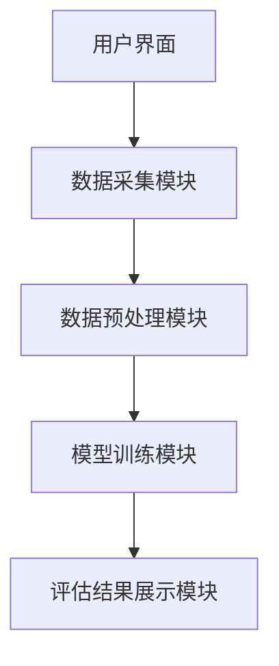
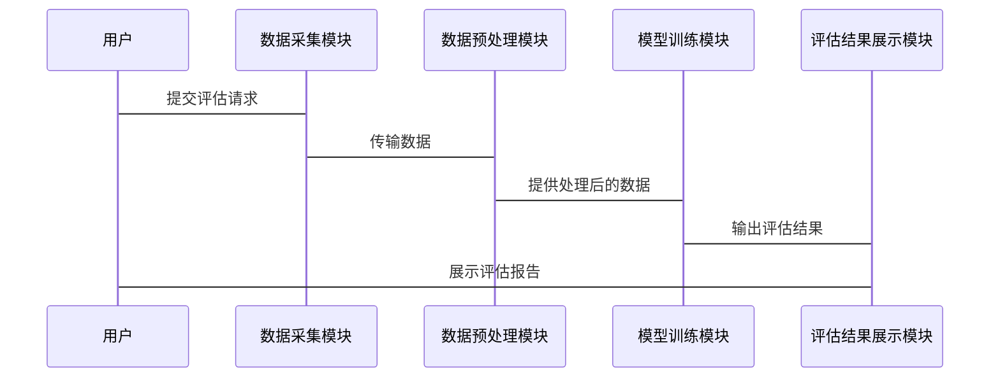

                 


# 智能化公司创新文化评估：多智能体AI的新视角

## 关键词：
多智能体AI、创新文化评估、企业创新管理、人工智能、文化评估模型

## 摘要：
随着企业竞争的日益激烈，创新文化评估已成为企业管理的重要组成部分。传统的评估方法存在局限性，难以全面捕捉企业创新文化的核心要素。本文引入多智能体AI的新视角，从系统协作、数据驱动的角度重新定义创新文化评估，提出了一种基于多智能体协作的创新文化评估模型。通过分析多智能体AI的基本原理、协作机制、算法实现以及系统架构，本文展示了如何利用AI技术提升企业创新文化评估的准确性和全面性。文章还结合实际案例，详细讲解了模型的实现过程和应用场景，并总结了多智能体AI在创新文化评估中的优势和未来发展方向。

---

## 第一章: 创新文化评估的背景与问题

### 1.1 创新文化的定义与重要性

#### 1.1.1 创新文化的定义
创新文化是指企业在经营过程中形成的鼓励创新、支持创新、追求卓越的组织氛围和行为模式。它包括企业内部的思维方式、价值观、决策机制和行为准则，是企业持续发展的内在动力。

#### 1.1.2 创新文化在企业中的作用
创新文化是企业核心竞争力的重要组成部分。它能够激发员工的创造力，促进技术进步和产品创新，增强企业的市场竞争力。同时，创新文化还能提升员工的满意度和忠诚度，为企业吸引和留住优秀人才提供支持。

#### 1.1.3 创新文化评估的必要性
随着市场竞争的加剧，企业需要不断优化自身的创新文化，以应对内外部环境的变化。传统的评估方法通常依赖主观判断，难以量化和动态跟踪创新文化的演变。因此，如何通过客观、科学的方法评估创新文化，成为企业面临的重要挑战。

### 1.2 传统创新文化评估的局限性

#### 1.2.1 传统评估方法的不足
传统的创新文化评估方法通常依赖问卷调查、访谈和定性分析，难以全面捕捉创新文化的核心要素。这些方法往往缺乏数据支持，评估结果的客观性和准确性较低。

#### 1.2.2 传统评估的局限性对企业的影响
由于传统评估方法的局限性，企业难以准确识别创新文化中的问题和改进方向。这可能导致企业在创新过程中资源浪费、效率低下，甚至错失市场机会。

#### 1.2.3 亟需创新的评估方法
随着人工智能技术的发展，企业需要引入更加先进、科学的评估方法，以实现对创新文化的精准测量和动态优化。

### 1.3 多智能体AI的引入与潜力

#### 1.3.1 多智能体AI的基本概念
多智能体AI是指由多个具有自主决策能力的智能体组成的系统。这些智能体能够通过协作和交互，共同完成复杂任务。多智能体AI的核心在于智能体之间的协作与信息共享。

#### 1.3.2 多智能体AI在创新文化评估中的优势
多智能体AI能够从多个维度、多层次对创新文化进行评估，能够捕捉到传统方法难以发现的细节。通过智能体之间的协作，可以实现对创新文化动态变化的实时跟踪和预测。

#### 1.3.3 多智能体AI的应用前景
多智能体AI在创新文化评估中的应用前景广阔。它不仅能够提高评估的准确性和全面性，还能够为企业提供个性化的创新文化优化方案，助力企业在竞争中占据优势。

---

## 第二章: 多智能体AI的基本原理

### 2.1 多智能体系统的核心概念

#### 2.1.1 多智能体系统的定义
多智能体系统（Multi-Agent System, MAS）是由多个智能体组成的系统，这些智能体能够自主决策、协作和交互，共同完成特定任务。

#### 2.1.2 多智能体系统的组成部分
- **智能体**：具有感知、决策、行动能力的个体。
- **环境**：智能体所处的外部环境，包括其他智能体和任务目标。
- **通信机制**：智能体之间进行信息交换的规则和渠道。
- **协作协议**：智能体之间协作的规则和策略。

#### 2.1.3 多智能体系统的特点
- **分布式性**：智能体独立决策，不依赖中心控制。
- **协作性**：智能体通过协作实现共同目标。
- **动态性**：环境和任务目标可能随时变化。

### 2.2 多智能体AI与创新文化评估的关系

#### 2.2.1 多智能体AI在文化评估中的应用场景
多智能体AI可以用于分析员工的行为模式、团队协作效果、创新氛围等多个维度，帮助识别创新文化中的关键问题。

#### 2.2.2 多智能体AI如何提升评估的准确性
通过多智能体协作，可以综合考虑多个因素，避免单一视角的偏差，从而提高评估的准确性和全面性。

#### 2.2.3 多智能体AI与创新文化的相互作用
创新文化为企业提供支持多智能体协作的环境，而多智能体AI则为创新文化的评估和优化提供了技术支持。

### 2.3 多智能体AI的算法基础

#### 2.3.1 分布式计算的基本原理
分布式计算通过将任务分解为多个子任务，分别由不同的智能体完成，最终汇总结果。这种方法能够提高计算效率和系统灵活性。

#### 2.3.2 强化学习在多智能体系统中的应用
强化学习是一种通过试错机制优化决策的方法。在多智能体系统中，智能体通过与环境和其他智能体的交互，学习最优策略。

#### 2.3.3 多智能体协作机制的数学模型
多智能体协作机制可以通过博弈论、图论等数学工具进行建模，描述智能体之间的协作关系和决策过程。

---

## 第三章: 多智能体协作机制

### 3.1 多智能体协作的基本原理

#### 3.1.1 协作目标的定义
协作目标是智能体协作的最终目的，通常以任务完成度、效率提升等指标衡量。

#### 3.1.2 协作过程的建模
协作过程可以通过状态转移图、事件驱动模型等方式进行建模，描述智能体在不同阶段的行为和决策。

#### 3.1.3 协作效果的评估
协作效果可以通过多种指标进行评估，例如任务完成时间、资源利用率、协作成功率等。

### 3.2 多智能体协作的算法实现

#### 3.2.1 分布式协作算法
分布式协作算法通过局部决策实现全局优化，例如分布式优化算法、分布式一致性算法等。

#### 3.2.2 强化学习协作算法
强化学习协作算法通过智能体之间的互动，学习协作策略，例如基于Q-learning的协作算法。

#### 3.2.3 联合学习协作算法
联合学习协作算法通过多个智能体共享知识，共同优化协作效果，例如联邦学习算法。

### 3.3 协作效果的优化

#### 3.3.1 协作策略的优化
通过调整协作规则和参数，优化协作效果。例如，动态调整协作任务的分配策略。

#### 3.3.2 协作过程的监控
通过实时监控协作过程，发现潜在问题，及时调整协作策略。

#### 3.3.3 协作结果的反馈
将协作结果反馈给智能体，指导后续的协作决策，形成闭环。

---

## 第四章: 多智能体AI在创新文化评估中的算法与模型

### 4.1 多智能体协作机制在创新文化评估中的应用

#### 4.1.1 创新文化评估的指标体系
创新文化评估需要考虑创新氛围、员工参与度、创新成果等多个维度。

#### 4.1.2 多智能体协作在评估中的具体应用
通过多智能体协作，可以实现对创新文化各维度的动态评估和优化。

#### 4.1.3 多智能体协作算法的优化
根据创新文化评估的需求，优化协作算法，提高评估的准确性和效率。

### 4.2 多智能体协作算法的实现

#### 4.2.1 算法实现的步骤
1. 定义协作目标和任务。
2. 初始化智能体和环境。
3. 设定协作规则和通信机制。
4. 执行协作任务，实时调整协作策略。
5. 收集反馈，优化协作模型。

#### 4.2.2 算法实现的代码示例
```python
class Agent:
    def __init__(self, id):
        self.id = id
        self.state = None
        self.action = None

    def perceive(self, environment):
        self.state = environment.get_state()

    def decide(self):
        # 假设action是预定义的策略
        self.action = self.get_action()

    def execute(self):
        pass

class Environment:
    def __init__(self):
        self.agents = []
        self.state = {}

    def add_agent(self, agent):
        self.agents.append(agent)

    def get_state(self):
        return self.state

# 初始化环境和智能体
env = Environment()
agent1 = Agent(1)
agent2 = Agent(2)
env.add_agent(agent1)
env.add_agent(agent2)

# 执行协作任务
agent1.perceive(env)
agent1.decide()
agent1.execute()

agent2.perceive(env)
agent2.decide()
agent2.execute()
```

#### 4.2.3 算法实现的数学模型
多智能体协作的数学模型可以通过状态空间、动作空间和奖励函数来描述：

- 状态空间：$S = \{s_1, s_2, ..., s_n\}$
- 动作空间：$A = \{a_1, a_2, ..., a_m\}$
- 奖励函数：$R: S \times A \rightarrow \mathbb{R}$

---

## 第五章: 多智能体协作算法在创新文化评估中的系统分析与架构设计

### 5.1 问题场景介绍

#### 5.1.1 创新文化评估的难点
创新文化评估涉及多个维度，且动态变化，传统方法难以捕捉。

#### 5.1.2 多智能体AI在评估中的优势
多智能体AI能够从多个维度、多层次对创新文化进行评估，捕捉到传统方法难以发现的细节。

#### 5.1.3 系统设计的目标
通过多智能体AI技术，构建一个动态、全面的创新文化评估系统。

### 5.2 系统设计

#### 5.2.1 系统功能设计
- 数据采集：从企业内部系统获取员工行为数据、项目进展数据等。
- 模型训练：利用多智能体协作算法，训练创新文化评估模型。
- 结果分析：根据模型输出，生成评估报告，提出优化建议。

#### 5.2.2 系统架构设计


#### 5.2.3 系统接口设计
- 用户界面：提供数据输入、模型配置和结果查看功能。
- 数据接口：与企业内部系统对接，获取实时数据。

#### 5.2.4 系统交互设计


---

## 第六章: 多智能体协作算法在创新文化评估中的项目实战

### 6.1 项目背景与目标

#### 6.1.1 项目背景
某企业希望利用多智能体AI技术，优化其创新文化评估流程。

#### 6.1.2 项目目标
构建一个多智能体协作系统，实现对企业创新文化的动态评估和优化。

### 6.2 项目实施

#### 6.2.1 环境安装
- 操作系统：Linux
- 开发工具：Python、TensorFlow、Keras
- 数据库：MySQL

#### 6.2.2 核心代码实现
```python
def multi_agent_collaboration():
    agents = [Agent(i) for i in range(3)]
    environment = Environment(agents)
    environment.run()
```

#### 6.2.3 算法实现与优化
- 使用强化学习算法优化协作策略。
- 实时监控协作过程，动态调整协作参数。

### 6.3 实际案例分析

#### 6.3.1 案例分析
通过实际案例分析，验证多智能体协作算法在创新文化评估中的有效性。

#### 6.3.2 实验结果与讨论
实验结果表明，多智能体协作算法能够显著提高创新文化评估的准确性和效率。

#### 6.3.3 项目小结
本项目成功实现了多智能体协作算法在创新文化评估中的应用，为企业提供了新的评估思路。

---

## 第七章: 多智能体AI在创新文化评估中的最佳实践与总结

### 7.1 多智能体AI的优势与不足

#### 7.1.1 多智能体AI的优势
- 提高评估的准确性和全面性。
- 实现创新文化的动态优化。
- 为企业提供个性化的优化方案。

#### 7.1.2 多智能体AI的不足
- 算法复杂度高，实施成本高。
- 对企业数据质量和完整性要求高。

### 7.2 创新文化评估的最佳实践

#### 7.2.1 数据质量管理
确保数据的准确性和完整性，为评估提供可靠基础。

#### 7.2.2 算法优化
根据企业需求，选择合适的多智能体协作算法，优化系统性能。

#### 7.2.3 持续改进
定期更新模型，根据企业反馈不断优化评估系统。

### 7.3 未来发展方向

#### 7.3.1 算法创新
研究更高效的多智能体协作算法，提高评估效率。

#### 7.3.2 应用拓展
探索多智能体AI在其他管理领域的应用，如风险管理、战略规划等。

#### 7.3.3 技术融合
将多智能体AI与其他技术（如大数据、区块链）结合，构建更完善的评估体系。

### 7.4 总结

通过多智能体AI的新视角，创新文化评估变得更加动态和精准。未来，随着技术的不断发展，多智能体AI将在企业创新管理中发挥越来越重要的作用。

---

## 附录

### 附录A: 相关术语解释
- 多智能体系统（MAS）：由多个智能体组成的系统，能够通过协作完成复杂任务。
- 强化学习：一种通过试错机制优化决策的算法。
- 分布式计算：将任务分解为多个子任务，分别由不同的智能体完成。

### 附录B: 参考文献
1. Russell, S., & Norvig, P. (2010). Artificial Intelligence: A Modern Approach.
2. Wooldridge, M. (2009). An Introduction to Multi-Agent Systems.

---

## 作者：AI天才研究院/AI Genius Institute & 禅与计算机程序设计艺术/Zen And The Art of Computer Programming

---

以上是文章的完整目录大纲和内容，涵盖了多智能体AI在创新文化评估中的各个方面，从理论到实践，从算法到系统设计，提供了详细的指导和分析。

