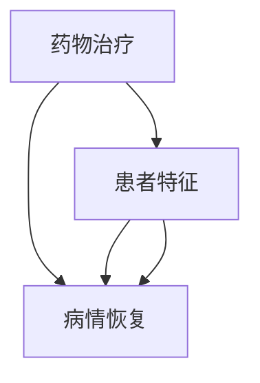
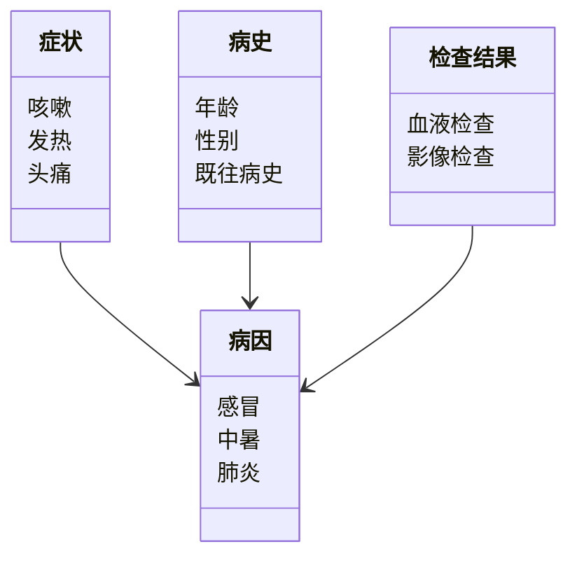
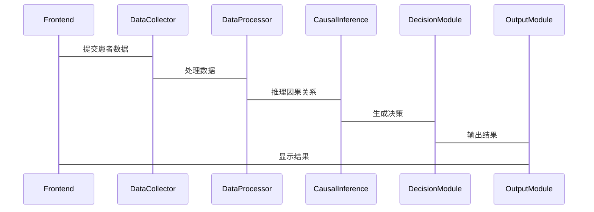

                 


# 构建具有因果推断能力的AI Agent

> 关键词：因果推断，AI Agent，因果图模型，潜在结果框架，结构方程模型，因果推理，AI系统设计

> 摘要：本文详细探讨了构建具有因果推断能力的AI Agent的理论基础、算法实现和系统设计。通过分析因果推断的核心概念、算法原理和实际应用场景，结合具体的代码实现和系统架构设计，帮助读者理解如何在AI Agent中实现因果推断能力，从而提升系统的决策能力和智能化水平。

---

# 第1章: 因果推断与AI Agent概述

## 1.1 因果推断的基本概念

### 1.1.1 什么是因果关系
因果关系是指一个事件（原因）导致另一个事件（结果）发生的必然联系。例如，下雨是导致地面湿的一个原因。因果关系与相关性不同，相关性仅表示两个变量之间的统计关联，而因果关系则表明一个变量的变化会导致另一个变量的变化。

### 1.1.2 因果关系与相关性的区别
相关性：两个变量之间存在统计上的关联，但并不意味着一个变量是另一个变量的原因。例如，冰激凌销量与溺水人数可能在某些情况下相关，但并不意味着冰激凌销量导致溺水人数增加。

因果关系：一个变量的变化直接导致另一个变量的变化。例如，下雨导致地面湿。

### 1.1.3 因果推断在AI Agent中的重要性
AI Agent需要在复杂环境中做出决策。仅仅基于相关性的推理可能无法区分因果关系，导致错误的决策。例如，在医疗领域，基于相关性可能误诊，而基于因果推断可以更准确地诊断疾病。

---

## 1.2 AI Agent的基本概念

### 1.2.1 什么是AI Agent
AI Agent（人工智能代理）是指能够感知环境、做出决策并执行动作的智能实体。它可以是一个软件程序、机器人或其他智能系统。

### 1.2.2 AI Agent的类型
1. **简单反射型Agent**：基于当前感知做出反应，没有内部状态。
2. **基于模型的反射型Agent**：具有内部状态和模型，能够基于模型做出决策。
3. **目标驱动型Agent**：具有明确的目标，通过规划和推理实现目标。
4. **效用驱动型Agent**：基于效用函数进行决策，选择能够最大化效用的行动。

### 1.2.3 AI Agent的应用场景
1. **医疗领域**：用于诊断、治疗方案推荐。
2. **金融领域**：用于风险管理、投资决策。
3. **自动驾驶**：用于路径规划、障碍物 avoidance。
4. **推荐系统**：用于个性化推荐。

---

## 1.3 本章小结
本章介绍了因果推断的基本概念、AI Agent的定义和类型，以及AI Agent在实际场景中的应用。因果推断是AI Agent做出正确决策的核心能力，而AI Agent则为因果推断提供了一个实现平台。

---

# 第2章: 因果推断的核心概念与联系

## 2.1 因果推断的原理

### 2.1.1 潜在结果框架
潜在结果框架（Potential Outcome Framework）是因果推断的重要理论基础。它假设对于每个个体，在接受处理（干预）或未接受处理的情况下，都有一个潜在的结果。例如，对于一个患者，接受药物治疗的结果和不接受药物治疗的结果是两个潜在结果。

### 2.1.2 因果图模型
因果图（Causal Graph）是一种用于表示因果关系的有向图。节点表示变量，边表示因果关系。例如，药物治疗（D）→ 病情恢复（Y）。

### 2.1.3 因果推断的基本步骤
1. 构建因果图。
2. 确定处理（干预）。
3. 估计潜在结果。
4. 计算处理的效应。

---

## 2.2 因果推断的核心概念对比

### 2.2.1 基于规则的因果推断方法
基于规则的因果推断方法依赖于专家知识或预定义的规则。例如，医生根据经验制定诊断规则。

### 2.2.2 基于模型的因果推断方法
基于模型的方法依赖于数据驱动的因果图模型，通过算法估计因果效应。例如，使用结构方程模型（SEM）估计因果关系。

### 2.2.3 对比分析表格

| 对比维度        | 基于规则的方法               | 基于模型的方法               |
|-----------------|------------------------------|------------------------------|
| 数据需求        | 较少，依赖专家知识           | 较多，依赖数据               |
| 灵活性          | 较低，规则固定               | 较高，适用于复杂场景         |
| 可解释性        | 较高，规则清晰               | 较低，依赖模型复杂性         |

---

## 2.3 因果图的ER实体关系图



---

## 2.4 本章小结
本章介绍了因果推断的核心概念，包括潜在结果框架和因果图模型，并对比了基于规则和基于模型的因果推断方法。通过对比分析表格和因果图，帮助读者理解因果推断的核心思想。

---

# 第3章: 因果推断算法原理

## 3.1 潜在结果框架

### 3.1.1 平均处理效应的计算
平均处理效应（Average Treatment Effect, ATE）是因果推断中的重要指标，表示处理对整体人群的平均效应。公式为：

$$ATE = E[Y^{1} - Y^{0}]$$

其中，$Y^{1}$表示接受处理后的结果，$Y^{0}$表示未接受处理的结果。

### 3.1.2 潜在结果的估计方法
1. **反事实推理**：通过构建反事实模型，估计潜在结果。
2. **匹配方法**：通过匹配处理和未处理的样本，估计因果效应。

### 3.1.3 案例分析
假设我们有一个医疗数据集，包含患者的病情恢复情况和是否接受药物治疗。我们可以通过潜在结果框架计算药物治疗的平均处理效应。

---

## 3.2 结构方程模型

### 3.2.1 模型的构建
结构方程模型（Structural Equation Modeling, SEM）是一种用于估计因果关系的统计方法。它将变量之间的因果关系表示为方程组。

例如，考虑因果关系 $D \rightarrow Y$，可以表示为：

$$Y = \beta D + \gamma X + \epsilon$$

其中，$D$是处理变量，$X$是控制变量，$\beta$是因果效应，$\epsilon$是误差项。

### 3.2.2 参数估计方法
1. **极大似然估计**：通过最大化似然函数估计模型参数。
2. **两阶段最小二乘法**：先估计工具变量，再估计因果效应。

### 3.2.3 应用场景
结构方程模型广泛应用于社会科学、经济学等领域，用于估计变量之间的因果关系。

---

## 3.3 因果推断算法的Python实现

### 3.3.1 使用潜在结果框架计算平均处理效应

```python
import numpy as np
from causalgraphicalmodels import CausalGraphicalModel

def calculate_ate(treatment, outcome, covariates):
    # 使用潜在结果框架计算平均处理效应
    ate = outcome[treatment == 1] - outcome[treatment == 0]
    return ate.mean()

# 示例数据
np.random.seed(123)
n = 1000
treatment = np.random.binomial(1, 0.5, n)
outcome = np.random.normal(0, 1, n)
covariates = np.random.normal(0, 1, (n, 2))

ate = calculate_ate(treatment, outcome, covariates)
print("平均处理效应 (ATE):", ate)
```

### 3.3.2 使用结构方程模型估计因果效应

```python
import numpy as np
from causalgraphicalmodels import CausalGraphicalModel

def estimate_causal_effect(x, y):
    # 使用结构方程模型估计因果效应
    model = CausalGraphicalModel(
        nodes=['x', 'y'],
        edges=[('x', 'y')]
    )
    model.fit(x, y)
    return model.causal_effect['x']['y']

# 示例数据
np.random.seed(123)
n = 1000
x = np.random.normal(0, 1, n)
y = 2 * x + np.random.normal(0, 1, n)

causal_effect = estimate_causal_effect(x, y)
print("因果效应:", causal_effect)
```

---

## 3.4 本章小结
本章详细介绍了因果推断的两种主流算法：潜在结果框架和结构方程模型。通过Python代码实现，帮助读者理解算法的数学模型和实现步骤。

---

# 第4章: 系统分析与架构设计

## 4.1 问题场景介绍
假设我们正在开发一个医疗AI Agent，用于辅助医生诊断疾病。系统需要根据患者的症状、病史、检查结果等信息，推断出可能的病因，并推荐治疗方案。

---

## 4.2 系统功能设计

### 4.2.1 领域模型（医疗领域）


---

## 4.2.2 系统架构设计


---

## 4.2.3 接口设计与交互


---

## 4.3 本章小结
本章通过医疗AI Agent的场景，设计了系统的功能模块、架构和交互流程，展示了如何将因果推断能力集成到AI Agent中。

---

# 第5章: 项目实战

## 5.1 环境安装
为了运行以下代码，需要安装以下Python库：
- `numpy`
- `pandas`
- `causalgraphicalmodels`

安装命令：
```bash
pip install numpy pandas causalgraphicalmodels
```

---

## 5.2 核心代码实现

### 5.2.1 因果推断模块
```python
import numpy as np
from causalgraphicalmodels import CausalGraphicalModel

def causal_inference(treatment, outcome, covariates):
    model = CausalGraphicalModel(
        nodes=['treatment', 'outcome', 'covariates'],
        edges=[('treatment', 'outcome'), ('covariates', 'outcome')]
    )
    model.fit(treatment, outcome, covariates)
    return model.estimate_causal_effect('treatment', 'outcome')

# 示例数据
np.random.seed(123)
n = 1000
treatment = np.random.binomial(1, 0.5, n)
outcome = 0.5 * treatment + np.random.normal(0, 0.1, n)
covariates = np.random.normal(0, 1, (n, 2))

causal_effect = causal_inference(treatment, outcome, covariates)
print("因果效应:", causal_effect)
```

### 5.2.2 决策模块
```python
def medical_decision(treatment_effect, patient_info):
    if treatment_effect > 0.5:
        return "推荐使用药物治疗"
    else:
        return "不推荐使用药物治疗"

patient_info = {
    '症状': ['咳嗽', '发热'],
    '病史': {'年龄': 30, '性别': '男', '既往病史': '无'},
    '检查结果': {'血液检查': '正常', '影像检查': '无异常'}
}

treatment_effect = 0.6
decision = medical_decision(treatment_effect, patient_info)
print("医疗决策:", decision)
```

---

## 5.3 实际案例分析
假设我们有一个医疗数据集，包含患者的症状、病史、检查结果和治疗效果。我们可以通过因果推断模块计算药物治疗的因果效应，并根据决策模块推荐治疗方案。

---

## 5.4 本章小结
本章通过实际项目案例，展示了如何将因果推断能力集成到AI Agent中，并通过代码实现展示了系统的功能。

---

# 第6章: 最佳实践与总结

## 6.1 小结
本文详细探讨了构建具有因果推断能力的AI Agent的理论基础、算法实现和系统设计。通过分析因果推断的核心概念、算法原理和实际应用场景，结合具体的代码实现和系统架构设计，帮助读者理解如何在AI Agent中实现因果推断能力。

---

## 6.2 注意事项
1. 因果推断需要依赖高质量的数据和合理的模型假设。
2. 在实际应用中，需要结合领域知识和专家经验。
3. 因果推断模型的解释性可能较低，需要结合可解释性技术。

---

## 6.3 拓展阅读
1. 贝叶斯网络与因果推断
2. 异因果识别与学习
3. 因果推断在推荐系统中的应用

---

# 作者

作者：AI天才研究院/AI Genius Institute & 禅与计算机程序设计艺术 /Zen And The Art of Computer Programming

---

以上就是构建具有因果推断能力的AI Agent的完整文章内容，涵盖了从理论到实践的各个方面。

