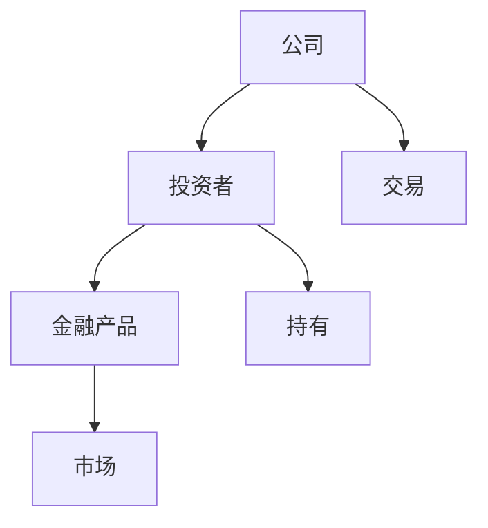

                 


# 构建基于知识图谱的金融风险关联网络动态预警系统

> 关键词：知识图谱、金融风险、关联网络、动态预警、人工智能、风险管理系统

> 摘要：本文详细探讨了如何利用知识图谱构建金融风险关联网络，并设计了一种动态预警系统。通过分析金融风险的关联性，结合图嵌入算法和时间序列分析，提出了一个高效的金融风险预警框架。本文还结合实际案例，详细讲解了系统的实现过程，并提出了最佳实践建议。

---

# 第一章: 金融风险关联网络的背景与问题背景

## 1.1 问题背景

### 1.1.1 金融风险管理的现状与挑战
金融市场的复杂性和不确定性使得风险管理变得尤为重要。传统的方法依赖于统计模型和历史数据分析，但在面对新兴风险和复杂关联时显得力不从心。例如，2008年的金融危机暴露了传统模型在处理复杂关联和非线性关系时的局限性。

### 1.1.2 传统金融风险预警的局限性
传统风险预警系统主要依赖于单一指标分析和统计回归模型，难以捕捉复杂的关联关系。此外，传统方法通常静态且滞后，无法实时捕捉市场动态变化。

### 1.1.3 知识图谱在金融领域的应用潜力
知识图谱通过将实体及其关系显式化，能够捕捉金融市场的隐含关联。这种关联不仅包括直接的金融交易关系，还可能包括新闻、社交媒体等多种非结构化数据中的隐含信息。

## 1.2 问题描述

### 1.2.1 金融风险关联网络的定义
金融风险关联网络是一个由金融市场中的实体（如公司、投资者、金融产品等）及其关系构成的网络。这些关系可以是直接的交易关系，也可以是间接的市场影响。

### 1.2.2 风险关联网络的核心要素
- **实体**：市场的参与者，如公司、投资者、金融机构等。
- **关系**：实体之间的关联，如投资关系、交易关系、控股关系等。
- **属性**：实体和关系的特征，如资产规模、交易金额等。

### 1.2.3 动态预警系统的建设目标
动态预警系统的目标是实时监控金融市场的风险关联网络，并在潜在风险事件发生前发出预警信号。这种系统需要具备以下特点：
- 实时性：能够快速响应市场变化。
- 关联性：能够捕捉实体之间的复杂关联。
- 动态性：能够适应市场环境的变化。

## 1.3 问题解决思路

### 1.3.1 知识图谱构建的基本思路
知识图谱的构建需要从数据源中提取实体和关系，并通过标准化和融合技术构建统一的知识库。

### 1.3.2 风险关联网络的构建方法
风险关联网络可以通过知识图谱的子图提取和关联规则挖掘来构建。

### 1.3.3 动态预警的核心算法选择
动态预警系统需要结合图嵌入算法和时间序列分析算法，以捕捉网络的动态变化。

## 1.4 边界与外延

### 1.4.1 系统的边界定义
系统主要关注金融市场中的实体及其关联关系，不包括实体的内部运营细节。

### 1.4.2 系统的外延与扩展方向
系统可以扩展到非金融领域的风险预警，例如企业供应链风险预警。

### 1.4.3 系统与现有金融系统的接口关系
系统需要与现有的金融数据系统（如交易系统、风控系统）进行数据对接。

## 1.5 核心概念结构与组成

### 1.5.1 知识图谱的核心要素
- 实体：公司、投资者、金融产品等。
- 关系：投资关系、交易关系等。
- 属性：资产规模、信用评级等。

### 1.5.2 风险关联网络的组成
- 实体节点：金融市场中的参与者。
- 关系边：实体之间的关联关系。
- 网络结构：实体节点和关系边构成的网络图。

### 1.5.3 动态预警系统的模块划分
- 数据采集模块：采集金融市场数据。
- 知识图谱构建模块：构建金融知识图谱。
- 风险关联网络构建模块：构建风险关联网络。
- 动态预警模块：实时监控并发出预警信号。

---

# 第二章: 知识图谱与风险关联网络的核心概念

## 2.1 知识图谱的基本原理

### 2.1.1 知识图谱的定义与特点
知识图谱是一种以图结构形式表示知识的数据库，具有语义丰富、结构化、可扩展等特点。

### 2.1.2 知识图谱的构建流程
1. 数据采集：从多种数据源（如金融数据库、新闻媒体）采集数据。
2. 数据清洗：去除噪声数据，确保数据质量。
3. 实体识别：通过NLP技术识别文本中的实体。
4. 关系抽取：抽取实体之间的关系。
5. 知识融合：将多源数据进行融合，消除冗余和冲突。

### 2.1.3 知识图谱的存储与表示
知识图谱通常使用图数据库（如Neo4j）进行存储，使用RDF（Resource Description Framework）或JSON-LD进行数据表示。

## 2.2 风险关联网络的构建原理

### 2.2.1 风险关联网络的定义
风险关联网络是金融知识图谱的子图，用于表示金融市场中实体之间的风险关联关系。

### 2.2.2 风险关联网络的构建方法
- **基于图嵌入的关联发现**：通过图嵌入算法（如Word2Vec、GraphSAGE）提取实体的低维表示，计算实体之间的相似性，发现潜在的关联关系。
- **基于关联规则挖掘**：通过挖掘高频关联项，发现实体之间的关联规则。

### 2.2.3 风险关联网络的属性特征
- **关联强度**：实体之间关联的紧密程度。
- **关联类型**：实体之间的关系类型，如投资关系、交易关系等。
- **关联方向**：实体之间的关联方向，如单向或双向。

## 2.3 动态预警机制的核心原理

### 2.3.1 动态预警机制的定义
动态预警机制是一种实时监控风险关联网络的变化，并根据变化情况发出预警信号的机制。

### 2.3.2 动态预警机制的关键算法
- **图嵌入算法**：用于实时更新实体的低维表示。
- **时间序列分析**：用于分析风险指标的变化趋势。
- **异常检测算法**：用于检测网络中的异常变化。

### 2.3.3 动态预警机制的实现流程
1. 实时更新知识图谱。
2. 计算实体的风险指标。
3. 检测风险指标的异常变化。
4. 根据异常变化发出预警信号。

## 2.4 核心概念对比分析

### 2.4.1 知识图谱与传统数据结构的对比
| 特性         | 知识图谱             | 传统数据结构（如关系型数据库） |
|--------------|---------------------|------------------------------|
| 数据表示     | 图结构，语义丰富     | 行为数据，结构化               |
| 关联性       | 强调实体之间的关联   | 关系有限，主要为表与表之间关系 |
| 灵活性       | 高，支持动态更新     | 低，结构固定                   |

### 2.4.2 风险关联网络与传统风险模型的对比
| 特性         | 风险关联网络         | 传统风险模型                 |
|--------------|---------------------|------------------------------|
| 关联性       | 强调实体之间的关联   | 依赖于单一指标或简单关系       |
| 动态性       | 支持动态更新         | 静态或周期性更新               |
| 表达能力     | 高，能够捕捉复杂关联 | 较低，主要依赖统计分析           |

### 2.4.3 动态预警机制与其他预警方法的对比
| 特性         | 动态预警机制         | 基于单一指标的预警方法         |
|--------------|---------------------|------------------------------|
| 数据来源     | 多源数据，包括非结构化数据 | 单一指标数据                   |
| 关联性       | 强调关联关系         | 依赖单一指标                   |
| 动态性       | 支持实时更新         | 通常滞后                       |

## 2.5 实体关系图（ER图）架构



---

# 第三章: 知识图谱构建的算法原理

## 3.1 知识图谱构建算法概述

### 3.1.1 基于规则的构建方法
基于规则的构建方法通过预定义的规则从文本中提取实体和关系。例如，使用正则表达式从公司财报中提取财务数据。

### 3.1.2 基于统计的构建方法
基于统计的构建方法通过统计特征（如共现、频率）来发现实体和关系。例如，使用关联规则挖掘从文本中发现实体关系。

### 3.1.3 基于深度学习的构建方法
基于深度学习的构建方法通过神经网络模型（如RNN、BERT）从文本中学习实体和关系的表示。

## 3.2 图嵌入算法原理

### 3.2.1 图嵌入的定义与特点
图嵌入是将图中的节点映射到低维向量空间的技术，具有以下特点：
- 维度低，便于后续分析。
- 保留图的结构信息和语义信息。

### 3.2.2 常见图嵌入算法
- **Word2Vec**：通过节点的上下文关系生成词向量。
- **GraphSAGE**：通过归纳式学习生成节点向量。
- **Node2Vec**：结合节点的邻居信息生成向量。

### 3.2.3 图嵌入算法的数学模型
以Node2Vec为例，其目标是最小化以下损失函数：

$$
\mathcal{L} = \sum_{v \in V} \sum_{u \in N(v)} \log p(u|v)
$$

其中，$V$是图的节点集合，$N(v)$是节点$v$的邻居节点集合。

## 3.3 关联规则挖掘算法

### 3.3.1 关联规则挖掘的定义
关联规则挖掘是从数据中发现频繁出现的项之间的关联关系，例如“购买A通常购买B”。

### 3.3.2 Apriori算法与FP-Growth算法
- **Apriori算法**：通过递归地生成候选项集，计算项集的支持度。
- **FP-Growth算法**：通过构建FP树，高效地生成候选项集。

### 3.3.3 关联规则在风险网络中的应用
通过关联规则挖掘，可以发现实体之间的关联关系，例如“公司A的股价与公司B的股价高度相关”。

## 3.4 时间序列分析算法

### 3.4.1 时间序列分析的定义
时间序列分析是通过分析数据的时间特性，发现数据的变化趋势和周期性。

### 3.4.2 常见时间序列分析方法
- **ARIMA模型**：自回归积分滑动平均模型。
- **LSTM网络**：长短期记忆网络。
- **Prophet模型**：Facebook开源的时间序列预测模型。

### 3.4.3 时间序列分析在风险预警中的应用
通过分析实体的风险指标的时间序列数据，预测未来的风险变化趋势。

---

# 第四章: 金融风险关联网络的构建与分析

## 4.1 风险关联网络的构建流程

### 4.1.1 数据采集与清洗
从金融数据库、新闻媒体等多源数据中采集数据，并进行清洗和预处理。

### 4.1.2 实体识别与关系抽取
通过NLP技术从文本中识别实体，并抽取实体之间的关系。

### 4.1.3 知识图谱构建
将实体和关系存储到图数据库中，构建金融知识图谱。

### 4.1.4 风险关联网络提取
从知识图谱中提取与风险相关的子图，构建风险关联网络。

## 4.2 风险关联网络的分析方法

### 4.2.1 网络拓扑分析
通过分析网络的度分布、中心性等拓扑特征，识别网络中的关键节点。

### 4.2.2 社群发现
通过社群发现算法（如Louvain算法），识别网络中的社群结构，分析社群之间的关联关系。

### 4.2.3 风险传播模拟
通过模拟风险在网络中的传播路径，评估风险事件的潜在影响范围。

---

# 第五章: 动态预警系统的算法实现

## 5.1 动态预警系统的实现流程

### 5.1.1 实时数据更新
通过API接口实时更新知识图谱中的数据。

### 5.1.2 实时图嵌入计算
使用在线学习算法实时更新实体的图嵌入向量。

### 5.1.3 异常检测
通过异常检测算法（如Isolation Forest）检测风险指标的异常变化。

### 5.1.4 预警信号生成
根据异常检测结果，生成相应的预警信号，并通过可视化界面呈现。

## 5.2 动态预警系统的算法实现

### 5.2.1 图嵌入的在线学习
使用GraphSAGE等在线学习算法，实时更新实体的图嵌入向量。

### 5.2.2 时间序列的实时预测
使用LSTM等深度学习模型，实时预测风险指标的未来值。

### 5.2.3 异常检测的实现
通过Isolation Forest等异常检测算法，实时检测风险指标的异常变化。

---

# 第六章: 金融风险关联网络动态预警系统的项目实战

## 6.1 项目实战的环境安装

### 6.1.1 系统环境
- 操作系统：Linux/Windows/MacOS
- 图数据库：Neo4j
- Python版本：3.8+

### 6.1.2 工具安装
- Python库：networkx、py2neo、pandas、scikit-learn、tensorflow
- 其他工具：Jupyter Notebook、IDE（PyCharm）

## 6.2 系统核心实现源代码

### 6.2.1 知识图谱构建代码
```python
from py2neo import Graph, Node, Relationship

# 连接图数据库
graph = Graph("http://localhost:7474", auth=("neo4j", "password"))

# 创建节点
node_company = Node("Company", name="Company A")
node_investor = Node("Investor", name="Investor B")

# 创建关系
relationship = Relationship(node_company, "INVESTED_BY", node_investor)

# 将关系添加到图数据库
graph.create(relationship)
```

### 6.2.2 动态预警算法代码
```python
import tensorflow as tf
from tensorflow.keras.layers import LSTM, Dense

# 定义LSTM模型
model = tf.keras.Sequential([
    LSTM(64, input_shape=(timesteps, features)),
    Dense(1, activation='sigmoid')
])

# 编译模型
model.compile(optimizer='adam', loss='binary_crossentropy', metrics=['accuracy'])

# 训练模型
model.fit(X_train, y_train, epochs=10, batch_size=32)
```

## 6.3 代码应用解读与分析

### 6.3.1 知识图谱构建代码解读
上述代码通过Py2Neo库连接到Neo4j图数据库，创建公司和投资者节点，并建立它们之间的投资关系。

### 6.3.2 动态预警算法代码解读
上述代码定义了一个LSTM模型，用于时间序列预测。模型通过训练数据进行拟合，能够预测未来的时间序列值。

## 6.4 实际案例分析与详细讲解剖析

### 6.4.1 案例背景
假设我们有一个金融市场的数据集，包含公司、投资者、金融产品的相关信息。

### 6.4.2 数据预处理
- 数据清洗：去除缺失值和异常值。
- 特征提取：从文本数据中提取实体和关系。

### 6.4.3 知识图谱构建
使用Py2Neo库将数据加载到Neo4j图数据库中，构建金融知识图谱。

### 6.4.4 风险关联网络提取
从知识图谱中提取与风险相关的子图，构建风险关联网络。

### 6.4.5 动态预警系统的实现
使用LSTM模型对风险指标进行实时预测，并通过异常检测算法检测潜在风险。

## 6.5 项目小结

### 6.5.1 项目总结
通过本项目，我们成功构建了一个基于知识图谱的金融风险关联网络动态预警系统。系统能够实时监控金融市场的风险变化，并在潜在风险事件发生前发出预警信号。

### 6.5.2 项目意义
本项目的实现为金融风险管理提供了一种新的思路，能够更有效地捕捉金融市场中的复杂关联关系。

---

# 第七章: 金融风险关联网络动态预警系统的最佳实践

## 7.1 最佳实践 Tips

### 7.1.1 数据质量管理
- 数据清洗：确保数据的完整性和准确性。
- 数据融合：多源数据的融合需要考虑数据的异构性和一致性。

### 7.1.2 系统性能优化
- 使用高效的图数据库（如Neo4j）存储知识图谱。
- 采用分布式计算技术（如Spark）处理大规模数据。

### 7.1.3 模型调优
- 使用超参数调优技术（如Grid Search）优化模型性能。
- 定期更新模型，确保模型的适用性。

## 7.2 小结
通过本文的详细讲解，读者可以全面理解如何构建基于知识图谱的金融风险关联网络动态预警系统。系统的核心在于知识图谱的构建和动态预警算法的设计。

## 7.3 注意事项

### 7.3.1 数据隐私与安全
在处理金融数据时，需要特别注意数据的隐私和安全问题。

### 7.3.2 系统的可扩展性
系统设计时需要考虑未来的扩展性，例如数据源的扩展、算法的升级等。

## 7.4 拓展阅读

### 7.4.1 推荐书籍
- 《知识图谱：概念、方法与应用》
- 《金融风险管理：理论与实践》

### 7.4.2 推荐论文
- "Knowledge Graph-based Risk Assessment in Financial Markets"
- "Dynamic Network Analysis for Financial Risk Management"

---

# 作者信息

作者：AI天才研究院/AI Genius Institute & 禅与计算机程序设计艺术/Zen And The Art of Computer Programming

