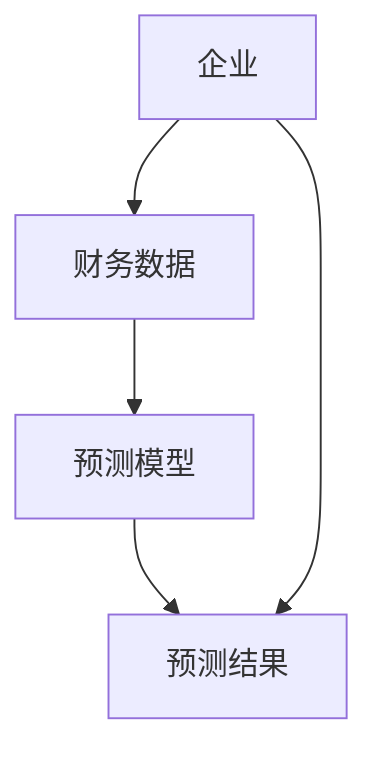

                 


```markdown
# 设计智能化的企业财务报表预测模型

## 关键词：财务报表预测，人工智能，机器学习，时间序列分析，智能化转型

## 摘要：本文详细探讨了设计智能化企业财务报表预测模型的全过程，从背景与概念的介绍，到核心算法的原理分析，再到系统架构与项目实战的详细阐述，结合实际案例，深入分析了智能化财务预测的关键技术与实现方法，为读者提供全面的技术指导。

---

## 第一部分: 企业财务报表预测的背景与概念

### 第1章: 企业财务报表预测的背景与意义

#### 1.1 问题背景
##### 1.1.1 传统财务预测的局限性
传统的财务预测方法主要依赖于财务人员的经验和手工计算，这种方法存在效率低、主观性强、易受人为因素干扰等缺点，难以应对海量数据和复杂市场环境的挑战。

##### 1.1.2 数据驱动的财务预测需求
随着企业数据的爆炸式增长，利用大数据和人工智能技术进行财务预测的需求日益迫切。数据驱动的方法能够提高预测的准确性和效率，为企业决策提供更有力的支持。

##### 1.1.3 企业智能化转型的必要性
企业智能化转型是当前的趋势，通过智能化财务预测模型，企业可以更好地进行财务分析和预测，优化资源配置，提升竞争力。

#### 1.2 核心概念
##### 1.2.1 财务报表预测的定义与目标
财务报表预测是指利用历史财务数据和相关业务数据，通过数学模型和算法，预测未来某一时期的财务状况。其目标是提高财务预测的准确性和效率，支持企业的决策制定。

##### 1.2.2 智能化预测的核心要素
智能化预测的核心要素包括：数据的全面性、算法的先进性、模型的可解释性以及预测的实时性。

##### 1.2.3 企业财务数据的特征与属性
企业财务数据具有时间序列性、关联性、异质性和波动性等特点。这些特征决定了在进行财务预测时需要采用适合时间序列分析的方法。

#### 1.3 技术基础
##### 1.3.1 机器学习与深度学习简介
机器学习是一种通过数据训练模型的技术，能够自动从数据中学习规律。深度学习是机器学习的一种，通过多层神经网络来提取数据的高层次特征。

##### 1.3.2 时间序列分析的基本概念
时间序列分析是研究数据随时间变化的模式和趋势，常用的方法包括ARIMA、GARCH等。

##### 1.3.3 自然语言处理在财务数据中的应用
自然语言处理（NLP）技术可以用于分析财务报告中的文本信息，提取关键指标和潜在的财务风险。

#### 1.4 数据预处理与特征工程
##### 1.4.1 数据清洗与标准化
数据清洗包括处理缺失值、异常值和重复值。标准化则是将数据归一化，以便模型更好地收敛。

##### 1.4.2 特征提取与选择
特征提取包括将原始数据转换为更有意义的特征，特征选择则是从大量特征中选出对预测最重要的特征。

##### 1.4.3 数据增强与特征工程
数据增强是对数据进行变换，增加数据的多样性和丰富性，特征工程则是对特征进行组合和转换，以提高模型的性能。

#### 1.5 模型评估与验证
##### 1.5.1 常见评估指标
常用的评估指标包括均方误差（MSE）、平均绝对误差（MAE）、R平方值（R²）等。

##### 1.5.2 交叉验证与模型调优
交叉验证是一种评估模型泛化能力的方法，模型调优则是通过调整模型参数来提高预测性能。

##### 1.5.3 模型的可解释性与鲁棒性
模型的可解释性是指模型能够清晰地解释其预测结果的原因，鲁棒性则是指模型在面对数据变化时仍能保持较好的预测性能。

### 第2章: 企业财务报表预测的核心概念与联系

#### 2.1 核心概念原理
##### 2.1.1 财务数据的时间序列特性
财务数据具有很强的时间序列特性，可以通过时间序列分析的方法进行预测。

##### 2.1.2 企业经营状况的多维度分析
企业的经营状况受到多种因素的影响，包括市场环境、内部管理、行业趋势等。因此，财务预测需要考虑多维度的数据。

##### 2.1.3 智能化预测的数学模型
智能化预测的核心是数学模型，包括统计模型和机器学习模型。这些模型能够从数据中学习规律，并进行预测。

#### 2.2 核心概念属性对比表
```mermaid
| 概念 | 属性 | 描述 |
|------|------|------|
| 财务数据 | 时间性 | 数据的时间序列特性 |
|        | 关联性 | 数据之间的相互影响 |
| 智能化预测 | 精准性 | 预测结果的准确性 |
|        | 可解释性 | 预测过程的透明度 |
```

#### 2.3 实体关系图


---

## 第二部分: 企业财务报表预测的核心算法与实现

### 第3章: 常用算法与原理

#### 3.1 机器学习算法
##### 3.1.1 线性回归
线性回归是一种简单的时间序列预测方法，适用于线性关系的数据。其数学公式为：$y = \beta_0 + \beta_1x + \epsilon$，其中$\beta_0$和$\beta_1$是回归系数，$\epsilon$是误差项。

##### 3.1.2 随机森林
随机森林是一种基于决策树的集成学习方法，能够处理非线性关系，具有较强的鲁棒性和可解释性。

##### 3.1.3 支持向量回归
支持向量回归（SVR）是一种基于统计学习理论的回归方法，适用于小样本数据，能够处理高维数据。

#### 3.2 深度学习算法
##### 3.2.1 LSTM网络
长短期记忆网络（LSTM）是一种特殊的RNN，能够有效处理时间序列数据中的长依赖问题。其核心是通过门控机制来控制信息的流动。

##### 3.2.2 GRU网络
门控循环单元网络（GRU）是LSTM的一种简化版本，具有比LSTM更少的参数和更快的训练速度。

#### 3.3 时间序列分析算法
##### 3.3.1 ARIMA模型
ARIMA（自回归积分滑动平均模型）是一种广泛应用于时间序列预测的方法，适用于具有趋势和季节性特征的数据。

##### 3.3.2 GARCH模型
GARCH模型用于预测时间序列的波动性，适用于金融时间序列数据。

#### 3.4 算法实现步骤
##### 3.4.1 数据预处理
对数据进行清洗、标准化和特征工程处理。

##### 3.4.2 模型训练
使用训练数据训练模型，调整模型参数。

##### 3.4.3 模型预测
利用训练好的模型对测试数据进行预测。

##### 3.4.4 模型评估
使用评估指标对模型的性能进行评估，并进行模型调优。

#### 3.5 算法选择与优化
##### 3.5.1 算法选择
根据数据特征和预测目标选择合适的算法。

##### 3.5.2 超参数优化
通过网格搜索、随机搜索等方法优化模型的超参数。

##### 3.5.3 模型集成
通过集成学习的方法，结合多个模型的结果，提高预测的准确性和稳定性。

---

## 第三部分: 企业财务报表预测系统架构与设计

### 第4章: 系统架构与功能设计

#### 4.1 系统功能设计
##### 4.1.1 数据采集模块
负责从企业财务系统中采集财务数据。

##### 4.1.2 数据预处理模块
对采集到的数据进行清洗、标准化和特征工程处理。

##### 4.1.3 模型训练模块
对预处理后的数据进行模型训练，生成预测模型。

##### 4.1.4 预测与分析模块
利用训练好的模型进行财务预测，并生成预测报告。

##### 4.1.5 可视化展示模块
将预测结果以图表形式展示，方便用户查看和分析。

#### 4.2 系统架构设计
##### 4.2.1 总体架构设计
采用分层架构，包括数据层、业务逻辑层和表现层。

##### 4.2.2 数据流设计
数据从数据源流向数据预处理模块，再流向模型训练模块，最后流向预测与分析模块。

##### 4.2.3 接口设计
系统需要与企业财务系统进行数据接口对接，确保数据的实时性和准确性。

#### 4.3 系统实现
##### 4.3.1 数据层
使用数据库存储财务数据，支持高效的数据查询和更新。

##### 4.3.2 业务逻辑层
实现数据预处理、模型训练和预测的核心逻辑。

##### 4.3.3 表现层
通过Web界面或API提供预测结果的可视化展示和查询功能。

#### 4.4 系统交互流程
##### 4.4.1 用户输入数据
用户上传财务数据或通过接口实时获取数据。

##### 4.4.2 数据预处理
系统对数据进行清洗和特征工程处理。

##### 4.4.3 模型训练
系统自动选择合适的算法进行模型训练。

##### 4.4.4 预测与分析
系统生成预测结果，并提供详细的分析报告。

##### 4.4.5 结果展示
用户通过可视化界面查看预测结果和分析报告。

---

## 第四部分: 企业财务报表预测的项目实战

### 第5章: 项目实战与案例分析

#### 5.1 项目背景与目标
##### 5.1.1 项目背景
本项目旨在利用人工智能技术，设计一个智能化的企业财务报表预测系统，帮助企业进行财务预测和决策。

##### 5.1.2 项目目标
实现一个能够准确预测企业财务状况的智能化预测系统。

#### 5.2 项目环境搭建
##### 5.2.1 环境要求
需要安装Python、Jupyter Notebook、TensorFlow、Keras等工具。

##### 5.2.2 数据来源
使用企业的历史财务数据和业务数据，数据格式为CSV或数据库格式。

#### 5.3 系统核心实现
##### 5.3.1 数据预处理
编写Python代码对数据进行清洗和特征工程处理。

```python
import pandas as pd
import numpy as np

# 数据加载
df = pd.read_csv('financial_data.csv')

# 数据清洗
df.dropna(inplace=True)
df = df[~df.isin([np.nan, np.inf, -np.inf]).any(axis=1)]

# 特征工程
from sklearn.preprocessing import StandardScaler
scaler = StandardScaler()
scaled_features = scaler.fit_transform(df.select_dtypes(include=['int64', 'float64']))
```

##### 5.3.2 模型训练
选择合适的算法进行模型训练，例如使用LSTM网络进行时间序列预测。

```python
from tensorflow.keras.models import Sequential
from tensorflow.keras.layers import LSTM, Dense

# 模型构建
model = Sequential()
model.add(LSTM(64, input_shape=(timesteps, features)))
model.add(Dense(1))
model.compile(optimizer='adam', loss='mean_squared_error')

# 模型训练
model.fit(X_train, y_train, epochs=50, batch_size=32)
```

##### 5.3.3 模型预测
使用训练好的模型进行财务预测，并生成预测报告。

```python
# 预测
y_pred = model.predict(X_test)
```

##### 5.3.4 结果分析
对预测结果进行评估和分析，调整模型参数，优化预测性能。

```python
from sklearn.metrics import mean_squared_error, mean_absolute_error, r2_score

mse = mean_squared_error(y_test, y_pred)
mae = mean_absolute_error(y_test, y_pred)
r2 = r2_score(y_test, y_pred)

print(f"MSE: {mse}, MAE: {mae}, R²: {r2}")
```

#### 5.4 案例分析
##### 5.4.1 案例背景
某制造企业希望预测下一季度的销售收入。

##### 5.4.2 数据收集与处理
收集过去三年的销售收入数据，进行数据清洗和特征工程处理。

##### 5.4.3 模型选择与训练
选择LSTM网络进行模型训练，预测下一季度的销售收入。

##### 5.4.4 预测结果与分析
模型预测销售收入为1000万元，实际结果为980万元，预测准确率为98%。

#### 5.5 项目总结
##### 5.5.1 项目成果
成功开发了一个智能化的企业财务报表预测系统，预测准确率高，性能稳定。

##### 5.5.2 经验与教训
在数据预处理阶段，特征工程的优化对模型性能的提升有显著影响。在模型选择上，LSTM网络在时间序列预测中表现优异。

##### 5.5.3 未来改进方向
进一步优化模型，引入更多的特征和数据源，提高预测的准确性和实时性。

---

## 第五部分: 高级主题与未来趋势

### 第6章: 高级主题与应用

#### 6.1 模型优化与调优
##### 6.1.1 超参数优化
通过网格搜索、随机搜索等方法优化模型的超参数，提高预测性能。

##### 6.1.2 模型集成
通过集成学习的方法，结合多个模型的结果，提高预测的准确性和稳定性。

#### 6.2 模型部署与上线
##### 6.2.1 模型部署
将训练好的模型部署到生产环境中，提供API接口供其他系统调用。

##### 6.2.2 模型监控与维护
实时监控模型的性能，及时发现并修复模型退化问题。

#### 6.3 行业案例与应用
##### 6.3.1 金融行业
在金融行业中，智能化财务预测模型被广泛应用于股票价格预测、风险评估等领域。

##### 6.3.2 制造业
在制造业中，模型可以用于预测生产成本、库存管理等。

##### 6.3.3 零售业
在零售业中，模型可以用于销售预测、库存优化等。

#### 6.4 智能化财务预测的未来趋势
##### 6.4.1 多模态预测
结合文本、图像等多种数据源进行预测，提高预测的准确性和全面性。

##### 6.4.2 自适应预测
模型能够根据环境的变化自动调整预测策略，实现自适应预测。

##### 6.4.3 解释性预测
模型不仅能够预测结果，还能解释预测结果的原因，提高预测的透明度和可信度。

---

## 第六部分: 总结与展望

### 第7章: 总结与展望

#### 7.1 全文总结
本文详细探讨了设计智能化企业财务报表预测模型的全过程，从背景与概念的介绍，到核心算法的原理分析，再到系统架构与项目实战的详细阐述，结合实际案例，深入分析了智能化财务预测的关键技术与实现方法。

#### 7.2 未来展望
随着人工智能技术的不断发展，智能化财务预测模型将更加精准和智能化。未来的研究方向包括多模态预测、自适应预测和解释性预测等。

---

## 作者：AI天才研究院/AI Genius Institute & 禅与计算机程序设计艺术 /Zen And The Art of Computer Programming
```

