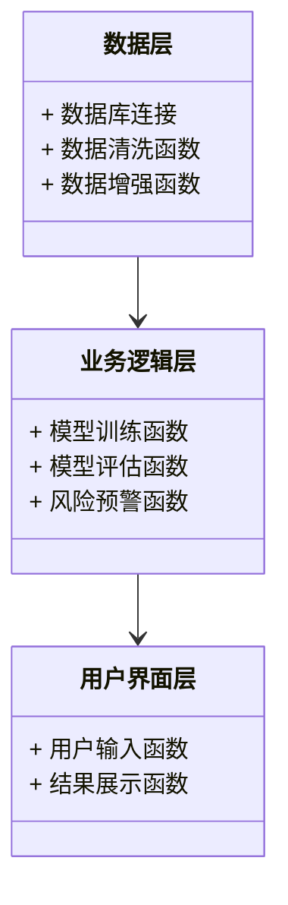
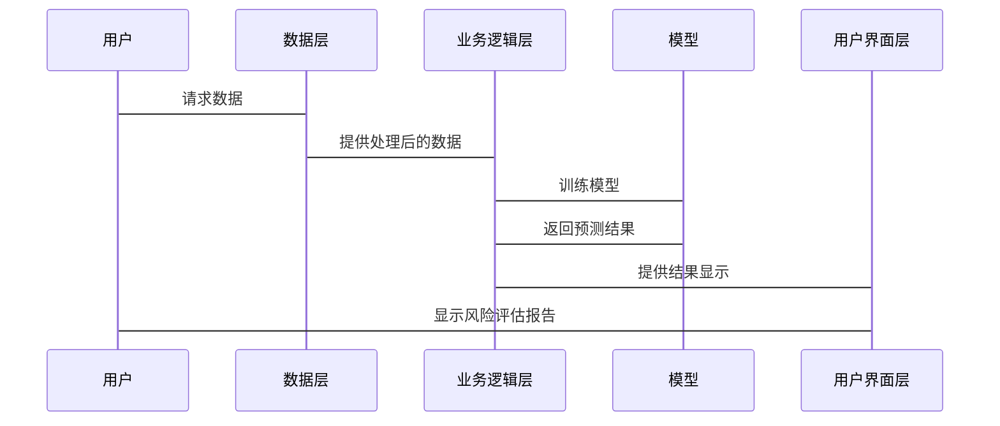

                 


```markdown
# AI辅助的投资风险评估

> 关键词：AI，投资，风险评估，机器学习，深度学习，系统架构

> 摘要：本文探讨了AI技术在投资风险评估中的应用，从基本概念到算法实现，再到系统架构设计，详细分析了AI如何辅助投资风险评估的过程。通过对比传统方法与AI方法，展示了AI在提高风险评估准确性和效率方面的优势，并通过具体案例分析了AI算法在投资风险评估中的实际应用。

---

# 第1章: 投资风险评估的基本概念

## 1.1 投资风险的定义与分类
### 1.1.1 投资风险的定义
投资风险是指在投资过程中，由于各种不确定因素的影响，导致投资收益与预期目标产生偏差的可能性。投资风险是投资决策中的核心问题，直接影响投资者的收益和资本安全。

### 1.1.2 投资风险的主要分类
- 市场风险：由于市场波动引起的资产价格变化风险。
- 信用风险：债务人或交易对手未能履行其合约义务的风险。
- 利率风险：由于利率变化导致资产价格波动的风险。
- 操作风险：由于内部操作失误或外部事件导致的损失风险。
- 流动性风险：资产在短时间内难以以合理价格变现的风险。

### 1.1.3 投资风险评估的重要性
准确评估投资风险是制定科学投资策略的基础，能够帮助投资者在风险可控范围内追求最大收益。同时，风险评估也是金融机构进行资产定价、资本配置和风险管理的重要依据。

## 1.2 AI技术在投资领域的应用背景
### 1.2.1 AI技术的基本概念
人工智能（AI）是指计算机系统模拟人类智能的理论、方法、技术和应用。AI技术包括机器学习、自然语言处理、计算机视觉等，能够帮助计算机从数据中学习模式并做出决策。

### 1.2.2 AI在金融领域的应用现状
- 数据分析：AI技术能够快速处理海量金融数据，发现数据中的隐藏模式。
- 预测模型：AI通过历史数据训练模型，预测股票价格、汇率波动等金融变量。
- 自动交易：AI算法可以实现高频交易和自动化投资决策。

### 1.2.3 AI辅助投资风险评估的必要性
传统投资风险评估方法依赖于经验判断和统计分析，存在主观性强、效率低、覆盖面窄等问题。AI技术能够通过大数据分析和机器学习模型，提供更精准、更全面的风险评估结果，帮助投资者做出科学决策。

## 1.3 本章小结
本章介绍了投资风险的基本概念和分类，探讨了AI技术在投资领域的应用背景，分析了AI辅助投资风险评估的必要性。

---

# 第2章: AI辅助投资风险评估的核心概念

## 2.1 投资风险评估的关键要素
### 2.1.1 风险来源分析
- 宏观经济因素：如GDP增长率、通货膨胀率、利率政策等。
- 微观企业因素：如企业的财务状况、盈利能力、管理能力等。
- 市场因素：如市场波动、行业竞争、政策法规等。

### 2.1.2 风险影响因素
- 价格波动：资产价格的短期波动可能引发投资损失。
- 时间因素：投资期限越长，不确定性越大。
- 杠杆效应：使用杠杆会放大投资收益和亏损。

### 2.1.3 风险评估指标
- 风险价值（VaR）：在一定置信水平下，可能的最大损失。
- 凸性风险（CVaR）：在VaR的基础上，考虑尾部风险。
- 波动率：资产价格的波动程度。

## 2.2 AI在投资风险评估中的作用
### 2.2.1 数据处理与分析
- 数据清洗：处理缺失值、异常值和重复数据。
- 数据增强：通过技术手段增加数据样本，提高模型的泛化能力。
- 特征提取：从原始数据中提取有助于风险评估的关键特征。

### 2.2.2 模型构建与预测
- 训练数据：使用历史数据训练机器学习模型。
- 预测结果：基于模型预测未来的风险水平。
- 风险预警：根据模型预测结果，提前预警潜在风险。

### 2.2.3 风险预警与决策支持
- 预警系统：实时监控市场变化，及时发出风险预警。
- 决策支持：基于AI模型的分析结果，为投资者提供科学决策支持。

## 2.3 核心概念对比分析
### 2.3.1 传统投资风险评估方法与AI方法的对比
| 方法 | 优点 | 缺点 |
|------|------|------|
| 传统方法 | 简单易懂，适用于小规模数据 | 主观性强，效率低，覆盖面窄 |
| AI方法 | 数据处理能力强，结果准确 | 模型复杂，需要大量数据支持 |

### 2.3.2 不同AI模型在投资风险评估中的应用对比
| 模型 | 优点 | 缺点 |
|------|------|------|
| 线性回归 | 简单，解释性强 | 适用于线性关系，非线性关系表现差 |
| 支持向量机 | 分类能力强，适合小样本数据 | 对高维数据处理能力有限 |
| 随机森林 | 抗过拟合能力强，适合复杂问题 | 计算复杂度高 |
| 神经网络 | 适合复杂非线性关系，表达能力强 | �易过拟合，需要大量数据 |

### 2.3.3 投资风险评估中的关键指标对比
| 指标 | 定义 | 应用 |
|------|------|------|
| VaR | 在一定置信水平下，可能的最大损失 | 用于衡量投资组合的风险 |
| CVaR | VaR的基础上，考虑尾部风险 | 用于评估极端损失的可能性 |
| 波动率 | 资产价格的波动程度 | 用于衡量资产的风险 |

## 2.4 本章小结
本章分析了投资风险评估的关键要素，探讨了AI在投资风险评估中的作用，并通过对比分析，展示了不同方法和模型在投资风险评估中的优缺点。

---

# 第3章: AI辅助投资风险评估的核心算法

## 3.1 机器学习算法在投资风险评估中的应用
### 3.1.1 线性回归模型
- 简单线性回归：用于预测单变量的线性关系。
- 多元线性回归：用于预测多变量的线性关系。
- 优缺点：简单易懂，但只能处理线性关系。

### 3.1.2 支持向量机模型
- SVM（Support Vector Machine）：用于分类和回归问题。
- 优缺点：适合小样本数据，但计算复杂度较高。

### 3.1.3 随机森林模型
- 随机森林：基于决策树的集成学习方法。
- 优缺点：抗过拟合能力强，但计算复杂度高。

### 3.1.4 神经网络模型
- 深度神经网络：用于处理复杂的非线性关系。
- 优缺点：需要大量数据支持，易过拟合。

## 3.2 基于深度学习的模型
### 3.2.1 卷积神经网络（CNN）
- 应用于图像识别和时间序列分析。
- 优缺点：适合处理局部特征，但需要大量数据支持。

### 3.2.2 循环神经网络（RNN）
- 应用于时间序列分析和自然语言处理。
- 优缺点：适合处理序列数据，但存在梯度消失问题。

### 3.2.3 Transformer模型
- 基于自注意力机制，广泛应用于自然语言处理。
- 优缺点：计算复杂度高，但效果优异。

## 3.3 算法对比与选择
### 3.3.1 不同算法的优缺点对比
| 模型 | 优点 | 缺点 |
|------|------|------|
| 线性回归 | 简单，解释性强 | 只能处理线性关系 |
| SVM | 分类能力强 | 计算复杂度高 |
| 随机森林 | 抗过拟合能力强 | 计算复杂度高 |
| 神经网络 | 表达能力强 | 易过拟合 |

### 3.3.2 投资风险评估中的算法选择策略
- 数据量：小样本数据适合SVM，大样本数据适合神经网络。
- 数据类型：时间序列数据适合RNN，图像数据适合CNN。
- 问题复杂度：复杂非线性关系适合深度学习模型。

### 3.3.3 实际案例中的算法应用
- 案例1：使用随机森林模型预测股票违约风险。
- 案例2：使用LSTM模型预测外汇汇率波动。

## 3.4 本章小结
本章详细介绍了机器学习和深度学习算法在投资风险评估中的应用，分析了不同算法的优缺点，并给出了实际案例中的算法选择策略。

---

# 第4章: 投资风险评估系统的架构设计

## 4.1 系统功能需求分析
### 4.1.1 数据采集与处理
- 数据来源：股票价格、财务数据、市场新闻等。
- 数据清洗：处理缺失值、异常值和重复数据。
- 数据增强：通过技术手段增加数据样本。

### 4.1.2 风险评估模型构建
- 数据预处理：标准化、归一化等。
- 模型训练：使用训练数据训练机器学习模型。
- 模型评估：通过测试数据评估模型性能。

### 4.1.3 风险预警与报告生成
- 风险预警：实时监控市场变化，及时发出风险预警。
- 报告生成：生成风险评估报告，提供投资建议。

## 4.2 系统架构设计
### 4.2.1 分层架构设计
- 数据层：数据采集、存储和管理。
- 业务逻辑层：实现风险评估的核心逻辑。
- 用户界面层：与用户交互，展示结果。

### 4.2.2 模块化设计
- 数据处理模块：负责数据清洗和特征提取。
- 模型训练模块：负责模型训练和评估。
- 风险预警模块：负责实时监控和预警。

### 4.2.3 可扩展性设计
- 模块化设计：便于功能扩展和升级。
- 异构系统集成：支持多种数据源和模型。

## 4.3 系统接口设计
### 4.3.1 数据接口
- 数据输入接口：接收外部数据源的数据。
- 数据输出接口：输出处理后的数据。

### 4.3.2 模型接口
- 模型训练接口：接收训练数据，返回训练好的模型。
- 模型预测接口：接收输入数据，返回预测结果。

### 4.3.3 用户接口
- 用户输入接口：接收用户的输入指令。
- 用户输出接口：展示系统的输出结果。

## 4.4 本章小结
本章分析了投资风险评估系统的功能需求，设计了系统的架构，包括数据层、业务逻辑层和用户界面层，并详细规划了系统的接口设计。

---

# 第5章: 投资风险评估的数学模型与公式

## 5.1 基于回归分析的数学模型
### 5.1.1 线性回归模型
- 简单线性回归：$y = \beta_0 + \beta_1 x + \epsilon$
- 多元线性回归：$y = \beta_0 + \beta_1 x_1 + \beta_2 x_2 + \dots + \beta_n x_n + \epsilon$

### 5.1.2 逻辑回归模型
- 二分类问题：$P(y=1|x) = \frac{1}{1 + e^{-(\beta_0 + \beta_1 x)}}$
- 多分类问题：使用softmax函数进行扩展。

### 5.1.3 岭回归模型
- 岭回归：在线性回归的基础上添加L2正则化项，$L = \sum (y_i - \hat{y}_i)^2 + \lambda \sum \beta_j^2$

## 5.2 基于分类算法的数学模型
### 5.2.1 支持向量机模型
- 线性可分：$y_i (\beta_0 + \beta_1 x_1 + \beta_2 x_2 + \dots + \beta_n x_n) \geq 1$
- 非线性可分：使用核函数进行映射，$y_i (w \cdot \phi(x_i) + b) \geq 1$

### 5.2.2 随机森林模型
- 基于决策树的集成学习，通过投票或加权的方式进行分类或回归。

### 5.2.3 K-近邻算法
- K-近邻分类：根据训练样本的距离进行投票，$P(y|x) = \arg\max_{k} \sum_{i=1}^k y_i$

## 5.3 基于深度学习的数学模型
### 5.3.1 神经网络模型
- 多层感知机：通过多层神经网络进行非线性变换，$y = f(Wx + b)$，其中$f$是激活函数。

### 5.3.2 LSTM模型
- 长短期记忆网络：通过门控机制保存长期信息，$c_t = \sigma(g(W_c x + W_h h_{t-1} + b_c))$
- 单元格状态更新：$h_t = \sigma(g(W_g x + W_h h_{t-1} + b_g))$

### 5.3.3 Transformer模型
- 自注意力机制：$Attention(Q,K,V) = \text{softmax}(\frac{QK^T}{\sqrt{d_k}})V$
- 前向网络：由多头自注意力和前向网络组成，$FFN(x) = \text{max}(0, x)$

## 5.4 数学公式与模型对比
### 5.4.1 各种模型的数学公式
| 模型 | 数学公式 |
|------|------|
| 线性回归 | $y = \beta_0 + \beta_1 x + \epsilon$ |
| 逻辑回归 | $P(y=1|x) = \frac{1}{1 + e^{-(\beta_0 + \beta_1 x)}}$ |
| 支持向量机 | $y_i (w \cdot \phi(x_i) + b) \geq 1$ |
| 神经网络 | $y = f(Wx + b)$ |
| LSTM | $c_t = \sigma(g(W_c x + W_h h_{t-1} + b_c))$ |
| Transformer | $Attention(Q,K,V) = \text{softmax}(\frac{QK^T}{\sqrt{d_k}})V$ |

### 5.4.2 模型的优缺点对比
| 模型 | 优点 | 缺点 |
|------|------|------|
| 线性回归 | 简单，解释性强 | 只能处理线性关系 |
| 逻辑回归 | 适合分类问题 | 仅适用于线性可分数据 |
| 支持向量机 | 分类能力强 | 计算复杂度高 |
| 神经网络 | 表达能力强 | 易过拟合 |
| LSTM | 适合时间序列 | 计算复杂度高 |
| Transformer | 自注意力机制 | 计算复杂度高 |

## 5.5 本章小结
本章详细介绍了投资风险评估中的数学模型与公式，分析了不同模型的优缺点，并通过公式对比展示了不同模型的数学表达。

---

# 附录

## 附录A: 算法实现的Python代码示例

### 附录A.1 线性回归模型
```python
import numpy as np
from sklearn.linear_model import LinearRegression

# 生成数据
X = np.array([1, 2, 3, 4, 5]).reshape(-1, 1)
y = np.array([2, 4, 5, 4, 6])

# 训练模型
model = LinearRegression()
model.fit(X, y)

# 预测结果
print(model.predict(X))
```

### 附录A.2 随机森林模型
```python
from sklearn.ensemble import RandomForestClassifier
from sklearn.datasets import make_classification

# 生成数据
X, y = make_classification(n_samples=100, n_features=4, n_classes=2)

# 训练模型
model = RandomForestClassifier(n_estimators=10)
model.fit(X, y)

# 预测结果
print(model.predict(X))
```

### 附录A.3 LSTM模型
```python
import numpy as np
from tensorflow.keras.models import Sequential
from tensorflow.keras.layers import LSTM, Dense

# 生成数据
X = np.random.randn(10, 1, 10)
y = np.random.randn(10, 1)

# 构建模型
model = Sequential()
model.add(LSTM(5, input_shape=(1, 10)))
model.add(Dense(1))
model.compile(loss='mean_squared_error', optimizer='adam')

# 训练模型
model.fit(X, y, epochs=10)
```

## 附录B: 系统架构的类图


## 附录C: 系统交互的序列图


---

# 结论

通过本文的详细分析，我们可以看到AI技术在投资风险评估中的巨大潜力和优势。AI技术能够帮助投资者更准确地识别和量化风险，提供科学的投资决策支持。然而，AI技术的应用也面临数据依赖性强、模型复杂度高、计算资源需求大等挑战。未来，随着AI技术的不断发展，投资风险评估将更加智能化和精准化，为投资者和金融机构提供更有力的支持。

---

# 参考文献
（此处列出相关的参考文献，如书籍、论文、技术报告等）

---

# 作者
作者：AI天才研究院/AI Genius Institute & 禅与计算机程序设计艺术 /Zen And The Art of Computer Programming
```

