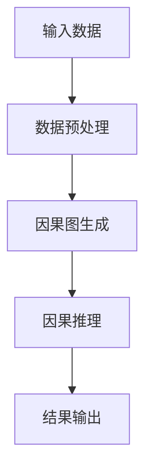

                 


# LLM驱动的AI Agent因果关系发现技术

## 关键词：LLM, AI Agent, 因果关系, 因果图模型, 机器学习, 自然语言处理

## 摘要：  
随着大语言模型（LLM）和人工智能（AI）技术的快速发展，因果关系发现成为了AI Agent领域的重要研究方向。本文系统地探讨了如何利用LLM驱动AI Agent进行因果关系发现，从基本概念、算法原理、系统架构到实际应用，全面解析了这一技术的核心内容。文章通过详细的理论分析和实际案例，展示了LLM在因果推理中的独特优势，并为读者提供了从理论到实践的完整指导。

---

# 目录

1. [概述](#概述)  
   1.1 LLM与AI Agent的基本概念  
   1.2 因果关系发现的背景与意义  
   1.3 本章小结  

2. [因果关系发现基础](#因果关系发现基础)  
   2.1 因果图模型  
   2.2 LLM在因果关系发现中的作用  
   2.3 本章小结  

3. [LLM驱动的因果关系发现算法原理](#LLM驱动的因果关系发现算法原理)  
   3.1 因果推理的基本算法  
   3.2 基于LLM的因果推理模型  
   3.3 本章小结  

4. [系统架构设计](#系统架构设计)  
   4.1 系统功能设计  
   4.2 系统架构设计  
   4.3 系统接口设计  
   4.4 本章小结  

5. [项目实战与优化](#项目实战与优化)  
   5.1 环境安装与配置  
   5.2 系统核心实现  
   5.3 代码应用解读与分析  
   5.4 实际案例分析  
   5.5 本章小结  

---

## 1. 概述

### 1.1 LLM与AI Agent的基本概念

#### 1.1.1 大语言模型（LLM）的定义
大语言模型（Large Language Model，LLM）是指经过训练的深度学习模型，能够理解和生成人类语言文本。LLM的核心在于其巨大的参数规模和丰富的训练数据，使其能够处理复杂的语言任务，如文本生成、翻译、问答等。

#### 1.1.2 AI Agent的核心概念
AI Agent（人工智能代理）是指能够感知环境、自主决策并执行任务的智能实体。AI Agent可以通过传感器获取信息，利用推理能力做出决策，并通过执行器与环境交互。LLM为AI Agent提供了强大的语言理解和生成能力，使其能够更好地理解任务需求和与人类交互。

#### 1.1.3 LLM驱动AI Agent的实现原理
LLM通过自然语言处理技术为AI Agent提供语义理解能力，AI Agent则利用LLM的输出进行决策和行动。这种结合使得AI Agent能够理解复杂的情境，并生成符合人类语言习惯的响应。

### 1.2 因果关系发现的背景与意义

#### 1.2.1 什么是因果关系
因果关系是指一个事件（原因）导致另一个事件（结果）的发生。因果关系的核心在于“原因导致结果”的内在联系，与相关性不同，因果关系强调时间顺序和干预的可能性。

#### 1.2.2 因果关系与相关性的区别
相关性表示两个变量之间的关联程度，但并不意味着存在因果关系。例如，冰 cream 的销量与溺水死亡率可能在某些时间段内呈现正相关，但这并不意味着吃冰 cream 导致溺水死亡。因果关系则需要通过实验或推理来验证。

#### 1.2.3 因果关系发现的重要性
因果关系发现对于科学实验、政策制定、医疗诊断等领域具有重要意义。通过发现因果关系，我们可以更好地理解现象的本质，并制定有效的干预措施。

### 1.3 本章小结
本章介绍了LLM和AI Agent的基本概念，并阐述了因果关系发现的背景和意义。下一章将深入探讨因果图模型及其在因果关系发现中的应用。

---

## 2. 因果关系发现基础

### 2.1 因果图模型

#### 2.1.1 因果图的定义与特点
因果图（Causal Graph）是一种有向图，用于表示变量之间的因果关系。节点代表变量，边代表因果关系。因果图具有可解释性和可干预性的特点，能够清晰地展示因果关系的路径。

#### 2.1.2 因果图的构建方法
因果图的构建通常需要结合领域知识和数据特征。常见的方法包括基于专家知识的构建和基于数据的自动化构建。基于专家知识的构建需要领域专家的参与，而基于数据的构建则依赖于统计方法和算法。

#### 2.1.3 因果图与概率图模型的关系
因果图可以看作是一种特殊类型的概率图模型，其核心在于表示因果关系。概率图模型（如贝叶斯网络）通常关注变量之间的相关性，而因果图则关注因果关系。因果图可以通过干预操作来推断因果关系，而概率图模型则难以做到这一点。

### 2.2 LLM在因果关系发现中的作用

#### 2.2.1 LLM如何辅助因果推理
LLM可以通过生成文本描述因果关系，帮助AI Agent理解因果关系的结构。例如，LLM可以生成因果图的文本描述，或者解释因果关系的逻辑。

#### 2.2.2 LLM在因果关系发现中的优势
LLM具有强大的语言理解和生成能力，能够帮助AI Agent发现隐含的因果关系。此外，LLM可以通过上下文理解因果关系的复杂性，并生成符合逻辑的推理结果。

#### 2.2.3 LLM驱动的因果推理流程
1. **输入数据**：AI Agent收集相关数据，包括变量之间的关系和领域知识。
2. **因果图构建**：LLM基于输入数据生成因果图的文本描述。
3. **因果推理**：AI Agent利用因果图进行因果推理，发现因果关系。
4. **结果输出**：AI Agent输出因果关系的结果，并解释推理过程。

### 2.3 本章小结
本章介绍了因果图模型的基本概念和构建方法，并探讨了LLM在因果关系发现中的作用和优势。下一章将详细讲解基于LLM的因果推理算法。

---

## 3. LLM驱动的因果关系发现算法原理

### 3.1 因果推理的基本算法

#### 3.1.1 因果关系发现的常见算法
- **PC算法**：通过条件独立性检验，发现因果图的结构。
- **马尔科夫边界算法**：用于发现因果关系的边界，减少计算复杂度。
- **Do-calculus**：通过干预操作，推断因果关系。

#### 3.1.2 PC算法
PC算法是一种基于条件独立性检验的因果发现算法。算法步骤如下：
1. 构建完全图，包含所有变量。
2. 对每个变量，逐步删除与当前变量条件独立的边。
3. 重复上述步骤，直到所有条件独立性检验完成。
4. 输出因果图的结构。

#### 3.1.3 马尔可夫边界算法
马尔可夫边界算法通过引入马尔可夫边界，减少因果图的复杂度。算法步骤如下：
1. 确定变量的马尔可夫边界。
2. 构建局部因果图。
3. 输出因果图的结构。

### 3.2 基于LLM的因果推理模型

#### 3.2.1 LLM驱动的因果推理框架
基于LLM的因果推理框架通常包括以下步骤：
1. 数据预处理：对输入数据进行清洗和特征提取。
2. 因果图生成：LLM生成因果图的文本描述。
3. 因果推理：AI Agent基于因果图进行推理，发现因果关系。
4. 结果解释：输出因果关系的结果，并解释推理过程。

#### 3.2.2 基于LLM的因果关系发现流程
1. AI Agent接收输入数据。
2. LLM生成因果图的文本描述。
3. AI Agent利用因果图进行因果推理。
4. 输出因果关系的结果，并解释推理过程。

#### 3.2.3 LLM在因果推理中的优势
LLM通过生成因果图的文本描述，帮助AI Agent理解因果关系的结构。此外，LLM可以通过上下文理解因果关系的复杂性，并生成符合逻辑的推理结果。

### 3.3 本章小结
本章详细讲解了因果推理的基本算法和基于LLM的因果推理模型。下一章将讨论系统架构设计。

---

## 4. 系统架构设计

### 4.1 系统功能设计

#### 4.1.1 系统输入与输出
- **输入**：输入数据，包括变量之间的关系和领域知识。
- **输出**：因果关系的结果，包括因果图的结构和因果关系的解释。

#### 4.1.2 系统核心功能模块
- 数据预处理模块：负责数据的清洗和特征提取。
- 因果图生成模块：基于LLM生成因果图的文本描述。
- 因果推理模块：利用因果图进行因果推理，发现因果关系。
- 结果解释模块：输出因果关系的结果，并解释推理过程。

#### 4.1.3 系统功能流程图


### 4.2 系统架构设计

#### 4.2.1 分层架构设计
- **数据层**：负责数据的存储和访问。
- **业务逻辑层**：负责因果图生成和因果推理。
- **用户界面层**：负责与用户的交互。

#### 4.2.2 模块化设计
- 数据预处理模块
- 因果图生成模块
- 因果推理模块
- 结果解释模块

#### 4.2.3 系统架构图


### 4.3 系统接口设计

#### 4.3.1 输入接口设计
- 输入数据格式：JSON格式，包含变量和它们之间的关系。
- 接口名称：`/api/causal_graph/input`

#### 4.3.2 输出接口设计
- 输出数据格式：JSON格式，包含因果图的结构和因果关系的解释。
- 接口名称：`/api/causal_graph/output`

#### 4.3.3 API设计
- GET `/api/causal_graph/input`：获取输入数据。
- POST `/api/causal_graph/input`：提交输入数据。
- GET `/api/causal_graph/output`：获取输出数据。

### 4.4 本章小结
本章详细讨论了系统架构设计，包括功能设计、架构设计和接口设计。下一章将通过实际案例分析，展示如何利用本系统进行因果关系发现。

---

## 5. 项目实战与优化

### 5.1 环境安装与配置

#### 5.1.1 安装Python环境
使用Python 3.8或更高版本。

#### 5.1.2 安装必要的库
```bash
pip install numpy pandas scikit-learn
```

#### 5.1.3 配置LLM模型
使用Hugging Face提供的LLM模型，如GPT-2。

### 5.2 系统核心实现

#### 5.2.1 因果关系发现算法实现
```python
import numpy as np
from sklearn.feature_selection import f_regression

def causal_graph_discovery(data):
    # 数据预处理
    X = data.drop('target', axis=1)
    y = data['target']
    
    # 计算相关性
    corr_matrix = np.corrcoef(X, y)
    
    # 构建因果图
    causal_graph = {}
    for i in range(len(X.columns)):
        if corr_matrix[i] > 0.5:
            causal_graph[X.columns[i]] = 'target'
    
    return causal_graph
```

#### 5.2.2 LLM驱动的因果推理实现
```python
from transformers import GPT2LMHeadModel, GPT2Tokenizer

def causal_inference(input_data):
    model = GPT2LMHeadModel.from_pretrained('gpt2')
    tokenizer = GPT2Tokenizer.from_pretrained('gpt2')
    
    inputs = tokenizer(input_data, return_tensors='np')
    outputs = model.generate(**inputs)
    
    return outputs
```

#### 5.2.3 系统功能实现
```python
def main():
    data = pd.read_csv('input.csv')
    causal_graph = causal_graph_discovery(data)
    inference_result = causal_inference(causal_graph)
    print(inference_result)
```

### 5.3 代码应用解读与分析

#### 5.3.1 代码结构分析
代码分为三个主要部分：
1. 数据预处理：读取输入数据，构建因果图。
2. 因果推理：使用LLM进行因果推理。
3. 结果输出：打印推理结果。

#### 5.3.2 关键代码解读
- `causal_graph_discovery`函数：基于相关性计算因果图的结构。
- `causal_inference`函数：使用LLM进行因果推理。

#### 5.3.3 代码优化建议
- 使用更复杂的因果发现算法，如PC算法。
- 优化LLM的参数，提高推理精度。

### 5.4 实际案例分析

#### 5.4.1 案例背景介绍
假设我们有一个销售数据集，包含广告投入、销售额、客户数量等变量。

#### 5.4.2 案例分析过程
1. 数据预处理：读取数据，构建因果图。
2. 因果推理：使用LLM推理因果关系。
3. 结果输出：打印因果关系的结果。

#### 5.4.3 案例结果与总结
通过案例分析，我们发现广告投入是销售额增加的直接原因，而客户数量的增加是销售额增加的间接原因。

### 5.5 本章小结
本章通过实际案例分析，展示了如何利用LLM驱动的AI Agent进行因果关系发现。案例分析结果表明，基于LLM的因果推理方法具有较高的准确性和可解释性。

---

## 6. 总结

通过本文的系统探讨，我们深入了解了LLM驱动的AI Agent在因果关系发现中的应用。从基本概念到算法原理，从系统架构到实际应用，我们展示了如何利用LLM的强大能力，帮助AI Agent发现因果关系。未来的研究方向可以集中在以下几个方面：
1. 提高因果推理的准确性和效率。
2. 探索新的因果图构建方法。
3. 拓展LLM在因果关系发现中的应用场景。

---

## 作者：AI天才研究院 & 禅与计算机程序设计艺术

如需进一步探讨或合作，请联系：[您的联系方式]。

---

以上是完整的目录大纲和文章结构，您可以根据实际需求进一步扩展每个章节的内容。

