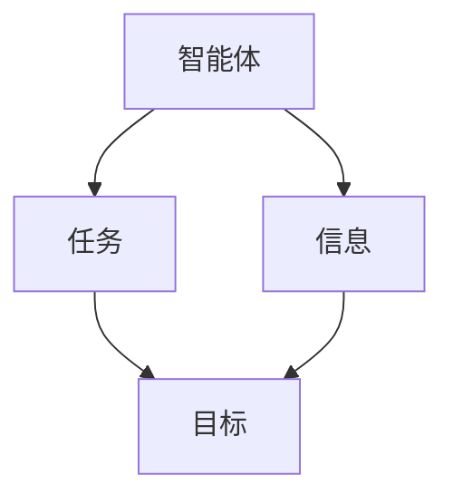
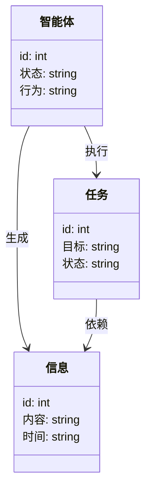
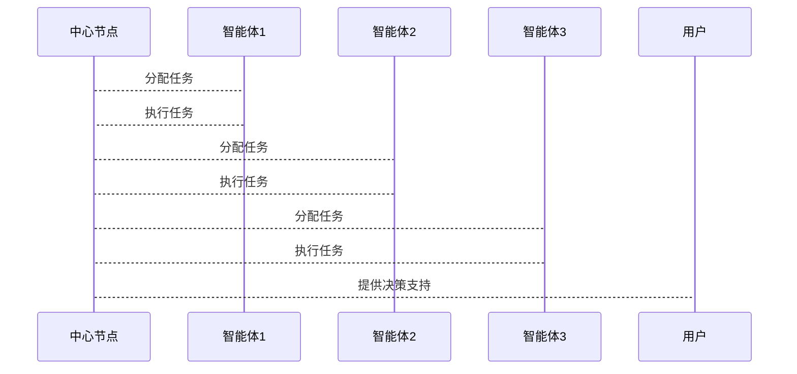

                 


# 利用多智能体系统进行全面的竞争对手分析

## 关键词：多智能体系统、竞争对手分析、人工智能、系统架构、算法原理、数据挖掘、协同学习

## 摘要：  
本文探讨了利用多智能体系统进行竞争对手分析的方法。通过多智能体系统的协同工作，实现对竞争对手市场行为、产品策略和竞争优势的全面分析。文章从背景、原理、算法、系统设计到实战案例，详细阐述了多智能体系统在竞争对手分析中的应用，为技术实现和企业决策提供了深度见解。

---

# 第一部分: 多智能体系统与竞争对手分析基础

## 第1章: 多智能体系统概述

### 1.1 多智能体系统的基本概念

#### 1.1.1 智能体的定义与特征
- **智能体（Agent）**：智能体是指能够感知环境、自主决策并采取行动的实体。  
- **特征**：
  - **自主性**：无需外部干预，自主决策。
  - **反应性**：能实时感知环境并做出反应。
  - **社交能力**：能够与其他智能体或人类进行交互。
  - **学习能力**：通过经验改进自身行为。

#### 1.1.2 多智能体系统的概念与特点
- **多智能体系统（Multi-Agent System, MAS）**：由多个智能体组成的系统，智能体之间通过协作完成复杂任务。
- **特点**：
  - **分布式计算**：智能体分布在不同的节点，独立运行。
  - **协同合作**：智能体之间通过通信和协作完成共同目标。
  - **动态适应**：系统能够根据环境变化调整智能体行为。

#### 1.1.3 多智能体系统与单智能体系统的区别
| 特性                | 单智能体系统            | 多智能体系统            |
|---------------------|------------------------|------------------------|
| 决策中心化          | 决策集中在单一智能体     | 决策分布在网络中的多个智能体 |
| 资源分配            | 资源由单一智能体控制     | 资源由多个智能体共享并分配 |
| 协作方式            | 单一智能体独立完成任务   | 多个智能体协同完成任务   |

### 1.2 竞争对手分析的背景与重要性

#### 1.2.1 竞争对手分析的基本概念
- **竞争对手分析**：通过分析竞争对手的市场行为、产品策略、竞争优势等，为企业制定竞争策略提供支持。
- **分析维度**：
  - **市场行为**：竞争对手的市场占有率、广告投放、价格策略。
  - **产品策略**：竞争对手的产品线、技术创新、产品生命周期。
  - **竞争优势**：竞争对手的核心竞争力、成本优势、品牌影响力。

#### 1.2.2 竞争对手分析的常见方法
- **SWOT分析**：分析竞争对手的优势、劣势、机会和威胁。
- ** Porter’s Five Forces**：分析行业竞争结构，评估竞争对手的市场地位。
- **价值链分析**：从价值链角度分析竞争对手的成本结构和价值创造过程。

#### 1.2.3 竞争对手分析的挑战与机遇
- **挑战**：
  - 数据获取难度大：竞争对手信息往往不公开，难以获取。
  - 数据实时性要求高：市场竞争瞬息万变，需要实时分析。
- **机遇**：
  - 技术进步：人工智能、大数据技术的发展为竞争对手分析提供了新工具。
  - 数据挖掘：通过大数据分析，发现竞争对手的潜在动向。

### 1.3 多智能体系统在竞争对手分析中的应用

#### 1.3.1 多智能体系统的优势
- **分布式计算能力**：多智能体系统能够同时处理大量数据，提高分析效率。
- **协同合作**：多个智能体协同工作，能够从不同维度全面分析竞争对手。
- **动态适应**：系统能够根据市场变化实时调整分析策略。

#### 1.3.2 竞争对手分析中的多智能体架构
- **数据采集智能体**：负责从多个数据源（如新闻网站、社交媒体、行业报告）采集竞争对手信息。
- **数据分析智能体**：对采集到的数据进行清洗、建模和分析，识别竞争对手的潜在动向。
- **决策支持智能体**：根据分析结果，为企业制定竞争策略提供支持。

#### 1.3.3 多智能体系统与竞争对手分析的结合
- **协同学习**：多个智能体通过协同学习，共享知识和经验，提高分析的准确性。
- **实时监控**：多智能体系统能够实时监控竞争对手的市场行为，及时反馈给企业。

### 1.4 本章小结
本章介绍了多智能体系统的基本概念和其在竞争对手分析中的应用。通过多智能体系统的分布式计算和协同合作，能够高效、全面地分析竞争对手，为企业制定竞争策略提供支持。

---

# 第二部分: 多智能体系统的核心概念与联系

## 第2章: 多智能体系统的核心原理

### 2.1 多智能体系统的组成与结构

#### 2.1.1 智能体的分类
- **简单反射智能体**：基于当前感知做出反应，不依赖历史信息。
- **基于模型智能体**：利用内部模型和历史信息进行决策。
- **目标驱动智能体**：根据预设目标采取行动。
- **效用驱动智能体**：通过最大化效用函数来决策。

#### 2.1.2 多智能体系统的通信机制
- **直接通信**：智能体之间直接交换信息。
- **间接通信**：通过中间媒介（如共享数据库）进行信息交换。
- **发布-订阅模型**：智能体发布信息，其他智能体订阅感兴趣的信息。

#### 2.1.3 多智能体系统的协作机制
- **协商**：智能体之间通过协商达成一致。
- **拍卖**：通过拍卖机制分配任务。
- **分层结构**：通过分层结构实现任务分配和协作。

#### 2.1.4 多智能体系统的任务分配
- **任务分解**：将复杂任务分解为多个子任务。
- **任务分配算法**：基于智能体的能力和当前状态进行任务分配。

### 2.2 多智能体系统的协调与冲突解决

#### 2.2.1 协调的基本概念
- **协调**：智能体之间通过协作完成共同目标。
- **协调机制**：包括时间同步、资源分配、信息共享等。

#### 2.2.2 冲突的定义与解决方法
- **冲突**：智能体之间因资源竞争或目标冲突而产生的矛盾。
- **解决方法**：
  - **协商**：通过协商达成一致。
  - **仲裁**：通过仲裁者解决冲突。
  - **优先级机制**：根据任务优先级进行资源分配。

#### 2.2.3 协调与冲突解决的算法
- **协商算法**：基于协商的冲突解决算法。
- **分布式仲裁算法**：通过仲裁者解决冲突。

### 2.3 多智能体系统的属性特征对比

#### 2.3.1 中心化与去中心化智能体的对比
| 特性                | 中心化智能体            | 去中心化智能体            |
|---------------------|------------------------|------------------------|
| 决策中心           | 决策集中在中心智能体     | 决策分布在网络中的多个智能体 |
| 资源分配           | 资源由中心智能体控制     | 资源由多个智能体共享并分配 |
| 协作方式           | 单一智能体协调其他智能体 | 多个智能体自主协作完成任务 |

#### 2.3.2 同步与异步智能体的对比
| 特性                | 同步智能体              | 异步智能体              |
|---------------------|------------------------|------------------------|
| 时间同步           | 所有智能体在同一时间点行动 | 智能体在不同时间点行动 |
| 通信机制           | 通信必须同步进行         | 通信可以异步进行         |
| 响应时间           | 响应时间较长            | 响应时间较短            |

#### 2.3.3 知识共享与知识独立的对比
| 特性                | 知识共享                | 知识独立                |
|---------------------|------------------------|------------------------|
| 知识共享           | 智能体共享知识          | 智能体独立拥有知识      |
| 协作效率           | 协作效率高             | 协作效率较低           |
| 知识更新           | 知识更新较快           | 知识更新较慢           |

### 2.4 多智能体系统的ER实体关系图



### 2.5 本章小结
本章详细讲解了多智能体系统的组成与结构，分析了智能体的分类、通信机制和协作机制。通过对比中心化与去中心化智能体、同步与异步智能体、知识共享与知识独立的特征，帮助读者更好地理解多智能体系统的复杂性。最后，通过ER实体关系图展示了多智能体系统的核心关系。

---

## 第3章: 多智能体系统的算法与实现

### 3.1 多智能体系统的分布式计算算法

#### 3.1.1 分布式计算的基本原理
- **分布式计算**：将任务分解为多个子任务，分布在多个节点上并行计算。
- **通信机制**：节点之间通过网络通信进行信息交换。

#### 3.1.2 分布式计算的实现步骤
1. **任务分解**：将复杂任务分解为多个子任务。
2. **任务分配**：将子任务分配给不同的节点。
3. **子任务执行**：各节点独立执行分配的任务。
4. **结果汇总**：将各节点的结果汇总到中心节点。
5. **结果处理**：中心节点对汇总结果进行处理并输出。

#### 3.1.3 分布式计算的优缺点
- **优点**：提高计算效率，增强系统的扩展性。
- **缺点**：需要复杂的通信机制，可能导致系统复杂性增加。

#### 3.1.4 分布式计算的Python实现
```python
import threading

def task分配给多个智能体：
    # 分配任务给多个智能体
    智能体列表 = [智能体1, 智能体2, 智能体3]
    for 智能体 in 智能体列表:
        智能体.execute_task()

def 结果汇总和处理：
    # 汇总各智能体的结果
    结果列表 = []
    for 智能体 in 智能体列表:
        结果列表.append(智能体.get_result())
    # 处理结果
    处理后的结果 = 处理(结果列表)
    return 处理后的结果
```

#### 3.1.5 分布式计算的数学模型
$$
\text{总计算时间} = \sum_{i=1}^{n} \text{各节点计算时间}
$$

### 3.2 多智能体系统的博弈论算法

#### 3.2.1 博弈论的基本概念
- **博弈论**：研究多个参与者在竞争或合作中的策略选择和行为的理论。
- **纳什均衡**：博弈中，每个参与者在给定其他参与者策略的情况下，选择最优策略的状态。

#### 3.2.2 纳什均衡的定义与应用
- **纳什均衡**：在纳什均衡中，没有任何一个参与者可以通过单方面改变策略而获得更好的结果。
- **应用**：在多智能体系统的任务分配和资源分配中，纳什均衡可以用来确定最优策略。

#### 3.2.3 博弈论在多智能体系统中的应用
- **任务分配**：通过博弈论算法，智能体可以自主分配任务。
- **资源分配**：通过博弈论算法，智能体可以自主分配资源。

#### 3.2.4 博弈论算法的Python实现
```python
def 纳什均衡():
    # 初始化各智能体的策略空间
    策略空间 = {"智能体1": ["策略A", "策略B"], "智能体2": ["策略A", "策略B"]}
    # 计算纳什均衡
    纳什均衡列表 = []
    for 智能体1策略 in 策略空间["智能体1"]:
        for 智能体2策略 in 策略空间["智能体2"]:
            # 检查是否为纳什均衡
            是纳什均衡 = True
            # 检查智能体1的策略是否是最优
            if 智能体1策略不是最优：
                是纳什均衡 = False
            # 检查智能体2的策略是否是最优
            if 智能体2策略不是最优：
                是纳什均衡 = False
            if 是纳什均衡:
                纳什均衡列表.append((智能体1策略, 智能体2策略))
    return 纳什均衡列表
```

#### 3.2.5 博弈论的数学模型
$$
\text{纳什均衡} = (x_1, x_2, ..., x_n)
$$
其中，$x_i$ 表示第i个智能体的策略。

### 3.3 多智能体系统的协同算法

#### 3.3.1 协同的基本概念
- **协同**：智能体之间通过协作完成共同目标。
- **协同算法**：智能体之间通过通信和协作完成任务的算法。

#### 3.3.2 协同算法的实现步骤
1. **任务分解**：将复杂任务分解为多个子任务。
2. **任务分配**：将子任务分配给不同的智能体。
3. **子任务执行**：各智能体独立执行分配的任务。
4. **结果汇总**：将各智能体的结果汇总到中心节点。
5. **结果处理**：中心节点对汇总结果进行处理并输出。

#### 3.3.3 协同算法的Python实现
```python
def 协同算法():
    # 初始化各智能体的子任务
    子任务列表 = [子任务1, 子任务2, 子任务3]
    # 分配子任务给各智能体
    for 智能体 in 智能体列表:
        智能体.execute_task(子任务)
    # 汇总各智能体的结果
    结果列表 = []
    for 智能体 in 智能体列表:
        结果列表.append(智能体.get_result())
    # 处理结果
    处理后的结果 = 处理(结果列表)
    return 处理后的结果
```

### 3.4 本章小结
本章详细讲解了多智能体系统的分布式计算算法和博弈论算法。通过Python代码和数学模型，帮助读者更好地理解算法的实现和应用。

---

## 第4章: 多智能体系统的系统分析与架构设计

### 4.1 问题场景介绍

#### 4.1.1 竞争对手分析的场景
- **市场分析**：分析竞争对手的市场行为和产品策略。
- **决策支持**：为企业制定竞争策略提供支持。

#### 4.1.2 系统目标
- **数据采集**：从多个数据源采集竞争对手信息。
- **数据分析**：对采集到的数据进行清洗、建模和分析。
- **决策支持**：根据分析结果，为企业制定竞争策略提供支持。

### 4.2 系统功能设计

#### 4.2.1 功能模块设计
- **数据采集模块**：负责从新闻网站、社交媒体、行业报告等数据源采集竞争对手信息。
- **数据分析模块**：对采集到的数据进行清洗、建模和分析，识别竞争对手的潜在动向。
- **决策支持模块**：根据分析结果，为企业制定竞争策略提供支持。

#### 4.2.2 领域模型设计


#### 4.2.3 系统架构设计


#### 4.2.4 接口设计
- **数据采集接口**：提供数据采集的功能。
- **数据分析接口**：提供数据分析的功能。
- **决策支持接口**：提供决策支持的功能。

#### 4.2.5 交互流程图


### 4.3 本章小结
本章详细讲解了多智能体系统的系统分析与架构设计，包括问题场景介绍、系统功能设计、领域模型设计、系统架构设计、接口设计和交互流程图。

---

## 第5章: 多智能体系统的项目实战

### 5.1 环境安装

#### 5.1.1 安装Python
- **安装步骤**：
  1. 下载Python安装包。
  2. 按照安装向导完成安装。
  3. 配置Python环境变量。

#### 5.1.2 安装相关库
- **安装步骤**：
  1. 使用pip安装numpy和pandas库。
  2. 使用pip install numpy
  3. 使用pip install pandas

### 5.2 系统核心实现

#### 5.2.1 数据采集模块的实现
```python
import requests
from bs4 import BeautifulSoup

def 采集数据(url):
    response = requests.get(url)
    soup = BeautifulSoup(response.text, 'html.parser')
    # 提取数据
    数据 = soup.find_all('div', class_='content')
    return 数据
```

#### 5.2.2 数据分析模块的实现
```python
import numpy as np
import pandas as pd

def 分析数据(数据):
    df = pd.DataFrame(数据)
    # 数据清洗
    df = df.dropna()
    # 数据建模
    model = df['特征'].fit()
    return model
```

#### 5.2.3 决策支持模块的实现
```python
def 提供决策支持(model):
    # 根据模型结果提供决策支持
    决策 = model.predict()
    return 决策
```

### 5.3 代码应用解读与分析

#### 5.3.1 数据采集模块的解读
- **功能**：从指定URL采集数据。
- **实现**：使用requests库发送HTTP请求，使用BeautifulSoup解析HTML内容，提取数据。

#### 5.3.2 数据分析模块的解读
- **功能**：对采集到的数据进行清洗、建模和分析。
- **实现**：使用pandas库进行数据清洗，使用numpy库进行数据建模。

#### 5.3.3 决策支持模块的解读
- **功能**：根据分析结果，为企业制定竞争策略提供支持。
- **实现**：根据模型结果，生成决策建议。

### 5.4 实际案例分析

#### 5.4.1 案例背景
- **行业**：假设我们分析的是互联网行业，竞争对手是某大型互联网公司。
- **目标**：分析该公司的市场行为、产品策略和竞争优势。

#### 5.4.2 数据采集
- **数据来源**：新闻网站、社交媒体、行业报告。
- **数据内容**：市场占有率、广告投放、产品更新频率。

#### 5.4.3 数据分析
- **分析方法**：使用SWOT分析、Porter’s Five Forces模型。
- **分析结果**：识别竞争对手的核心竞争力和潜在动向。

#### 5.4.4 决策支持
- **决策建议**：根据分析结果，为企业制定竞争策略提供支持。

### 5.5 本章小结
本章通过实际案例，详细讲解了多智能体系统的项目实战，包括环境安装、系统核心实现、代码应用解读与分析、实际案例分析和项目总结。

---

## 第6章: 最佳实践

### 6.1 小结
- **多智能体系统的应用**：通过多智能体系统的协同工作，能够高效、全面地分析竞争对手。
- **系统优势**：多智能体系统具有分布式计算、协同合作和动态适应的优势。

### 6.2 注意事项
- **数据隐私**：注意保护数据隐私，遵守相关法律法规。
- **系统安全性**：确保系统的安全性，防止数据泄露和系统攻击。
- **系统维护**：定期维护系统，确保系统的稳定性和可靠性。

### 6.3 拓展阅读
- **推荐书籍**：《Multi-Agent Systems: Algorithm and Applications》
- **推荐论文**：《A Survey of Multi-Agent Systems》
- **推荐网站**：多智能体系统相关的技术博客和论坛。

---

# 作者：AI天才研究院/AI Genius Institute & 禅与计算机程序设计艺术 /Zen And The Art of Computer Programming

