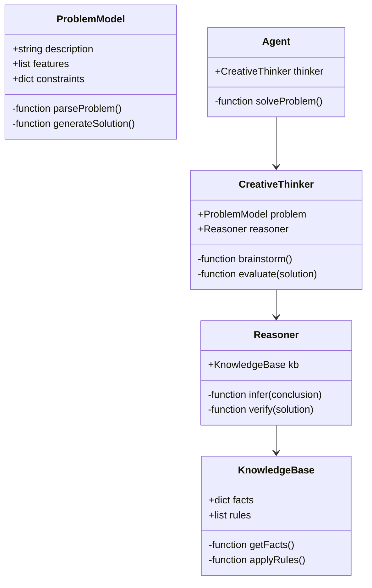
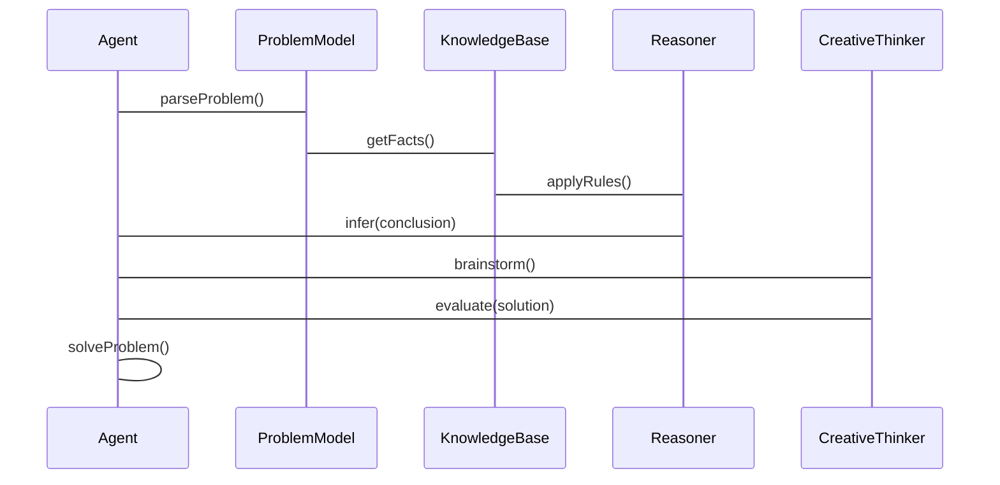

                 


# 开发具有创造性问题解决能力的AI Agent

> 关键词：AI Agent，创造性思维，问题解决，算法原理，系统设计，技术实现，应用案例

> 摘要：本文系统探讨了开发具有创造性问题解决能力的AI Agent的核心概念、算法原理和系统设计。通过分析问题建模、知识表示、推理机制和创造性思维的结合，文章详细介绍了AI Agent在创造性问题解决中的应用。同时，通过项目实战和案例分析，展示了如何将理论应用于实际开发，总结了最佳实践和注意事项，为读者提供了全面的技术指导。

---

# 第1章: AI Agent 的背景与核心概念

## 1.1 AI Agent 的定义与分类

### 1.1.1 什么是 AI Agent
AI Agent（人工智能代理）是指能够感知环境、自主决策并采取行动以实现目标的智能体。它可以是一个软件程序或物理设备，通过传感器和执行器与环境交互。

| 类型 | 描述 | 示例 |
|------|------|------|
| 软件代理 | 运行在计算机系统中的程序 | 虚拟助手（如Siri） |
| 物理代理 | 具有物理形态的设备 | 工业机器人 |

### 1.1.2 AI Agent 的分类
AI Agent 可以根据智能水平、目标类型和应用场景进行分类。以下是常见的分类方式：

1. **按智能水平**：
   - **反应式代理**：基于当前感知做出反应，不依赖历史信息。
   - **认知式代理**：具有复杂推理和规划能力，依赖知识库。

2. **按目标类型**：
   - **目标驱动代理**：为实现特定目标而行动。
   - **效用驱动代理**：通过最大化效用函数来决策。

3. **按应用场景**：
   - **服务代理**：提供特定服务（如客服代理）。
   - **监控代理**：实时监控并响应异常情况。

### 1.1.3 AI Agent 的核心特征
AI Agent 的核心特征包括自主性、反应性、目标导向和学习能力。这些特征使其能够适应复杂环境并解决问题。

## 1.2 创造性问题解决能力的定义

### 1.2.1 问题解决的定义
问题解决是指通过分析问题、制定解决方案并执行方案来达到目标的过程。AI Agent 的问题解决能力依赖于其感知、推理和执行能力。

### 1.2.2 创造性的定义
创造性是指生成新颖、有用且可行的解决方案的能力。创造性问题解决强调解决方案的独特性和创新性。

### 1.2.3 创造性问题解决能力的核心要素
创造性问题解决能力的核心要素包括：
1. **知识表示**：存储和组织知识以支持推理。
2. **推理机制**：从现有知识中推导新结论。
3. **创造性思维**：生成新颖的解决方案。
4. **学习能力**：通过经验改进问题解决能力。

## 1.3 AI Agent 在问题解决中的作用

### 1.3.1 AI Agent 的问题解决优势
AI Agent 的优势在于其强大的计算能力和快速的决策能力。它能够处理复杂问题并提供优化解决方案。

### 1.3.2 创造性思维在 AI Agent 中的应用
AI Agent 可以通过生成模型和启发式算法模拟创造性思维，生成多种解决方案并选择最优解。

### 1.3.3 AI Agent 与人类问题解决能力的对比
AI Agent 的优势在于速度和准确性，而人类的优势在于情感和创造性。两者结合可以互补优势。

## 1.4 本章小结
本章介绍了AI Agent 的定义、分类和核心特征，分析了创造性问题解决能力的定义和要素，并探讨了AI Agent 在问题解决中的作用。

---

# 第2章: 问题建模与知识表示

## 2.1 问题建模的基本概念

### 2.1.1 问题建模的定义
问题建模是将现实问题转化为计算机可处理的形式化表示的过程。

### 2.1.2 问题建模的方法与步骤
问题建模通常包括需求分析、抽象、形式化和验证四个步骤。

### 2.1.3 问题建模的常见挑战
问题建模的挑战包括复杂性、模糊性和动态性。

## 2.2 知识表示的原理

### 2.2.1 知识表示的定义
知识表示是将知识以计算机可理解的形式存储的过程。

### 2.2.2 常见的知识表示方法
- **规则表示法**：基于逻辑规则。
- **框架表示法**：基于概念框架。
- **语义网络**：基于节点和关系。

### 2.2.3 知识图谱的构建与应用
知识图谱是一种结构化的知识表示形式，广泛应用于搜索、推荐和语义理解。

## 2.3 问题建模与知识表示的关系

### 2.3.1 问题建模对知识表示的依赖
问题建模需要知识表示的支持来定义问题空间。

### 2.3.2 知识表示对问题解决的支撑
知识表示为AI Agent 提供了推理和决策的基础。

### 2.3.3 问题建模与知识表示的协同优化
通过协同优化，可以提高问题解决的准确性和效率。

## 2.4 本章小结
本章探讨了问题建模和知识表示的基本概念、方法和应用，分析了两者的关系和协同优化。

---

# 第3章: 推理与创造性思维的结合

## 3.1 推理的基本原理

### 3.1.1 推理的定义与分类
推理是通过现有知识推导新结论的过程，包括演绎推理和归纳推理。

### 3.1.2 常见推理算法的介绍
- **逻辑推理**：基于逻辑规则的推理。
- **概率推理**：基于概率论的推理。

### 3.1.3 推理算法的优缺点对比
逻辑推理准确但计算复杂，概率推理灵活但依赖概率分布。

## 3.2 创造性思维的机制

### 3.2.1 创造性思维的定义
创造性思维是生成新颖解决方案的过程，包括发散思维和收敛思维。

### 3.2.2 创造性思维的模拟方法
- **启发式搜索**：利用启发函数减少搜索空间。
- **生成模型**：通过生成模型模拟创造性思维。

### 3.2.3 创造性思维与问题建模的关系
创造性思维依赖于问题建模，问题建模为创造性思维提供基础。

## 3.3 推理与创造性思维的协同优化

### 3.3.1 推理对创造性思维的支持
推理为创造性思维提供逻辑基础和可能性空间。

### 3.3.2 创造性思维对推理的优化
创造性思维可以启发新的推理路径和方法。

### 3.3.3 协同优化的实现方法
通过结合推理和创造性思维，可以提高问题解决的效率和质量。

## 3.4 本章小结
本章分析了推理和创造性思维的基本原理，探讨了它们的协同优化方法。

---

# 第4章: 算法原理

## 4.1 启发式搜索算法

### 4.1.1 A*算法的原理
A*算法是一种常见的启发式搜索算法，结合了广度优先搜索和贪心算法。

公式：
$$f(n) = g(n) + h(n)$$
其中，$g(n)$ 是当前节点的已知成本，$h(n)$ 是从当前节点到目标节点的估计成本。

### 4.1.2 A*算法的实现步骤
1. 初始化优先队列。
2. 取出队列中具有最小$f(n)$的节点。
3. 展开节点，生成子节点。
4. 重复步骤2和3，直到找到目标节点。

### 4.1.3 A*算法的应用案例
在路径规划问题中，A*算法可以找到最短路径。

## 4.2 强化学习算法

### 4.2.1 Q-learning算法的原理
Q-learning是一种基于值函数的强化学习算法，通过更新Q值表来学习最优策略。

公式：
$$Q(s, a) = Q(s, a) + \alpha [r + \max Q(s', a') - Q(s, a)]$$
其中，$\alpha$ 是学习率。

### 4.2.2 DQN算法的实现步骤
1. 构建经验回放池。
2. 使用神经网络近似Q值函数。
3. 通过经验回放和梯度下降更新网络参数。

### 4.2.3 DQN算法的应用案例
在游戏AI训练中，DQN算法可以实现自我学习和优化。

## 4.3 生成模型

### 4.3.1 变量关系图
生成模型通过概率图表示变量之间的关系，例如贝叶斯网络。

### 4.3.2 生成模型的数学公式
生成模型通常基于概率分布，例如：
$$P(x|z) = \text{Normal}(x; \mu_z, \sigma_z)$$

### 4.3.3 生成模型的应用案例
在自然语言处理中，生成模型可以用于文本生成。

## 4.4 知识图谱构建

### 4.4.1 知识图谱的构建流程
1. 数据采集。
2. 数据清洗。
3. 实体识别。
4. 关系抽取。

### 4.4.2 知识图谱的存储格式
常用存储格式包括RDF和JSON-LD。

### 4.4.3 知识图谱的应用案例
在搜索引擎中，知识图谱可以提高语义理解能力。

## 4.5 本章小结
本章介绍了几种常用的算法，包括启发式搜索、强化学习、生成模型和知识图谱构建，分析了它们的原理和应用。

---

# 第5章: 系统分析与架构设计

## 5.1 项目介绍

### 5.1.1 项目背景
本文以开发一个具有创造性问题解决能力的AI Agent为项目目标。

### 5.1.2 项目目标
通过实现问题建模、知识表示、推理和创造性思维模块，构建一个能够解决复杂问题的AI Agent。

## 5.2 系统功能设计

### 5.2.1 领域模型类图


### 5.2.2 系统架构设计


### 5.2.3 系统接口设计
- **输入接口**：接收问题描述和约束条件。
- **输出接口**：输出解决方案和验证结果。

### 5.2.4 系统交互流程图


## 5.3 本章小结
本章通过系统功能设计和架构设计，展示了如何将理论应用于实际开发。

---

# 第6章: 项目实战与高级应用

## 6.1 环境安装

### 6.1.1 安装Python
```bash
python --version
pip install --upgrade pip
```

### 6.1.2 安装相关库
```bash
pip install numpy matplotlib networkx
```

## 6.2 系统核心实现

### 6.2.1 问题生成模块
```python
def generateProblem():
    # 随机生成问题描述
    pass
```

### 6.2.2 创造性思维模块
```python
def brainstorm():
    # 生成多种解决方案
    pass
```

## 6.3 案例分析与详细讲解

### 6.3.1 案例分析
以路径规划问题为例，展示AI Agent 的解决方案。

### 6.3.2 详细讲解
通过代码示例和流程图，详细讲解AI Agent 的实现过程。

## 6.4 本章小结
本章通过项目实战，展示了如何将理论应用于实际开发，并总结了经验教训。

---

# 第7章: 高级应用与最佳实践

## 7.1 高级应用

### 7.1.1 创造性写作
AI Agent 可以辅助作家生成故事情节和人物设定。

### 7.1.2 艺术创作
AI Agent 可以生成音乐、绘画等艺术作品。

## 7.2 伦理与安全

### 7.2.1 伦理问题
AI Agent 的决策可能涉及伦理问题，需谨慎处理。

### 7.2.2 安全问题
AI Agent 的安全性需通过加密和访问控制来保障。

## 7.3 最佳实践

### 7.3.1 模块化设计
将系统划分为独立模块，便于维护和扩展。

### 7.3.2 数据安全
保护用户数据，避免数据泄露。

### 7.3.3 持续优化
定期更新模型和算法，提高系统性能。

## 7.4 本章小结
本章探讨了AI Agent 的高级应用，并总结了开发中的注意事项。

---

# 作者：AI天才研究院 & 禅与计算机程序设计艺术

---

这篇文章系统地探讨了开发具有创造性问题解决能力的AI Agent的核心概念、算法原理和系统设计。通过理论与实践相结合的方式，帮助读者全面掌握AI Agent的开发技术。

