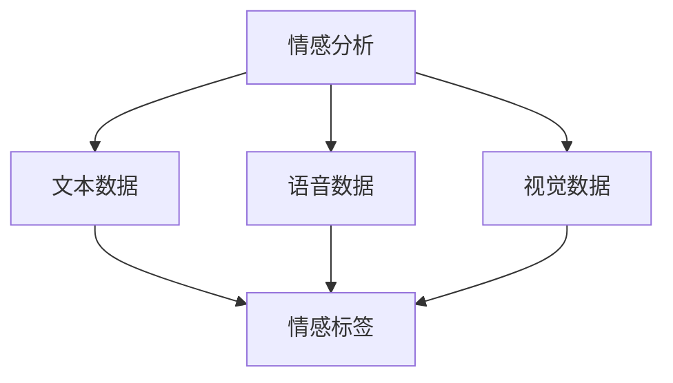
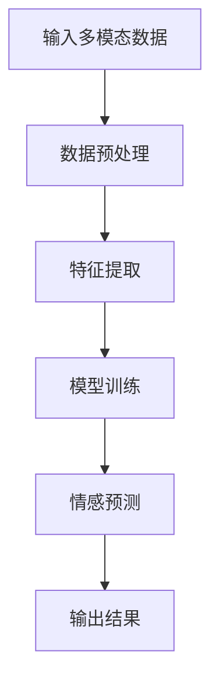
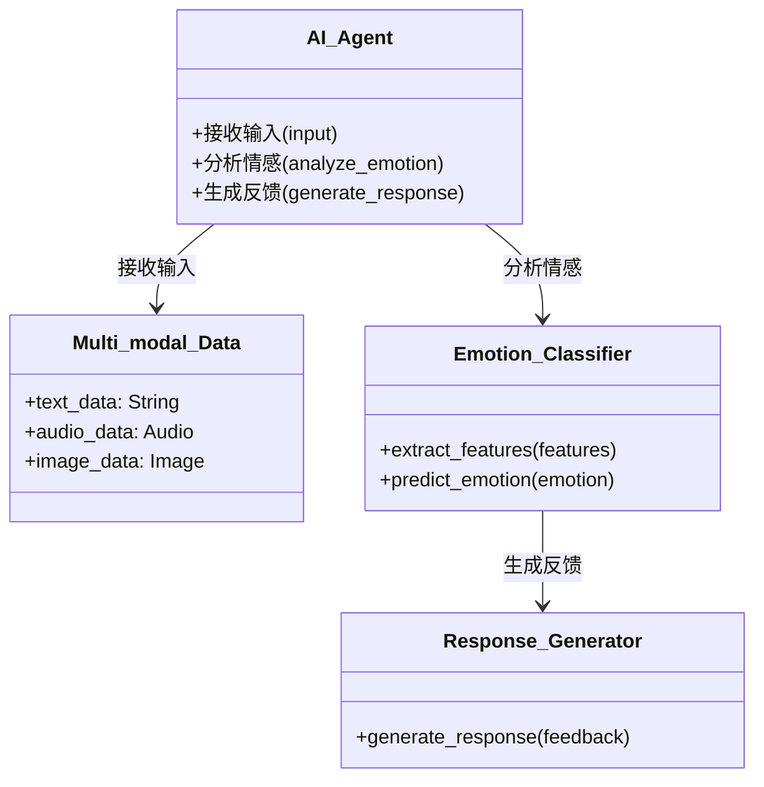
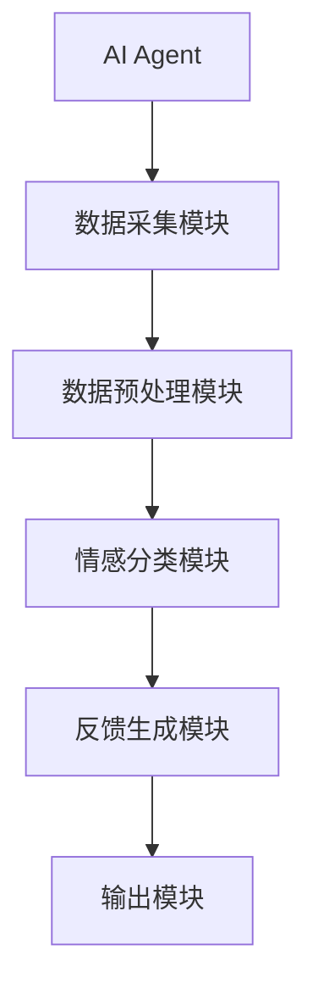
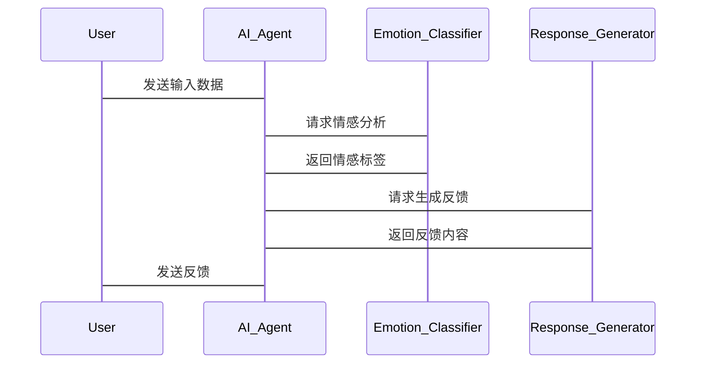

                 


# 开发具有多模态情感分析能力的AI Agent

## 关键词
- 多模态情感分析
- AI Agent
- 机器学习
- 深度学习
- 多模态数据融合

## 摘要
本文详细探讨了开发具有多模态情感分析能力的AI Agent的技术挑战和解决方案。从问题背景到系统架构设计，从算法原理到项目实战，全面分析了多模态情感分析的核心概念、实现方法和应用场景。通过详细的流程图和代码示例，展示了如何利用深度学习技术处理多模态数据，并构建高效的AI Agent系统。

---

# 第一部分: 多模态情感分析与AI Agent概述

## 第1章: 多模态情感分析与AI Agent的背景介绍

### 1.1 问题背景
#### 1.1.1 当前情感分析技术的局限性
传统的单模态情感分析主要依赖文本数据，无法充分利用语音、图像等其他模态的信息。这种单一性导致情感分析的准确性和鲁棒性有限。

#### 1.1.2 多模态数据的引入及其优势
引入多模态数据（如文本、语音、图像）可以提高情感分析的准确性和丰富性。多模态数据的互补性可以有效弥补单一模态的不足。

#### 1.1.3 AI Agent在情感分析中的作用
AI Agent作为智能体，能够实时感知用户情感并做出响应，提升人机交互的自然性和智能化水平。

### 1.2 问题描述
#### 1.2.1 情感分析的定义与目标
情感分析旨在通过分析文本、语音等数据，识别其中的情感倾向（如正面、负面、中性）。

#### 1.2.2 多模态数据的定义与特征
多模态数据指的是结合多种数据类型的输入，如文本、语音、图像等。每种模态数据都有其独特的特征和优势。

#### 1.2.3 AI Agent在多模态情感分析中的任务
AI Agent需要整合多模态数据，进行情感分析，并根据结果生成相应的反馈。

### 1.3 问题解决
#### 1.3.1 多模态情感分析的解决方案
结合多种模态数据，利用深度学习模型进行特征提取和情感分类。

#### 1.3.2 AI Agent在情感分析中的具体应用
AI Agent可以用于客服系统、智能音箱、虚拟助手等领域，提升用户体验。

#### 1.3.3 技术实现的关键点
多模态数据的融合、情感分类模型的选择、AI Agent的交互设计。

### 1.4 边界与外延
#### 1.4.1 多模态情感分析的边界
仅关注情感分析任务，不涉及其他任务如实体识别。

#### 1.4.2 AI Agent的适用范围
适用于需要情感交互的场景，如客服、教育、娱乐等。

#### 1.4.3 相关技术的对比与区别
对比传统单模态情感分析和多模态情感分析，突出多模态的优势。

### 1.5 概念结构与核心要素
#### 1.5.1 情感分析的核心要素
数据输入、特征提取、情感分类、结果输出。

#### 1.5.2 多模态数据的构成
文本、语音、图像等。

#### 1.5.3 AI Agent的功能模块
数据采集、情感分析、反馈生成。

## 第2章: 多模态情感分析的核心概念与联系

### 2.1 核心概念原理
#### 2.1.1 情感分析的基本原理
通过特征提取和分类模型，识别数据中的情感倾向。

#### 2.1.2 多模态数据的处理方法
将多种模态数据分别处理后进行融合，或直接联合建模。

#### 2.1.3 AI Agent的交互机制
通过多轮对话，实时感知用户情感并调整交互策略。

### 2.2 概念属性特征对比表格
| 概念       | 属性特征                     |
|------------|------------------------------|
| 单模态情感分析 | 仅依赖文本或单一数据源       |
| 多模态情感分析 | 结合文本、语音、图像等多种数据源 |
| AI Agent    | 具备自主决策和交互能力         |

### 2.3 ER实体关系图（使用Mermaid）


---

# 第二部分: 多模态情感分析的算法原理

## 第3章: 多模态情感分析的算法原理

### 3.1 算法原理讲解
#### 3.1.1 多模态数据融合方法
- **特征级融合**：将不同模态的特征向量进行拼接或加权。
- **决策级融合**：分别对每种模态进行分类，再将结果融合。

#### 3.1.2 情感分类模型的选择
- **文本处理**：使用BERT、LSTM等模型。
- **语音处理**：使用CNN、RNN提取特征。
- **图像处理**：使用CNN提取视觉特征。

#### 3.1.3 AI Agent的训练流程
1. 数据预处理：清洗和标注多模态数据。
2. 特征提取：分别提取文本、语音、图像特征。
3. 模型训练：联合训练多模态情感分类模型。
4. 模型评估：验证准确率、召回率等指标。

### 3.2 算法流程图（使用Mermaid）


### 3.3 数学模型与公式
#### 3.3.1 情感分类的损失函数
$$ \text{Loss} = -\sum_{i=1}^{n} y_i \log(p_i) + (1 - y_i) \log(1 - p_i) $$
其中，$y_i$ 是真实标签，$p_i$ 是预测概率。

---

# 第三部分: 系统分析与架构设计方案

## 第4章: 系统分析与架构设计方案

### 4.1 问题场景介绍
#### 4.1.1 项目介绍
开发一个基于多模态情感分析的AI Agent系统，能够通过文本、语音、图像等多种数据源，准确识别用户情感并生成智能反馈。

### 4.2 系统功能设计
#### 4.2.1 领域模型（使用Mermaid类图）


### 4.3 系统架构设计
#### 4.3.1 系统架构图（使用Mermaid）


### 4.4 系统接口设计
#### 4.4.1 API接口
- `POST /api/input`: 接收多模态数据
- `GET /api/emotion`: 获取情感分析结果
- `POST /api/response`: 生成反馈

### 4.5 系统交互设计
#### 4.5.1 序列图（使用Mermaid）


---

# 第四部分: 项目实战

## 第5章: 项目实战

### 5.1 环境安装
#### 5.1.1 安装Python
```bash
python --version
pip install --upgrade pip
```

#### 5.1.2 安装依赖库
```bash
pip install numpy pandas tensorflow keras matplotlib
```

### 5.2 系统核心实现源代码
#### 5.2.1 数据预处理代码
```python
import numpy as np
import pandas as pd

def preprocess_data(data):
    # 文本处理
    text_data = data['text'].apply(lambda x: x.lower())
    # 语音处理
    audio_data = data['audio'].apply(lambda x: x.reshape(-1))
    # 图像处理
    image_data = data['image'].apply(lambda x: x.flatten())
    return text_data, audio_data, image_data
```

#### 5.2.2 情感分类模型代码
```python
from tensorflow.keras.models import Model
from tensorflow.keras.layers import Input, LSTM, Dense, concatenate

def build_model(input_shapes):
    text_input = Input(shape=input_shapes['text'])
    lstm_layer = LSTM(64, return_sequences=False)(text_input)
    
    audio_input = Input(shape=input_shapes['audio'])
    dense_layer = Dense(32, activation='relu')(audio_input)
    
    image_input = Input(shape=input_shapes['image'])
    conv_layer = Dense(32, activation='relu')(image_input)
    
    merged = concatenate([lstm_layer, dense_layer, conv_layer])
    output = Dense(1, activation='sigmoid')(merged)
    model = Model(inputs=[text_input, audio_input, image_input], outputs=output)
    model.compile(loss='binary_crossentropy', optimizer='adam', metrics=['accuracy'])
    return model
```

#### 5.2.3 AI Agent交互代码
```python
class AI_Agent:
    def __init__(self, model):
        self.model = model
    
    def analyze_emotion(self, input_data):
        # 输入数据预处理
        text, audio, image = preprocess_data(input_data)
        # 情感分析
        prediction = self.model.predict([text, audio, image])
        return prediction[0][0]  # 返回情感概率
    
    def generate_response(self, emotion_prob):
        # 根据情感概率生成反馈
        if emotion_prob > 0.5:
            return "正面情绪，我可以帮助您解决问题。"
        else:
            return "负面情绪，请提供更多细节，我将尽力协助。"
```

### 5.3 代码应用解读与分析
- **数据预处理**：将不同模态的数据进行标准化处理，确保模型输入的一致性。
- **模型构建**：利用多模态数据构建深度学习模型，分别提取每种模态的特征，再进行融合和分类。
- **AI Agent交互**：根据情感分析结果生成相应的反馈，提升用户体验。

### 5.4 实际案例分析
#### 5.4.1 案例1：文本与语音结合
输入文本：“我感到很沮丧。”，语音数据（带有情绪特征）。
模型预测：负面情绪（概率0.8）。
反馈：“负面情绪，请提供更多细节，我将尽力协助。”

#### 5.4.2 案例2：图像与文本结合
输入文本：“我很高兴。”，图像数据（微笑表情）。
模型预测：正面情绪（概率0.95）。
反馈：“正面情绪，我可以帮助您解决问题。”

### 5.5 项目小结
通过多模态数据融合和深度学习模型，AI Agent能够更准确地识别用户情感，提供更智能化的交互体验。

---

# 第五部分: 最佳实践与总结

## 第6章: 最佳实践与总结

### 6.1 最佳实践
- **数据多样性**：确保训练数据包含多种情感和模态。
- **模型优化**：使用迁移学习和数据增强提升模型性能。
- **实时性优化**：优化模型推理速度，确保低延迟。

### 6.2 小结
本文详细探讨了开发具有多模态情感分析能力的AI Agent的技术挑战和解决方案。通过多模态数据的融合和深度学习模型的应用，AI Agent能够更准确地识别用户情感，提升交互体验。

### 6.3 注意事项
- 数据隐私保护：确保用户数据的安全性和隐私性。
- 模型泛化能力：避免过拟合，确保模型在不同场景下的适用性。
- 系统可扩展性：设计模块化架构，便于后续功能扩展。

### 6.4 拓展阅读
- **推荐书籍**：《Deep Learning》、《Speech and Language Processing》
- **推荐论文**：多模态情感分析领域的最新研究论文
- **推荐工具**：TensorFlow、PyTorch等深度学习框架

---

# 结语

通过本文的详细讲解，读者可以系统地了解多模态情感分析的核心概念、算法原理和系统设计。希望本文能为开发具有多模态情感分析能力的AI Agent提供有益的参考和启发。

---

# 作者

作者：AI天才研究院/AI Genius Institute & 禅与计算机程序设计艺术 /Zen And The Art of Computer Programming

