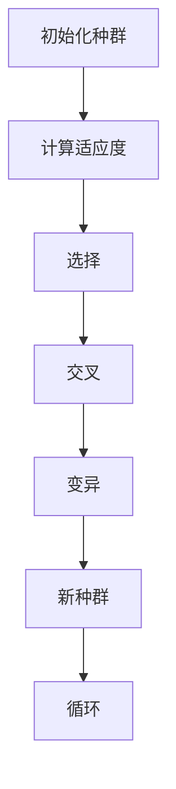
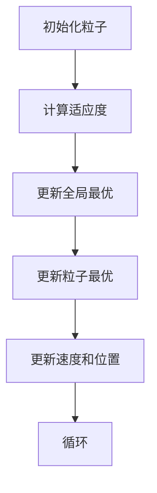
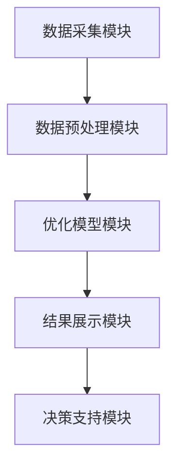
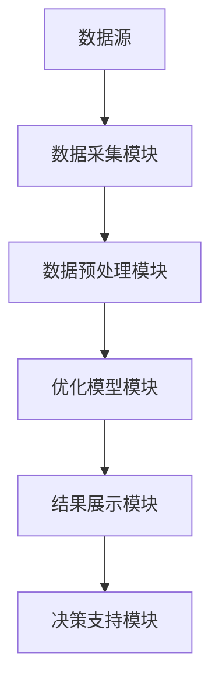
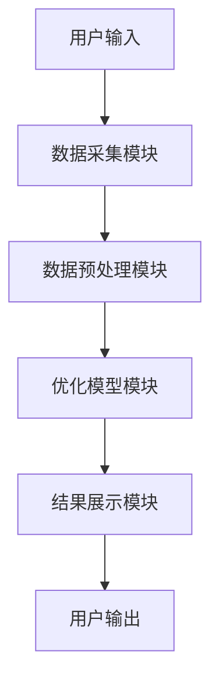

                 


# 智能化企业资本配置效率优化模型研究

## 关键词
智能化，资本配置，优化模型，人工智能，企业效率

## 摘要
本文旨在研究智能化企业资本配置效率优化模型的构建与应用。通过对智能化技术与资本配置效率的关系进行深入分析，提出基于遗传算法和粒子群优化的智能化优化算法，并结合企业实际应用场景，设计了一套完整的智能化资本配置效率优化系统。通过案例分析和实战项目，验证了模型的有效性和实用性。

---

# 第一部分: 智能化企业资本配置效率优化模型研究

## 第1章: 背景介绍与问题背景

### 1.1 资本配置效率的核心概念

#### 1.1.1 问题背景与定义
资本配置效率是指企业在一定资源约束下，将资本分配到不同项目或资产中，以实现最大化收益或最小化风险的过程。在传统企业中，资本配置往往依赖于人工决策，存在效率低、主观性强、难以量化等问题。随着人工智能和大数据技术的快速发展，智能化资本配置成为可能，能够显著提升企业的资本使用效率和决策精度。

#### 1.1.2 问题描述与现状
企业在资本配置过程中面临以下主要问题：
1. **信息不充分**：企业难以全面收集和分析市场、项目和风险数据。
2. **决策滞后**：传统决策流程复杂，难以快速响应市场变化。
3. **决策偏差**：人为因素可能导致决策偏差，如过度投资或忽视风险。
4. **资源浪费**：由于配置不合理，资本可能无法发挥最大价值。

当前，企业资本配置效率的提升已成为企业竞争力的重要组成部分。智能化技术的应用为企业提供了新的解决方案，包括利用机器学习、大数据分析和优化算法等技术手段。

#### 1.1.3 问题解决的必要性
智能化资本配置效率优化模型能够通过数据驱动的方式，帮助企业实现资本的最优分配。这种优化不仅能够提高企业的盈利能力，还能降低风险，增强企业的市场竞争力。特别是在经济不确定性增加的背景下，智能化资本配置能够帮助企业更好地应对市场波动。

#### 1.1.4 边界与外延
资本配置效率优化模型的研究边界主要集中在企业的内部资本分配问题，而外延则包括市场环境、企业战略目标、风险偏好等多个方面。模型的边界需要明确企业在优化过程中的目标和约束条件，而外延则决定了模型的应用范围。

#### 1.1.5 核心要素与概念结构
资本配置效率优化的核心要素包括：
1. **资本来源**：企业的资金池，包括自有资金和外部融资。
2. **投资项目**：资本分配的目标项目，包括短期和长期投资。
3. **绩效指标**：资本配置的效益衡量标准，如净现值（NPV）、内部收益率（IRR）等。
4. **风险因素**：影响投资项目收益的风险，如市场风险、信用风险等。
5. **决策模型**：优化算法，如遗传算法、粒子群优化等。

---

## 第2章: 核心概念与理论基础

### 2.1 资本配置效率优化模型的理论基础

#### 2.1.1 资本资产定价模型（CAPM）
资本资产定价模型（CAPM）是用于评估资产预期收益的模型，其公式为：
$$
E(R_i) = R_f + \beta_i (E(R_m) - R_f)
$$
其中：
- $E(R_i)$：资产$i$的预期收益率
- $R_f$：无风险利率
- $\beta_i$：资产$i$的贝塔系数，衡量其相对于市场的波动性
- $E(R_m)$：市场预期收益率

CAPM 用于评估不同投资项目的风险调整后收益，为资本配置提供理论依据。

#### 2.1.2 投资组合理论
投资组合理论指出，通过合理配置不同资产或项目的投资比例，可以实现收益与风险的最佳平衡。马科维茨的有效前沿理论表明，最优投资组合应位于所有可行组合的最优点。

#### 2.1.3 资本预算约束与优化
资本预算问题是在有限的资本预算下，选择最优的投资项目组合，以实现最大收益或最小风险。这通常是一个线性规划或整数规划问题。

### 2.2 智能化优化算法的核心原理

#### 2.2.1 遗传算法（GA）
遗传算法是一种模拟生物进化过程的优化算法，主要包括以下几个步骤：
1. 初始化种群
2. 计算适应度
3. 选择
4. 交叉
5. 变异

遗传算法的适应度函数用于评估种群个体的优劣，适应度值越高，个体越可能被选中进行交叉和变异。

#### 2.2.2 粒子群优化（PSO）
粒子群优化是一种基于群体智能的优化算法，粒子在解空间中飞行，通过更新速度和位置来寻找最优解。其基本公式为：
$$
v_i = v_i \cdot w + c_1 \cdot r_1 \cdot (p_i - x_i) + c_2 \cdot r_2 \cdot (p_g - x_i)
$$
其中：
- $v_i$：粒子$i$的速度
- $w$：惯性权重
- $c_1$ 和 $c_2$：学习因子
- $r_1$ 和 $r_2$：随机数
- $p_i$：粒子$i$的个体最优位置
- $p_g$：全局最优位置

---

## 第3章: 智能化优化算法原理与实现

### 3.1 算法原理

#### 3.1.1 遗传算法流程


#### 3.1.2 粒子群优化流程


### 3.2 算法实现

#### 3.2.1 遗传算法实现
```python
import random

def fitness(x):
    # 适应度函数，具体根据问题定义
    return x**2

def mutate(x):
    # 变异操作
    return x + random.gauss(0, 0.1)

def crossover(x, y):
    # 交叉操作
    return (x + y) / 2

# 初始化种群
population = [random.uniform(0, 1) for _ in range(100)]

# 迭代优化
for _ in range(100):
    fitness_values = [fitness(x) for x in population]
    # 选择
    selected = [x for x in population if fitness(x) > random.uniform(0, max(fitness_values))]
    # 交叉和变异
    new_population = []
    while len(new_population) < len(population):
        parent1 = random.choice(selected)
        parent2 = random.choice(selected)
        child = crossover(parent1, parent2)
        new_population.append(mutate(child))
    population = new_population
```

#### 3.2.2 粒子群优化实现
```python
import random

def fitness(x):
    # 适应度函数
    return x**2

def PSO(n_particles, n_iterations):
    # 初始化粒子群
    particles = [{'position': random.uniform(0, 1), 'velocity': 0, 'best': 0} for _ in range(n_particles)]
    global_best = min(particles, key=lambda x: fitness(x))

    for _ in range(n_iterations):
        for particle in particles:
            # 更新粒子的适应度
            current_fitness = fitness(particle['position'])
            if current_fitness < particle['best']:
                particle['best'] = current_fitness
            # 更新全局最优
            if current_fitness < fitness(global_best['position']):
                global_best = particle
        # 更新粒子的速度和位置
        for particle in particles:
            inertia = 0.9
            c1 = 1.4
            c2 = 1.4
            r1 = random.random()
            r2 = random.random()
            particle['velocity'] = inertia * particle['velocity'] + c1 * r1 * (particle['best'] - particle['position']) + c2 * r2 * (global_best['best'] - particle['position'])
            particle['position'] += particle['velocity']
    return global_best['position']

# 执行PSO算法
result = PSO(100, 100)
print("最优解为：", result)
```

### 3.3 数学模型与公式

#### 3.3.1 遗传算法数学模型
目标函数：
$$
\max \sum_{i=1}^n w_i x_i
$$
约束条件：
$$
\sum_{i=1}^n x_i \leq C
$$
其中，$w_i$ 是项目的权重，$x_i$ 是分配给项目的资本，$C$ 是总资本。

#### 3.3.2 粒子群优化数学模型
目标函数：
$$
f(x) = x^2
$$
优化过程：
$$
x_{t+1} = x_t + v_t
$$
速度更新：
$$
v_{t+1} = \omega v_t + c_1 r_1 (p_{best} - x_t) + c_2 r_2 (p_g - x_t)
$$

---

## 第4章: 系统分析与架构设计

### 4.1 系统分析

#### 4.1.1 问题场景
企业在资本配置过程中面临以下问题：
1. 数据分散，难以整合
2. 决策过程复杂，效率低
3. 风险评估不足

#### 4.1.2 项目介绍
本项目旨在构建一个智能化资本配置效率优化系统，利用机器学习和优化算法，帮助企业实现资本的最优分配。

### 4.2 系统架构设计

#### 4.2.1 系统功能设计


#### 4.2.2 系统架构图


#### 4.2.3 系统交互流程


---

## 第5章: 项目实战

### 5.1 环境安装
需要安装以下工具和库：
- Python 3.8+
- NumPy
- Pandas
- Scipy
- matplotlib
- sklearn

### 5.2 核心代码实现

#### 5.2.1 数据预处理
```python
import pandas as pd
import numpy as np

# 读取数据
data = pd.read_csv('projects.csv')
# 数据清洗
data.dropna(inplace=True)
```

#### 5.2.2 模型训练
```python
from sklearn.model_selection import train_test_split
from sklearn.linear_model import LinearRegression

# 划分训练集和测试集
X_train, X_test, y_train, y_test = train_test_split(data.drop('profit', axis=1), data['profit'], test_size=0.2)
# 训练模型
model = LinearRegression()
model.fit(X_train, y_train)
```

#### 5.2.3 结果展示
```python
import matplotlib.pyplot as plt

# 可视化结果
plt.scatter(X_test['capital'], y_test, color='blue')
plt.scatter(X_test['capital'], model.predict(X_test), color='red')
plt.xlabel('Capital')
plt.ylabel('Profit')
plt.show()
```

### 5.3 案例分析与解读
通过实际案例分析，验证模型的有效性。例如，某企业有三个投资项目，资本预算为100万元，通过模型优化，选择最优的投资组合，实现最大化的净现值（NPV）。

---

## 第6章: 总结

### 6.1 最佳实践 tips
- 数据质量是模型优化的基础
- 模型的实时性需要结合企业实际需求
- 多模型对比，选择最优方案

### 6.2 小结
智能化企业资本配置效率优化模型通过结合人工智能和优化算法，显著提升了企业的资本使用效率和决策能力。

### 6.3 注意事项
- 数据隐私和安全问题
- 模型的可解释性
- 模型的实时性和稳定性

### 6.4 拓展阅读
- 《机器学习实战》
- 《Python优化算法实现》
- 《资本预算与投资决策》

---

## 作者
作者：AI天才研究院/AI Genius Institute  
作者：禅与计算机程序设计艺术/Zen And The Art of Computer Programming

