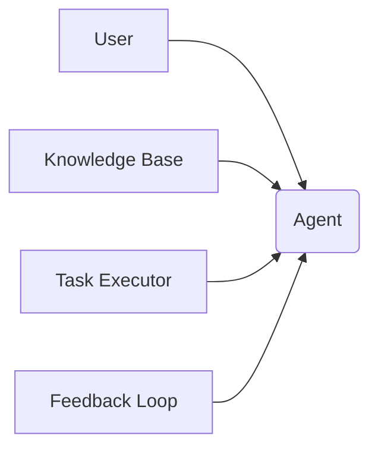
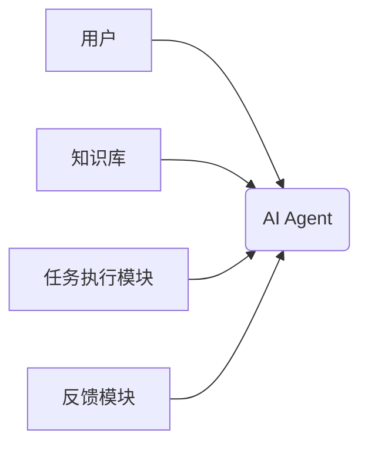
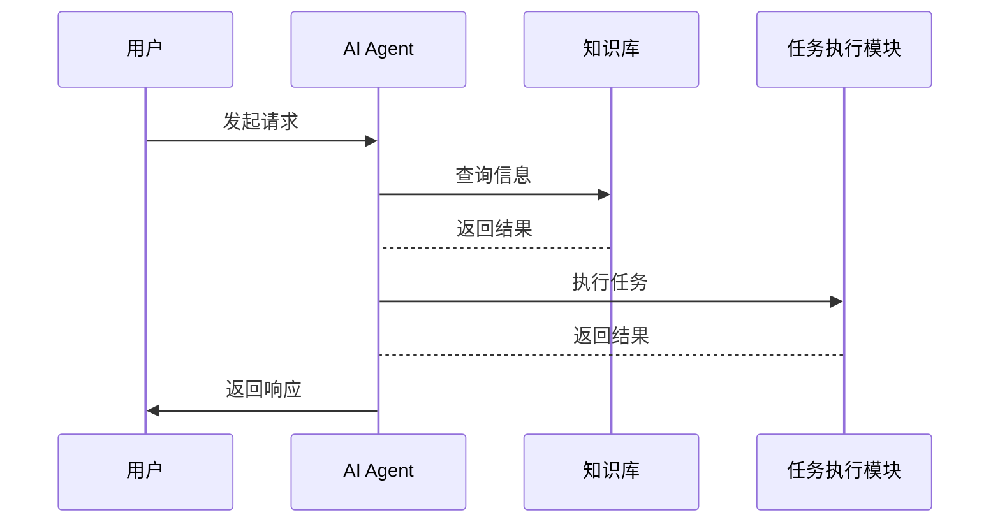

                 


# 案例解析：成功落地的企业级AI Agent项目

## 关键词：企业级AI Agent，大语言模型，多轮对话，知识库，任务执行，系统架构，落地实践

## 摘要：本文通过解析一个成功落地的企业级AI Agent项目，深入分析了AI Agent的核心概念、算法原理、系统架构及实现细节。文章详细介绍了AI Agent的背景、核心概念、算法实现、系统设计、项目实战及最佳实践，为读者提供了从理论到实践的全面指导。

---

# 第一部分: 企业级AI Agent项目背景与核心概念

## 第1章: AI Agent的基本概念与企业级应用背景

### 1.1 AI Agent的定义与特点

#### 1.1.1 AI Agent的基本概念
AI Agent（人工智能代理）是一种能够感知环境、执行任务并自主决策的智能实体。它通过与用户交互或与其他系统通信，帮助用户完成复杂任务或提供智能服务。企业级AI Agent具备以下特点：

1. **智能化**：基于大语言模型（LLM）提供智能对话和任务执行能力。
2. **可扩展性**：支持多种应用场景，如客服、供应链管理等。
3. **实时性**：能够快速响应用户请求并执行任务。
4. **可定制性**：可根据企业需求进行个性化配置。

#### 1.1.2 AI Agent的核心特点
企业级AI Agent的核心特点包括：
- **上下文理解**：通过多轮对话理解和维护对话上下文。
- **知识库集成**：结合企业知识库提供准确的信息检索和推理能力。
- **任务执行能力**：能够调用外部系统完成复杂任务，如查询数据库、调用API等。

#### 1.1.3 企业级AI Agent的独特性
企业级AI Agent的独特性体现在以下几个方面：
- **领域特定性**：针对特定行业或企业的业务需求设计，具备行业知识库和专家经验。
- **高可用性**：具备高可靠性和容错能力，确保在复杂环境下的稳定运行。
- **可扩展性**：支持模块化设计，便于功能扩展和性能优化。

### 1.2 企业级AI Agent的应用背景

#### 1.2.1 当前企业智能化转型的趋势
随着人工智能技术的快速发展，企业智能化转型已成为不可逆转的趋势。AI Agent作为企业智能化的核心技术之一，正在被广泛应用于各个行业。企业通过部署AI Agent，可以显著提升效率、降低成本，并增强客户体验。

#### 1.2.2 AI Agent在企业中的定位与价值
AI Agent在企业中的定位是作为智能化服务的提供者，帮助员工和客户完成复杂任务。其价值体现在以下几个方面：
- **提升效率**：通过自动化处理任务，减少人工干预。
- **增强客户体验**：提供个性化的服务，提升客户满意度。
- **降低运营成本**：通过智能化手段减少人力投入。

#### 1.2.3 企业级AI Agent的典型应用场景
企业级AI Agent的典型应用场景包括：
1. **智能客服**：通过多轮对话解决客户问题，提供个性化的服务。
2. **供应链管理**：通过AI Agent协调供应链中的各个环节，优化库存管理。
3. **内部员工助手**：帮助员工快速获取信息、处理任务，提升工作效率。

---

## 第2章: 企业级AI Agent的核心概念与联系

### 2.1 核心概念原理

#### 2.1.1 多轮对话机制
多轮对话机制是AI Agent实现智能化交互的核心之一。通过维护对话上下文，AI Agent能够理解用户意图并提供连贯的响应。

- **对话上下文管理**：记录用户的当前意图和历史对话内容，确保每次交互的连贯性。
- **意图识别**：通过自然语言处理技术识别用户的意图，并将其转化为系统可执行的操作。
- **反馈机制**：根据用户的反馈调整对话策略，确保对话的准确性。

#### 2.1.2 知识库与上下文管理
知识库是AI Agent的核心模块之一，存储企业相关的知识和信息。上下文管理模块负责维护对话过程中的上下文信息，确保知识库的信息能够被正确应用。

- **知识库结构**：通常采用图结构表示，支持复杂的推理和查询。
- **上下文表示**：通过向量或符号表示对话上下文，确保信息的准确传递。

#### 2.1.3 任务执行与反馈机制
任务执行模块负责将用户的请求转化为具体的任务，并调用外部系统完成任务。反馈机制则用于收集任务执行结果，并将其反馈给用户。

- **任务分解**：将用户的请求分解为多个子任务，分别执行。
- **任务执行**：通过调用API或其他系统完成任务。
- **反馈处理**：将任务执行结果反馈给用户，并根据反馈调整后续操作。

### 2.2 核心概念属性对比表

#### 表2-1: AI Agent核心模块属性对比

| 模块             | 属性               | 描述                                       |
|------------------|--------------------|------------------------------------------|
| 对话模块         | 意图识别能力       | 能否准确识别用户的意图                     |
| 知识库模块       | 知识覆盖范围       | 知识库包含的内容范围                     |
| 任务执行模块     | 执行能力           | 能否调用外部系统完成任务                 |
| 上下文管理模块   | 上下文维护能力     | 能否有效维护对话上下文                   |

### 2.3 实体关系图



---

## 第3章: 大语言模型在AI Agent中的应用

### 3.1 大语言模型的基本原理

#### 3.1.1 Transformer架构
Transformer架构是大语言模型的核心结构，由编码器和解码器组成。编码器负责将输入文本转换为向量表示，解码器则根据编码结果生成输出文本。

- **编码器结构**：包括多个自注意力层和前馈神经网络层。
- **解码器结构**：包括自注意力层和交叉注意力层，用于捕捉输入和输出之间的关系。

#### 3.1.2 注意力机制
注意力机制是Transformer架构的核心，通过计算输入序列中每个词的重要性，生成位置相关的表示。

$$
\text{Attention}(Q, K, V) = \text{softmax}\left(\frac{QK^T}{\sqrt{d_k}}\right)V
$$

其中，$Q$、$K$、$V$分别是查询、键和值向量，$d_k$是键的维度。

#### 3.1.3 梯度下降与优化算法
大语言模型的训练通常采用梯度下降优化算法，如Adam优化器。优化算法通过调整模型参数，最小化预测与真实值之间的误差。

### 3.2 大语言模型的数学模型

#### 3.2.1 词嵌入表示
词嵌入是将词转换为低维向量的过程，常用Word2Vec或BERT等模型实现。

$$
E(w) = \text{lookup}(w)
$$

其中，$E(w)$表示词$w$的嵌入向量。

#### 3.2.2 注意力机制公式
注意力机制的计算公式如下：

$$
\text{Attention}(Q, K, V) = \text{softmax}\left(\frac{QK^T}{\sqrt{d_k}}\right)V
$$

其中，$Q$、$K$、$V$分别是查询、键和值向量，$\text{softmax}$函数用于归一化。

#### 3.2.3 模型训练的损失函数
模型训练的损失函数通常采用交叉熵损失：

$$
\text{Loss} = -\sum_{i=1}^{n} \text{log}P(x_i|x_{<i})
$$

---

## 第4章: AI Agent的多轮对话算法

### 4.1 基于记忆网络的对话模型

#### 4.1.1 记忆网络结构
记忆网络是一种用于处理多轮对话的模型，通过维护记忆来记录对话历史。

- **编码器**：将对话历史编码为向量表示。
- **记忆存储**：存储对话历史信息，供后续对话使用。
- **解码器**：根据当前输入和记忆生成输出。

#### 4.1.2 对话状态表示
对话状态表示是多轮对话的核心，通常采用向量形式表示当前对话的上下文信息。

- **状态表示**：$S = f(h_{\text{prev}}, u)$，其中$h_{\text{prev}}$是上一步的状态向量，$u$是当前输入。
- **更新规则**：$S_{\text{new}} = g(S, u)$，其中$g$是状态更新函数。

#### 4.1.3 响应生成
响应生成模块负责根据对话状态生成输出响应。

- **生成策略**：采用最大似然估计或强化学习方法训练生成模型。
- **输出形式**：通常为文本形式，支持多种语言和格式。

### 4.2 基于Transformer的对话模型

#### 4.2.1 基于编码器的对话模型
基于编码器的对话模型通过将对话历史编码为向量，生成输出响应。

- **编码器结构**：与Transformer编码器类似，包含自注意力层和前馈网络层。
- **解码器结构**：生成输出文本，通常采用自注意力和交叉注意力层。

#### 4.2.2 对话状态管理
对话状态管理是基于Transformer的对话模型的关键，通过维护对话上下文确保生成的连贯性。

- **上下文编码**：将对话历史编码为向量表示，供解码器使用。
- **状态更新**：根据用户的输入更新对话状态，确保生成的响应与当前上下文一致。

---

## 第5章: 企业级AI Agent的系统架构设计

### 5.1 问题场景介绍

#### 5.1.1 项目背景
本项目旨在为企业提供一个智能化的AI Agent解决方案，帮助企业在客服、供应链管理等领域实现自动化和智能化。

#### 5.1.2 项目目标
通过部署AI Agent，企业可以显著提升效率、降低成本，并增强客户体验。

### 5.2 系统功能设计

#### 5.2.1 领域模型设计
领域模型是系统设计的核心，描述了系统的功能和交互流程。

- **领域模型**：通过类图描述系统中的各个角色及其交互关系。
- **用例分析**：分析用户与系统之间的交互流程，设计系统功能。

#### 5.2.2 系统架构设计

##### 5.2.2.1 系统架构图


##### 5.2.2.2 接口设计
系统接口设计包括：
- **API接口**：定义了系统与其他模块的交互接口。
- **协议选择**：选择合适的通信协议，如HTTP、WebSocket等。

##### 5.2.2.3 交互流程图


### 5.3 系统实现细节

#### 5.3.1 环境安装
系统实现需要以下环境：
- **Python 3.8+**
- **TensorFlow或PyTorch**
- **Flask或Django框架**

#### 5.3.2 核心代码实现

##### 5.3.2.1 对话模块实现
```python
class DialogueManager:
    def __init__(self):
        self.context = {}
    
    def process_input(self, user_input):
        # 维护对话上下文
        self.context.update(user_input)
        # 调用模型生成响应
        response = self.generate_response(self.context)
        return response
    
    def generate_response(self, context):
        # 调用大语言模型生成响应
        pass
```

##### 5.3.2.2 任务执行模块实现
```python
class TaskExecutor:
    def __init__(self):
        pass
    
    def execute_task(self, task):
        # 调用外部系统执行任务
        pass
```

### 5.4 项目实战

#### 5.4.1 案例分析
通过一个具体的案例，详细讲解AI Agent在企业中的实际应用。

#### 5.4.2 实现步骤
1. **环境搭建**：安装必要的库和工具。
2. **模块开发**：开发对话模块、知识库模块、任务执行模块。
3. **系统集成**：将各个模块集成到一个完整的系统中。
4. **测试优化**：通过测试优化系统性能和用户体验。

---

## 第6章: 企业级AI Agent的最佳实践

### 6.1 总结与反思
通过本文的分析和案例，我们可以得出以下结论：
- 企业级AI Agent的成功离不开合理的系统设计和高效的算法实现。
- 在实际应用中，需要充分考虑系统的可扩展性和高可用性。

### 6.2 小结与展望
本文通过解析一个成功落地的企业级AI Agent项目，详细介绍了其核心概念、算法原理和系统架构。未来，随着人工智能技术的不断发展，企业级AI Agent将具备更强大的功能和更广泛的应用场景。

### 6.3 注意事项
在实际应用中，需要注意以下几点：
- **数据安全**：确保用户数据的安全性和隐私性。
- **系统稳定性**：保证系统的高可用性和容错能力。
- **用户体验**：提供个性化的服务，提升用户体验。

### 6.4 拓展阅读
推荐以下几本书籍和文章，供读者深入学习：
1. 《Deep Learning》
2. 《自然语言处理实战》
3. 《企业级AI系统设计》

---

## 作者：AI天才研究院/AI Genius Institute & 禅与计算机程序设计艺术 /Zen And The Art of Computer Programming

---

以上是《案例解析：成功落地的企业级AI Agent项目》的完整目录和部分章节内容，涵盖了从理论到实践的各个方面，为读者提供了全面的技术指导。

