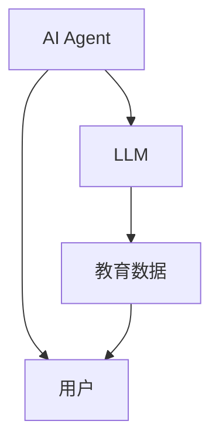
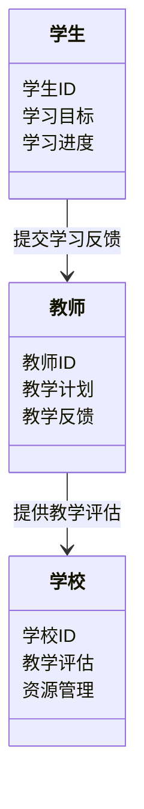
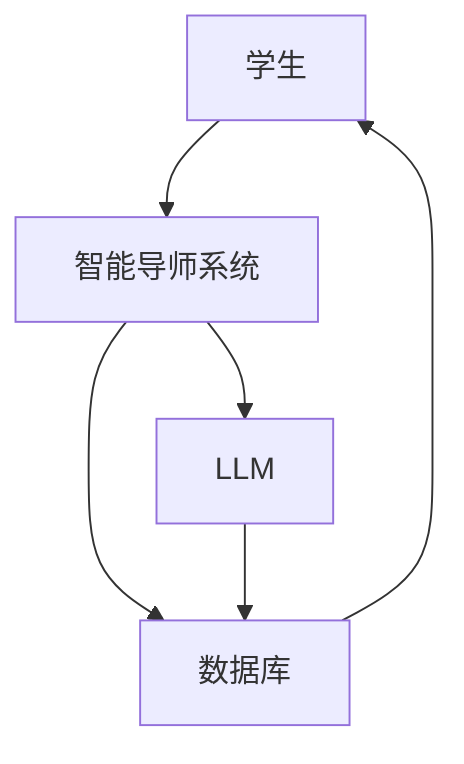
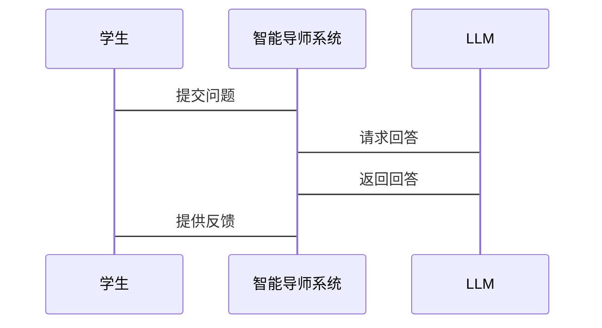

                 


# AI Agent 在教育领域的应用：LLM 驱动的智能导师

> 关键词：AI Agent, LLM, 教育应用, 智能导师, 人工智能教育

> 摘要：本文探讨AI Agent在教育领域的应用，重点分析了大型语言模型（LLM）驱动的智能导师系统。通过逐步分析，文章详细阐述了AI Agent与LLM的核心概念、算法原理、系统架构设计及项目实现，为教育领域的智能化转型提供了理论与实践的双重支持。

---

## 第一部分: AI Agent与教育领域的背景介绍

### 第1章: AI Agent与教育领域的背景

#### 1.1 AI Agent的基本概念

##### 1.1.1 AI Agent的定义
AI Agent（人工智能代理）是指能够感知环境、自主决策并执行任务的智能实体。它可以是一个软件程序，也可以是硬件设备，其核心目标是通过智能算法解决特定问题或完成特定任务。

##### 1.1.2 AI Agent的核心特征
- **自主性**：AI Agent能够自主决策，无需外部干预。
- **反应性**：能够实时感知环境并做出响应。
- **学习能力**：通过数据和经验不断优化自身行为。
- **交互能力**：能够与用户或其他系统进行有效交互。

##### 1.1.3 AI Agent在教育中的应用潜力
AI Agent在教育领域的潜力主要体现在个性化学习、智能辅导、教学管理等方面。例如，AI Agent可以作为智能导师，为学生提供个性化的学习建议和实时指导。

#### 1.2 大型语言模型（LLM）的基本原理

##### 1.2.1 LLM的定义与特点
LLM（Large Language Model）是基于深度学习的自然语言处理模型，能够理解和生成人类语言。其特点包括：
- **大规模训练**：通常使用海量文本数据进行训练。
- **上下文理解**：能够捕捉文本中的上下文关系。
- **生成能力**：可以生成连贯且有意义的文本。

##### 1.2.2 LLM的训练机制
LLM的训练通常采用监督学习和无监督学习的结合。模型通过大量未标注数据进行预训练，然后在特定任务上进行微调。

##### 1.2.3 LLM在教育中的应用前景
LLM在教育中的应用前景广阔，例如：
- **智能辅导**：为学生提供个性化学习建议。
- **自动评分**：对学生的作业进行自动评分。
- **内容生成**：自动生成教学材料。

#### 1.3 教育领域的AI Agent应用背景

##### 1.3.1 当前教育技术的发展现状
随着人工智能技术的快速发展，教育技术也在不断进步。传统的教学工具逐渐被智能化的教育系统所取代。

##### 1.3.2 LLM驱动的智能导师的必要性
传统教育工具难以满足个性化学习的需求，而LLM驱动的智能导师能够提供个性化的学习支持，满足学生的学习需求。

##### 1.3.3 教育AI Agent的边界与外延
教育AI Agent的边界主要在于其功能和应用场景。其外延则包括与其他教育技术的结合，例如与虚拟现实、增强现实等技术的融合。

#### 1.4 本章小结
本章介绍了AI Agent和LLM的基本概念及其在教育中的应用潜力，为后续章节的深入分析奠定了基础。

---

## 第二部分: AI Agent与LLM的核心概念与联系

### 第2章: AI Agent与LLM的核心概念

#### 2.1 AI Agent的核心原理

##### 2.1.1 AI Agent的决策机制
AI Agent的决策机制通常包括感知、推理和行动三个步骤。感知是通过传感器获取环境信息，推理是通过算法分析信息，行动是通过执行器采取行动。

##### 2.1.2 AI Agent的学习能力
AI Agent的学习能力主要体现在其能够通过强化学习或监督学习来优化自身的决策策略。

##### 2.1.3 AI Agent的交互模式
AI Agent的交互模式包括人机交互和机机交互。人机交互是通过自然语言处理技术实现的，机机交互则是通过API或其他通信协议实现的。

#### 2.2 LLM的核心原理

##### 2.2.1 LLM的模型结构
LLM通常基于Transformer架构，包括编码器和解码器两个部分。编码器负责将输入文本转换为向量表示，解码器负责根据向量生成输出文本。

##### 2.2.2 LLM的训练目标
LLM的训练目标是通过最小化预测错误来优化模型参数。常用的损失函数包括交叉熵损失函数。

##### 2.2.3 LLM的输出机制
LLM的输出机制通常采用贪心算法或蒙特卡洛采样算法。贪心算法选择概率最高的词，而蒙特卡洛采样则随机选择多个候选词并计算其概率。

#### 2.3 AI Agent与LLM的关系

##### 2.3.1 AI Agent作为LLM的用户界面
AI Agent可以作为LLM的用户界面，接收用户的输入并将其转化为LLM可以理解的格式。

##### 2.3.2 LLM作为AI Agent的核心驱动力
LLM作为AI Agent的核心驱动力，能够为AI Agent提供强大的自然语言处理能力，使其能够理解和生成人类语言。

##### 2.3.3 两者的协同工作模式
AI Agent与LLM的协同工作模式包括数据输入、模型调用和结果输出三个步骤。AI Agent接收用户的输入，调用LLM生成响应，并将结果返回给用户。

#### 2.4 核心概念对比分析

##### 2.4.1 AI Agent与传统教育工具的对比
| 对比维度 | AI Agent | 传统教育工具 |
|----------|-----------|--------------|
| 功能     | 个性化学习、智能辅导 | 单一功能、缺乏互动性 |
| 交互性   | 高         | 低            |
| 智能性   | 高         | 低            |

##### 2.4.2 LLM与传统NLP模型的对比
| 对比维度 | LLM       | 传统NLP模型 |
|----------|-----------|--------------|
| 模型规模 | 大         | 小            |
| 训练数据 | 海量       | 有限          |
| 表现能力 | 强         | 较弱           |

##### 2.4.3 AI Agent与智能教育系统的对比
AI Agent作为智能教育系统的核心组件，其主要区别在于AI Agent具有更强的自主决策能力和学习能力。

#### 2.5 实体关系图



#### 2.6 本章小结
本章详细分析了AI Agent与LLM的核心概念及其关系，为后续章节的系统设计奠定了理论基础。

---

## 第三部分: LLM驱动的AI Agent算法原理

### 第3章: LLM的算法原理

#### 3.1 LLM的模型结构

##### 3.1.1 Transformer模型的结构
Transformer模型由编码器和解码器组成。编码器负责将输入文本转换为向量表示，解码器负责根据向量生成输出文本。

##### 3.1.2 编码器的结构
编码器包括多个自注意力层和前馈神经网络层。自注意力机制能够捕捉文本中的长距离依赖关系。

##### 3.1.3 解码器的结构
解码器包括自注意力层和交叉注意力层。自注意力层用于捕捉解码器内部的依赖关系，交叉注意力层用于捕捉编码器和解码器之间的依赖关系。

#### 3.2 LLM的训练过程

##### 3.2.1 预训练阶段
预训练阶段使用大规模未标注数据进行训练，目标是最小化生成的概率损失。

##### 3.2.2 微调阶段
微调阶段使用特定任务的数据对模型进行微调，使其适应特定任务的需求。

##### 3.2.3 评估指标
常用的评估指标包括困惑度（Perplexity）和准确率（Accuracy）。

#### 3.3 LLM的推理过程

##### 3.3.1 解码策略
解码策略包括贪心解码和随机采样解码。贪心解码选择概率最高的词，随机采样解码通过随机采样生成多个候选词并选择概率最高的词。

##### 3.3.2 注意力机制
注意力机制通过计算输入文本中每个词的注意力权重，确定每个词对当前词的影响程度。

##### 3.3.3 模型优化
模型优化包括参数调整和剪枝技术。参数调整通过调整学习率和批量大小来优化模型性能，剪枝技术通过去除冗余的参数来减少计算量。

#### 3.4 LLM的数学模型

##### 3.4.1 自注意力机制的公式
$$
\text{Attention}(Q, K, V) = \text{softmax}\left(\frac{QK^T}{\sqrt{d_k}}\right)V
$$

##### 3.4.2 变换层的公式
$$
\text{LayerNorm}(x) = \gamma \cdot \frac{x - \mu}{\sigma} + \beta
$$

##### 3.4.3 解码器的输出
$$
\text{Output} = \text{LayerNorm}(x)
$$

#### 3.5 本章小结
本章详细分析了LLM的模型结构、训练过程和推理过程，为后续章节的系统设计提供了理论支持。

---

## 第四部分: 系统分析与架构设计

### 第4章: 教育智能导师系统的场景

#### 4.1 问题场景介绍

##### 4.1.1 学生的学习需求
学生的学习需求包括个性化学习、实时辅导和学习反馈。

##### 4.1.2 教师的教学需求
教师的教学需求包括教学管理、教学反馈和教学资源优化。

##### 4.1.3 学校的管理需求
学校的管理需求包括教学评估、学生管理和服务优化。

#### 4.2 系统功能设计

##### 4.2.1 领域模型


##### 4.2.2 系统架构设计


##### 4.2.3 系统交互流程


#### 4.3 本章小结
本章详细分析了教育智能导师系统的场景和功能设计，为后续章节的实现提供了指导。

---

## 第五部分: 项目实战

### 第5章: 项目实战

#### 5.1 环境安装

##### 5.1.1 安装Python
```bash
python --version
```

##### 5.1.2 安装LLM库
```bash
pip install transformers
```

#### 5.2 核心代码实现

##### 5.2.1 导入库
```python
from transformers import AutoTokenizer, AutoModelForCausalLM
```

##### 5.2.2 加载模型
```python
tokenizer = AutoTokenizer.from_pretrained("gpt2")
model = AutoModelForCausalLM.from_pretrained("gpt2")
```

##### 5.2.3 定义生成函数
```python
def generate_response(prompt, max_length=50):
    inputs = tokenizer.encode(prompt, return_tensors="pt")
    outputs = model.generate(inputs, max_length=max_length)
    return tokenizer.decode(outputs[0], skip_special_tokens=True)
```

##### 5.2.4 应用案例
```python
response = generate_response("解方程：x^2 + 2x + 1 = 0")
print(response)
```

##### 5.2.5 输出结果
```
解方程：x^2 + 2x + 1 = 0

解：x = -1（重根）
```

#### 5.3 本章小结
本章通过实际操作，详细讲解了如何使用Python和LLM库实现一个简单的智能导师系统。

---

## 第六部分: 最佳实践与总结

### 第6章: 最佳实践

#### 6.1 问题解决思路
- **问题识别**：识别学生的学习需求。
- **模型选择**：选择适合的LLM模型。
- **系统设计**：设计合理的系统架构。
- **代码实现**：实现核心功能模块。

#### 6.2 系统实现技巧
- **数据预处理**：对输入数据进行清洗和格式化。
- **模型调优**：通过微调和优化参数提高模型性能。
- **异常处理**：处理模型推理中的异常情况。

#### 6.3 代码实现细节
- **错误处理**：在代码中加入异常捕获机制。
- **性能优化**：通过并行计算和缓存技术提高推理速度。

#### 6.4 拓展思考
- **多模态支持**：将图像、音频等多模态数据融入系统。
- **跨平台支持**：实现不同平台的兼容性。

#### 6.5 本章小结
本章总结了实现LLM驱动的AI Agent的最佳实践，为读者提供了宝贵的参考。

---

## 作者信息

作者：AI天才研究院/AI Genius Institute & 禅与计算机程序设计艺术/Zen And The Art of Computer Programming

---

这篇文章系统地介绍了AI Agent在教育领域的应用，从背景介绍到项目实战，层层深入，为读者提供了全面的知识体系和实践指导。

