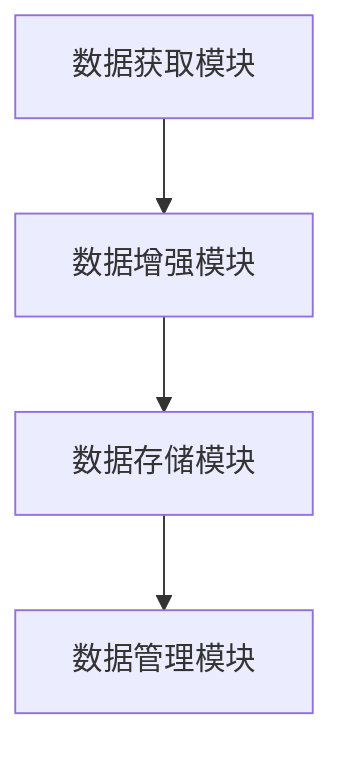
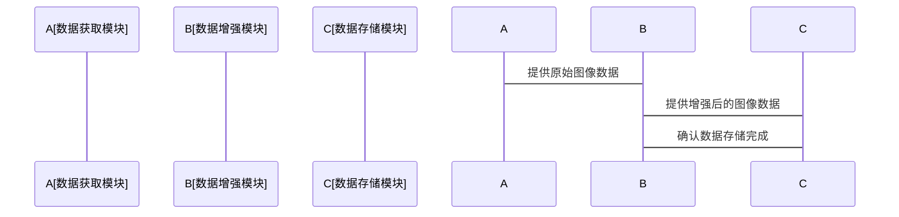

                 


# AI Agent的数据增强技术与策略

> 关键词：AI Agent, 数据增强, 机器学习, 数据处理, 算法优化

> 摘要：本文深入探讨了AI Agent在数据增强技术中的应用策略与实现方法，结合实际案例，详细分析了数据增强技术的核心原理、算法实现、系统架构设计以及在AI Agent中的具体应用。文章从问题背景、核心概念、算法原理、系统设计到项目实战，全面阐述了数据增强技术在提升AI Agent性能中的重要作用，为AI Agent的优化提供了有价值的参考。

---

## 第1章：AI Agent与数据增强技术的背景与概念

### 1.1 数据增强技术的背景与问题背景

#### 1.1.1 数据不足的问题与数据增强的必要性
在机器学习和人工智能领域，数据是训练模型的基础。然而，实际应用场景中，数据获取往往面临以下挑战：
- 数据量不足：特别是在小样本数据的情况下，模型难以有效学习。
- 数据多样性不足：单一的数据来源可能导致模型过拟合。
- 数据质量问题：噪声、缺失或异常数据会影响模型性能。

数据增强技术通过模拟人工标注，生成更多样化的高质量数据，弥补了这些不足，从而提升了模型的泛化能力。

#### 1.1.2 AI Agent在数据增强中的作用
AI Agent是一种智能体，能够感知环境、做出决策并执行任务。在数据增强过程中，AI Agent可以：
- **自动化处理**：自动识别数据中的不足，并生成新的数据样本。
- **动态调整**：根据任务需求，动态调整数据增强的策略和参数。
- **多模态处理**：处理图像、文本等多种数据类型，提升数据的多样性。

#### 1.1.3 数据增强技术的边界与外延
数据增强技术的边界在于数据生成的真实性与多样性，过度增强可能导致数据失真，影响模型性能。外延则包括数据清洗、数据标注等数据处理技术，共同构成了完整的数据处理流程。

### 1.2 AI Agent的定义与核心要素

#### 1.2.1 AI Agent的基本定义
AI Agent（智能体）是指能够感知环境、自主决策并执行任务的智能系统。AI Agent的核心特征包括：
- **自主性**：无需外部干预，自主完成任务。
- **反应性**：能够实时感知环境并做出反应。
- **目标导向性**：根据目标驱动行为。

#### 1.2.2 AI Agent的核心属性与特征
- **感知能力**：通过传感器或数据接口获取环境信息。
- **决策能力**：基于感知信息，选择最优行动方案。
- **执行能力**：通过执行机构或算法实现目标。

#### 1.2.3 AI Agent与数据增强技术的关系
数据增强技术是AI Agent实现数据处理和优化的重要手段。AI Agent通过数据增强技术，能够更好地处理和利用数据，提升模型的性能和泛化能力。

---

## 第2章：数据增强技术的核心概念与原理

### 2.1 数据增强技术的原理与核心要素

#### 2.1.1 数据增强的基本原理
数据增强技术通过对原始数据进行变换，生成更多样化的数据样本。这些变换包括：
- **几何变换**：如旋转、缩放、翻转等。
- **颜色变换**：如调整亮度、对比度、饱和度等。
- **噪声添加**：如添加高斯噪声、椒盐噪声等。

#### 2.1.2 数据增强的核心要素与组成
- **变换类型**：包括几何变换、颜色变换、噪声添加等。
- **变换参数**：如旋转角度、缩放比例等。
- **变换策略**：随机化策略或基于任务的策略。

#### 2.1.3 数据增强技术的分类与对比
数据增强技术可以分为以下几类：
| 类别 | 描述 | 优缺点 |
|------|------|--------|
| 线性变换 | 如旋转、缩放 | 计算简单，生成数据多样性有限 |
| 非线性变换 | 如仿射变换 | 能够生成更多样化数据，但计算复杂度较高 |
| 噪声添加 | 添加各种噪声 | 提高数据鲁棒性，但可能降低数据质量 |

### 2.2 数据增强技术与AI Agent的联系

#### 2.2.1 数据增强在AI Agent中的应用场景
- **图像识别**：通过数据增强生成更多样化的图像数据，提升模型的识别准确率。
- **自然语言处理**：通过文本数据增强，如同义词替换、句式变换，提升模型的语义理解能力。
- **语音识别**：通过声音数据增强，如添加背景噪声，提升模型的抗干扰能力。

#### 2.2.2 数据增强对AI Agent性能的提升作用
- **提升模型泛化能力**：通过生成多样化的数据，模型能够更好地适应不同的输入情况。
- **减少过拟合风险**：数据增强能够防止模型对训练数据的过度拟合，提升模型的泛化性能。
- **提高数据利用率**：在小样本数据的情况下，数据增强能够充分挖掘数据的潜力。

#### 2.2.3 数据增强技术在AI Agent中的核心地位
数据增强技术是AI Agent实现高效数据处理和模型优化的关键技术。通过数据增强，AI Agent能够更好地适应复杂的现实场景，提升任务执行的效率和准确性。

---

## 第3章：数据增强技术的核心概念与联系

### 3.1 数据增强技术的核心概念

#### 3.1.1 数据增强技术的核心概念
数据增强技术通过对原始数据进行变换，生成更多样化的数据样本，从而提升模型的性能。核心概念包括：
- **数据变换**：通过几何变换、颜色变换等方式，生成新的数据样本。
- **数据多样性**：数据增强的目的是生成多样化的数据，以提升模型的泛化能力。
- **数据真实性**：数据增强需要保持数据的真实性，避免生成的数据失真影响模型性能。

#### 3.1.2 数据增强技术的核心属性
- **可控制性**：通过调整变换参数，实现对数据增强过程的控制。
- **可扩展性**：能够处理多种类型的数据，如图像、文本、语音等。
- **可优化性**：能够根据任务需求，优化数据增强策略。

#### 3.1.3 数据增强技术的核心要素
- **变换类型**：如旋转、缩放、翻转等。
- **变换参数**：如旋转角度、缩放比例等。
- **变换策略**：随机化策略或基于任务的策略。

### 3.2 数据增强技术与AI Agent的联系

#### 3.2.1 数据增强在AI Agent中的应用场景
- **图像识别**：通过数据增强生成更多样化的图像数据，提升模型的识别准确率。
- **自然语言处理**：通过文本数据增强，如同义词替换、句式变换，提升模型的语义理解能力。
- **语音识别**：通过声音数据增强，如添加背景噪声，提升模型的抗干扰能力。

#### 3.2.2 数据增强对AI Agent性能的提升作用
- **提升模型泛化能力**：通过生成多样化的数据，模型能够更好地适应不同的输入情况。
- **减少过拟合风险**：数据增强能够防止模型对训练数据的过度拟合，提升模型的泛化性能。
- **提高数据利用率**：在小样本数据的情况下，数据增强能够充分挖掘数据的潜力。

#### 3.2.3 数据增强技术在AI Agent中的核心地位
数据增强技术是AI Agent实现高效数据处理和模型优化的关键技术。通过数据增强，AI Agent能够更好地适应复杂的现实场景，提升任务执行的效率和准确性。

---

## 第4章：数据增强技术的算法原理与数学模型

### 4.1 数据增强技术的数学模型与算法原理

#### 4.1.1 数据增强的数学模型
数据增强的数学模型通常包括以下步骤：
1. **数据获取**：获取原始数据样本。
2. **变换函数**：定义数据变换的函数，如旋转、缩放等。
3. **参数设置**：设置变换参数，如旋转角度θ。
4. **数据变换**：应用变换函数，生成新的数据样本。
5. **数据验证**：验证生成的数据样本是否符合要求。

数学表达式如下：
$$
x_{new} = f(x, \theta)
$$
其中，\( x \) 是原始数据样本，\( f \) 是变换函数，\( \theta \) 是变换参数。

#### 4.1.2 数据增强算法的核心实现
以下是实现数据增强的核心代码示例（以图像数据为例）：

```python
import numpy as np
import matplotlib.pyplot as plt
from PIL import Image

# 定义数据增强函数
def enhance_image(image, rotation=0, scale=1.0):
    # 旋转
    image = image.rotate(rotation)
    # 缩放
    width, height = image.size
    new_width = int(width * scale)
    new_height = int(height * scale)
    image = image.resize((new_width, new_height))
    return image

# 示例：加载图像并进行数据增强
original_image = Image.open('example.jpg')
enhanced_image = enhance_image(original_image, rotation=45, scale=1.2)

# 显示原始图像和增强后的图像
plt.figure(figsize=(10, 5))
plt.subplot(1, 2, 1)
plt.imshow(original_image)
plt.title('Original Image')
plt.axis('off')

plt.subplot(1, 2, 2)
plt.imshow(enhanced_image)
plt.title('Enhanced Image')
plt.axis('off')

plt.show()
```

#### 4.1.3 数据增强算法的数学公式
数据增强算法的数学公式如下：
$$
x_{new} = f(x, \theta)
$$
其中，\( f \) 是变换函数，\( \theta \) 是变换参数，\( x \) 是原始数据样本，\( x_{new} \) 是增强后的数据样本。

---

## 第5章：AI Agent系统的分析与架构设计

### 5.1 问题场景与需求分析

#### 5.1.1 问题场景介绍
假设我们正在开发一个图像识别的AI Agent，用于识别图像中的物体。由于训练数据不足，模型的识别准确率较低。为了提升模型性能，我们需要引入数据增强技术。

#### 5.1.2 系统功能需求
- 数据增强功能：能够对图像数据进行旋转、缩放、翻转等变换。
- 数据处理功能：能够批量处理图像数据，生成多样化的数据集。
- 数据管理功能：能够管理增强后的数据，便于后续模型训练。

### 5.2 系统功能设计与架构设计

#### 5.2.1 系统功能设计
- **数据获取模块**：从数据源获取原始图像数据。
- **数据增强模块**：对图像数据进行旋转、缩放、翻转等变换。
- **数据存储模块**：将增强后的数据存储到数据集中。
- **数据管理模块**：管理数据集，便于后续模型训练。

#### 5.2.2 系统架构设计
以下是系统的架构图：



### 5.3 系统接口与交互设计

#### 5.3.1 系统接口设计
- **数据获取接口**：从数据源获取图像数据。
- **数据增强接口**：对图像数据进行变换，生成增强后的数据。
- **数据存储接口**：将增强后的数据存储到数据集。

#### 5.3.2 系统交互流程
以下是系统的交互流程图：



---

## 第6章：项目实战与应用案例

### 6.1 项目环境与工具安装

#### 6.1.1 项目环境
- **操作系统**：Linux/Windows/macOS
- **编程语言**：Python
- **深度学习框架**：TensorFlow/PyTorch

#### 6.1.2 工具安装
- **安装Python**：确保Python版本为3.6或更高。
- **安装深度学习框架**：
  ```bash
  pip install tensorflow
  ```
- **安装数据处理库**：
  ```bash
  pip install pillow
  ```

### 6.2 核心代码实现与解读

#### 6.2.1 数据增强核心代码
以下是数据增强的核心代码示例：

```python
import numpy as np
import tensorflow as tf
from tensorflow.keras.preprocessing.image import ImageDataGenerator

# 定义数据增强生成器
datagen = ImageDataGenerator(
    rotation_range=20,  # 旋转范围
    width_shift_range=0.2,  # 宽度平移范围
    height_shift_range=0.2,  # 高度平移范围
    shear_range=0.2,  # 剪切范围
    zoom_range=0.2,  # 缩放范围
    horizontal_flip=True  # 水平翻转
)

# 加载原始图像数据
original_images = ...  # 加载图像数据

# 生成增强后的数据
augmented_images = next(datagen.flow(original_images, batch_size=1))
```

#### 6.2.2 应用案例分析
假设我们有一个包含100张图像的数据集，通过数据增强技术，我们可以生成500张增强后的图像，从而提升模型的训练效果。

### 6.3 项目小结
通过数据增强技术，我们可以有效地提升AI Agent的性能，特别是在数据不足的情况下，数据增强能够充分发挥数据的潜力，提升模型的泛化能力。

---

## 第7章：最佳实践与小结

### 7.1 数据增强技术的最佳实践

#### 7.1.1 数据增强策略的选择
- 根据任务需求选择合适的数据增强策略。
- 在图像识别任务中，可以使用旋转、缩放、翻转等几何变换。
- 在自然语言处理任务中，可以使用同义词替换、句式变换等文本变换。

#### 7.1.2 数据增强参数的调整
- 根据数据集的特性调整变换参数。
- 避免过度增强，防止数据失真。

#### 7.1.3 数据增强与模型训练的结合
- 在模型训练过程中，实时生成增强数据，动态调整数据增强策略。

### 7.2 全文总结与未来展望

#### 7.2.1 全文总结
本文系统地探讨了AI Agent在数据增强技术中的应用策略与实现方法，结合实际案例，详细分析了数据增强技术的核心原理、算法实现、系统架构设计以及在AI Agent中的具体应用。通过数据增强技术，AI Agent能够更好地处理和利用数据，提升模型的性能和泛化能力。

#### 7.2.2 未来展望
随着AI技术的不断发展，数据增强技术将在AI Agent中发挥越来越重要的作用。未来的研究方向包括：
- **自适应数据增强**：根据任务需求和数据特性，动态调整数据增强策略。
- **多模态数据增强**：同时处理图像、文本、语音等多种数据类型，提升模型的多模态处理能力。
- **生成式数据增强**：利用生成对抗网络（GAN）等技术，生成高质量的数据样本。

---

## 作者：AI天才研究院/AI Genius Institute & 禅与计算机程序设计艺术 /Zen And The Art of Computer Programming

---

通过以上思考过程，我可以逐步完成《AI Agent的数据增强技术与策略》这篇文章的撰写。

