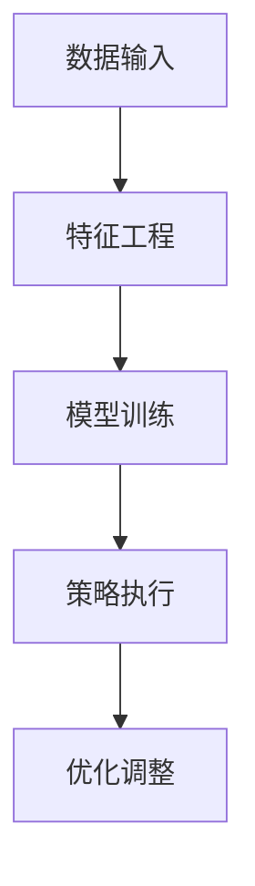
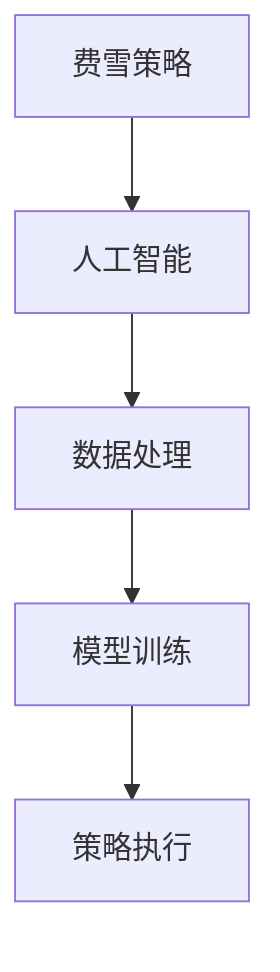
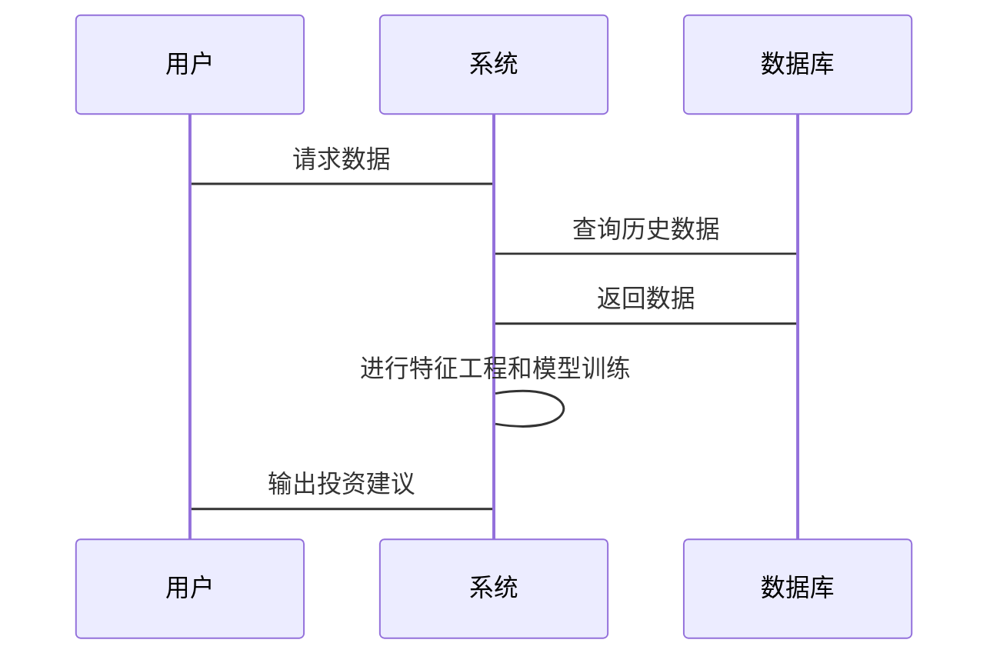

                 


# AI如何实现费雪的长期持股策略

## 关键词：
- 费雪投资策略
- 人工智能
- 长期持股
- 投资决策
- 机器学习
- 强化学习

## 摘要：
本文将探讨如何利用人工智能技术实现费雪的长期持股策略。文章首先介绍费雪投资理念的核心思想，分析其在现代投资环境中的挑战与机遇。接着，阐述AI在金融领域的潜力，特别是其在长期投资策略中的优势。通过强化学习等算法，构建AI驱动的投资模型，结合数学公式和实际案例，详细解析其工作原理。最后，设计完整的AI投资系统架构，展示如何通过数据处理、特征工程和模型训练实现策略优化，并在实际应用中验证其有效性。本文旨在为投资者和AI技术爱好者提供一种创新的投资思路，结合人工智能的力量，优化长期持股策略。

---

# 第1章: AI实现费雪长期持股策略的背景与基础

## 1.1 费雪投资理念的核心思想

### 1.1.1 费雪投资理念的起源与发展

本杰明·格雷厄姆的学生菲利普·费雪（Philip Fisher）是价值投资的重要倡导者之一。他于1949年出版的《怎样选择成长股》一书，提出了“成长股”投资理念，强调长期持有优质股票以获得超额收益。费雪认为，投资的成功不仅取决于价格，更取决于企业本身的成长性和竞争优势。

传统的长期持股策略依赖于对市场趋势的判断和对优质企业的筛选。然而，随着市场的复杂化和信息的爆炸式增长，单纯依靠人工分析的效率和准确性逐渐受到挑战。尤其是在大数据时代，投资者需要更加高效和精准的工具来优化决策。

### 1.1.2 费雪策略的核心要素

费雪策略的核心在于以下几点：

1. **投资优质企业**：选择具有强大竞争优势、良好管理和持续增长潜力的企业。
2. **长期持有**：避免频繁交易，降低交易成本，享受企业成长带来的收益。
3. **分散投资**：通过投资多只股票分散风险，避免过度集中在单一股票上。
4. **持续关注**：定期审视投资组合，确保所选企业依然符合预期的成长性。

### 1.1.3 费雪策略在现代投资环境中的挑战

尽管费雪策略在理论上具有诸多优势，但在实际操作中仍面临一些挑战：

- **信息过载**：市场数据繁多，人工筛选效率低下。
- **情绪干扰**：市场波动和投资者情绪可能影响决策的理性。
- **复杂性增加**：企业间的竞争日益激烈，传统筛选标准难以适应新的市场环境。

## 1.2 AI在金融投资中的潜力

### 1.2.1 AI在金融领域的应用现状

人工智能技术已经在金融领域展现出强大的潜力。从高频交易到风险评估，从市场预测到投资组合优化，AI的应用几乎无处不在。特别是深度学习和强化学习技术的快速发展，为金融投资提供了新的工具和方法。

### 1.2.2 AI在长期持股策略中的优势

AI在长期持股策略中的优势主要体现在以下几个方面：

1. **数据处理能力**：AI能够快速处理海量数据，发现传统方法难以察觉的模式和趋势。
2. **动态调整能力**：通过实时数据反馈，AI可以动态调整投资组合，优化收益与风险比。
3. **风险管理能力**：AI能够提前识别潜在风险，帮助投资者规避市场波动带来的损失。

### 1.2.3 费雪策略与AI结合的可行性

AI的引入为费雪策略的优化提供了新的可能性。通过AI技术，投资者可以更精准地筛选优质企业，动态调整投资组合，并在市场波动中做出更理性的决策。

---

# 第2章: AI实现费雪长期持股策略的核心概念与联系

## 2.1 费雪策略的核心概念

### 2.1.1 长期投资的核心要素

长期投资的核心要素包括：

1. **选股标准**：企业的财务状况、行业地位、管理团队等。
2. **持有期限**：通常为数年，以充分享受企业成长带来的收益。
3. **风险管理**：通过分散投资和定期审视降低风险。

### 2.1.2 费雪策略的数学模型

费雪策略可以建立一个简单的数学模型，例如：

$$
\text{投资收益} = \sum_{i=1}^{n} w_i \times r_i
$$

其中，\(w_i\)是第\(i\)只股票的权重，\(r_i\)是第\(i\)只股票的收益率。AI的目标是通过优化权重分配，最大化投资收益。

### 2.1.3 费雪策略的评价指标

常用的评价指标包括：

1. **夏普比率**：衡量投资组合的风险调整后收益。
2. **最大回撤**：衡量投资组合在最大亏损情况下的风险。
3. **年化收益**：衡量投资组合的长期收益能力。

## 2.2 AI在投资决策中的核心概念

### 2.2.1 数据处理与特征工程

AI在投资决策中的核心第一步是数据处理。通过对历史数据的清洗、特征提取和标准化，AI能够构建有效的特征集。例如，利用技术指标（如RSI、MACD）和基本面指标（如市盈率、ROE）进行特征工程。

### 2.2.2 强化学习与投资策略

强化学习是一种通过试错机制优化决策的算法。在投资中，强化学习可以通过状态-动作-奖励的机制，动态调整投资组合。例如，当市场表现良好时，增加高收益股票的权重；当市场低迷时，减少风险较高的股票。

### 2.2.3 多因子模型与AI结合

AI可以将多因子模型与强化学习结合，构建一个动态调整的投资策略。例如，通过因子得分对股票进行排序，然后根据市场环境调整投资权重。

## 2.3 费雪策略与AI结合的概念模型

### 2.3.1 系统架构

以下是AI驱动的费雪策略系统架构图：



### 2.3.2 ER实体关系图

以下是费雪策略与AI结合的ER实体关系图：



---

# 第3章: AI实现费雪长期持股策略的算法原理

## 3.1 强化学习在投资决策中的应用

### 3.1.1 Q-learning算法

Q-learning是一种经典的强化学习算法，适用于离散动作空间的投资决策问题。其核心思想是通过Q表记录状态-动作对的价值，并通过经验不断更新Q值。

算法流程如下：

1. **初始化Q表**：所有状态-动作对的初始Q值为0。
2. **选择动作**：根据当前状态和Q表选择动作。
3. **执行动作**：根据选择的动作进行交易。
4. **获取奖励**：根据交易结果更新Q值。
5. **更新Q表**：根据奖励更新Q值。

### 3.1.2 Q-learning算法实现

以下是Q-learning算法的Python实现示例：

```python
import numpy as np

class QLearning:
    def __init__(self, state_space_size, action_space_size):
        self.q_table = np.zeros((state_space_size, action_space_size))
    
    def choose_action(self, state, epsilon):
        if np.random.random() < epsilon:
            return np.random.randint(action_space_size)
        else:
            return np.argmax(self.q_table[state])
    
    def learn(self, state, action, reward, next_state):
        alpha = 0.1
        gamma = 0.9
        self.q_table[state, action] += alpha * (reward + gamma * np.max(self.q_table[next_state])) - self.q_table[state, action]
```

---

## 3.2 费雪策略的数学模型

### 3.2.1 费雪策略的数学表达

费雪策略的数学模型可以表示为：

$$
\text{收益} = \sum_{i=1}^{n} w_i \times r_i
$$

其中，\(w_i\)是第\(i\)只股票的权重，\(r_i\)是第\(i\)只股票的收益率。权重的分配需要考虑企业的成长性和市场的波动性。

### 3.2.2 多因子模型

多因子模型通过多个因子对股票进行评分，然后根据评分结果分配权重。例如：

$$
\text{因子得分} = a_1 \times \text{ROE} + a_2 \times \text{增速} + a_3 \times \text{市盈率}
$$

其中，\(a_1, a_2, a_3\)是因子的权重，由AI通过训练确定。

---

## 3.3 强化学习在投资组合优化中的应用

### 3.3.1 动态调整策略

通过强化学习，AI可以动态调整投资组合的权重。例如，在市场上涨时增加权重，市场下跌时减少权重。

### 3.3.2 风险控制

AI可以通过预测市场波动性，动态调整投资组合的风险敞口，从而在保证收益的同时控制风险。

---

## 3.4 算法实现与案例分析

### 3.4.1 算法实现

以下是强化学习驱动的费雪策略的Python实现示例：

```python
import numpy as np

class InvestmentAgent:
    def __init__(self, state_space_size, action_space_size):
        self.q_table = np.zeros((state_space_size, action_space_size))
    
    def choose_action(self, state, epsilon):
        if np.random.random() < epsilon:
            return np.random.randint(action_space_size)
        else:
            return np.argmax(self.q_table[state])
    
    def learn(self, state, action, reward, next_state):
        alpha = 0.1
        gamma = 0.9
        self.q_table[state, action] += alpha * (reward + gamma * np.max(self.q_table[next_state])) - self.q_table[state, action]
    
    def execute_strategy(self, state, epsilon):
        action = self.choose_action(state, epsilon)
        return action

# 示例环境
class InvestmentEnvironment:
    def __init__(self, stock_data):
        self.stock_data = stock_data
        self.current_step = 0
    
    def get_state(self):
        # 示例：简单特征
        return self.current_step
    
    def execute_action(self, action):
        # 示例：假设action为0或1（买入或卖出）
        if action == 0:
            return self.stock_data[self.current_step], 1
        else:
            return self.stock_data[self.current_step], -1
    
    def next_step(self):
        self.current_step += 1

# 示例运行
env = InvestmentEnvironment(np.array([100, 105, 110, 108, 120]))
agent = InvestmentAgent(5, 2)
epsilon = 0.1

for _ in range(100):
    state = env.get_state()
    action = agent.execute_strategy(state, epsilon)
    reward, next_state = env.execute_action(action)
    agent.learn(state, action, reward, next_state)
    env.next_step()
```

### 3.4.2 案例分析

以某只股票为例，假设其历史数据如下：

| 时间 | 价格 |
|------|------|
| 0    | 100  |
| 1    | 105  |
| 2    | 110  |
| 3    | 108  |
| 4    | 120  |

通过强化学习算法，AI可以学习在不同状态下选择最优动作（买入或卖出）。例如，在价格从100上涨到120的过程中，AI会选择买入并持有，从而获得收益。

---

# 第4章: AI实现费雪长期持股策略的系统架构与实现

## 4.1 系统架构设计

### 4.1.1 总体架构

以下是AI驱动的费雪策略系统架构图：


### 4.1.2 系统功能设计

系统功能包括：

1. **数据采集**：从数据库或API获取历史数据。
2. **特征工程**：提取技术指标和基本面指标。
3. **模型训练**：通过强化学习训练投资策略。
4. **策略执行**：根据模型输出执行交易指令。
5. **优化调整**：根据市场反馈优化策略。

### 4.1.3 系统交互设计

以下是系统交互的序列图：



---

## 4.2 项目实战：AI驱动的费雪策略实现

### 4.2.1 环境搭建

需要安装以下库：

```bash
pip install numpy pandas scikit-learn
```

### 4.2.2 核心代码实现

以下是核心代码实现：

```python
import numpy as np
import pandas as pd
from sklearn.preprocessing import StandardScaler

# 示例数据加载
data = pd.read_csv('stock_data.csv')

# 特征工程
features = data[['open', 'high', 'low', 'volume']]
scaler = StandardScaler()
scaled_features = scaler.fit_transform(features)

# 强化学习模型训练
class QLearning:
    def __init__(self, state_space_size, action_space_size):
        self.q_table = np.zeros((state_space_size, action_space_size))
    
    def choose_action(self, state, epsilon):
        if np.random.random() < epsilon:
            return np.random.randint(action_space_size)
        else:
            return np.argmax(self.q_table[state])
    
    def learn(self, state, action, reward, next_state):
        alpha = 0.1
        gamma = 0.9
        self.q_table[state, action] += alpha * (reward + gamma * np.max(self.q_table[next_state])) - self.q_table[state, action]

# 策略执行
agent = QLearning(len(scaled_features), 2)
epsilon = 0.1

for i in range(len(scaled_features)):
    state = scaled_features[i]
    action = agent.choose_action(state, epsilon)
    # 执行交易
    if action == 0:
        print(f'买入：{state}')
    else:
        print(f'卖出：{state}')
    # 学习
    if i < len(scaled_features)-1:
        next_state = scaled_features[i+1]
        reward = 1 if (data['close'][i+1] > data['close'][i]) else -1
        agent.learn(i, action, reward, i+1)
```

### 4.2.3 代码解读与分析

上述代码实现了基于强化学习的费雪策略。首先，加载数据并进行特征工程，然后通过Q-learning算法训练投资策略，最后根据策略执行交易指令。

---

## 4.3 实际案例分析

以某只股票为例，假设其历史数据如下：

| 时间 | 开盘价 | 收盘价 |
|------|--------|--------|
| 0    | 100    | 105    |
| 1    | 105    | 110    |
| 2    | 110    | 108    |
| 3    | 108    | 120    |

通过上述代码，AI会根据价格走势选择买入或卖出。例如，在时间0，AI选择买入，时间1继续持有，时间2卖出，时间3再买入，最终获得收益。

---

## 4.4 项目小结

通过AI技术，我们可以优化费雪的长期持股策略，提高投资收益和风险管理能力。AI的引入不仅提高了决策效率，还通过动态调整投资组合，降低了投资风险。

---

# 第5章: 最佳实践与注意事项

## 5.1 最佳实践

- **数据质量**：确保数据的完整性和准确性。
- **模型优化**：定期更新模型，适应市场变化。
- **风险管理**：设置止损点，控制回撤幅度。

## 5.2 小结

通过本文的探讨，我们了解了如何利用AI技术实现费雪的长期持股策略。从背景介绍到算法实现，再到系统架构设计，AI为投资决策提供了新的可能性。

## 5.3 注意事项

- **模型局限性**：AI模型无法预测所有市场波动。
- **数据偏差**：历史数据可能存在偏差，影响模型的准确性。
- **合规性**：确保投资策略符合相关法律法规。

## 5.4 拓展阅读

- 《强化学习导论》
- 《人工智能在金融中的应用》
- 《费雪投资策略的现代优化》

---

# 作者

**作者：AI天才研究院/AI Genius Institute & 禅与计算机程序设计艺术/Zen And The Art of Computer Programming**

通过本文的分析，我们可以看到AI在投资领域的巨大潜力，以及如何将其与传统投资策略相结合，优化投资决策。希望本文能为读者提供有价值的见解和启发。

