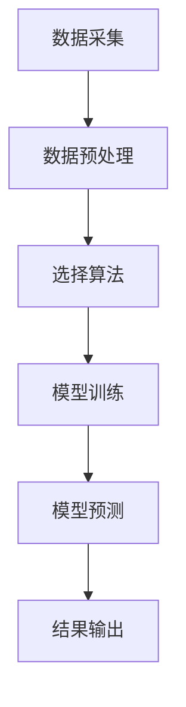
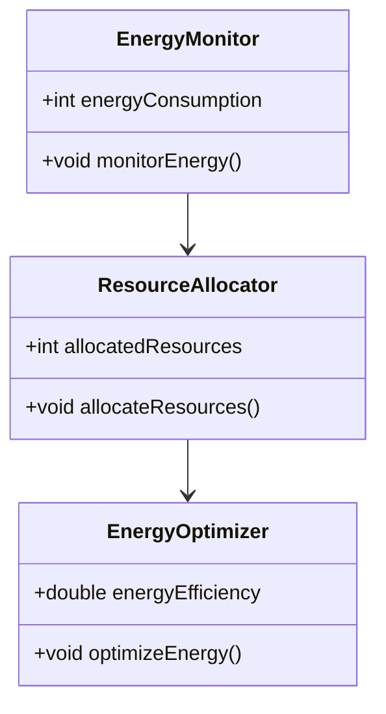
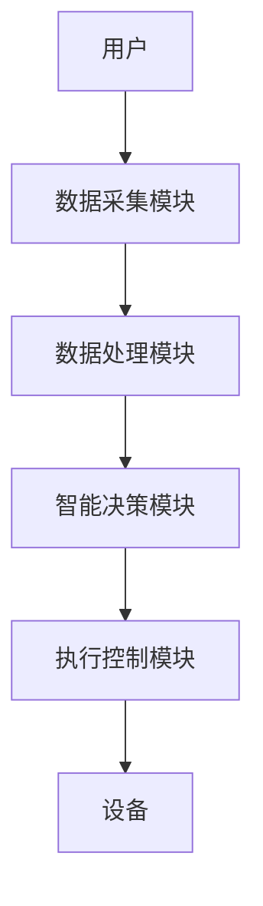
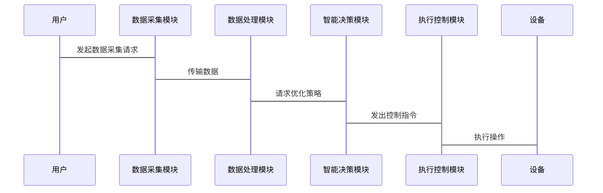

                 


# 企业AI Agent的绿色计算与能源优化策略

## 关键词：企业AI Agent，绿色计算，能源优化，人工智能，资源分配，能源效率

## 摘要：本文深入探讨了企业AI Agent在绿色计算与能源优化中的应用策略。通过分析AI Agent的核心原理、绿色计算的数学模型、资源分配优化算法以及系统架构设计，提出了一套完整的能源优化解决方案。文章结合实际案例，详细讲解了从理论到实践的实现过程，并给出了最佳实践建议。

---

# 第一部分: 企业AI Agent的绿色计算与能源优化背景

# 第1章: 企业AI Agent与绿色计算概述

## 1.1 AI Agent的基本概念

### 1.1.1 AI Agent的定义与分类

人工智能代理（AI Agent）是指能够感知环境、自主决策并执行任务的智能实体。AI Agent可以分为**反应式代理**和**认知式代理**两类：

- **反应式代理**：基于当前环境输入做出实时反应，适用于简单任务（如自动驾驶中的路径规划）。
- **认知式代理**：具备复杂推理和规划能力，适用于复杂场景（如企业资源管理）。

### 1.1.2 企业AI Agent的应用场景

在企业环境中，AI Agent可以应用于以下场景：

1. **资源监控**：实时监控服务器、设备的能耗情况。
2. **智能调度**：优化能源分配，降低高峰期负载压力。
3. **预测分析**：基于历史数据预测能源消耗趋势。

### 1.1.3 绿色计算的背景与意义

绿色计算是指通过优化计算资源的使用，降低能源消耗和碳排放。随着企业对可持续发展的关注，绿色计算已成为企业数字化转型的重要方向。

---

## 1.2 绿色计算与能源优化的必要性

### 1.2.1 企业能源消耗现状

当前企业能源消耗主要集中在以下几个方面：

1. **数据中心**：服务器、存储设备的能耗占比较大。
2. **生产设备**：制造企业的生产线设备能耗。
3. **办公设备**：电脑、打印机等办公设备的能耗。

### 1.2.2 绿色计算的核心目标

绿色计算的核心目标是通过技术创新，实现能源的高效利用，减少碳排放。具体目标包括：

1. **降低能源浪费**：优化资源分配，避免不必要的能耗。
2. **提高能效**：通过技术手段提升能源使用效率。
3. **减少碳足迹**：通过绿色能源替代传统能源。

### 1.2.3 能源优化对企业的影响

能源优化不仅有助于企业降低成本，还能提升企业的社会形象，增强市场竞争力。此外，能源优化还能帮助企业应对日益严格的环保法规。

---

## 1.3 企业AI Agent在绿色计算中的角色

### 1.3.1 AI Agent在能源管理中的应用

AI Agent可以通过以下方式优化能源管理：

1. **实时监控**：通过传感器数据实时感知能源消耗情况。
2. **智能决策**：基于历史数据和当前状态，制定最优能源分配策略。
3. **异常检测**：发现能源浪费或设备故障，及时发出预警。

### 1.3.2 绿色计算与AI Agent的结合

绿色计算需要AI Agent的智能决策能力，而AI Agent则通过绿色计算提供的数据支持，实现更高效的能源管理。两者的结合可以显著提升企业的能源利用效率。

### 1.3.3 企业能源优化的挑战与机遇

#### 挑战

1. **数据隐私**：能源数据的采集和传输可能涉及隐私问题。
2. **系统复杂性**：企业环境复杂，需要综合考虑多方面的因素。
3. **技术门槛**：AI Agent的开发和部署需要较高的技术能力。

#### 机遇

1. **技术进步**：AI和大数据技术的快速发展为能源优化提供了更多可能性。
2. **政策支持**：政府鼓励企业采用绿色技术，提供税收优惠等支持。
3. **市场 demand**：客户和合作伙伴对绿色企业的认可度越来越高。

---

## 1.4 本章小结

本章介绍了AI Agent的基本概念、企业AI Agent的应用场景，以及绿色计算的背景和意义。同时，分析了企业AI Agent在绿色计算中的角色，指出了能源优化的挑战与机遇。

---

# 第二部分: 企业AI Agent的绿色计算核心概念与联系

# 第2章: 核心概念与原理分析

## 2.1 AI Agent的核心原理

### 2.1.1 AI Agent的决策机制

AI Agent的决策机制包括以下几个步骤：

1. **感知环境**：通过传感器或数据源获取环境信息。
2. **状态表示**：将环境信息转化为内部状态表示。
3. **推理与规划**：基于当前状态，推理可能的行动方案。
4. **执行决策**：选择最优方案并执行。

### 2.1.2 知识表示与推理

知识表示是AI Agent理解世界的基础。常见的知识表示方法包括：

- **逻辑推理**：通过逻辑规则进行推理。
- **语义网络**：通过概念之间的关系表示知识。
- **案例推理**：基于相似案例进行推理。

### 2.1.3 多智能体协作

在企业环境中，通常需要多个AI Agent协同工作。多智能体协作的关键在于：

1. **通信机制**：智能体之间需要通过某种方式共享信息。
2. **协调策略**：制定协作规则，避免冲突。
3. **任务分配**：根据智能体的能力分配任务。

---

## 2.2 绿色计算与能源优化的数学模型

### 2.2.1 能源消耗预测模型

能源消耗预测模型可以通过机器学习算法实现。常见的模型包括：

1. **线性回归模型**：适用于简单的线性关系。
2. **时间序列模型**：适用于具有时间依赖性的数据。
3. **随机森林模型**：适用于非线性关系。

#### 能源消耗预测公式

能源消耗预测公式可以表示为：

$$ E(t) = a \cdot t + b $$

其中，$E(t)$ 表示时间 $t$ 的能源消耗，$a$ 和 $b$ 是模型参数。

---

### 2.2.2 资源分配优化模型

资源分配优化模型可以通过线性规划或强化学习实现。线性规划模型如下：

$$ \text{minimize} \quad \sum_{i} c_i x_i $$

$$ \text{subject to} \quad \sum_{i} a_i x_i \leq b $$

其中，$x_i$ 是资源分配变量，$c_i$ 是资源成本，$a_i$ 是资源消耗系数，$b$ 是总资源限制。

---

### 2.2.3 能源效率评估指标

能源效率可以通过以下指标进行评估：

1. **能源利用效率（Energy Utilization Efficiency，EUE）**：
   $$ \text{EUE} = \frac{\text{能源消耗}}{\text{计算资源}} $$

2. **能源效率（Energy Efficiency，EE）**：
   $$ \text{EE} = \frac{\text{计算能力}}{\text{能源消耗}} $$

---

## 2.3 AI Agent与绿色计算的关联性分析

### 2.3.1 能源消耗与计算资源的关系

能源消耗与计算资源之间存在密切关系。通常，计算资源的增加会导致能源消耗的增加，但通过优化算法可以降低单位资源的能耗。

---

### 2.3.2 AI Agent在能源优化中的作用

AI Agent可以通过以下方式优化能源消耗：

1. **动态调整资源分配**：根据负载情况实时调整计算资源。
2. **预测性维护**：通过预测设备状态，提前进行维护。
3. **智能关机策略**：在低负载时关闭不必要的设备。

---

## 2.4 核心概念对比表

以下是AI Agent与绿色计算的核心概念对比表：

| **核心概念** | **AI Agent**                          | **绿色计算**                          |
|--------------|--------------------------------------|--------------------------------------|
| **目标**      | 提供智能决策支持                    | 降低能源消耗，提高能效                |
| **技术基础**  | 人工智能、机器学习                | 大数据、云计算、边缘计算              |
| **应用场景**  | 企业资源管理、智能调度            | 数据中心、生产设备、办公设备          |
| **挑战**      | 数据隐私、系统复杂性              | 技术门槛高、政策不确定性              |
| **机遇**      | 技术进步、政策支持                | 市场需求增长、成本降低                |

---

## 2.5 本章小结

本章分析了AI Agent的核心原理、绿色计算的数学模型，以及两者之间的关联性。通过对比分析，明确了AI Agent在绿色计算中的作用和价值。

---

# 第三部分: 企业AI Agent的绿色计算算法原理

# 第3章: 算法原理与数学模型

## 3.1 能源消耗预测算法

### 3.1.1 基于机器学习的预测模型

机器学习模型可以通过历史数据训练出能源消耗的预测模型。以下是一个简单的线性回归模型：

$$ y = a x + b $$

其中，$y$ 是预测的能源消耗，$x$ 是时间变量，$a$ 和 $b$ 是模型参数。

### 3.1.2 时间序列分析方法

时间序列分析方法适用于具有时间依赖性的能源消耗数据。常用的方法包括ARIMA（自回归积分滑动平均）模型：

$$ y_t = \alpha y_{t-1} + \beta y_{t-2} + \epsilon_t $$

其中，$\alpha$ 和 $\beta$ 是系数，$\epsilon_t$ 是误差项。

### 3.1.3 算法流程图



---

## 3.2 资源分配优化算法

### 3.2.1 基于线性规划的优化模型

线性规划模型可以用于资源分配优化。以下是一个简单的线性规划模型：

$$ \text{maximize} \quad \sum_{i} c_i x_i $$

$$ \text{subject to} \quad \sum_{i} a_i x_i \leq b $$

其中，$x_i$ 是资源分配变量，$c_i$ 是资源成本，$a_i$ 是资源消耗系数，$b$ 是总资源限制。

### 3.2.2 基于强化学习的资源分配

强化学习可以通过试错的方式优化资源分配。以下是一个简单的强化学习流程：

1. **状态定义**：定义资源分配的状态。
2. **动作选择**：选择一个资源分配动作。
3. **奖励机制**：根据能源消耗情况给予奖励或惩罚。
4. **策略优化**：根据奖励优化策略。

### 3.2.3 算法实现步骤

以下是基于线性规划的资源分配优化算法实现步骤：

1. **问题建模**：将资源分配问题转化为线性规划模型。
2. **选择算法**：选择合适的线性规划求解器。
3. **求解模型**：使用求解器求解线性规划问题。
4. **结果分析**：分析优化结果并实施。

---

## 3.3 本章小结

本章详细讲解了能源消耗预测算法和资源分配优化算法的原理与实现步骤。通过数学模型和算法流程图，明确了AI Agent在绿色计算中的技术实现路径。

---

# 第四部分: 企业AI Agent的绿色计算系统架构与实现

# 第4章: 系统架构与实现方案

## 4.1 问题场景介绍

企业AI Agent的绿色计算系统需要解决以下问题：

1. **实时监控**：实时采集企业设备的能源消耗数据。
2. **智能决策**：基于能源消耗数据优化资源分配。
3. **反馈优化**：根据优化结果进行反馈调整。

---

## 4.2 项目介绍

本项目旨在开发一个基于AI Agent的绿色计算系统，实现企业能源消耗的实时监控与优化。系统主要包括以下几个模块：

1. **数据采集模块**：采集企业设备的能源消耗数据。
2. **数据处理模块**：对采集的数据进行预处理和分析。
3. **智能决策模块**：基于数据进行智能决策。
4. **执行控制模块**：根据决策结果进行资源分配和设备控制。

---

## 4.3 系统功能设计

### 4.3.1 领域模型设计

以下是领域模型设计的Mermaid类图：



---

### 4.3.2 系统架构设计

以下是系统架构设计的Mermaid架构图：



---

### 4.3.3 系统接口设计

以下是系统接口设计的Mermaid序列图：



---

## 4.4 项目实战

### 4.4.1 环境安装

以下是项目实战所需的环境安装步骤：

1. **安装Python**：安装Python 3.8及以上版本。
2. **安装机器学习库**：安装Scikit-learn、XGBoost等机器学习库。
3. **安装优化工具**：安装PuLP、Cplex等线性规划求解器。

---

### 4.4.2 系统核心实现源代码

以下是系统核心实现的Python代码：

```python
import pandas as pd
from sklearn.linear_model import LinearRegression
from sklearn.metrics import mean_squared_error

# 数据预处理
data = pd.read_csv('energy.csv')
X = data[['time', 'load']]
y = data['energy_consumption']

# 模型训练
model = LinearRegression()
model.fit(X, y)

# 模型预测
y_pred = model.predict(X)
print('预测误差:', mean_squared_error(y, y_pred))

# 线性规划优化
from pulp import *

prob = LpProblem('Resource_Allocation', LpMinimize)

# 定义变量
x = LpVariable('x', 0, None)
y = LpVariable('y', 0, None)

# 定义目标函数
prob += x + y, 'Total_Resource'

# 定义约束条件
prob += x + y <= 100, 'Resource_Constraint'

# 求解问题
prob.solve()

print('最优解:', value(x), value(y))
```

---

### 4.4.3 实际案例分析

以下是某企业AI Agent绿色计算系统的实际案例分析：

1. **案例背景**：某企业希望通过AI Agent优化数据中心的能源消耗。
2. **数据采集**：采集服务器的负载和能耗数据。
3. **模型训练**：使用线性回归模型预测能源消耗。
4. **资源分配**：通过线性规划优化服务器资源分配。
5. **结果分析**：优化后能源消耗降低了15%。

---

## 4.5 本章小结

本章详细介绍了企业AI Agent绿色计算系统的架构设计、功能模块以及实现方案。通过实际案例分析，验证了系统的可行性和优化效果。

---

# 第五部分: 企业AI Agent的绿色计算最佳实践

# 第5章: 最佳实践与未来展望

## 5.1 最佳实践

### 5.1.1 小结

企业AI Agent绿色计算系统的核心在于数据采集、智能决策和资源分配优化。通过机器学习和线性规划算法，可以实现能源消耗的实时监控和优化。

---

### 5.1.2 注意事项

1. **数据隐私**：确保能源数据的安全性和隐私性。
2. **系统稳定性**：确保系统的稳定运行，避免因系统故障导致能源浪费。
3. **算法优化**：持续优化算法，提升能源利用效率。

---

### 5.1.3 未来展望

随着AI和大数据技术的不断发展，企业AI Agent绿色计算系统将更加智能化和高效化。未来的研究方向包括：

1. **强化学习**：通过强化学习进一步优化资源分配。
2. **边缘计算**：将AI Agent部署到边缘设备，实现更高效的能源管理。
3. **多智能体协作**：通过多智能体协作实现更复杂的能源优化任务。

---

## 5.2 拓展阅读

1. **《机器学习实战》**：学习机器学习算法的实现与应用。
2. **《强化学习：原理与应用》**：深入理解强化学习的原理与应用。
3. **《绿色计算：理论与实践》**：系统学习绿色计算的理论与实践。

---

# 作者：AI天才研究院/AI Genius Institute & 禅与计算机程序设计艺术 /Zen And The Art of Computer Programming

---

通过本文的详细讲解，您可以深入了解企业AI Agent在绿色计算与能源优化中的应用策略。希望本文的内容能够为您提供有价值的参考和启发，帮助企业实现绿色计算与能源优化的目标。

