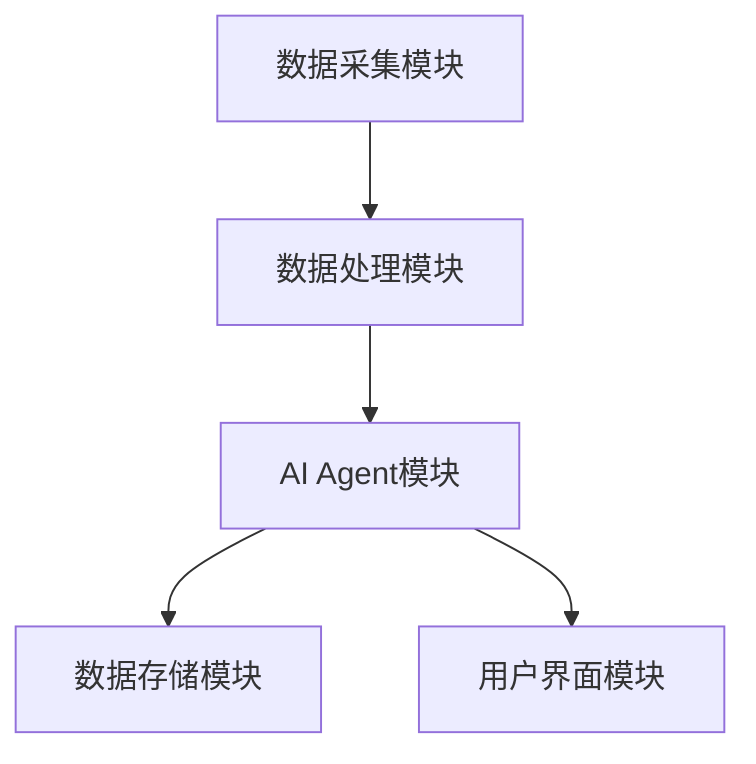
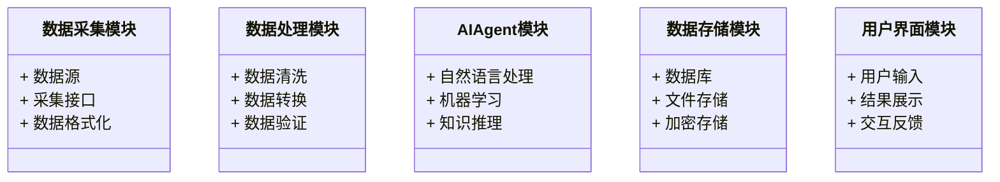
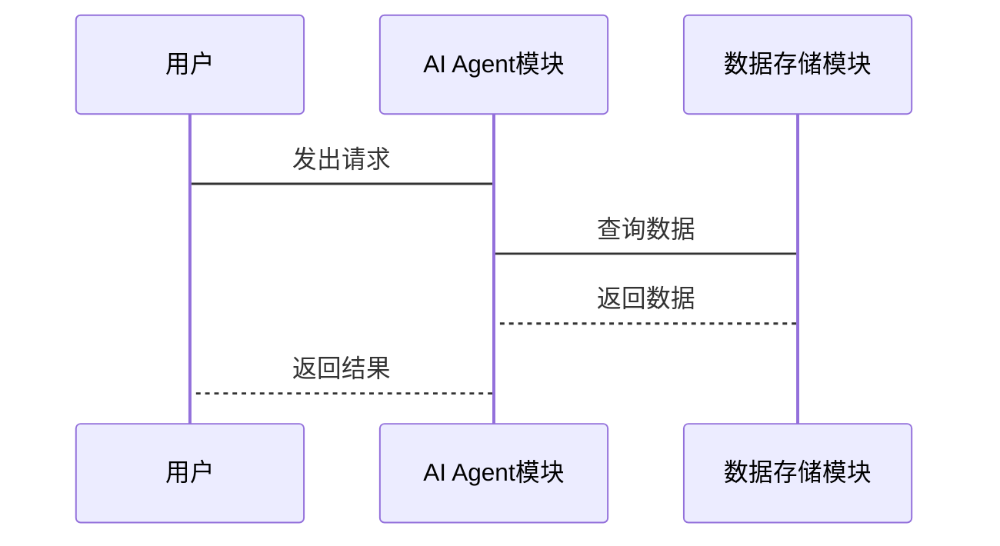

                 


# 企业数据安全与AI Agent开发：平衡创新与风险

> **关键词**：企业数据安全、AI Agent、数据隐私、人工智能安全、安全开发、创新风险

> **摘要**：在企业数字化转型的背景下，数据安全与AI Agent的结合成为一个重要议题。本文探讨了如何在AI Agent开发中平衡创新与风险，确保数据安全的前提下推动技术进步。通过分析数据安全的核心原理、AI Agent的技术基础以及它们的结合方式，本文提供了系统的解决方案和实践案例。

---

## 第一章：企业数据安全与AI Agent开发概述

### 1.1 数据安全的重要性

#### 1.1.1 数据在企业中的核心地位

数据是企业的核心资产，涵盖了客户信息、财务数据、知识产权等多个方面。随着数字化转型的推进，数据的收集、存储和处理变得越来越频繁。然而，数据的安全性也随之成为企业面临的重要挑战。

- **数据分类**：企业需要对数据进行分类，例如按照敏感程度分为机密数据、重要数据和公开数据。
- **数据生命周期**：数据从生成、存储、处理到销毁，每个阶段都需要考虑安全问题。

#### 1.1.2 数据安全的定义与范畴

数据安全是指通过技术手段保护数据的机密性、完整性和可用性。数据安全的范畴包括数据加密、访问控制、数据备份和恢复等。

- **数据加密**：通过加密技术保护数据在传输和存储过程中的安全。
- **访问控制**：基于角色的访问控制（RBAC）是常见的数据安全策略。

#### 1.1.3 企业数据安全的挑战与风险

- **数据泄露**：由于内部员工疏忽或外部攻击，数据可能被泄露。
- **合规性要求**：企业需要遵守各种数据保护法规，如GDPR、《个人信息保护法》等。

### 1.2 AI Agent的基本概念

#### 1.2.1 AI Agent的定义与特点

AI Agent（智能代理）是一种能够感知环境并采取行动以实现目标的实体。它可以通过自然语言处理（NLP）、机器学习（ML）等技术与用户交互，并执行任务。

- **自主性**：AI Agent可以在没有人工干预的情况下执行任务。
- **反应性**：能够根据环境的变化调整行为。

#### 1.2.2 AI Agent的核心技术

- **自然语言处理（NLP）**：用于理解和生成人类语言。
- **机器学习（ML）**：用于模式识别和预测。
- **知识表示**：用于存储和处理知识。

#### 1.2.3 AI Agent在企业中的应用前景

AI Agent可以在企业中应用于客服、数据分析、流程自动化等领域。例如，AI Agent可以作为虚拟助手，帮助员工处理日常任务。

### 1.3 数据安全与AI Agent的结合

#### 1.3.1 数据安全与AI Agent的关联性

AI Agent的开发和应用依赖于大量数据，因此数据安全是其开发和应用的基础。

- **数据隐私**：AI Agent处理的数据可能包含敏感信息，需要确保数据隐私。
- **数据完整性**：数据在传输和处理过程中不能被篡改。

#### 1.3.2 企业数据安全与AI Agent开发的平衡点

- **数据脱敏**：在开发AI Agent时，可以对敏感数据进行脱敏处理，确保数据安全。
- **最小权限原则**：在AI Agent中，赋予最小的访问权限，以减少潜在风险。

#### 1.3.3 案例分析：AI Agent在企业数据安全中的应用

例如，企业可以使用AI Agent来监控网络流量，检测异常行为。AI Agent可以分析日志数据，识别潜在的安全威胁。

---

## 第二章：数据安全的核心原理

### 2.1 数据分类与分级

#### 2.1.1 数据分类的标准与方法

- **按用途分类**：分为业务数据、元数据等。
- **按敏感程度分类**：分为机密数据、重要数据和公开数据。

#### 2.1.2 数据分级的策略与实施

- **分级标准**：根据数据的重要性、敏感性和业务影响程度进行分级。
- **分级策略**：制定数据访问策略，确保不同级别的数据有不同的访问权限。

#### 2.1.3 数据分类与分级的实际案例

例如，某企业将客户数据分为客户信息、订单数据、财务数据等，并根据数据的重要性进行分级，制定相应的访问控制策略。

### 2.2 数据加密技术

#### 2.2.1 加密算法的基本原理

- **对称加密**：如AES算法，加密和解密使用相同的密钥。
- **非对称加密**：如RSA算法，加密和解密使用不同的密钥。

#### 2.2.2 对称加密与非对称加密的对比

| 特性          | 对称加密             | 非对称加密             |
|---------------|----------------------|------------------------|
| 密钥管理      | 使用一个密钥          | 使用一对公钥和私钥      |
| 加密速度      | 快                   | 较慢                   |
| 适用场景      | 适用于大数据量加密    | 适用于数字签名和身份验证|

#### 2.2.3 数据加密在企业中的应用

- **数据存储加密**：在数据库中存储加密数据。
- **数据传输加密**：使用SSL/TLS协议加密数据传输。

### 2.3 数据访问控制

#### 2.3.1 权限管理的基本概念

- **用户角色**：根据用户在企业的角色分配不同的权限。
- **权限层次**：将权限分为管理权限、操作权限等。

#### 2.3.2 RBAC（基于角色的访问控制）模型

RBAC模型通过角色和权限的分离，实现对数据的访问控制。其核心思想是：用户通过角色获得权限，角色通过权限定义访问权限。

#### 2.3.3 数据访问控制的实现方法

- **基于角色的访问控制（RBAC）**：通过定义角色和权限，控制用户的访问权限。
- **基于属性的访问控制（ABAC）**：根据用户属性（如部门、职位）动态调整访问权限。

### 2.4 数据安全的挑战与解决方案

#### 2.4.1 数据泄露的主要原因

- **内部员工疏忽**：员工可能无意中泄露数据。
- **外部攻击**：黑客攻击可能导致数据泄露。

#### 2.4.2 数据安全的常见威胁与应对策略

- **常见威胁**：包括网络攻击、钓鱼攻击、内部威胁等。
- **应对策略**：包括多因素认证（MFA）、数据加密、访问控制等。

#### 2.4.3 数据安全的未来发展趋势

- **零信任架构**：基于身份的访问控制，确保每个用户和设备都经过严格的验证。
- **数据安全治理**：通过制定数据安全政策和流程，确保数据安全。

---

## 第三章：AI Agent开发的核心技术

### 3.1 自然语言处理（NLP）技术

#### 3.1.1 NLP的基本概念与技术

- **词法分析**：对文本进行分词、词性标注等。
- **句法分析**：分析句子的语法结构。
- **语义分析**：理解文本的语义含义。

#### 3.1.2 常见的NLP算法与模型

- **词袋模型（Bag of Words）**：将文本表示为词袋。
- **TF-IDF**：计算词的重要程度。
- **Word2Vec**：将词表示为向量。
- **BERT**：基于Transformer的预训练模型。

#### 3.1.3 NLP在AI Agent中的应用

- **文本分类**：将文本分类为不同的类别。
- **问答系统**：基于NLP技术实现智能问答。
- **情感分析**：分析文本中的情感倾向。

### 3.2 机器学习（ML）技术

#### 3.2.1 机器学习的基本概念

- **监督学习**：基于标注数据进行学习。
- **无监督学习**：基于未标注数据进行学习。
- **强化学习**：通过奖励机制进行学习。

#### 3.2.2 常见的机器学习算法

- **线性回归**：用于回归问题。
- **支持向量机（SVM）**：用于分类问题。
- **随机森林**：用于分类和回归问题。
- **神经网络**：用于深度学习任务。

#### 3.2.3 机器学习在AI Agent中的应用

- **模式识别**：识别图像、语音中的模式。
- **预测分析**：基于历史数据预测未来趋势。
- **推荐系统**：基于用户行为推荐相关内容。

### 3.3 知识表示与推理

#### 3.3.1 知识表示的基本概念

- **知识图谱**：将知识表示为图结构。
- **本体论（Ontology）**：定义领域内的概念和关系。

#### 3.3.2 知识推理的原理

- **推理算法**：基于逻辑推理、概率推理等方法，从已知事实中推导出新的结论。
- **推理引擎**：实现推理算法的软件工具。

#### 3.3.3 知识表示与推理在AI Agent中的应用

- **智能问答**：基于知识图谱实现智能问答。
- **决策支持**：基于知识推理提供决策支持。

---

## 第四章：数据安全与AI Agent的结合

### 4.1 数据安全在AI Agent开发中的重要性

#### 4.1.1 数据安全是AI Agent开发的基础

AI Agent的开发和应用依赖于数据，数据安全是其开发和应用的前提条件。

#### 4.1.2 数据安全对AI Agent性能的影响

- **数据隐私**：保护数据隐私可能会影响AI Agent的性能。
- **数据完整性**：确保数据完整性可以提高AI Agent的准确性。

### 4.2 AI Agent开发中的数据安全措施

#### 4.2.1 数据脱敏

- **数据脱敏技术**：对敏感数据进行脱敏处理，确保数据安全。
- **脱敏策略**：根据数据类型和敏感程度制定脱敏策略。

#### 4.2.2 数据访问控制

- **角色权限管理**：基于RBAC模型管理数据访问权限。
- **最小权限原则**：赋予AI Agent最小的访问权限，以减少潜在风险。

#### 4.2.3 数据加密

- **数据存储加密**：在存储AI Agent数据时进行加密。
- **数据传输加密**：在传输AI Agent数据时进行加密。

### 4.3 数据安全对AI Agent性能的影响

#### 4.3.1 数据脱敏对性能的影响

- **计算开销**：数据脱敏需要额外的计算资源，可能会影响性能。
- **存储开销**：数据脱敏可能需要更多的存储空间。

#### 4.3.2 数据加密对性能的影响

- **加密速度**：加密算法的速度可能会影响AI Agent的响应时间。
- **解密速度**：解密算法的速度也可能影响性能。

---

## 第五章：系统架构与设计

### 5.1 系统架构设计

#### 5.1.1 系统模块划分

- **数据采集模块**：负责采集数据。
- **数据处理模块**：负责数据的清洗、转换等。
- **AI Agent模块**：负责AI Agent的核心功能。
- **数据存储模块**：负责存储数据。
- **用户界面模块**：负责与用户的交互。

#### 5.1.2 系统架构图



### 5.2 系统功能设计

#### 5.2.1 领域模型



#### 5.2.2 系统接口设计

- **数据接口**：定义数据的输入输出接口。
- **AI Agent接口**：定义AI Agent的功能接口。
- **用户接口**：定义用户的输入输出接口。

#### 5.2.3 系统交互设计



---

## 第六章：项目实战

### 6.1 环境配置

#### 6.1.1 开发环境

- **操作系统**：建议使用Linux或MacOS。
- **编程语言**：建议使用Python。
- **开发工具**：建议使用Jupyter Notebook或PyCharm。

#### 6.1.2 依赖库安装

```bash
pip install numpy
pip install pandas
pip install scikit-learn
pip install transformers
```

### 6.2 核心实现源代码

#### 6.2.1 数据脱敏实现

```python
import re

def mask_data(data, mask_char='*', replace_percent=50):
    masked_data = []
    for item in data:
        # 随机选择需要替换的字段
        for field in item:
            if random.random() < replace_percent/100:
                masked_field = re.sub(r'\d+', mask_char, field)
                masked_data.append(masked_field)
            else:
                masked_data.append(field)
    return masked_data
```

#### 6.2.2 数据加密实现

```python
from cryptography.fernet import Fernet

def encrypt_data(data):
    key = Fernet.generate_key()
    cipher = Fernet(key)
    encrypted_data = cipher.encrypt(data.encode())
    return encrypted_data, key

def decrypt_data(encrypted_data, key):
    cipher = Fernet(key)
    decrypted_data = cipher.decrypt(encrypted_data).decode()
    return decrypted_data
```

#### 6.2.3 AI Agent实现

```python
from transformers import AutoTokenizer, AutoModelForSeq2Seq

class AIAssistant:
    def __init__(self):
        self.tokenizer = AutoTokenizer.from_pretrained("facebook/bart-large")
        self.model = AutoModelForSeq2Seq.from_pretrained("facebook/bart-large")

    def generate_response(self, input_text):
        inputs = self.tokenizer(input_text, return_tensors="pt")
        outputs = self.model.generate(inputs.input_ids, max_length=100)
        response = self.tokenizer.decode(outputs[0])
        return response
```

### 6.3 代码应用解读与分析

- **数据脱敏**：上述代码通过正则表达式替换数据中的敏感信息，如身份证号、电话号等。
- **数据加密**：使用Fernet库对数据进行加密和解密，确保数据在存储和传输过程中的安全性。
- **AI Agent实现**：基于预训练的Bart模型，实现文本生成功能，可以用于智能问答、文本摘要等任务。

### 6.4 实际案例分析

#### 6.4.1 案例背景

某企业希望开发一个智能客服系统，用于处理客户的咨询和投诉。

#### 6.4.2 系统设计

- **数据采集模块**：采集客户的问题和反馈。
- **数据处理模块**：对数据进行清洗和转换。
- **AI Agent模块**：基于NLP和机器学习技术，实现智能问答。
- **数据存储模块**：存储处理后的数据和生成的响应。
- **用户界面模块**：提供客户与AI Agent交互的界面。

#### 6.4.3 系统实现

1. **数据采集**：通过网页爬虫采集客户的问题和反馈。
2. **数据处理**：对数据进行清洗、分词和向量化。
3. **AI Agent开发**：基于预训练的Bart模型，训练一个智能问答系统。
4. **数据存储**：将处理后的数据和生成的响应存储在数据库中。
5. **用户界面设计**：设计一个简洁易用的网页界面，供客户与AI Agent交互。

### 6.5 项目小结

通过上述案例，我们可以看到，数据安全与AI Agent的结合可以显著提高企业的效率和安全性。然而，在实际开发中，需要充分考虑数据安全的问题，确保数据的机密性、完整性和可用性。

---

## 第七章：总结与展望

### 7.1 总结

本文探讨了企业数据安全与AI Agent开发的平衡点，详细介绍了数据安全的核心原理和AI Agent的核心技术，并提供了系统的解决方案和实践案例。通过本文的分析，我们可以看到，数据安全是AI Agent开发的基础，而AI Agent的开发也为数据安全提供了新的思路和方法。

### 7.2 展望

随着AI技术的不断发展，数据安全与AI Agent的结合将更加紧密。未来，我们需要进一步研究如何在AI Agent开发中实现更高级别的数据安全，例如基于零信任架构的数据访问控制、基于区块链的数据完整性验证等。同时，还需要关注数据隐私保护、数据安全治理等前沿问题，确保企业在数字化转型中既能创新又能保障数据安全。

---

## 作者：AI天才研究院/AI Genius Institute & 禅与计算机程序设计艺术/Zen And The Art of Computer Programming

---

**温馨提示**：如果您对本文内容有疑问或需要进一步的技术支持，请随时与我们联系。我们期待为您提供更优质的服务！

