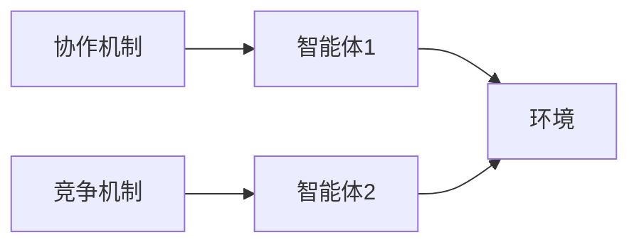
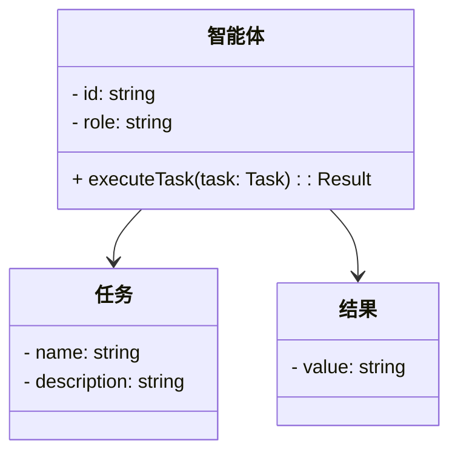
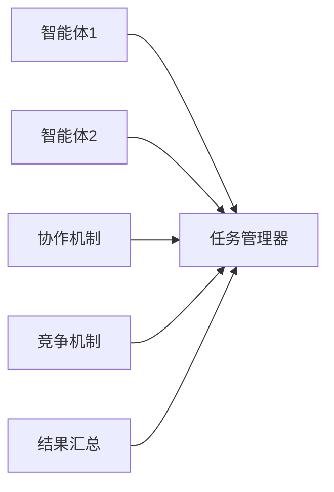
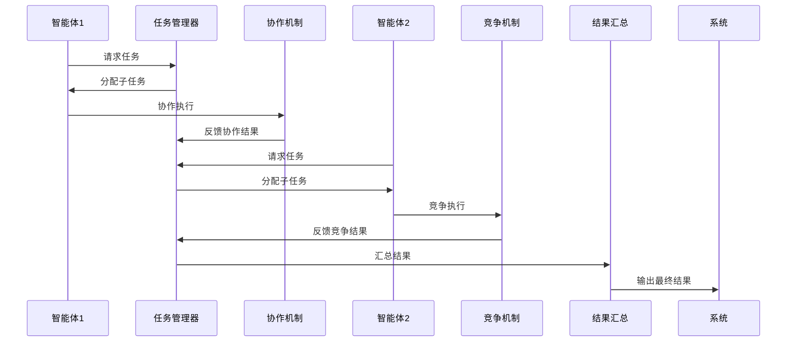

                 


# 多智能体AI Agent：LLM驱动的协作与竞争系统

> **关键词**：多智能体AI Agent、LLM、协作、竞争、系统架构、算法原理

> **摘要**：  
多智能体AI Agent系统是一种由多个智能体协作或竞争完成复杂任务的系统，利用大语言模型（LLM）作为核心驱动力，实现高效的协作与竞争机制。本文从多智能体AI Agent的基本概念出发，深入探讨其核心概念、算法原理、系统架构设计，并结合实际项目案例，全面解析如何构建和优化多智能体AI Agent系统。通过本文的阐述，读者将能够理解多智能体AI Agent的核心思想，并掌握其实际应用中的关键技术和方法。

---

## 第1章: 多智能体AI Agent的基本概念

### 1.1 多智能体系统的基本概念

#### 1.1.1 多智能体系统的定义  
多智能体系统（Multi-Agent System, MAS）是由多个智能体（Agent）组成的分布式系统，这些智能体能够通过协作或竞争完成复杂的任务。每个智能体都是一个具备感知、决策和执行能力的实体，能够独立运作，同时与其他智能体进行交互。

#### 1.1.2 多智能体系统的特征  
- **自主性**：智能体能够自主决策，无需外部干预。  
- **反应性**：智能体能够实时感知环境并做出响应。  
- **协作性**：智能体之间可以通过协作完成共同目标。  
- **竞争性**：智能体之间也可以通过竞争优化系统性能。  

#### 1.1.3 多智能体系统与传统AI的区别  
传统AI通常是一个单一的智能系统，而多智能体系统则是多个智能体的集合。多智能体系统强调智能体之间的协作与竞争，能够处理复杂动态环境下的任务，而传统AI则更注重单点智能的提升。

### 1.2 多智能体AI Agent的背景与问题背景

#### 1.2.1 多智能体系统的起源与发展  
多智能体系统的概念起源于分布式人工智能（Distributed AI）领域，随着计算能力的提升和AI技术的发展，多智能体系统逐渐在多个领域得到广泛应用。

#### 1.2.2 当前AI技术的演进与多智能体系统的关系  
大语言模型（LLM）的出现为多智能体系统的智能化提供了新的可能性。LLM能够处理复杂语言任务，具备强大的上下文理解和生成能力，使得多智能体系统更加智能化和高效。

#### 1.2.3 多智能体系统的核心问题与挑战  
- **协作与竞争的平衡**：如何在协作与竞争之间找到动态平衡。  
- **通信与协调**：智能体之间的通信和协调机制设计。  
- **动态环境适应**：如何应对复杂动态环境下的任务变化。  

### 1.3 多智能体系统的应用领域与前景

#### 1.3.1 协作型多智能体系统的应用领域  
- **分布式任务分配**：例如无人机编队、机器人协作等。  
- **智能客服系统**：多个智能客服协同处理客户问题。  

#### 1.3.2 竞争型多智能体系统的应用领域  
- **游戏AI**：例如多智能体策略游戏中的对手AI。  
- **金融市场**：智能体之间的竞争模拟。  

#### 1.3.3 多智能体系统在企业级应用中的潜力  
- **供应链优化**：多个智能体协同优化供应链流程。  
- **企业决策支持**：多个智能体协作提供决策支持。  

---

## 第2章: 多智能体AI Agent的核心概念与联系

### 2.1 多智能体系统的组成要素

#### 2.1.1 智能体的定义与属性  
- **智能体**：具备感知、决策、执行能力的实体。  
- **属性**：自主性、反应性、协作性、学习能力。  

#### 2.1.2 环境的定义与分类  
- **环境**：智能体所处的外部世界，可以是物理环境或虚拟环境。  
- **分类**：静态环境、动态环境、确定性环境、不确定性环境。  

#### 2.1.3 协作与竞争机制的定义  
- **协作机制**：智能体之间通过协作完成共同目标的机制。  
- **竞争机制**：智能体之间通过竞争优化系统性能的机制。  

### 2.2 多智能体系统的协作与竞争机制

#### 2.2.1 协作机制的定义与实现  
- **协作机制**：智能体之间通过共享信息、分工合作完成任务。  
- **实现方式**：任务分配、信息共享、协作决策。  

#### 2.2.2 竞争机制的定义与实现  
- **竞争机制**：智能体之间通过竞争优化系统性能。  
- **实现方式**：资源分配、竞争策略、性能优化。  

#### 2.2.3 协作与竞争的动态平衡  
- **动态平衡**：根据任务需求，智能体在协作与竞争之间动态调整。  

### 2.3 多智能体系统的通信与协调

#### 2.3.1 智能体之间的通信方式  
- **直接通信**：智能体之间直接交换信息。  
- **间接通信**：通过中间媒介进行信息传递。  

#### 2.3.2 协调机制的实现方式  
- **协调协议**：定义智能体之间的交互规则。  
- **协调算法**：实现智能体之间的协作与协调。  

#### 2.3.3 通信协议的设计与实现  
- **协议设计**：定义通信的内容、格式和规则。  
- **协议实现**：基于通信协议实现智能体之间的信息交换。  

### 2.4 核心概念对比表

| **概念**       | **协作机制**                  | **竞争机制**                  |
|----------------|-------------------------------|-----------------------------|
| 定义           | 智能体之间通过协作完成任务   | 智能体之间通过竞争优化性能   |
| 实现方式       | 任务分配、信息共享            | 资源分配、竞争策略            |
| 目标           | 完成共同目标                  | 优化系统性能                  |

### 2.5 实体关系图



---

## 第3章: 多智能体AI Agent的算法原理

### 3.1 协作型多智能体算法

#### 3.1.1 协作算法的基本原理  
协作算法通过智能体之间的协作完成任务，通常采用分布式计算和任务分配策略。  

#### 3.1.2 协作算法的实现步骤  
1. **任务分解**：将整体任务分解为子任务。  
2. **任务分配**：根据智能体的能力分配子任务。  
3. **协作执行**：智能体协作执行分配的任务。  
4. **结果汇总**：汇总各智能体的执行结果。  

#### 3.1.3 协作算法的数学模型  
$$V(s) = \sum_{i=1}^{n} v_i(s_i)$$  
其中，$V(s)$ 表示系统整体价值，$v_i(s_i)$ 表示智能体 $i$ 的价值函数。

### 3.2 竞争型多智能体算法

#### 3.2.1 竞争算法的基本原理  
竞争算法通过智能体之间的竞争优化系统性能，通常采用博弈论和优化算法。  

#### 3.2.2 竞争算法的实现步骤  
1. **目标设定**：设定竞争目标。  
2. **竞争策略制定**：制定智能体的竞争策略。  
3. **竞争执行**：智能体根据策略进行竞争。  
4. **结果优化**：优化竞争结果。  

#### 3.2.3 竞争算法的数学模型  
$$U(s) = \max_{i} u_i(s_i)$$  
其中，$U(s)$ 表示系统整体效用，$u_i(s_i)$ 表示智能体 $i$ 的效用函数。

### 3.3 协作与竞争的综合算法

#### 3.3.1 综合算法的基本原理  
综合算法结合协作和竞争机制，根据任务需求动态调整协作与竞争的比例。  

#### 3.3.2 综合算法的实现步骤  
1. **任务分析**：分析任务需求，确定协作与竞争的比例。  
2. **动态调整**：根据任务变化动态调整协作与竞争机制。  
3. **执行任务**：智能体根据调整后的机制执行任务。  
4. **结果评估**：评估任务执行结果，优化协作与竞争机制。  

---

## 第4章: 多智能体AI Agent的系统分析与架构设计

### 4.1 系统背景与目标

#### 4.1.1 系统背景介绍  
本系统旨在利用多智能体AI Agent实现复杂任务的协作与竞争，提升系统整体性能。  

#### 4.1.2 系统目标  
- 实现多智能体之间的协作与竞争。  
- 提供高效的通信与协调机制。  
- 支持复杂动态环境下的任务执行。  

### 4.2 系统功能设计

#### 4.2.1 领域模型类图  



#### 4.2.2 系统架构设计  



#### 4.2.3 系统接口设计  
- **智能体接口**：定义智能体的交互接口。  
- **任务管理器接口**：定义任务分配和管理的接口。  
- **结果汇总接口**：定义结果汇总和优化的接口。  

#### 4.2.4 系统交互流程  



---

## 第5章: 多智能体AI Agent的项目实战

### 5.1 项目背景与目标

#### 5.1.1 项目背景  
本项目旨在利用多智能体AI Agent实现一个协作与竞争的系统，提升系统的整体性能。  

#### 5.1.2 项目目标  
- 实现多智能体之间的协作与竞争。  
- 提供高效的通信与协调机制。  
- 支持复杂动态环境下的任务执行。  

### 5.2 核心代码实现

#### 5.2.1 环境安装  
需要安装以下工具：  
- Python 3.8及以上  
- Mermaid工具  
- 必要的Python库（如numpy、pandas等）。  

#### 5.2.2 系统核心实现代码  

```python
class Agent:
    def __init__(self, id):
        self.id = id
        self.role = "collaborator"  # 可以是 collaborator 或 competitor

    def execute_task(self, task):
        # 根据任务类型执行协作或竞争
        if self.role == "collaborator":
            return self.collaborate(task)
        else:
            return self.compete(task)

    def collaborate(self, task):
        # 协作机制实现
        pass

    def compete(self, task):
        # 竞争机制实现
        pass

class TaskManager:
    def __init__(self):
        self.tasks = []

    def assign_task(self, agent, task):
        # 分配任务
        pass

    def get_task_result(self, agent, result):
        # 获取任务结果
        pass

class System:
    def __init__(self):
        self.agents = []
        self.task_manager = TaskManager()

    def add_agent(self, agent):
        self.agents.append(agent)

    def run(self):
        # 运行系统
        pass
```

#### 5.2.3 代码应用解读与分析  
- **Agent类**：定义智能体的基本属性和方法。  
- **TaskManager类**：管理任务分配和结果获取。  
- **System类**：定义系统的整体结构和运行流程。  

### 5.3 实际案例分析与详细讲解

#### 5.3.1 案例背景  
假设我们需要实现一个分布式任务分配系统，利用多智能体AI Agent完成任务。  

#### 5.3.2 系统实现  
1. **智能体初始化**：创建多个智能体，并分配角色。  
2. **任务分配**：任务管理器将任务分配给智能体。  
3. **任务执行**：智能体根据角色协作或竞争执行任务。  
4. **结果汇总**：任务管理器汇总结果并输出最终结果。  

#### 5.3.3 代码实现细节  
- **协作机制**：智能体之间共享信息，共同完成任务。  
- **竞争机制**：智能体之间通过竞争优化任务执行效率。  

### 5.4 项目总结与经验分享

#### 5.4.1 项目成功的关键因素  
- **良好的系统设计**：确保系统的可扩展性和可维护性。  
- **高效的通信机制**：确保智能体之间的高效通信。  
- **动态调整机制**：根据任务需求动态调整协作与竞争机制。  

#### 5.4.2 项目实施中的注意事项  
- **智能体的协调**：确保智能体之间的协作与竞争机制协调一致。  
- **环境的适应性**：确保系统能够适应复杂动态环境。  
- **系统的可扩展性**：确保系统能够扩展到更多的智能体和任务。  

---

## 第6章: 总结与展望

### 6.1 全文总结

多智能体AI Agent系统是一种由多个智能体协作或竞争完成复杂任务的系统，利用大语言模型（LLM）作为核心驱动力，实现高效的协作与竞争机制。本文从多智能体AI Agent的基本概念出发，深入探讨其核心概念、算法原理、系统架构设计，并结合实际项目案例，全面解析如何构建和优化多智能体AI Agent系统。通过本文的阐述，读者将能够理解多智能体AI Agent的核心思想，并掌握其实际应用中的关键技术和方法。

### 6.2 未来展望

随着人工智能技术的不断发展，多智能体AI Agent系统将得到更广泛的应用。未来的研究方向包括：  
- **更高效的协作与竞争机制**：优化协作与竞争机制，提高系统的整体性能。  
- **更智能的通信与协调机制**：研究更智能的通信与协调机制，提升系统的智能化水平。  
- **更广泛的应用场景**：探索更多应用场景，推动多智能体AI Agent系统的普及和应用。  

### 6.3 最佳实践 Tips

- **系统设计**：注重系统的可扩展性和可维护性。  
- **智能体协调**：确保智能体之间的协作与竞争机制协调一致。  
- **环境适应**：确保系统能够适应复杂动态环境。  
- **持续优化**：根据实际需求持续优化系统性能。  

### 6.4 结束语

多智能体AI Agent系统作为人工智能领域的重要研究方向，具有广阔的应用前景。通过不断的研究和实践，我们相信多智能体AI Agent系统将在未来发挥更大的作用，为人类社会的进步做出更大的贡献。

---

**作者：AI天才研究院/AI Genius Institute & 禅与计算机程序设计艺术 /Zen And The Art of Computer Programming**

