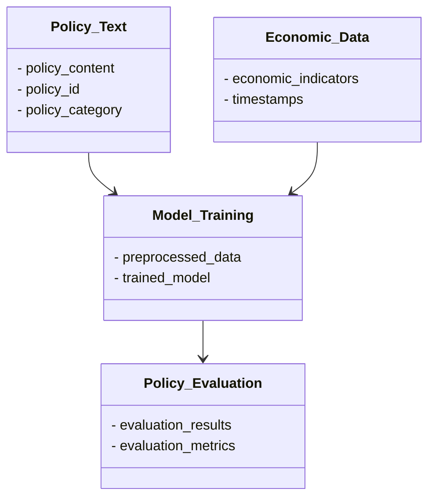
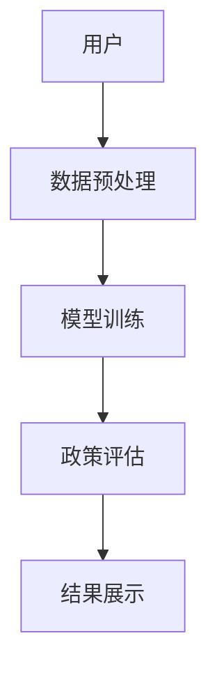
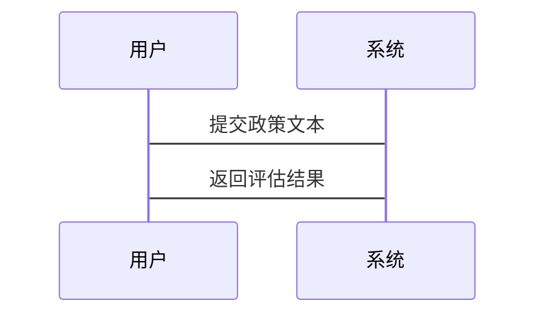

                 


# 开发基于大模型的金融政策执行效果预测与评估器

**关键词：** 金融政策，大模型，AI，预测评估，机器学习，自然语言处理

**摘要：** 本文旨在探讨如何利用大模型技术来预测和评估金融政策的执行效果。通过分析金融政策评估的关键挑战，结合大模型的自然语言处理和机器学习优势，提出了一种创新的解决方案。本文详细介绍了从问题背景到系统实现的全过程，并通过实际案例展示了如何将大模型应用于金融政策评估，为相关领域的研究和实践提供了参考。

---

## 第1章 金融政策执行效果预测的背景与问题

### 1.1 问题背景

#### 1.1.1 金融政策执行的复杂性
金融政策的执行效果受多种因素影响，包括经济环境、政策文本的复杂性以及政策实施过程中的不确定因素。传统的评估方法难以捕捉这些复杂性，导致评估结果不够准确。

#### 1.1.2 政策执行效果评估的重要性
准确评估金融政策的执行效果对于制定科学的政策、优化资源配置、促进经济发展具有重要意义。然而，传统的评估方法往往依赖于大量的历史数据和专家经验，耗时且成本高。

#### 1.1.3 传统评估方法的局限性
传统评估方法通常基于统计分析和专家判断，难以应对政策执行过程中的动态变化和复杂性。此外，传统方法难以处理大规模的非结构化数据，如政策文本和市场反馈。

### 1.2 问题描述

#### 1.2.1 金融政策执行效果的定义
金融政策执行效果是指政策在实际执行过程中对经济、社会等多方面产生的影响。这包括政策目标的实现程度、政策实施的成本效益比等。

#### 1.2.2 政策执行过程中的关键因素
政策执行的关键因素包括政策文本的解读、政策实施的环境、政策执行的主体行为等。这些因素相互作用，影响政策的最终效果。

#### 1.2.3 评估指标的选择与挑战
评估指标的选择需要综合考虑经济、社会、市场等多个维度。然而，如何选择合适的指标并量化其影响是一个复杂的挑战。

### 1.3 问题解决的思路

#### 1.3.1 引入AI大模型的必要性
AI大模型，如GPT-3、BERT等，具有强大的自然语言处理能力和深度学习能力，能够有效处理大规模的文本数据，并捕捉复杂的模式。

#### 1.3.2 大模型在金融政策评估中的优势
大模型可以自动分析政策文本，提取关键信息，并预测政策的执行效果。此外，大模型还可以结合实时市场数据，提供动态评估。

#### 1.3.3 技术实现的总体框架
本文提出了一种基于大模型的金融政策评估框架，包括数据收集、模型训练、预测评估等阶段。框架的核心是利用大模型对政策文本进行语义分析，并结合经济指标进行预测。

### 1.4 本章小结
本章分析了金融政策执行效果预测的背景与问题，指出了传统评估方法的局限性，并提出了利用AI大模型进行评估的思路。这为后续的技术实现奠定了基础。

---

## 第2章 基于大模型的金融政策评估核心概念

### 2.1 大模型的基本概念

#### 2.1.1 大模型的定义与特点
大模型是指基于深度学习的大规模预训练模型，具有参数量大、模型结构复杂等特点。大模型的核心优势在于其强大的语义理解和生成能力。

#### 2.1.2 大模型与传统AI的区别
与传统AI模型相比，大模型具有更强的泛化能力和自我学习能力，能够处理复杂的非结构化数据。

#### 2.1.3 大模型在金融领域的应用潜力
大模型在金融领域的应用潜力巨大，包括金融文本分析、风险评估、政策预测等。

### 2.2 金融政策评估的核心要素

#### 2.2.1 政策文本的特征提取
政策文本的特征包括政策的目标、措施、预期效果等。大模型可以通过自然语言处理技术提取这些特征。

#### 2.2.2 政策执行环境的建模
政策执行环境包括经济环境、政策实施主体、政策影响对象等。大模型可以对这些环境进行建模，分析其对政策效果的影响。

#### 2.2.3 政策效果的多维度评估
政策效果需要从经济、社会、市场等多个维度进行评估。大模型可以综合这些维度，提供全面的评估结果。

### 2.3 大模型与金融政策评估的结合

#### 2.3.1 大模型在政策文本分析中的应用
大模型可以通过自然语言处理技术，分析政策文本的语义，提取关键信息。

#### 2.3.2 大模型在政策效果预测中的作用
大模型可以基于政策文本和历史数据，预测政策的执行效果，并提供动态评估。

#### 2.3.3 大模型与传统评估方法的融合
大模型可以与传统评估方法相结合，利用大模型的优势弥补传统方法的不足。

### 2.4 本章小结
本章详细介绍了大模型的基本概念及其在金融政策评估中的应用潜力，指出了大模型在政策文本分析和效果预测中的重要作用。

---

## 第3章 大模型的核心算法原理

### 3.1 Transformer架构解析

#### 3.1.1 自注意力机制的数学公式
$$\text{Attention}(Q,K,V) = \text{softmax}\left(\frac{QK^T}{\sqrt{d_k}}\right)V$$

自注意力机制通过计算查询（Q）、键（K）和值（V）之间的关系，捕捉序列中的长程依赖关系。

#### 3.1.2 前馈神经网络的结构
前馈神经网络由多个全连接层组成，每个层都包含ReLU激活函数，用于对输入数据进行非线性变换。

#### 3.1.3 层规范化与残差连接
层规范化用于稳定训练过程，残差连接用于保持网络的深度而不增加计算复杂度。

### 3.2 大模型的训练流程

#### 3.2.1 数据预处理与特征提取
数据预处理包括分词、去除停用词、词向量转换等。特征提取则利用预训练的词向量，如Word2Vec。

#### 3.2.2 模型训练的优化策略
模型训练采用Adam优化器，学习率采用学习率衰减策略，防止过拟合。

#### 3.2.3 分布式训练与并行计算
分布式训练利用多GPU并行计算，加快训练速度，同时降低内存消耗。

### 3.3 大模型的推理机制

#### 3.3.1 解码器的生成策略
解码器采用贪心搜索策略，逐步生成最可能的预测结果。

#### 3.3.2 解码器的注意力机制
解码器通过自注意力机制捕捉序列的局部依赖关系，提升生成结果的连贯性。

### 3.4 本章小结
本章详细讲解了大模型的核心算法原理，包括Transformer架构、训练流程和推理机制，为后续的系统设计奠定了理论基础。

---

## 第4章 金融政策评估系统的设计与实现

### 4.1 问题场景介绍

#### 4.1.1 系统目标
系统的目标是利用大模型对金融政策的执行效果进行预测和评估，为政策制定者提供参考。

#### 4.1.2 系统需求
系统需要处理大量的政策文本和经济数据，提供实时的政策效果评估。

### 4.2 系统功能设计

#### 4.2.1 领域模型


#### 4.2.2 系统架构


#### 4.2.3 系统接口设计
系统接口包括数据输入接口、模型训练接口和结果输出接口。数据输入接口接收政策文本和经济数据，模型训练接口对数据进行预处理并训练模型，结果输出接口提供评估结果。

#### 4.2.4 系统交互


### 4.3 本章小结
本章详细设计了金融政策评估系统的架构和功能模块，为系统的实现提供了清晰的指导。

---

## 第5章 项目实战：基于大模型的金融政策评估系统实现

### 5.1 环境安装

#### 5.1.1 安装Python
```bash
python --version
# 输出：Python 3.8.5
```

#### 5.1.2 安装必要的库
```bash
pip install numpy pandas transformers torch
```

### 5.2 系统核心实现

#### 5.2.1 数据预处理
```python
import pandas as pd
from transformers import AutoTokenizer, AutoModelForMaskedLM

def preprocess_data(data_path):
    df = pd.read_csv(data_path)
    tokenizer = AutoTokenizer.from_pretrained('bert-base-cased')
    inputs = tokenizer(df['policy_text'], padding=True, truncation=True, max_length=512)
    return inputs
```

#### 5.2.2 模型训练
```python
import torch
from torch.utils.data import Dataset, DataLoader

class PolicyDataset(Dataset):
    def __init__(self, tokenizer, data_path):
        self.tokenizer = tokenizer
        self.data = pd.read_csv(data_path)
    
    def __len__(self):
        return len(self.data)
    
    def __getitem__(self, idx):
        text = self.data['policy_text'][idx]
        inputs = self.tokenizer(text, padding=True, truncation=True, max_length=512)
        return inputs.input_ids, inputs.attention_mask

def train_model(model, optimizer, criterion, train_loader, epochs=3):
    for epoch in range(epochs):
        for batch_input, batch_mask in train_loader:
            outputs = model(batch_input, batch_mask)
            loss = criterion(outputs, batch_labels)
            loss.backward()
            optimizer.step()
            optimizer.zero_grad()
    return model

model = AutoModelForMaskedLM.from_pretrained('bert-base-cased')
optimizer = torch.optim.Adam(model.parameters(), lr=2e-5)
criterion = torch.nn.CrossEntropyLoss()
train_loader = DataLoader(PolicyDataset(tokenizer, 'policy_data.csv'), batch_size=32, shuffle=True)
model = train_model(model, optimizer, criterion, train_loader)
```

#### 5.2.3 模型预测与评估
```python
def evaluate_model(model, test_loader):
    model.eval()
    total_loss = 0
    for batch_input, batch_mask in test_loader:
        outputs = model(batch_input, batch_mask)
        loss = criterion(outputs, batch_labels)
        total_loss += loss.item()
    avg_loss = total_loss / len(test_loader)
    return avg_loss

test_loader = DataLoader(PolicyDataset(tokenizer, 'test_policy_data.csv'), batch_size=32, shuffle=False)
result = evaluate_model(model, test_loader)
print(f"评估结果：{result}")
```

### 5.3 项目小结
本章通过实际案例展示了如何利用大模型开发金融政策评估系统，从环境安装到模型训练，再到结果评估，详细讲解了每个步骤的具体实现。通过代码示例，读者可以快速上手并实现类似系统。

---

## 第6章 最佳实践与小结

### 6.1 最佳实践 tips

#### 6.1.1 数据预处理的关键性
数据预处理是模型训练的基础，需要仔细清洗和特征提取，以提高模型的性能。

#### 6.1.2 模型调优的技巧
模型调优包括调整学习率、批量大小、模型结构等参数，以找到最佳的模型表现。

#### 6.1.3 实际应用中的注意事项
在实际应用中，需要考虑模型的实时性和可解释性，确保模型能够快速响应并提供可信赖的评估结果。

### 6.2 小结
本文从背景、算法、系统设计到项目实战，详细介绍了如何利用大模型开发金融政策执行效果预测与评估系统。通过本文的学习，读者可以掌握大模型在金融领域的应用技巧，并将其应用到实际项目中。

### 6.3 注意事项
在实际应用中，需要注意数据隐私和模型的可解释性问题，确保模型的合法性和合规性。

### 6.4 拓展阅读
建议读者进一步阅读相关领域的最新研究，如大模型在金融风险管理中的应用，以及多模态数据在政策评估中的应用。

---

## 作者信息

作者：AI天才研究院/AI Genius Institute & 禅与计算机程序设计艺术 /Zen And The Art of Computer Programming

